# 🚀 CI/CD Pipeline Architecture - Enterprise Deployment Strategy

## 📋 Overview

This document describes the **3-tier deployment architecture** for Smart Supply Pro's backend service, designed to separate concerns between:

1. **Source artifacts** (main branch)
2. **Generated documentation** (gh-pages branch)
3. **Production runtime** (Fly.io)

---

## 🏗️ Architecture Design

### **Separation of Concerns**

| **Artifact Type** | **Location** | **Deployment Method** |
|-------------------|--------------|----------------------|
| Java source code (`src/main/java`) | `main` branch + Fly.io Docker image | CI build → Docker push → Manual deploy |
| Test source code (`src/test/java`) | `main` branch ONLY | Never deployed to production |
| Documentation source (`.md`, `.yml`) | `main` branch ONLY | Version-controlled, not deployed |
| JaCoCo HTML reports | `gh-pages` branch | Auto-published via workflow |
| ReDoc API HTML | `gh-pages` branch | Auto-published via workflow |
| Frontend assets | Separate repository/workflow | Deployed to Koyeb |

---

## 🔄 Workflow Sequence

```mermaid
graph LR
    A[Push to main] --> B[1️⃣ ci-test.yml]
    B --> C[Build & Test]
    C --> D[Generate JaCoCo]
    D --> E[Build Docker Image]
    E --> F[Security Scan]
    F --> G[Upload Artifacts]
    
    G --> H[2️⃣ deploy-ghpages.yml]
    H --> I[Download Artifacts]
    I --> J[Commit to gh-pages]
    
    E --> K[3️⃣ deploy-fly.yml]
    K --> L[Manual Trigger]
    L --> M[Deploy to Fly.io]
```



---

## 📝 Workflow Details

### **1️⃣ Backend CI - Build & Test** (`1-ci-test.yml`)

**Purpose:** Build, test, and prepare deployable artifacts

**Triggers:**
- Push to `main` or `develop` branches
- Changes in backend source files (`src/`, `pom.xml`, `Dockerfile`)

**Steps:**
1. Checkout code
2. Setup JDK 17 + Maven cache
3. Run Maven build with tests (`mvn clean verify`)
4. Generate JaCoCo coverage report
5. Upload JaCoCo HTML as artifact (retention: 30 days)
6. Build Docker image (tagged with commit SHA)
7. Run Trivy security scan (fails on HIGH/CRITICAL CVEs)
8. Push Docker image to Docker Hub

**Outputs:**
- Docker image: `<username>/inventory-service:<commit-sha>`
- Artifact: `jacoco-html-<commit-sha>`

**No commits to main branch** - coverage reports are uploaded as artifacts only.

---

### **2️⃣ Deploy Docs to GitHub Pages** (`2-deploy-ghpages.yml`)

**Purpose:** Publish generated HTML documentation to gh-pages branch

**Triggers:**
- Automatic: Successful completion of `1-ci-test.yml` on `main` branch

**Steps:**
1. Checkout `gh-pages` branch
2. Download JaCoCo artifact from upstream workflow
3. Download ReDoc artifact (if available)
4. Create/update index.html for navigation
5. Commit and push to `gh-pages` branch

**Published URLs:**
- Coverage: `https://<username>.github.io/<repo>/coverage/backend/`
- API Docs: `https://<username>.github.io/<repo>/api/`

**Why gh-pages?**
- Keeps `main` branch clean (no generated HTML commits)
- Automatic GitHub Pages hosting
- No merge conflicts with coverage updates

---

### **3️⃣ Deploy to Fly.io** (`3-deploy-fly.yml`)

**Purpose:** Deploy pre-built Docker image to production

**Triggers:**
- **Manual only** (`workflow_dispatch`)
- Reason: Oracle Wallet requires dedicated IP configuration

**Inputs:**
- `image_tag`: Docker image tag to deploy (default: `latest`)
- `deployment_strategy`: `immediate`, `canary`, or `rolling`

**Steps:**
1. Validate Docker image exists in registry
2. Install Fly CLI
3. Verify Fly.io app status
4. Deploy using `flyctl deploy --image`
5. Wait for health checks to pass
6. Run smoke tests against production URL

**Why manual?**
- Controlled rollout timing
- Verify secrets are configured in Fly.io
- Test in staging before production

---

## 🔐 Required Secrets

### **GitHub Secrets** (Repository Settings → Secrets → Actions)

| Secret Name | Description | Used By |
|-------------|-------------|---------|
| `DOCKER_USERNAME` | Docker Hub username | 1-ci-test.yml, 3-deploy-fly.yml |
| `DOCKER_PASSWORD` | Docker Hub password/token | 1-ci-test.yml, 3-deploy-fly.yml |
| `FLY_API_TOKEN` | Fly.io API token (`flyctl auth token`) | 3-deploy-fly.yml |
| `DB_URL` | Test database URL | 1-ci-test.yml |
| `DB_USER` | Test database username | 1-ci-test.yml |
| `DB_PASS` | Test database password | 1-ci-test.yml |
| `SPRING_SECURITY_OAUTH2_CLIENT_REGISTRATION_GOOGLE_CLIENT_ID` | OAuth2 client ID | 1-ci-test.yml |
| `SPRING_SECURITY_OAUTH2_CLIENT_REGISTRATION_GOOGLE_CLIENT_SECRET` | OAuth2 client secret | 1-ci-test.yml |

### **Fly.io Secrets** (Configure via `flyctl secrets set`)

| Secret Name | Description |
|-------------|-------------|
| `ORACLE_WALLET_B64` | Base64-encoded Oracle Wallet ZIP |
| `ORACLE_WALLET_PASSWORD` | Oracle Wallet password |
| `DB_URL` | Production database connection string |
| `DB_USER` | Production database username |
| `DB_PASS` | Production database password |

---

## 🚀 Deployment Workflow

### **Step 1: Make Code Changes**
```bash
git checkout -b feature/my-change
# Make your changes
git commit -m "feat: add new feature"
git push origin feature/my-change
```

### **Step 2: Create Pull Request**
- CI runs on PR (builds, tests, security scan)
- Review code changes
- Merge to `main`

### **Step 3: Automatic CI Pipeline**
```
Push to main → 1-ci-test.yml runs → Builds Docker image → Uploads coverage artifact
                    ↓
              2-deploy-ghpages.yml runs → Downloads artifact → Publishes to gh-pages
```

### **Step 4: Manual Production Deployment**
1. Go to GitHub Actions → "3️⃣ Deploy to Fly.io (Production)"
2. Click "Run workflow"
3. Select image tag (use commit SHA from step 3)
4. Choose deployment strategy (`immediate` recommended)
5. Click "Run workflow"

**Verification:**
```bash
# Check deployment status
flyctl status --app inventoryservice

# View logs
flyctl logs --app inventoryservice

# Health check
curl https://inventoryservice.fly.dev/health
```

---

## 📦 What Gets Deployed Where?

### **Main Branch** (Source Control)
✅ Includes:
- `src/main/java` - Production source code
- `src/test/java` - Test source code
- `docs/**/*.md` - Documentation source
- `docs/**/*.yml` - OpenAPI specs
- `pom.xml`, `Dockerfile`, etc.

❌ Excludes:
- `docs/backend/coverage/` - Generated JaCoCo HTML
- `docs/api/redoc/api.html` - Generated ReDoc HTML

### **gh-pages Branch** (Generated Artifacts)
✅ Includes:
- `coverage/backend/` - JaCoCo HTML reports
- `api/` - ReDoc API documentation HTML
- `index.html` - Landing page

❌ Excludes:
- Source code
- Configuration files

### **Fly.io Docker Image** (Production Runtime)
✅ Includes:
- Compiled JAR (`app.jar`)
- JRE 17 (Alpine)
- Startup script (`start.sh`)

❌ Excludes:
- `src/test/` - Test files (via `.dockerignore`)
- `docs/` - Documentation (via `.dockerignore`)
- `frontend/` - Frontend assets (via `.dockerignore`)
- `.github/` - CI/CD workflows (via `.dockerignore`)

---

## 🧪 Testing the Pipeline

### **Local Testing**

**1. Test Docker Build:**
```bash
docker build -t test-inventory:local .
docker run --rm test-inventory:local sh -c 'ls -la /app/'
# Verify: No /app/docs, no /app/src/test
```

**2. Test Coverage Generation:**
```bash
mvn clean verify
# Check: target/site/jacoco/index.html exists
```

**3. Test Fly Deployment (Dry Run):**
```bash
flyctl deploy --app inventoryservice --image <username>/inventory-service:latest --dry-run
```

### **CI Testing**

**1. Test on Feature Branch:**
```bash
git checkout -b test/pipeline-validation
git commit --allow-empty -m "test: trigger CI"
git push origin test/pipeline-validation
# Open PR and observe CI results
```

**2. Verify Artifacts:**
- Go to GitHub Actions → Workflow run → Artifacts tab
- Download `jacoco-html-<sha>` artifact
- Verify HTML files are present

---

## 🔧 Troubleshooting

### **Issue: Coverage not showing on gh-pages**
**Solution:**
1. Check `2-deploy-ghpages.yml` workflow status
2. Verify `jacoco-html-*` artifact was created in `1-ci-test.yml`
3. Ensure GitHub Pages is enabled (Settings → Pages → Source: gh-pages)

### **Issue: Docker image too large**
**Solution:**
1. Check `.dockerignore` includes test files and docs
2. Run: `docker history <image>` to see layer sizes
3. Verify multi-stage build is working

### **Issue: Fly.io deployment fails**
**Solution:**
1. Check Fly.io secrets: `flyctl secrets list --app inventoryservice`
2. Verify image exists: `docker pull <username>/inventory-service:<tag>`
3. Check logs: `flyctl logs --app inventoryservice`

### **Issue: Health check fails**
**Solution:**
1. Verify `/health` endpoint in application code
2. Check `fly.toml` port configuration (should be 8081)
3. Ensure Oracle Wallet is decoded correctly in `start.sh`

---

## 📊 Monitoring & Observability

### **GitHub Actions**
- **Workflow runs:** github.com/<username>/<repo>/actions
- **Artifacts:** Retained for 30 days
- **Logs:** Available in workflow run details

### **GitHub Pages**
- **Status:** github.com/<username>/<repo>/settings/pages
- **URL:** https://<username>.github.io/<repo>/

### **Fly.io**
- **Dashboard:** fly.io/apps/inventoryservice
- **Logs:** `flyctl logs --app inventoryservice`
- **Metrics:** `flyctl metrics --app inventoryservice`
- **Health:** https://inventoryservice.fly.dev/health

---

## 🎯 Success Criteria

| Criteria | Validation |
|----------|------------|
| ✅ Test files NOT in Docker image | `docker run <image> ls /app/src/test` → not found |
| ✅ Docs NOT in Docker image | `docker run <image> ls /app/docs` → not found |
| ✅ Frontend NOT in Docker image | Already verified via `.dockerignore` |
| ✅ JaCoCo HTML on gh-pages only | Check GitHub Pages URL |
| ✅ No coverage commits to main | `git log main` shows no `[skip ci]` commits |
| ✅ Manual Fly deployment works | Workflow completes successfully |
| ✅ Health check passes | `curl https://inventoryservice.fly.dev/health` → 200 OK |

---

## 📚 Additional Resources

- [GitHub Actions Documentation](https://docs.github.com/en/actions)
- [Fly.io Documentation](https://fly.io/docs/)
- [Docker Best Practices](https://docs.docker.com/develop/dev-best-practices/)
- [Spring Boot Actuator](https://docs.spring.io/spring-boot/docs/current/reference/html/actuator.html)
- [JaCoCo Documentation](https://www.jacoco.org/jacoco/trunk/doc/)

---

## 🔄 Migration from Old Pipeline

### **What Changed?**

| Old Behavior | New Behavior |
|--------------|--------------|
| Coverage committed to `main` | Coverage uploaded to `gh-pages` |
| Manual `flyctl deploy` | Automated via workflow dispatch |
| Single monolithic workflow | 3 focused workflows |
| Test files in Docker image | Test files excluded |

### **Migration Checklist**

- [x] Create `gh-pages` branch
- [x] Configure GitHub Pages source
- [x] Add `FLY_API_TOKEN` secret
- [x] Update `.dockerignore`
- [x] Update `.gitignore`
- [x] Create new workflows (1, 2, 3)
- [x] Update `docs-openapi.yml`
- [x] Deprecate old `ci-build.yml`
- [ ] Remove `docs/backend/coverage/` from main (one-time cleanup)
- [ ] Test new pipeline on feature branch
- [ ] Verify gh-pages deployment
- [ ] Test Fly.io deployment

---

**Last Updated:** 2025-11-14  
**Maintained by:** Smart Supply Pro DevOps Team
