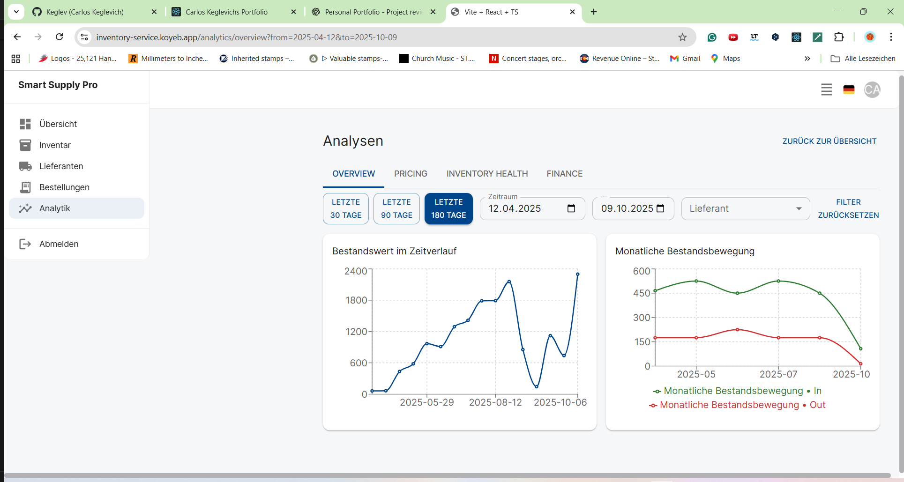
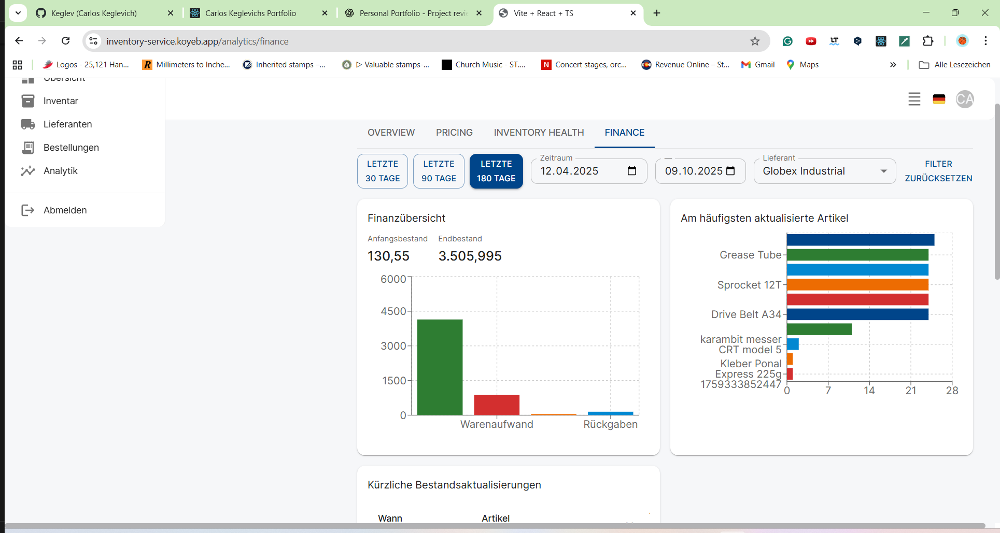

# SmartSupplyPro

**Enterprise Inventory Management System - Java Spring Boot & React**

## About

Complete enterprise-style full-stack application for Inventory & Supplier Management with comprehensive documentation, security architecture, and CI/CD integration.

## Description
This project simulates a real-world software system for small-to-medium manufacturing companies, inspired by real job experience in purchasing and production planning. It includes modern technologies, OAuth2 authentication, automated CI/CD pipelines, comprehensive testing, and business intelligence visualizations.

  


**📅 Last Updated:** October 13, 2025 - Controller Layer Testing Architecture Complete  
**🏗️ Status:** 60,000+ words comprehensive documentation | Enterprise architecture | Working CI/CD pipeline

---

## Table of contents

1. [Still under construction](#still-under-construction)
2. [Screenshots](#screenshots)
3. [Project status](#project-status)
4. [Features](#features)
5. [Security](#security)
6. [Documentation](#documentation)
  - [Architecture Overview](#architecture-overview)
  - [API Integration Guides](#api-integration-guides)
  - [API Documentation Hub](#api-documentation-hub)
  - [API Endpoints](#api-endpoints)
7. [Testing & Code quality](#testing-code-quality)
8. [Tech stack](#tech-stack)
9. [Environment profiles (Ci/CD)](#environment-profiles)
10. [Available Scripts](#available-scripts)
11. [Coming next](#coming-next)

<a id="still-under-construction"></a>
## Still under construction

> ⚠️ **Still under construction**
> - Enterprise documentation is not yet complete
> - Frontend development still not complete

---

<a id="screenshots"></a>
## Screenshots





---

<a id="project-status"></a>
## Project status

### ✅ Backend Development - Complete
- ✅ 60,000+ words comprehensive documentation
- ✅ Professional API documentation with TypeDoc, OpenAPI, and Redoc
- ✅ Complete backend architecture with enterprise patterns
- ✅ Working CI/CD pipeline for backend
- ✅ Controller layer testing architecture complete

### 🚧 Frontend Development - In Progress
- ✅ React + TypeScript + Material-UI foundation
- ✅ CI/CD pipeline working and automatically deployed
- 🚧 Dashboard UI development ongoing
- 🚧 CRUD operations implementation needed
- 🚧 Frontend testing documentation needed

### 📚 Documentation Status
- ✅ Backend testing documentation complete
- 🚧 Frontend testing documentation needed
- 🚧 Complete integration testing documentation needed

---

<a id="features"></a>
## 🚀 Features

### 🎯 Core Modules
- ✅ **Authentication** with Google OAuth2 via Spring Security
- 📦 **Inventory Management** – CRUD items, quantity tracking, stock history
- 🧾 **Supplier Management** – CRUD supplier data, filtering by name  
- 📊 **Analytics & Dashboard** – Visual insights including:
  - Stock value over time
  - Monthly stock movement
  - Update frequency per item
  - Low stock alerts

---

<a id="security"></a>
## 🛡️ Security

- OAuth2 login with Google integration and role-based access (`ADMIN`, `USER`)
- All `/api/**` endpoints are secured with Spring Security
- Fine-grained access control using `@PreAuthorize` annotations
- **Note**: Swagger is **not used** for security simplification - instead using TypeDoc, OpenAPI, and Redoc for API documentation

---

### Key documents:

- [OAuth2 Security Architecture](./docs/architecture/patterns/oauth2-security-architecture.md) — detailed OAuth2 and token flow
- [Security Patterns](./docs/architecture/patterns/security-patterns.md) — common security patterns used across services
- [Cross-Cutting Security](./docs/architecture/patterns/security-cross-cutting-patterns.md) — cross-cutting concerns and implementations

<a id="documentation"></a>
## 📘 Documentation

<a id="architecture-overview"></a>
### 🏗️ Architecture Overview

- . [Index for Backend Documentation](./docs/backend/README.md) — architecture landing with service catalog
- . [Service Layer Overview](./docs/architecture/services/README.md) — service responsibilities and patterns
- . [Design Patterns & Security](./docs/architecture/patterns/) — architecture patterns, security, and implementation

Key documents:

  - [OAuth2 Security Architecture](./docs/architecture/patterns/oauth2-security-architecture.md) — detailed OAuth2 and token flow
  - [Security Patterns](./docs/architecture/patterns/security-patterns.md) — common security patterns used across services
  - [Cross-Cutting Security](./docs/architecture/patterns/security-cross-cutting-patterns.md) — cross-cutting concerns and implementations

<a id="api-integration-guides"></a>
### 📡 API Integration Guides

Comprehensive integration documentation for all backend layers:

- . [Exception Handling](./docs/architecture/exceptions/) — comprehensive exception handling patterns *(25,000+ words)*
- . [Mapper Patterns](./docs/architecture/mappers/) — mapping strategies and DTO patterns *(35,000+ words)*
- . [Enum Business Logic](./docs/architecture/enums/) — domain enums and business rules
- . [Configuration Patterns](./docs/architecture/patterns/) — configuration best practices and patterns
- . [Refactoring Roadmap](./docs/architecture/refactoring/) — planned refactors and migration notes

Service Documentation:

- . [AnalyticsService](./docs/architecture/services/analytics-service.md) — Business insights, WAC algorithm (🔴 HIGH complexity)
- . [InventoryItemService](./docs/architecture/services/inventory-item-service.md) — Inventory CRUD, stock history (🟡 MEDIUM complexity)
- . [SupplierService](./docs/architecture/services/supplier-service.md) — Master data management (🟢 LOW complexity)
- . [StockHistoryService](./docs/architecture/services/stock-history-service.md) — Append-only audit log (🟢 LOW complexity)
- . [OAuth2 Services](./docs/architecture/services/oauth2-services.md) — Authentication integration (🟡 MEDIUM complexity)

<a id="api-documentation-hub"></a>
 ### 🚀 API Documentation Hub
 
 - [Complete API Documentation (ReDoc)](docs/api/redoc/index.html) — interactive API landing page
 - [Interactive API Reference](docs/api/redoc/api.html) — direct ReDoc explorer
 - [API index and quick reference](docs/api/README.md) — API index and quick reference

---

<a id="testing-code-quality"></a>
## 🧪 Testing & Code Quality

**🚧 Still under construction** - Backend testing complete, frontend testing documentation needed

### 🧪 Backend Testing Architecture
- **JUnit 5** with Mockito for comprehensive unit testing
- **Testcontainers** for integration testing with Oracle database
- **MockMvc** for controller layer testing with Spring Security integration
- **JaCoCo** for code coverage analysis and reporting

📊 **View Coverage Reports:**
👉 [**Backend Test Coverage (JaCoCo)**](https://keglev.github.io/inventory-service/backend/coverage/index.html)

📚 **Complete Testing Documentation:**
👉 [**Testing Architecture Documentation**](./docs/architecture/testing/README.md) - Enterprise testing strategy and implementation guides

> Coverage reports are automatically updated on every CI build and published via GitHub Pages.

### 🚧 Frontend Testing (Still under construction)
- Vitest for unit testing framework
- React Testing Library for component testing  
- TypeDoc for documentation generation
- Coverage reports and documentation coming soon

---

<a id="tech-stack"></a>
## 🧰 Tech Stack 

### Backend
- **Java 17+** with **Spring Boot 3.5+**
- **Spring Security** (OAuth2 + Role-based Access Control)
- **Oracle Autonomous Database** (Free Tier with wallet connectivity)
- **REST APIs** documented via OpenAPI YAML specifications
- **Docker** containerization with multi-stage builds
- **JUnit 5** + **Mockito**  for comprehensive testing

### Frontend
- **React 19** + **TypeScript** for type-safe development
- **Material-UI (MUI)** for enterprise-grade component library
- **Vite** for fast development and optimized builds
- **Axios** for HTTP client with React Query for state management
- **React Router** for SPA navigation
- **Vitest** + **React Testing Library** for testing
- **TypeDoc** for documentation generation

### DevOps & Infrastructure
- **GitHub Actions** for automated CI/CD pipelines
- **Docker Compose** for local development environment
- Fly.io for backend deployment with Oracle DB connectivity
- Koyeb for frontend deployment with automated builds
- **JaCoCo** + **GitHub Pages** for live test coverage reporting

---

<a id="environment-profiles"></a>
## 🌐 Environment Profiles

- `application-dev.yml` — Local development (auto-reload, detailed logging)
- `application-prod.yml` — Production deployment (Docker + CI/CD)  
- `application-test.yml` — Testing environment (unit + integration tests with Testcontainers)

Oracle Wallet authentication is configured via environment variables for secure database access across all environments.

---

## ✅ CI/CD

**🚧 Still under construction** - CI/CD is working, documentation updates needed

### 🔄 Automated Pipelines
GitHub Actions automatically handle:

**Backend CI/CD:**
- ✅ Builds and tests Spring Boot application using Maven
- ✅ Runs comprehensive test suite (unit tests)
- ✅ Generates and publishes test coverage reports to GitHub Pages
- ✅ Builds Docker image and pushes to DockerHub with security scanning
- ✅ Automated deployment ready (manual trigger for Oracle IP restrictions)

**Frontend CI/CD:**
- ✅ Builds and tests React application with Vitest
- ✅ Automatically deploys to Koyeb on successful builds
- ✅ Live deployment at: https://inventory-service.koyeb.app
- ✅ Health checks and smoke tests included

<a id="available-scripts"></a>
## Available Scripts

Below are a few common commands used during development:

- Backend (Maven): `./mvnw spring-boot:run`
- Run tests: `./mvnw test`
- Frontend (development): `npm run dev` (from `frontend/`)
- Frontend (build): `npm run build` (from `frontend/`)

---

## Deployment

### CI/CD Pipeline Status
**✅ CI/CD pipelines are working and operational**

**Backend Deployment:**
1. **Automated CI/CD**: Push to main → Triggers build, test, and Docker image creation
2. **Manual Production Deploy**: Due to Oracle free tier IP restrictions, backend deployment uses manual trigger:
   ```bash
   fly deploy
   ```
   This approach:
   - ✅ Uses your whitelisted IP during local Docker build process
   - ✅ Deploys via `fly.toml` configuration with `Dockerfile` and `start.sh` 
   - ✅ No dependency on external Docker registry pulls
   - ✅ Reliable deployment to: https://inventoryservice.fly.dev

**Frontend Deployment:**
- ✅ **Fully Automated**: Push to main → Auto-build and deploy to Koyeb
- ✅ **Live Application**: https://inventory-service.koyeb.app
- ✅ **Health Checks**: Automated smoke tests and health monitoring

### Why This Deployment Strategy Works
- **Oracle Free Tier**: Requires IP whitelisting for database connections
- **Fixed IP Solution**: Using Fly.io VM provides stable IP address
- **Local Build**: Ensures build process uses your whitelisted IP
- **No Daily IP Updates**: Eliminates need to constantly update Oracle IP whitelist

### Production Environment
- **Backend**: Spring Boot with `application-prod.yml` profile
- **Database**: Oracle Autonomous DB with wallet-based authentication
- **Security**: OAuth2 with Google integration
- **Monitoring**: Health check endpoints and application logging

---

<a id="coming-next"></a>
## 👀 Coming Next - Still Under Construction

### 🚧 Frontend Development
- **Dashboard UI**: Still developing comprehensive frontend dashboard
- **CRUD Operations**: Still need to implement complete CRUD operations in frontend
- **Dynamic Chart Filtering**: Advanced analytics visualization features

### 🚧 Infrastructure Enhancements
- **Jenkins Parallel CI**: No parallel CI pipeline implementation yet
- **Advanced Monitoring**: Enhanced logging and monitoring capabilities

### 🚧 Documentation
- **Frontend Testing**: Complete frontend testing documentation needed
- **Integration Guides**: Cross-system integration documentation

---

📬 For questions or contributions, feel free to [open an issue](https://github.com/Keglev/inventory-service/issues).

. JaCoCo
