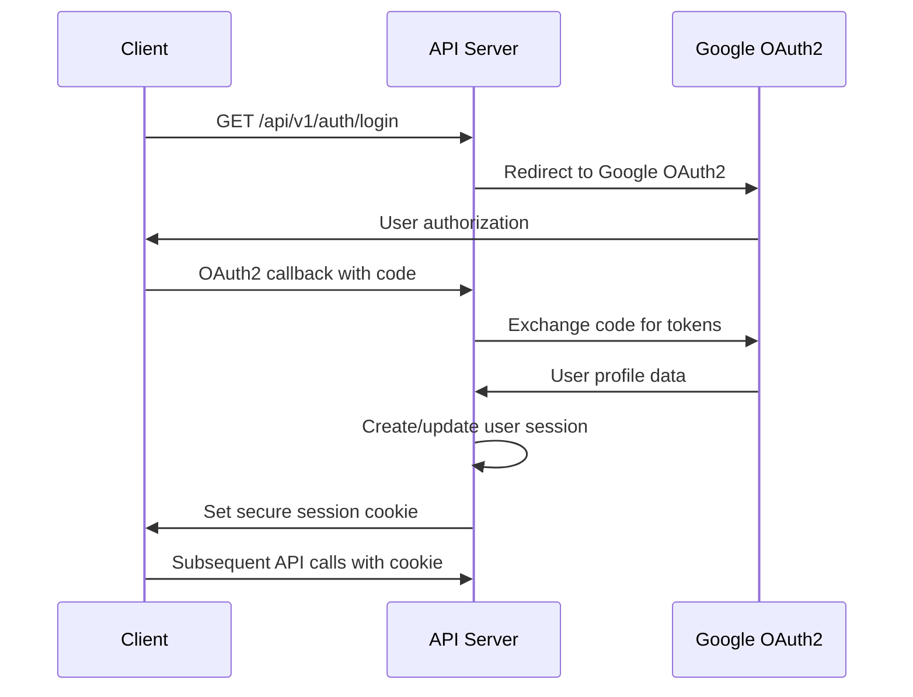

# Authentication API Documentation

**Endpoint Base:** `/api/v1/auth`  
**Version:** 1.0.0  
**Authentication:** OAuth2 with Google Identity Provider  

## Overview

The Authentication API provides OAuth2-based authentication using Google as the identity provider. The system uses session-based authentication with secure cookie management for web applications.

## Endpoints Summary

| Method | Endpoint | Description | Auth Required |
|--------|----------|-------------|---------------|
| `GET` | `/api/v1/auth/login` | Initiate OAuth2 login | ❌ No |
| `POST` | `/api/v1/auth/logout` | Terminate session | ✅ Yes |
| `GET` | `/api/v1/auth/user` | Get current user info | ✅ Yes |
| `GET` | `/api/v1/auth/status` | Check auth status | ❌ No |

## Authentication Flow

### OAuth2 Authentication Process



## Endpoint Details

### 🔐 Initiate Login

**GET** `/api/v1/auth/login`

Initiates the OAuth2 authentication flow by redirecting to Google's authorization server.

#### Query Parameters

| Parameter | Type | Required | Description | Example |
|-----------|------|----------|-------------|---------|
| `redirect_uri` | `string` | No | Post-login redirect URL | `http://localhost:3000/dashboard` |

#### Response

**Status:** `302 Found`

Redirects to Google OAuth2 authorization URL with appropriate parameters.

#### Example Usage

```javascript
// Frontend redirect to initiate login
window.location.href = '/api/v1/auth/login?redirect_uri=' + 
  encodeURIComponent(window.location.origin + '/dashboard');
```

### 🚪 Logout

**POST** `/api/v1/auth/logout`

Terminates the current user session and clears authentication cookies.

#### Request Headers

```http
Cookie: SESSION=<session-cookie-value>
```

#### Response

**Status:** `200 OK`

```json
{
  "message": "Successfully logged out",
  "timestamp": "2025-10-08T14:30:00Z"
}
```

#### Example Usage

```javascript
const response = await fetch('/api/v1/auth/logout', {
  method: 'POST',
  credentials: 'include',
  headers: {
    'Content-Type': 'application/json'
  }
});

if (response.ok) {
  window.location.href = '/';
}
```

### 👤 Get Current User

**GET** `/api/v1/auth/user`

Retrieves information about the currently authenticated user.

#### Response

**Status:** `200 OK`

```json
{
  "id": "user-123",
  "email": "john.doe@company.com",
  "name": "John Doe",
  "givenName": "John",
  "familyName": "Doe",
  "picture": "https://lh3.googleusercontent.com/...",
  "roles": ["USER", "INVENTORY_MANAGER"],
  "permissions": [
    "inventory:read",
    "inventory:write",
    "suppliers:read",
    "analytics:read"
  ],
  "lastLogin": "2025-10-08T14:30:00Z",
  "sessionExpiry": "2025-10-08T18:30:00Z",
  "preferences": {
    "language": "en",
    "timezone": "America/New_York",
    "theme": "light"
  }
}
```

### ❓ Check Authentication Status

**GET** `/api/v1/auth/status`

Checks if the current request has a valid authentication session.

#### Response

**Status:** `200 OK`

```json
{
  "authenticated": true,
  "sessionValid": true,
  "sessionExpiry": "2025-10-08T18:30:00Z",
  "user": {
    "id": "user-123",
    "email": "john.doe@company.com",
    "name": "John Doe"
  }
}
```

**Unauthenticated Response:**

```json
{
  "authenticated": false,
  "sessionValid": false,
  "message": "No valid session found"
}
```

## Security Features

### Session Management

#### Session Configuration
- **Session Timeout**: 4 hours of inactivity
- **Absolute Timeout**: 24 hours maximum session life
- **Secure Cookies**: HTTPOnly, Secure, SameSite=Lax
- **CSRF Protection**: Enabled for state-changing operations

#### Cookie Security
```http
Set-Cookie: SESSION=<encrypted-session-id>; 
  Path=/; 
  HttpOnly; 
  Secure; 
  SameSite=Lax; 
  Max-Age=14400
```

### OAuth2 Configuration

#### Google OAuth2 Scopes
- `openid` - OpenID Connect authentication
- `email` - User email address
- `profile` - Basic profile information

#### Security Headers
```http
X-Content-Type-Options: nosniff
X-Frame-Options: DENY
X-XSS-Protection: 1; mode=block
Strict-Transport-Security: max-age=31536000; includeSubDomains
```

## Error Handling

### Authentication Errors

#### 401 Unauthorized
```json
{
  "error": "unauthorized",
  "message": "Authentication required",
  "timestamp": "2025-10-08T14:30:00Z",
  "correlationId": "SSP-1728378600-4527"
}
```

#### 403 Forbidden
```json
{
  "error": "forbidden",
  "message": "Insufficient permissions for this operation",
  "timestamp": "2025-10-08T14:30:00Z",
  "correlationId": "SSP-1728378600-4528",
  "requiredPermissions": ["inventory:write"]
}
```

#### OAuth2 Errors
```json
{
  "error": "oauth2_error",
  "message": "OAuth2 authentication failed",
  "timestamp": "2025-10-08T14:30:00Z",
  "correlationId": "SSP-1728378600-4529",
  "details": "Invalid authorization code"
}
```

## Role-Based Access Control

### Available Roles

| Role | Description | Permissions |
|------|-------------|-------------|
| `USER` | Basic system access | Read-only access to assigned inventory |
| `INVENTORY_MANAGER` | Inventory management | Full inventory and supplier management |
| `ANALYTICS_VIEWER` | Analytics access | Read access to analytics and reports |
| `ADMIN` | System administration | Full system access and user management |

### Permission Matrix

| Resource | USER | INVENTORY_MANAGER | ANALYTICS_VIEWER | ADMIN |
|----------|------|-------------------|------------------|--------|
| Inventory Items | Read (assigned) | Full CRUD | Read | Full CRUD |
| Suppliers | Read | Full CRUD | Read | Full CRUD |
| Analytics | - | Read | Full Access | Full Access |
| Users | Profile only | - | - | Full CRUD |
| System Config | - | - | - | Full Access |

## Integration Examples

### Frontend Authentication Check

```typescript
// React hook for authentication
const useAuth = () => {
  const [user, setUser] = useState(null);
  const [loading, setLoading] = useState(true);

  useEffect(() => {
    checkAuthStatus();
  }, []);

  const checkAuthStatus = async () => {
    try {
      const response = await fetch('/api/v1/auth/status', {
        credentials: 'include'
      });
      
      if (response.ok) {
        const data = await response.json();
        if (data.authenticated) {
          setUser(data.user);
        }
      }
    } catch (error) {
      console.error('Auth check failed:', error);
    } finally {
      setLoading(false);
    }
  };

  const login = () => {
    window.location.href = '/api/v1/auth/login?redirect_uri=' + 
      encodeURIComponent(window.location.origin + '/dashboard');
  };

  const logout = async () => {
    try {
      await fetch('/api/v1/auth/logout', {
        method: 'POST',
        credentials: 'include'
      });
      setUser(null);
      window.location.href = '/';
    } catch (error) {
      console.error('Logout failed:', error);
    }
  };

  return { user, loading, login, logout };
};
```

### API Request with Authentication

```javascript
// Utility function for authenticated API requests
const apiRequest = async (url, options = {}) => {
  const config = {
    credentials: 'include',
    headers: {
      'Content-Type': 'application/json',
      ...options.headers
    },
    ...options
  };

  const response = await fetch(url, config);

  if (response.status === 401) {
    // Redirect to login if unauthorized
    window.location.href = '/api/v1/auth/login';
    return;
  }

  if (!response.ok) {
    const errorData = await response.json();
    throw new Error(errorData.message || 'API request failed');
  }

  return response.json();
};

// Usage example
const getInventoryItems = () => {
  return apiRequest('/api/v1/inventory');
};
```

## Monitoring and Compliance

### Authentication Metrics
- **Login Success Rate**: Percentage of successful OAuth2 flows
- **Session Duration**: Average and median session lengths
- **Failed Authentication Attempts**: Rate and patterns of failed attempts
- **User Activity**: Login frequency and access patterns

### Compliance Features
- **Audit Logging**: All authentication events are logged
- **GDPR Compliance**: User data handling follows GDPR requirements
- **SOC 2 Type II**: Authentication controls align with SOC 2 requirements
- **Session Management**: Secure session handling prevents session fixation

---

**Related Documentation:**
- [OAuth2 Security Architecture](../../architecture/patterns/oauth2-security-architecture.md)
- [Security Patterns](../../architecture/patterns/security-patterns.md)
- [Error Handling Guide](../integration/error-handling.md)
