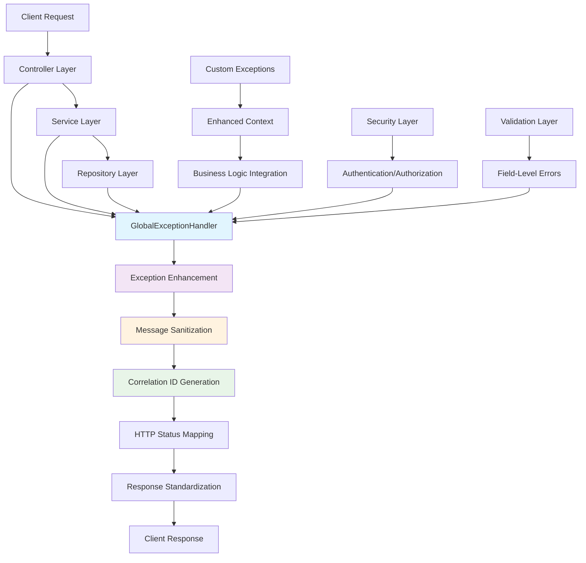

# Exception Integration Patterns Documentation

**Version:** 1.0  
**Date:** October 8, 2025  
**Purpose:** Enterprise Exception Integration Patterns  
**Scope:** API, Service, and Cross-Layer Exception Integration Strategies  

## Table of Contents

1. [Integration Overview](#integration-overview)
2. [API Layer Integration](#api-layer-integration)
3. [Service Layer Integration](#service-layer-integration)
4. [Repository Layer Integration](#repository-layer-integration)
5. [Security Integration](#security-integration)
6. [Validation Framework Integration](#validation-framework-integration)
7. [Monitoring and Observability](#monitoring-and-observability)
8. [Client SDK Integration](#client-sdk-integration)

## Integration Overview

The exception layer provides **seamless integration** across all application tiers with standardized error handling, correlation tracking, and business-aware exception translation.

### Exception Integration Architecture



### Integration Principles

1. **Unified Error Contract**: Consistent response structure across all endpoints
2. **Context Preservation**: Rich error information maintained through layers
3. **Security Awareness**: Sanitized responses preventing information disclosure
4. **Business Intelligence**: Domain-specific error handling with meaningful messages
5. **Monitoring Integration**: Comprehensive tracking with correlation IDs

## API Layer Integration

### Pattern 1: REST Controller Integration

**Strategy**: Leverage enhanced exception handling for comprehensive API error management.

#### Enhanced Controller with Exception Integration
```java
@RestController
@RequestMapping("/api/v1/suppliers")
@Validated
@Slf4j
public class SupplierController {
    
    private final SupplierService supplierService;
    
    /**
     * Create supplier with comprehensive exception handling.
     */
    @PostMapping
    @ResponseStatus(HttpStatus.CREATED)
    public SupplierDTO createSupplier(@Valid @RequestBody CreateSupplierRequest request) {
        
        // Business validation with enhanced exceptions
        if (request.getName() == null || request.getName().trim().isEmpty()) {
            throw InvalidRequestException.requiredField("name");
        }
        
        try {
            return supplierService.createSupplier(request);
            
        } catch (DataIntegrityViolationException ex) {
            // Convert technical exception to business exception with context
            throw DuplicateResourceException.supplierName(request.getName());
        }
    }
    
    /**
     * Update supplier with optimistic locking support.
     */
    @PutMapping("/{id}")
    public SupplierDTO updateSupplier(@PathVariable String id, 
                                     @Valid @RequestBody UpdateSupplierRequest request) {
        
        try {
            return supplierService.updateSupplier(id, request);
            
        } catch (ObjectOptimisticLockingFailureException ex) {
            // Enhanced conflict handling with correlation tracking
            log.warn("Concurrent update detected for supplier {}", id);
            throw ex; // Handled by GlobalExceptionHandler with correlation ID
        }
    }
    
    /**
     * Delete supplier with business rule validation.
     */
    @DeleteMapping("/{id}")
    @ResponseStatus(HttpStatus.NO_CONTENT)
    public void deleteSupplier(@PathVariable String id) {
        
        try {
            supplierService.deleteSupplier(id);
            
        } catch (IllegalStateException ex) {
            // Business rule violation with enhanced context
            if (ex.getMessage().contains("inventory")) {
                throw InvalidRequestException.businessRuleViolation(
                    "Cannot delete supplier with active inventory items");
            }
            throw ex;
        }
    }
    
    /**
     * Bulk operations with comprehensive error aggregation.
     */
    @PostMapping("/bulk")
    public BulkSupplierResponseDTO createSuppliersInBulk(
            @Valid @RequestBody BulkSupplierRequest request) {
        
        List<String> errors = new ArrayList<>();
        List<SupplierDTO> created = new ArrayList<>();
        
        for (CreateSupplierRequest supplierRequest : request.getSuppliers()) {
            try {
                SupplierDTO supplier = supplierService.createSupplier(supplierRequest);
                created.add(supplier);
                
            } catch (DuplicateResourceException ex) {
                errors.add(ex.getClientMessage());
            } catch (InvalidRequestException ex) {
                errors.add("Validation failed for supplier: " + ex.getMessage());
            }
        }
        
        return BulkSupplierResponseDTO.builder()
            .created(created)
            .errors(errors)
            .summary(BulkOperationSummary.of(created.size(), errors.size()))
            .build();
    }
}
```

### Pattern 2: OpenAPI Documentation Integration

**Strategy**: Automatically document exception responses with enhanced error schemas.

#### OpenAPI Exception Documentation
```java
@Configuration
public class OpenAPIExceptionConfiguration {
    
    @Bean
    public OpenAPI customOpenAPI() {
        return new OpenAPI()
            .components(new Components()
                .addSchemas("ErrorResponse", createErrorResponseSchema())
                .addSchemas("ValidationErrorResponse", createValidationErrorResponseSchema())
                .addSchemas("ConflictErrorResponse", createConflictErrorResponseSchema()));
    }
    
    private Schema<?> createErrorResponseSchema() {
        return new ObjectSchema()
            .description("Standard error response structure")
            .addProperty("error", new StringSchema()
                .description("Normalized error code")
                .example("bad_request"))
            .addProperty("message", new StringSchema()
                .description("Human-readable error message")
                .example("Validation failed: 2 field error(s)"))
            .addProperty("timestamp", new StringSchema()
                .format("date-time")
                .description("Error occurrence timestamp")
                .example("2025-10-08T10:30:00Z"))
            .addProperty("correlationId", new StringSchema()
                .description("Unique correlation ID for request tracking")
                .example("SSP-1728378600-4521"));
    }
    
    private Schema<?> createValidationErrorResponseSchema() {
        return new ObjectSchema()
            .description("Validation error response with field details")
            .allOf(List.of(
                new Schema<>().$ref("#/components/schemas/ErrorResponse"),
                new ObjectSchema()
                    .addProperty("fieldErrors", new ObjectSchema()
                        .description("Field-specific validation errors")
                        .example(Map.of(
                            "name", "This field is required",
                            "email", "Invalid email format"
                        )))
            ));
    }
    
    private Schema<?> createConflictErrorResponseSchema() {
        return new ObjectSchema()
            .description("Resource conflict error response")
            .allOf(List.of(
                new Schema<>().$ref("#/components/schemas/ErrorResponse"),
                new ObjectSchema()
                    .addProperty("resourceType", new StringSchema()
                        .description("Type of resource in conflict")
                        .example("Supplier"))
                    .addProperty("conflictField", new StringSchema()
                        .description("Field causing the conflict")
                        .example("name"))
                    .addProperty("duplicateValue", new StringSchema()
                        .description("Value that already exists")
                        .example("Acme Corp"))
            ));
    }
}

// Enhanced API endpoint documentation
@RestController
public class SupplierController {
    
    @PostMapping("/suppliers")
    @ApiResponses(value = {
        @ApiResponse(responseCode = "201", description = "Supplier created successfully",
            content = @Content(schema = @Schema(implementation = SupplierDTO.class))),
        @ApiResponse(responseCode = "400", description = "Validation failed",
            content = @Content(schema = @Schema(ref = "#/components/schemas/ValidationErrorResponse"))),
        @ApiResponse(responseCode = "409", description = "Supplier already exists",
            content = @Content(schema = @Schema(ref = "#/components/schemas/ConflictErrorResponse"))),
        @ApiResponse(responseCode = "500", description = "Internal server error",
            content = @Content(schema = @Schema(ref = "#/components/schemas/ErrorResponse")))
    })
    public SupplierDTO createSupplier(@Valid @RequestBody CreateSupplierRequest request) {
        // Implementation...
    }
}
```

## Service Layer Integration

### Pattern 1: Business Logic Exception Translation

**Strategy**: Convert technical exceptions into business-meaningful errors with enhanced context.

#### Enhanced Service Layer Implementation
```java
@Service
@Transactional
@Slf4j
public class SupplierService {
    
    private final SupplierRepository supplierRepository;
    private final InventoryItemRepository inventoryRepository;
    private final AuditService auditService;
    
    /**
     * Create supplier with comprehensive validation and exception handling.
     */
    public SupplierDTO createSupplier(CreateSupplierRequest request) {
        
        // Enhanced business validation
        validateSupplierBusinessRules(request);
        
        try {
            // Check for existing supplier with enhanced context
            if (supplierRepository.existsByName(request.getName())) {
                throw DuplicateResourceException.supplierName(request.getName());
            }
            
            Supplier supplier = supplierMapper.toEntity(request);
            Supplier saved = supplierRepository.save(supplier);
            
            // Audit successful creation
            auditService.logSupplierCreation(saved.getId(), saved.getName());
            
            return supplierMapper.toDTO(saved);
            
        } catch (DataIntegrityViolationException ex) {
            // Enhanced technical exception translation
            String constraintName = extractConstraintName(ex);
            
            if (constraintName.contains("name")) {
                throw DuplicateResourceException.supplierName(request.getName());
            } else if (constraintName.contains("email")) {
                throw DuplicateResourceException.supplierEmail(request.getContactEmail());
            } else {
                log.error("Unexpected data integrity violation creating supplier", ex);
                throw new IllegalStateException("Supplier creation failed due to data conflict");
            }
        }
    }
    
    /**
     * Delete supplier with enhanced business rule enforcement.
     */
    public void deleteSupplier(String supplierId) {
        
        // Verify supplier exists
        Supplier supplier = supplierRepository.findById(supplierId)
            .orElseThrow(() -> new NoSuchElementException("Supplier not found: " + supplierId));
        
        // Enhanced business rule validation
        validateSupplierDeletion(supplier);
        
        try {
            supplierRepository.delete(supplier);
            auditService.logSupplierDeletion(supplierId, supplier.getName());
            
        } catch (DataIntegrityViolationException ex) {
            // Enhanced constraint violation handling
            if (isInventoryConstraintViolation(ex)) {
                throw new IllegalStateException(
                    "Cannot delete supplier '" + supplier.getName() + 
                    "' - active inventory items exist");
            } else {
                log.error("Unexpected constraint violation deleting supplier {}", supplierId, ex);
                throw new IllegalStateException("Supplier deletion failed due to data constraints");
            }
        }
    }
    
    private void validateSupplierBusinessRules(CreateSupplierRequest request) {
        Map<String, String> fieldErrors = new HashMap<>();
        
        // Enhanced field validation
        if (request.getName() == null || request.getName().trim().isEmpty()) {
            fieldErrors.put("name", "Supplier name is required");
        } else if (request.getName().length() > 100) {
            fieldErrors.put("name", "Supplier name must not exceed 100 characters");
        }
        
        if (request.getContactEmail() != null && !isValidEmail(request.getContactEmail())) {
            fieldErrors.put("contactEmail", "Invalid email format");
        }
        
        if (request.getContactPhone() != null && !isValidPhoneNumber(request.getContactPhone())) {
            fieldErrors.put("contactPhone", "Invalid phone number format");
        }
        
        // Business-specific validation
        if (request.getName() != null && isRestrictedSupplierName(request.getName())) {
            fieldErrors.put("name", "Supplier name is restricted or reserved");
        }
        
        if (!fieldErrors.isEmpty()) {
            throw new InvalidRequestException("Supplier validation failed", fieldErrors);
        }
    }
    
    private void validateSupplierDeletion(Supplier supplier) {
        // Check for active inventory items
        long inventoryCount = inventoryRepository.countBySupplier(supplier);
        if (inventoryCount > 0) {
            throw new IllegalStateException(
                "Cannot delete supplier with " + inventoryCount + " active inventory items");
        }
        
        // Check for pending orders
        if (hasActivePurchaseOrders(supplier.getId())) {
            throw new IllegalStateException("Cannot delete supplier with active purchase orders");
        }
    }
    
    private String extractConstraintName(DataIntegrityViolationException ex) {
        // Extract constraint name from exception for enhanced error context
        String message = ex.getMostSpecificCause().getMessage().toLowerCase();
        
        if (message.contains("uk_supplier_name") || message.contains("name")) {
            return "name";
        } else if (message.contains("uk_supplier_email") || message.contains("email")) {
            return "email";
        }
        
        return "unknown";
    }
    
    private boolean isInventoryConstraintViolation(DataIntegrityViolationException ex) {
        String message = ex.getMostSpecificCause().getMessage().toLowerCase();
        return message.contains("inventory") || message.contains("fk_inventory_supplier");
    }
}
```

### Pattern 2: Service Layer Exception Aggregation

**Strategy**: Collect and aggregate multiple validation errors for comprehensive feedback.

#### Multi-Error Validation Service
```java
@Service
public class ValidationAggregationService {
    
    /**
     * Validate multiple suppliers with error aggregation.
     */
    public BulkValidationResult validateSuppliersInBulk(List<CreateSupplierRequest> requests) {
        
        List<SupplierValidationResult> results = new ArrayList<>();
        
        for (int i = 0; i < requests.size(); i++) {
            CreateSupplierRequest request = requests.get(i);
            
            try {
                validateSingleSupplier(request);
                results.add(SupplierValidationResult.success(i, request.getName()));
                
            } catch (InvalidRequestException ex) {
                results.add(SupplierValidationResult.failure(i, request.getName(), ex));
            } catch (DuplicateResourceException ex) {
                results.add(SupplierValidationResult.conflict(i, request.getName(), ex));
            }
        }
        
        return BulkValidationResult.of(results);
    }
    
    /**
     * Comprehensive supplier validation with detailed error collection.
     */
    private void validateSingleSupplier(CreateSupplierRequest request) {
        List<String> generalErrors = new ArrayList<>();
        Map<String, String> fieldErrors = new HashMap<>();
        
        // Field-level validation
        validateSupplierFields(request, fieldErrors);
        
        // Business rule validation
        validateSupplierBusinessRules(request, generalErrors);
        
        // Cross-field validation
        validateSupplierCrossFields(request, fieldErrors);
        
        // Aggregate all errors
        if (!fieldErrors.isEmpty() || !generalErrors.isEmpty()) {
            InvalidRequestException ex = new InvalidRequestException(
                "Supplier validation failed with " + (fieldErrors.size() + generalErrors.size()) + " errors",
                fieldErrors
            );
            
            // Add general errors to the exception context
            generalErrors.forEach(error -> ex.getGeneralErrors().add(error));
            
            throw ex;
        }
    }
    
    @Data
    @Builder
    public static class SupplierValidationResult {
        private int index;
        private String supplierName;
        private ValidationStatus status;
        private List<String> errors;
        private Exception exception;
        
        public static SupplierValidationResult success(int index, String name) {
            return SupplierValidationResult.builder()
                .index(index)
                .supplierName(name)
                .status(ValidationStatus.SUCCESS)
                .errors(List.of())
                .build();
        }
        
        public static SupplierValidationResult failure(int index, String name, InvalidRequestException ex) {
            List<String> errors = new ArrayList<>();
            ex.getFieldErrors().forEach((field, error) -> errors.add(field + ": " + error));
            errors.addAll(ex.getGeneralErrors());
            
            return SupplierValidationResult.builder()
                .index(index)
                .supplierName(name)
                .status(ValidationStatus.VALIDATION_FAILED)
                .errors(errors)
                .exception(ex)
                .build();
        }
        
        public static SupplierValidationResult conflict(int index, String name, DuplicateResourceException ex) {
            return SupplierValidationResult.builder()
                .index(index)
                .supplierName(name)
                .status(ValidationStatus.CONFLICT)
                .errors(List.of(ex.getClientMessage()))
                .exception(ex)
                .build();
        }
        
        public enum ValidationStatus {
            SUCCESS, VALIDATION_FAILED, CONFLICT
        }
    }
}
```

## Repository Layer Integration

### Pattern 1: Repository Exception Translation

**Strategy**: Translate data access exceptions with business context preservation.

#### Enhanced Repository Exception Handling
```java
@Repository
public class SupplierRepositoryWrapper {
    
    private final SupplierRepository repository;
    private final EntityManager entityManager;
    
    /**
     * Save supplier with enhanced exception translation.
     */
    public Supplier saveWithExceptionTranslation(Supplier supplier) {
        try {
            return repository.save(supplier);
            
        } catch (DataIntegrityViolationException ex) {
            throw translateDataIntegrityViolation(ex, supplier);
        } catch (OptimisticLockingFailureException ex) {
            throw new ObjectOptimisticLockingFailureException(
                "Supplier was modified by another user", ex);
        }
    }
    
    /**
     * Find supplier with enhanced not found handling.
     */
    public Supplier findByIdWithException(String id) {
        return repository.findById(id)
            .orElseThrow(() -> new NoSuchElementException(
                "Supplier not found with ID: " + id));
    }
    
    /**
     * Delete supplier with dependency checking.
     */
    public void deleteWithDependencyCheck(String supplierId) {
        try {
            Supplier supplier = findByIdWithException(supplierId);
            
            // Check dependencies before deletion
            if (hasInventoryDependencies(supplierId)) {
                throw new IllegalStateException(
                    "Cannot delete supplier '" + supplier.getName() + 
                    "' with active inventory items");
            }
            
            repository.delete(supplier);
            
        } catch (DataIntegrityViolationException ex) {
            throw new IllegalStateException(
                "Supplier deletion failed due to referential constraints", ex);
        }
    }
    
    /**
     * Bulk operations with transaction management and error aggregation.
     */
    @Transactional
    public BulkOperationResult<Supplier> saveAllWithErrorHandling(List<Supplier> suppliers) {
        
        List<Supplier> saved = new ArrayList<>();
        List<BulkOperationError> errors = new ArrayList<>();
        
        for (int i = 0; i < suppliers.size(); i++) {
            Supplier supplier = suppliers.get(i);
            
            try {
                Supplier savedSupplier = saveWithExceptionTranslation(supplier);
                saved.add(savedSupplier);
                
            } catch (DuplicateResourceException ex) {
                errors.add(BulkOperationError.builder()
                    .index(i)
                    .item(supplier.getName())
                    .errorType("DUPLICATE")
                    .errorMessage(ex.getClientMessage())
                    .build());
                    
            } catch (InvalidRequestException ex) {
                errors.add(BulkOperationError.builder()
                    .index(i)
                    .item(supplier.getName())
                    .errorType("VALIDATION")
                    .errorMessage(ex.getMessage())
                    .build());
            }
        }
        
        return BulkOperationResult.<Supplier>builder()
            .successful(saved)
            .errors(errors)
            .totalProcessed(suppliers.size())
            .successCount(saved.size())
            .errorCount(errors.size())
            .build();
    }
    
    private RuntimeException translateDataIntegrityViolation(DataIntegrityViolationException ex, 
                                                           Supplier supplier) {
        String constraintName = extractConstraintName(ex);
        
        return switch (constraintName) {
            case "name" -> DuplicateResourceException.supplierName(supplier.getName());
            case "email" -> DuplicateResourceException.supplierEmail(supplier.getContactEmail());
            case "phone" -> new DuplicateResourceException(
                "Supplier phone number already exists: " + supplier.getContactPhone(),
                "Supplier", "phone", supplier.getContactPhone());
            default -> new IllegalStateException("Data integrity violation: " + ex.getMessage(), ex);
        };
    }
    
    private boolean hasInventoryDependencies(String supplierId) {
        String query = "SELECT COUNT(i) FROM InventoryItem i WHERE i.supplier.id = :supplierId";
        Long count = entityManager.createQuery(query, Long.class)
            .setParameter("supplierId", supplierId)
            .getSingleResult();
        return count > 0;
    }
}
```

## Security Integration

### Pattern 1: Security-Aware Exception Handling

**Strategy**: Implement role-based exception responses with information disclosure prevention.

#### Security-Enhanced Exception Processing
```java
@Component
public class SecurityAwareExceptionProcessor {
    
    private final SecurityContext securityContext;
    private final AuditService auditService;
    
    /**
     * Process exceptions with security context awareness.
     */
    public String processSecurityAwareMessage(Exception ex, HttpServletRequest request) {
        
        Authentication auth = SecurityContextHolder.getContext().getAuthentication();
        UserRole userRole = extractUserRole(auth);
        boolean isAuthenticated = auth != null && auth.isAuthenticated();
        
        // Audit security-related exceptions
        if (isSecurityException(ex)) {
            auditSecurityException(ex, request, userRole);
        }
        
        return switch (userRole) {
            case ANONYMOUS -> getAnonymousMessage(ex);
            case USER -> getUserMessage(ex);
            case ADMIN -> getAdminMessage(ex);
            case SYSTEM -> getSystemMessage(ex);
        };
    }
    
    private String getAnonymousMessage(Exception ex) {
        return switch (ex) {
            case AuthenticationException ae -> "Authentication required";
            case AccessDeniedException ade -> "Access denied";
            case NoSuchElementException nsee -> "Resource not found";
            case DuplicateResourceException dre -> "Resource conflict";
            default -> "Request failed";
        };
    }
    
    private String getUserMessage(Exception ex) {
        return switch (ex) {
            case DuplicateResourceException dre when dre.hasDetailedContext() -> 
                dre.getClientMessage();
            case InvalidRequestException ire when ire.hasFieldErrors() -> 
                "Validation failed: " + ire.getErrorCount() + " field error(s)";
            case NoSuchElementException nsee -> "Requested resource not found";
            case IllegalStateException ise -> "Operation not allowed in current state";
            default -> sanitizeForUser(ex.getMessage());
        };
    }
    
    private String getAdminMessage(Exception ex) {
        String baseMessage = getUserMessage(ex);
        
        // Add technical context for administrators
        if (ex.getCause() != null) {
            String cause = sanitizeForAdmin(ex.getCause().getMessage());
            return baseMessage + " (Technical details: " + cause + ")";
        }
        
        return baseMessage;
    }
    
    private void auditSecurityException(Exception ex, HttpServletRequest request, UserRole role) {
        SecurityExceptionAuditEntry entry = SecurityExceptionAuditEntry.builder()
            .exceptionType(ex.getClass().getSimpleName())
            .userRole(role.name())
            .requestPath(request.getRequestURI())
            .requestMethod(request.getMethod())
            .remoteAddress(request.getRemoteAddr())
            .userAgent(request.getHeader("User-Agent"))
            .timestamp(Instant.now())
            .message(sanitizeForAudit(ex.getMessage()))
            .build();
        
        auditService.logSecurityException(entry);
    }
    
    private boolean isSecurityException(Exception ex) {
        return ex instanceof AuthenticationException ||
               ex instanceof AccessDeniedException ||
               (ex instanceof InvalidRequestException ire && ire.isCritical());
    }
    
    private enum UserRole {
        ANONYMOUS, USER, ADMIN, SYSTEM
    }
}
```

## Validation Framework Integration

### Pattern 1: Bean Validation Integration with Enhanced Exceptions

**Strategy**: Integrate Bean Validation with custom exception enhancements for comprehensive validation.

#### Enhanced Validation Integration
```java
@Component
public class EnhancedValidationProcessor {
    
    private final Validator validator;
    private final MessageSource messageSource;
    
    /**
     * Validate object with enhanced exception creation.
     */
    public <T> void validateWithEnhancedExceptions(T object, Class<?>... groups) {
        Set<ConstraintViolation<T>> violations = validator.validate(object, groups);
        
        if (!violations.isEmpty()) {
            Map<String, String> fieldErrors = new HashMap<>();
            List<String> generalErrors = new ArrayList<>();
            
            for (ConstraintViolation<T> violation : violations) {
                String propertyPath = violation.getPropertyPath().toString();
                String message = violation.getMessage();
                
                if (propertyPath.isEmpty()) {
                    generalErrors.add(message);
                } else {
                    fieldErrors.put(propertyPath, message);
                }
            }
            
            // Determine severity based on validation groups
            InvalidRequestException.ValidationSeverity severity = determineSeverity(groups);
            
            throw new InvalidRequestException(
                "Validation failed with " + violations.size() + " violations",
                severity,
                "BEAN_VALIDATION_FAILED"
            );
        }
    }
    
    /**
     * Custom validator for business rules with enhanced error context.
     */
    @Component
    public static class SupplierBusinessRuleValidator implements ConstraintValidator<ValidSupplier, CreateSupplierRequest> {
        
        private final SupplierRepository supplierRepository;
        
        @Override
        public boolean isValid(CreateSupplierRequest request, ConstraintValidatorContext context) {
            boolean isValid = true;
            
            // Disable default constraint violation
            context.disableDefaultConstraintViolation();
            
            // Business rule: unique supplier name
            if (request.getName() != null && supplierRepository.existsByName(request.getName())) {
                context.buildConstraintViolationWithTemplate(
                    "Supplier name already exists: " + request.getName())
                    .addPropertyNode("name")
                    .addConstraintViolation();
                isValid = false;
            }
            
            // Business rule: valid contact information
            if (request.getContactEmail() == null && request.getContactPhone() == null) {
                context.buildConstraintViolationWithTemplate(
                    "Either email or phone contact must be provided")
                    .addConstraintViolation();
                isValid = false;
            }
            
            // Business rule: restricted names
            if (request.getName() != null && isRestrictedName(request.getName())) {
                context.buildConstraintViolationWithTemplate(
                    "Supplier name is restricted: " + request.getName())
                    .addPropertyNode("name")
                    .addConstraintViolation();
                isValid = false;
            }
            
            return isValid;
        }
        
        private boolean isRestrictedName(String name) {
            Set<String> restrictedNames = Set.of("SYSTEM", "ADMIN", "TEST", "DEFAULT");
            return restrictedNames.contains(name.toUpperCase());
        }
    }
    
    // Custom validation annotation
    @Constraint(validatedBy = SupplierBusinessRuleValidator.class)
    @Target({ElementType.TYPE})
    @Retention(RetentionPolicy.RUNTIME)
    @Documented
    public @interface ValidSupplier {
        String message() default "Supplier validation failed";
        Class<?>[] groups() default {};
        Class<? extends Payload>[] payload() default {};
    }
}
```

## Monitoring and Observability

### Pattern 1: Exception Metrics and Correlation Tracking

**Strategy**: Implement comprehensive exception monitoring with correlation tracking and business metrics.

#### Enhanced Exception Monitoring
```java
@Component
public class ExceptionMonitoringService {
    
    private final MeterRegistry meterRegistry;
    private final TracingService tracingService;
    
    /**
     * Record exception metrics with business context.
     */
    public void recordExceptionMetrics(Exception ex, String operation, Duration responseTime, 
                                     HttpServletRequest request) {
        
        // Basic exception counters with enhanced tags
        meterRegistry.counter("exceptions.total",
            Tags.of(
                "type", ex.getClass().getSimpleName(),
                "operation", operation,
                "httpMethod", request.getMethod(),
                "endpoint", extractEndpoint(request.getRequestURI()),
                "userAgent", extractUserAgent(request)
            )).increment();
        
        // Performance impact tracking
        meterRegistry.timer("exceptions.response.time",
            Tags.of(
                "type", ex.getClass().getSimpleName(),
                "severity", determineSeverity(ex).name()
            )).record(responseTime);
        
        // Business context metrics
        recordBusinessMetrics(ex, operation);
        
        // Correlation tracking
        String correlationId = extractOrGenerateCorrelationId(request);
        recordCorrelationMetrics(ex, correlationId);
        
        // Distributed tracing integration
        tracingService.recordExceptionSpan(ex, correlationId, operation);
    }
    
    private void recordBusinessMetrics(Exception ex, String operation) {
        // Enhanced context for custom exceptions
        if (ex instanceof DuplicateResourceException dre && dre.hasDetailedContext()) {
            meterRegistry.counter("exceptions.business.duplicate",
                Tags.of(
                    "resourceType", dre.getResourceType(),
                    "field", dre.getConflictField(),
                    "operation", operation
                )).increment();
        }
        
        if (ex instanceof InvalidRequestException ire) {
            meterRegistry.counter("exceptions.business.validation",
                Tags.of(
                    "severity", ire.getSeverity().name(),
                    "errorCount", String.valueOf(ire.getErrorCount()),
                    "hasFieldErrors", String.valueOf(ire.hasFieldErrors()),
                    "operation", operation
                )).increment();
        }
        
        // Security exception tracking
        if (isSecurityException(ex)) {
            meterRegistry.counter("exceptions.security",
                Tags.of(
                    "type", ex.getClass().getSimpleName(),
                    "operation", operation
                )).increment();
        }
    }
    
    /**
     * Health indicator for exception patterns.
     */
    @Component
    public static class ExceptionHealthIndicator implements HealthIndicator {
        
        private final MeterRegistry meterRegistry;
        
        @Override
        public Health health() {
            try {
                // Analyze exception patterns for health assessment
                Map<String, Object> details = new HashMap<>();
                
                // Error rate analysis
                double errorRate = calculateErrorRate();
                details.put("errorRate", errorRate);
                
                if (errorRate > 0.1) { // 10% error rate threshold
                    return Health.down()
                        .withDetails(details)
                        .withDetail("status", "High error rate detected")
                        .build();
                }
                
                // Exception distribution analysis
                Map<String, Double> distribution = getExceptionDistribution();
                details.put("exceptionDistribution", distribution);
                
                // Critical exception check
                long criticalExceptions = getCriticalExceptionCount();
                details.put("criticalExceptions", criticalExceptions);
                
                if (criticalExceptions > 5) { // Threshold for critical exceptions
                    return Health.down()
                        .withDetails(details)
                        .withDetail("status", "High critical exception count")
                        .build();
                }
                
                return Health.up()
                    .withDetails(details)
                    .withDetail("status", "Exception patterns normal")
                    .build();
                    
            } catch (Exception ex) {
                return Health.down()
                    .withException(ex)
                    .withDetail("status", "Health check failed")
                    .build();
            }
        }
        
        private double calculateErrorRate() {
            // Calculate error rate from metrics
            Counter totalRequests = meterRegistry.find("http.server.requests").counter();
            Counter totalExceptions = meterRegistry.find("exceptions.total").counter();
            
            if (totalRequests != null && totalExceptions != null) {
                double requests = totalRequests.count();
                double exceptions = totalExceptions.count();
                return requests > 0 ? exceptions / requests : 0.0;
            }
            
            return 0.0;
        }
    }
}
```

## Client SDK Integration

### Pattern 1: TypeScript Client Exception Handling

**Strategy**: Generate type-safe client libraries with comprehensive exception handling.

#### TypeScript Client Integration
```typescript
// Generated TypeScript client with exception handling
export class InventoryServiceClient {
    
    private readonly baseURL: string;
    private readonly httpClient: HttpClient;
    
    constructor(baseURL: string) {
        this.baseURL = baseURL;
        this.httpClient = new HttpClient();
    }
    
    /**
     * Create supplier with comprehensive error handling.
     */
    async createSupplier(request: CreateSupplierRequest): Promise<SupplierDTO> {
        try {
            const response = await this.httpClient.post<SupplierDTO>(
                `${this.baseURL}/api/v1/suppliers`,
                request
            );
            return response.data;
            
        } catch (error) {
            throw this.handleApiError(error);
        }
    }
    
    /**
     * Enhanced error handling with business context.
     */
    private handleApiError(error: any): InventoryServiceError {
        if (!error.response) {
            return new NetworkError('Network connection failed', error);
        }
        
        const { status, data } = error.response;
        const errorResponse = data as ErrorResponse;
        
        switch (status) {
            case 400:
                return new ValidationError(
                    errorResponse.message,
                    errorResponse.correlationId,
                    this.extractFieldErrors(data)
                );
                
            case 401:
                return new AuthenticationError(
                    errorResponse.message,
                    errorResponse.correlationId
                );
                
            case 403:
                return new AuthorizationError(
                    errorResponse.message,
                    errorResponse.correlationId
                );
                
            case 404:
                return new ResourceNotFoundError(
                    errorResponse.message,
                    errorResponse.correlationId
                );
                
            case 409:
                return new ResourceConflictError(
                    errorResponse.message,
                    errorResponse.correlationId,
                    this.extractConflictDetails(data)
                );
                
            case 500:
                return new ServerError(
                    errorResponse.message,
                    errorResponse.correlationId
                );
                
            default:
                return new UnknownError(
                    `Unexpected error: ${status}`,
                    errorResponse.correlationId
                );
        }
    }
    
    private extractFieldErrors(data: any): Map<string, string> {
        const fieldErrors = new Map<string, string>();
        
        if (data.fieldErrors) {
            Object.entries(data.fieldErrors).forEach(([field, message]) => {
                fieldErrors.set(field, message as string);
            });
        }
        
        return fieldErrors;
    }
    
    private extractConflictDetails(data: any): ConflictDetails | undefined {
        if (data.resourceType && data.conflictField && data.duplicateValue) {
            return {
                resourceType: data.resourceType,
                conflictField: data.conflictField,
                duplicateValue: data.duplicateValue
            };
        }
        return undefined;
    }
}

// Enhanced error hierarchy for client
export abstract class InventoryServiceError extends Error {
    constructor(
        message: string,
        public readonly correlationId: string,
        public readonly timestamp: string = new Date().toISOString()
    ) {
        super(message);
        this.name = this.constructor.name;
    }
    
    abstract getErrorCode(): string;
    abstract getUserMessage(): string;
}

export class ValidationError extends InventoryServiceError {
    constructor(
        message: string,
        correlationId: string,
        public readonly fieldErrors: Map<string, string>
    ) {
        super(message, correlationId);
    }
    
    getErrorCode(): string { return 'VALIDATION_FAILED'; }
    getUserMessage(): string {
        return `Validation failed: ${this.fieldErrors.size} field error(s)`;
    }
    
    getFieldError(fieldName: string): string | undefined {
        return this.fieldErrors.get(fieldName);
    }
    
    hasFieldErrors(): boolean {
        return this.fieldErrors.size > 0;
    }
}

export class ResourceConflictError extends InventoryServiceError {
    constructor(
        message: string,
        correlationId: string,
        public readonly conflictDetails?: ConflictDetails
    ) {
        super(message, correlationId);
    }
    
    getErrorCode(): string { return 'RESOURCE_CONFLICT'; }
    getUserMessage(): string {
        if (this.conflictDetails) {
            return `${this.conflictDetails.resourceType} with ${this.conflictDetails.conflictField} '${this.conflictDetails.duplicateValue}' already exists`;
        }
        return this.message;
    }
}

interface ConflictDetails {
    resourceType: string;
    conflictField: string;
    duplicateValue: string;
}

interface ErrorResponse {
    error: string;
    message: string;
    timestamp: string;
    correlationId: string;
    fieldErrors?: Record<string, string>;
    resourceType?: string;
    conflictField?: string;
    duplicateValue?: string;
}
```

---

## Integration Summary

The exception integration patterns provide:

1. **API Integration**: Comprehensive error handling with OpenAPI documentation
2. **Service Integration**: Business logic exception translation with context preservation
3. **Repository Integration**: Data access exception handling with dependency checking
4. **Security Integration**: Role-based error responses with audit logging
5. **Validation Integration**: Enhanced Bean Validation with custom business rules
6. **Monitoring Integration**: Metrics collection with correlation tracking and health monitoring
7. **Client Integration**: Type-safe client libraries with business-aware error handling

These patterns ensure seamless exception handling across all application layers with enterprise-grade reliability and observability.

---

*This integration documentation provides comprehensive patterns for exception handling integration across Spring Boot application layers.*