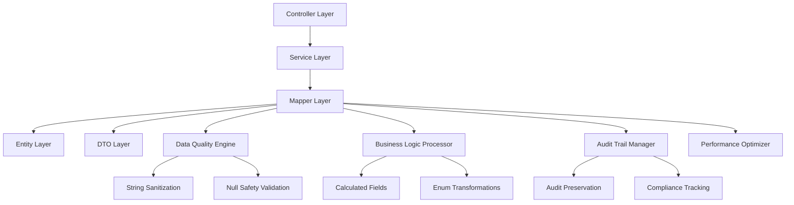
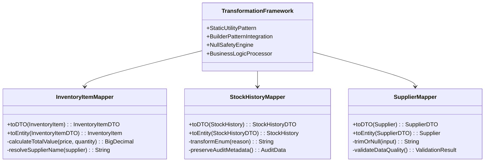
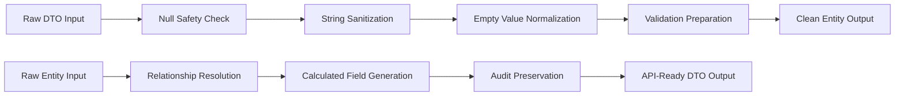
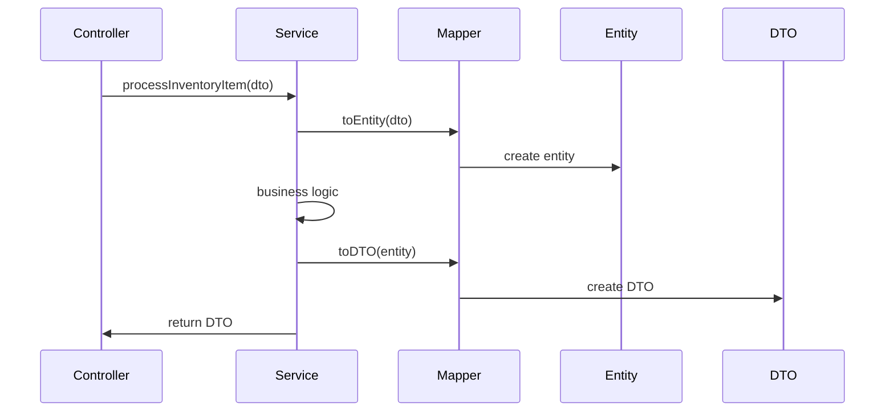

# Mapper Layer Architecture Documentation

**Version:** 1.0  
**Date:** December 19, 2024  
**Layer:** Entity-DTO Transformation Architecture  
**Scope:** Enterprise Mapping Patterns and Strategies  

## Table of Contents

1. [Architecture Overview](#architecture-overview)
2. [Mapping Strategy Patterns](#mapping-strategy-patterns)
3. [Entity-DTO Transformation Framework](#entity-dto-transformation-framework)
4. [Business Logic Integration](#business-logic-integration)
5. [Data Quality and Validation](#data-quality-and-validation)
6. [Performance Architecture](#performance-architecture)
7. [Integration Patterns](#integration-patterns)
8. [Compliance and Audit Architecture](#compliance-and-audit-architecture)
9. [Error Handling Strategy](#error-handling-strategy)
10. [Future Architecture Considerations](#future-architecture-considerations)

## Architecture Overview

The Mapper layer serves as the **enterprise transformation gateway** between persistence entities and API data transfer objects, implementing sophisticated mapping patterns that preserve business logic, ensure data quality, and support enterprise compliance requirements.

### Core Architecture Principles



### Enterprise Design Philosophy

1. **Static Utility Pattern**: Zero-instance overhead for high-throughput operations
2. **Immutable Transformations**: Builder pattern usage ensuring data integrity
3. **Business Logic Preservation**: Calculated fields and domain rules integration
4. **Audit Trail Integrity**: Complete preservation of compliance metadata
5. **Data Quality Assurance**: Comprehensive validation and sanitization

## Mapping Strategy Patterns

### 1. Bidirectional Transformation Strategy

The mapper layer implements **bidirectional transformation patterns** supporting both entity-to-DTO and DTO-to-entity conversions with different business logic requirements:

#### Entity-to-DTO Strategy (Data Enrichment)
```java
// Pattern: Enrichment with calculated fields
InventoryItemDTO dto = InventoryItemMapper.toDTO(entity);
// Includes: totalValue calculation, supplier name resolution, audit preservation
```

**Key Features:**
- **Calculated Field Generation**: Real-time computation of derived values
- **Relationship Resolution**: Safe navigation through entity associations
- **Audit Metadata Inclusion**: Complete audit trail preservation for compliance
- **API Optimization**: Field formatting optimized for client consumption

#### DTO-to-Entity Strategy (Data Preparation)
```java
// Pattern: Sanitization and preparation for persistence
InventoryItem entity = InventoryItemMapper.toEntity(dto);
// Includes: data cleaning, server-authoritative field exclusion
```

**Key Features:**
- **Data Sanitization**: Automatic string trimming and normalization
- **Server Authority Respect**: Exclusion of server-managed audit fields
- **Persistence Preparation**: Field formatting optimized for database storage
- **Validation Support**: Clean data preparation for validation frameworks

### 2. Specialized Mapping Patterns

#### Audit Trail Mapping Pattern
```java
// StockHistoryMapper: Specialized for audit and compliance
StockHistoryDTO auditDTO = StockHistoryMapper.toDTO(auditEntity);
// Focus: enum transformation, temporal preservation, compliance formatting
```

**Architecture Features:**
- **Enum String Conversion**: Safe transformation for external system compatibility
- **Temporal Integrity**: Precise timestamp preservation for audit trails
- **Compliance Formatting**: Data structure optimized for regulatory reporting
- **Historical Context**: Complete change attribution and reason tracking

#### Data Quality Mapping Pattern
```java
// SupplierMapper: Specialized for data quality and validation
Supplier cleanEntity = SupplierMapper.toEntity(supplierDTO);
// Focus: null safety, string sanitization, validation preparation
```

**Architecture Features:**
- **Comprehensive Null Safety**: Multi-level null checking throughout transformation
- **String Sanitization Engine**: Automatic whitespace and empty value normalization
- **Validation Gateway**: Clean data preparation supporting validation frameworks
- **Database Optimization**: Field formatting optimized for query performance

## Entity-DTO Transformation Framework

### Transformation Architecture Model



### Core Transformation Components

#### 1. Business Logic Processor
**Purpose**: Handles calculated fields and domain-specific transformations

```java
// Example: Total value calculation with BigDecimal precision
private static BigDecimal calculateTotalValue(BigDecimal price, Integer quantity) {
    if (price == null || quantity == null) return BigDecimal.ZERO;
    return price.multiply(BigDecimal.valueOf(quantity));
}
```

**Enterprise Features:**
- **Financial Precision**: BigDecimal usage for monetary calculations
- **Null Safety**: Graceful handling of missing data
- **Business Rule Enforcement**: Domain-specific calculation logic
- **Performance Optimization**: Efficient calculation patterns

#### 2. Data Quality Engine
**Purpose**: Ensures consistent data quality across all transformations

```java
// Example: String sanitization utility
private static String trimOrNull(String input) {
    if (input == null) return null;
    String trimmed = input.trim();
    return trimmed.isEmpty() ? null : trimmed;
}
```

**Enterprise Features:**
- **Whitespace Normalization**: Consistent string handling
- **Empty Value Conversion**: Database optimization through null conversion
- **Validation Preparation**: Clean data for validation frameworks
- **Query Optimization**: Field formatting optimized for database performance

#### 3. Audit Preservation Engine
**Purpose**: Maintains complete audit trail integrity across transformations

**Enterprise Features:**
- **Timestamp Preservation**: Exact temporal data maintenance
- **User Attribution**: Complete change tracking and attribution
- **Compliance Metadata**: Regulatory reporting data preservation
- **Historical Context**: Change reason and context preservation

## Business Logic Integration

### Calculated Field Architecture

The mapper layer implements sophisticated **calculated field patterns** that preserve business logic while optimizing for performance and maintainability:

#### Total Value Calculation Pattern
```java
// Business Logic: inventory valuation = price × quantity
BigDecimal totalValue = item.getPrice() != null && item.getQuantity() != null
    ? item.getPrice().multiply(BigDecimal.valueOf(item.getQuantity()))
    : BigDecimal.ZERO;
```

**Architecture Benefits:**
- **Financial Accuracy**: BigDecimal precision for monetary calculations
- **Real-time Computation**: Dynamic calculation during transformation
- **Null Safety**: Graceful handling of incomplete data
- **Performance Efficiency**: Calculation only during DTO creation

### Enum Transformation Architecture

#### String Conversion Strategy
```java
// Pattern: Safe enum to string conversion for external systems
String reasonString = history.getReason() != null 
    ? history.getReason().name() 
    : null;
```

**Enterprise Features:**
- **External System Compatibility**: String format for API consumers
- **Backward Compatibility**: Stable string representation across versions
- **Null Safety**: Graceful handling of missing enum values
- **Validation Support**: Strict enum validation during reverse transformation

### Relationship Resolution Patterns

#### Safe Navigation Architecture
```java
// Pattern: Safe supplier name resolution
String supplierName = item.getSupplier() != null 
    ? item.getSupplier().getName() 
    : null;
```

**Architecture Benefits:**
- **Association Safety**: Null-safe navigation through entity relationships
- **Performance Optimization**: Lazy loading compatibility
- **Data Integrity**: Consistent relationship handling
- **API Simplification**: Flattened structure for client consumption

## Data Quality and Validation

### Data Quality Architecture Framework



### Quality Assurance Patterns

#### 1. Input Sanitization Strategy
```java
// Multi-level data cleaning approach
.name(trimOrNull(dto.getName()))
.contactName(trimOrNull(dto.getContactName()))
.phone(trimOrNull(dto.getPhone()))
.email(trimOrNull(dto.getEmail()))
```

**Quality Features:**
- **Whitespace Elimination**: Automatic leading/trailing space removal
- **Empty String Normalization**: Conversion to null for database consistency
- **Consistent Field Handling**: Uniform sanitization across all string fields
- **Database Optimization**: Null values improve query performance

#### 2. Null Safety Architecture
```java
// Comprehensive null checking patterns
if (supplier == null) return null;  // Early return for null entities
if (dto == null) return null;       // Input validation
```

**Safety Features:**
- **Early Null Detection**: Immediate null validation at method entry
- **Graceful Degradation**: Safe handling of incomplete data
- **Optional Relationship Support**: Null returns for missing associations
- **Error Prevention**: Proactive null checking prevents runtime exceptions

## Performance Architecture

### Static Utility Design Pattern

The mapper layer implements **static utility patterns** optimized for high-throughput enterprise operations:

#### Zero-Instance Overhead Architecture
```java
public final class SupplierMapper {
    private SupplierMapper() { /* no instances */ }
    
    public static SupplierDTO toDTO(Supplier supplier) {
        // Static method implementation
    }
}
```

**Performance Benefits:**
- **Memory Efficiency**: No instance creation overhead
- **CPU Optimization**: Direct static method invocation
- **Garbage Collection**: Reduced object creation pressure
- **Thread Safety**: Stateless design enables concurrent access

### Builder Pattern Integration

#### Immutable Object Construction
```java
return InventoryItemDTO.builder()
    .id(item.getId())
    .name(item.getName())
    .totalValue(totalValue)  // Calculated field
    .build();
```

**Architecture Advantages:**
- **Immutability**: Thread-safe DTO creation
- **Validation Integration**: Builder validation during construction
- **Null Safety**: Builder pattern null checking
- **Performance**: Optimized object creation patterns

### Transformation Efficiency Patterns

#### Lazy Calculation Strategy
```java
// Calculated fields only computed during DTO transformation
BigDecimal totalValue = calculateTotalValue(item.getPrice(), item.getQuantity());
```

**Efficiency Features:**
- **On-Demand Computation**: Calculations only when needed
- **Resource Conservation**: No unnecessary calculations for entity operations
- **Cache-Friendly**: Consistent calculation results for same inputs
- **Scalability**: Efficient handling of large data volumes

## Integration Patterns

### Service Layer Integration Architecture



### Controller Integration Patterns

#### Request Processing Flow
```java
// Controller to Service via Mapper
@PostMapping("/inventory")
public ResponseEntity<InventoryItemDTO> createItem(@RequestBody InventoryItemDTO dto) {
    InventoryItem entity = InventoryItemMapper.toEntity(dto);  // Clean input
    InventoryItem saved = inventoryService.save(entity);      // Business logic
    InventoryItemDTO response = InventoryItemMapper.toDTO(saved);  // Enrich output
    return ResponseEntity.ok(response);
}
```

**Integration Benefits:**
- **Clean Separation**: Clear boundaries between layers
- **Data Transformation**: Automatic field enrichment and sanitization
- **Business Logic Isolation**: Pure business logic in service layer
- **API Consistency**: Uniform response structure

### Repository Integration Patterns

#### Entity Persistence Flow
```java
// Service to Repository via clean entities
public InventoryItemDTO updateInventoryItem(Long id, InventoryItemDTO dto) {
    InventoryItem entity = InventoryItemMapper.toEntity(dto);  // Clean data
    entity.setId(id);  // Server-authoritative ID
    InventoryItem updated = repository.save(entity);          // Persistence
    return InventoryItemMapper.toDTO(updated);                // Enriched response
}
```

## Compliance and Audit Architecture

### Audit Trail Preservation Strategy

The mapper layer implements **comprehensive audit preservation** supporting enterprise compliance requirements:

#### Audit Metadata Architecture
```java
// Complete audit field preservation
.createdBy(history.getCreatedBy())      // User attribution
.timestamp(history.getTimestamp())      // Precise timing
.reason(history.getReason().name())     // Change justification
.priceAtChange(history.getPriceAtChange())  // Historical context
```

**Compliance Features:**
- **User Attribution**: Complete change tracking for accountability
- **Temporal Accuracy**: Precise timestamp preservation for audit trails
- **Change Justification**: Reason tracking for compliance reporting
- **Historical Context**: Point-in-time data preservation

### Regulatory Reporting Support

#### Data Structure Optimization
```java
// Optimized for external reporting systems
StockHistoryDTO auditRecord = StockHistoryMapper.toDTO(history);
// Provides: string enums, formatted timestamps, complete metadata
```

**Reporting Features:**
- **String Enum Format**: Compatible with external reporting systems
- **Timestamp Formatting**: Standardized temporal data representation
- **Complete Metadata**: Full audit trail for regulatory compliance
- **Data Lineage**: Change attribution and historical context

## Error Handling Strategy

### Null Safety Error Prevention

#### Multi-Level Null Checking
```java
public static SupplierDTO toDTO(Supplier supplier) {
    if (supplier == null) return null;  // Input validation
    return SupplierDTO.builder()
        .contactName(supplier.getContactName())  // Individual field safety
        .build();
}
```

**Error Prevention Features:**
- **Early Detection**: Input validation at method entry
- **Graceful Degradation**: Safe handling of incomplete data
- **Explicit Null Returns**: Clear null handling contracts
- **Runtime Safety**: Prevention of NullPointerException

### Enum Conversion Error Handling

#### Validation Strategy
```java
// Safe enum conversion with validation
StockChangeReason reason = dto.getReason() != null 
    ? StockChangeReason.valueOf(dto.getReason())  // May throw IllegalArgumentException
    : null;
```

**Validation Features:**
- **Strict Validation**: Enum.valueOf() throws exception for invalid values
- **Error Propagation**: Clear error messaging for invalid enum strings
- **Data Integrity**: Ensures only valid enum values in persistence
- **API Consistency**: Consistent error handling across enum conversions

## Future Architecture Considerations

### Scalability Enhancements

#### 1. Bulk Transformation Patterns
```java
// Future: Bulk mapping operations for performance
public static List<InventoryItemDTO> toDTOList(List<InventoryItem> items) {
    return items.stream()
        .map(InventoryItemMapper::toDTO)
        .collect(Collectors.toList());
}
```

#### 2. Caching Integration
```java
// Future: Calculated field caching for performance
@Cacheable("total-values")
private static BigDecimal calculateTotalValue(Long itemId, BigDecimal price, Integer quantity) {
    // Cached calculation implementation
}
```

### Enterprise Pattern Evolution

#### 1. Validation Framework Integration
```java
// Future: JSR-303 validation integration
@Valid
public static InventoryItem toEntity(@Valid InventoryItemDTO dto) {
    // Validation-aware transformation
}
```

#### 2. Audit Framework Integration
```java
// Future: Audit framework integration
@Audited
public static InventoryItemDTO toDTO(InventoryItem item) {
    // Audit-aware transformation
}
```

### Microservices Architecture Support

#### 1. Event-Driven Mapping
```java
// Future: Event-driven transformation patterns
public static InventoryItemEvent toEvent(InventoryItem item) {
    // Event-driven architecture support
}
```

#### 2. Distributed Tracing Integration
```java
// Future: Distributed tracing support
@Traced
public static InventoryItemDTO toDTO(InventoryItem item) {
    // Tracing-aware transformation
}
```

---

## Architecture Summary

The Mapper layer architecture provides a **comprehensive transformation framework** that:

1. **Ensures Data Quality**: Through comprehensive sanitization and validation patterns
2. **Preserves Business Logic**: Via calculated fields and domain rule integration
3. **Supports Compliance**: Through complete audit trail preservation
4. **Optimizes Performance**: Using static utility patterns and efficient transformations
5. **Enables Integration**: With clean separation of concerns and consistent interfaces

This architecture serves as the **enterprise transformation gateway** between persistence and presentation layers, ensuring data integrity, business logic preservation, and compliance support while maintaining high performance and scalability.

---
*This architecture documentation represents the comprehensive design patterns and strategies implemented in the Mapper layer, supporting enterprise-grade entity-DTO transformation requirements.*