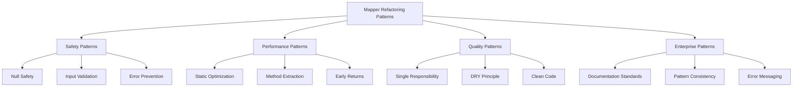

# Mapper Refactoring Patterns Guide

**Version:** 1.0  
**Date:** December 19, 2024  
**Purpose:** Practical Refactoring Patterns for Entity-DTO Mapper Optimization  

## Table of Contents

1. [Refactoring Pattern Categories](#refactoring-pattern-categories)
2. [Safety Refactoring Patterns](#safety-refactoring-patterns)
3. [Performance Refactoring Patterns](#performance-refactoring-patterns)
4. [Code Quality Refactoring Patterns](#code-quality-refactoring-patterns)
5. [Method Extraction Patterns](#method-extraction-patterns)
6. [Error Handling Refactoring Patterns](#error-handling-refactoring-patterns)
7. [Enterprise Pattern Refactoring](#enterprise-pattern-refactoring)
8. [Anti-Patterns and Solutions](#anti-patterns-and-solutions)
9. [Refactoring Workflow](#refactoring-workflow)
10. [Validation and Testing Patterns](#validation-and-testing-patterns)

## Refactoring Pattern Categories

### Pattern Classification System



### Refactoring Priority Matrix

| Priority | Pattern Type | Impact | Effort | ROI |
|----------|-------------|--------|--------|-----|
| **Critical** | Null Safety | High | Low | Excellent |
| **High** | Performance | Medium | Low | Good |
| **Medium** | Code Quality | Medium | Medium | Good |
| **Low** | Documentation | Low | High | Fair |

## Safety Refactoring Patterns

### Pattern 1: Null Input Validation

**Problem**: Methods don't validate input parameters, leading to NPE risks.

#### Before Pattern (Anti-Pattern)
```java
// ❌ Unsafe: No input validation
public static InventoryItemDTO toDTO(InventoryItem item) {
    return InventoryItemDTO.builder()
        .id(item.getId())           // ← NPE if item is null
        .name(item.getName())       // ← NPE if item is null
        .build();
}
```

#### Refactoring Steps
```java
// Step 1: Add input validation
public static InventoryItemDTO toDTO(InventoryItem item) {
    if (item == null) {
        return null;  // ← Safe early return
    }
    
    return InventoryItemDTO.builder()
        .id(item.getId())     // ← Now safe
        .name(item.getName()) // ← Now safe
        .build();
}
```

#### Pattern Template
```java
public static OutputDTO safeTransformation(InputEntity input) {
    // Pattern: Early null validation
    if (input == null) {
        return null;  // or appropriate safe default
    }
    
    // Safe transformation logic
    return transformation(input);
}
```

### Pattern 2: Field-Level Null Safety

**Problem**: Individual fields may be null, causing downstream NPEs.

#### Before Pattern (Risky)
```java
// ❌ Risky: Direct field access without null checks
.totalValue(item.getPrice().multiply(BigDecimal.valueOf(item.getQuantity())))
//          ↑ NPE if price is null    ↑ NPE if quantity is null
```

#### Refactoring Steps
```java
// Step 1: Extract to utility method with null safety
private static BigDecimal calculateTotalValue(BigDecimal price, Integer quantity) {
    if (price == null || quantity == null) {
        return BigDecimal.ZERO;  // Safe financial default
    }
    return price.multiply(BigDecimal.valueOf(quantity));
}

// Step 2: Use safe utility method
.totalValue(calculateTotalValue(item.getPrice(), item.getQuantity()))
```

#### Pattern Template
```java
private static ResultType safeCalculation(Type1 field1, Type2 field2) {
    // Pattern: Null validation before calculation
    if (field1 == null || field2 == null) {
        return safeDefault;  // Domain-appropriate default
    }
    return actualCalculation(field1, field2);
}
```

### Pattern 3: Relationship Navigation Safety

**Problem**: Unsafe navigation through object relationships.

#### Before Pattern (Unsafe)
```java
// ❌ Unsafe: Direct relationship navigation
.supplierName(item.getSupplier().getName())  // ← NPE if supplier is null
```

#### Refactoring Steps
```java
// Step 1: Extract safe navigation utility
private static String resolveSupplierName(Supplier supplier) {
    return supplier != null ? supplier.getName() : null;
}

// Step 2: Use safe navigation
.supplierName(resolveSupplierName(item.getSupplier()))
```

#### Pattern Template
```java
private static TargetType safeNavigation(SourceEntity source) {
    // Pattern: Null-safe relationship navigation
    return source != null ? source.getTargetProperty() : null;
}
```

## Performance Refactoring Patterns

### Pattern 1: Static Utility Class Optimization

**Problem**: Classes allow instantiation, creating unnecessary overhead.

#### Before Pattern (Suboptimal)
```java
// ❌ Suboptimal: Allows instantiation
public class MapperClass {
    public static SomeDTO toDTO(SomeEntity entity) {
        // Implementation
    }
}

// Usage creates unnecessary instances
MapperClass mapper = new MapperClass();  // ← Unnecessary overhead
```

#### Refactoring Steps
```java
// Step 1: Make class final
public final class MapperClass {

// Step 2: Add private constructor
    private MapperClass() {
        throw new UnsupportedOperationException("Utility class - no instances allowed");
    }

// Step 3: Keep methods static
    public static SomeDTO toDTO(SomeEntity entity) {
        // Implementation unchanged
    }
}
```

#### Pattern Template
```java
/**
 * Enterprise static utility class template.
 */
public final class DomainMapper {
    
    private DomainMapper() {
        throw new UnsupportedOperationException("Utility class - no instances allowed");
    }
    
    public static OutputDTO transform(InputEntity input) {
        // Static transformation methods only
    }
}
```

### Pattern 2: Method Extraction for JVM Optimization

**Problem**: Complex inline logic prevents JVM optimization.

#### Before Pattern (Unoptimized)
```java
// ❌ Unoptimized: Complex inline calculations
public static InventoryItemDTO toDTO(InventoryItem item) {
    return InventoryItemDTO.builder()
        .totalValue(item.getPrice() != null && item.getQuantity() != null
            ? item.getPrice().multiply(BigDecimal.valueOf(item.getQuantity()))
            : BigDecimal.ZERO)  // ← Complex inline logic
        .build();
}
```

#### Refactoring Steps
```java
// Step 1: Extract calculation to utility method
private static BigDecimal calculateTotalValue(BigDecimal price, Integer quantity) {
    if (price == null || quantity == null) {
        return BigDecimal.ZERO;
    }
    return price.multiply(BigDecimal.valueOf(quantity));
}

// Step 2: Use extracted method (enables JIT optimization)
public static InventoryItemDTO toDTO(InventoryItem item) {
    if (item == null) return null;
    
    BigDecimal totalValue = calculateTotalValue(item.getPrice(), item.getQuantity());
    return InventoryItemDTO.builder()
        .totalValue(totalValue)  // ← Clean method call
        .build();
}
```

#### Pattern Template
```java
// Pattern: Extract complex calculations
private static ResultType optimizedCalculation(InputType1 param1, InputType2 param2) {
    // Focused calculation logic (optimizable by JIT)
    return calculation(param1, param2);
}
```

### Pattern 3: Early Return Optimization

**Problem**: Unnecessary processing for null or invalid inputs.

#### Before Pattern (Inefficient)
```java
// ❌ Inefficient: Processing continues even with null input
public static OutputDTO toDTO(InputEntity input) {
    OutputDTO.Builder builder = OutputDTO.builder();
    
    if (input != null) {
        builder.field1(input.getField1());
        builder.field2(input.getField2());
        // ... many more fields
    }
    
    return builder.build();  // ← Unnecessary builder creation for null input
}
```

#### Refactoring Steps
```java
// ✅ Optimized: Early return saves processing
public static OutputDTO toDTO(InputEntity input) {
    if (input == null) {
        return null;  // ← Early return saves processing cycles
    }
    
    // Complex processing only for valid inputs
    return OutputDTO.builder()
        .field1(input.getField1())
        .field2(input.getField2())
        .build();
}
```

## Code Quality Refactoring Patterns

### Pattern 1: Single Responsibility Extraction

**Problem**: Methods doing multiple unrelated tasks.

#### Before Pattern (Mixed Responsibilities)
```java
// ❌ Mixed Responsibilities: Calculation + mapping + relationship resolution
public static InventoryItemDTO toDTO(InventoryItem item) {
    return InventoryItemDTO.builder()
        .totalValue(item.getPrice() != null && item.getQuantity() != null
            ? item.getPrice().multiply(BigDecimal.valueOf(item.getQuantity()))
            : BigDecimal.ZERO)  // ← Calculation responsibility
        .supplierName(item.getSupplier() != null 
            ? item.getSupplier().getName() 
            : null)  // ← Relationship responsibility
        .build();  // ← Mapping responsibility
}
```

#### Refactoring Steps
```java
// Step 1: Extract calculation responsibility
private static BigDecimal calculateTotalValue(BigDecimal price, Integer quantity) {
    if (price == null || quantity == null) return BigDecimal.ZERO;
    return price.multiply(BigDecimal.valueOf(quantity));
}

// Step 2: Extract relationship responsibility
private static String resolveSupplierName(Supplier supplier) {
    return supplier != null ? supplier.getName() : null;
}

// Step 3: Pure mapping responsibility
public static InventoryItemDTO toDTO(InventoryItem item) {
    if (item == null) return null;
    
    BigDecimal totalValue = calculateTotalValue(item.getPrice(), item.getQuantity());
    String supplierName = resolveSupplierName(item.getSupplier());
    
    return InventoryItemDTO.builder()
        .totalValue(totalValue)      // ← Pure mapping
        .supplierName(supplierName)  // ← Pure mapping
        .build();
}
```

### Pattern 2: DRY Principle Application

**Problem**: Repeated logic across multiple methods.

#### Before Pattern (Code Duplication)
```java
// ❌ Duplication: Enum transformation repeated
public static StockHistoryDTO toDTO(StockHistory history) {
    return StockHistoryDTO.builder()
        .reason(history.getReason() != null ? history.getReason().name() : null)
        .build();
}

public static List<StockHistoryDTO> toDTOList(List<StockHistory> histories) {
    return histories.stream()
        .map(h -> StockHistoryDTO.builder()
            .reason(h.getReason() != null ? h.getReason().name() : null)  // ← Duplication
            .build())
        .collect(Collectors.toList());
}
```

#### Refactoring Steps
```java
// Step 1: Extract common transformation
private static String transformEnumSafely(StockChangeReason reason) {
    return reason != null ? reason.name() : null;
}

// Step 2: Reuse in both methods
public static StockHistoryDTO toDTO(StockHistory history) {
    if (history == null) return null;
    
    return StockHistoryDTO.builder()
        .reason(transformEnumSafely(history.getReason()))  // ← Reused utility
        .build();
}

public static List<StockHistoryDTO> toDTOList(List<StockHistory> histories) {
    return histories.stream()
        .map(StockHistoryMapper::toDTO)  // ← Reuses single transformation
        .collect(Collectors.toList());
}
```

## Method Extraction Patterns

### Pattern 1: Calculation Extraction

**When to Apply**: Any mathematical or business logic calculation.

#### Extraction Template
```java
// Template for calculation extraction
private static ReturnType calculateBusinessValue(ParamType1 param1, ParamType2 param2) {
    // 1. Parameter validation
    if (param1 == null || param2 == null) {
        return safeDefault;
    }
    
    // 2. Business calculation
    return businessLogic(param1, param2);
}
```

#### Real Example: Financial Calculations
```java
/**
 * Calculates inventory total value with financial precision.
 * Business Rule: Total value = price × quantity using BigDecimal for accuracy.
 */
private static BigDecimal calculateTotalValue(BigDecimal price, Integer quantity) {
    if (price == null || quantity == null) {
        return BigDecimal.ZERO;  // Safe financial default
    }
    return price.multiply(BigDecimal.valueOf(quantity));
}
```

### Pattern 2: Validation Extraction

**When to Apply**: Complex validation or data sanitization logic.

#### Extraction Template
```java
// Template for validation extraction
private static ValidatedType validateAndTransform(InputType input) {
    // 1. Input validation
    if (!isValid(input)) {
        throw new ValidationException("Clear validation message");
    }
    
    // 2. Transformation
    return transform(input);
}
```

#### Real Example: Enum Validation
```java
/**
 * Parses string to enum with comprehensive validation.
 * Provides clear error messages with valid options for debugging.
 */
private static StockChangeReason parseEnumSafely(String reasonString) {
    if (reasonString == null) return null;
    
    try {
        return StockChangeReason.valueOf(reasonString);
    } catch (IllegalArgumentException e) {
        throw new IllegalArgumentException(
            "Invalid stock change reason: " + reasonString + 
            ". Valid values: " + Arrays.toString(StockChangeReason.values()), e);
    }
}
```

### Pattern 3: Relationship Extraction

**When to Apply**: Navigation through object relationships.

#### Extraction Template
```java
// Template for relationship extraction
private static TargetType resolveRelationshipSafely(SourceEntity source) {
    return source != null ? source.getRelationshipProperty() : null;
}
```

#### Real Example: Supplier Resolution
```java
/**
 * Resolves supplier name through safe relationship navigation.
 * Handles null supplier relationships gracefully.
 */
private static String resolveSupplierName(Supplier supplier) {
    return supplier != null ? supplier.getName() : null;
}
```

## Error Handling Refactoring Patterns

### Pattern 1: Enhanced Exception Messaging

**Problem**: Generic exception messages that don't help debugging.

#### Before Pattern (Poor Messaging)
```java
// ❌ Poor: Generic exception without context
StockChangeReason reason = StockChangeReason.valueOf(reasonString);
// May throw: IllegalArgumentException: No enum constant StockChangeReason.INVALID
```

#### Refactoring Steps
```java
// ✅ Enhanced: Clear context and valid options
private static StockChangeReason parseEnumSafely(String reasonString) {
    if (reasonString == null) return null;
    
    try {
        return StockChangeReason.valueOf(reasonString);
    } catch (IllegalArgumentException e) {
        throw new IllegalArgumentException(
            "Invalid stock change reason: '" + reasonString + "'. " +
            "Valid values: " + Arrays.toString(StockChangeReason.values()) + ". " +
            "Original error: " + e.getMessage(), e);
    }
}
```

### Pattern 2: Graceful Degradation

**Problem**: Methods fail completely when they could provide partial results.

#### Before Pattern (All-or-Nothing)
```java
// ❌ Fails completely if any field is null
public static InventoryItemDTO toDTO(InventoryItem item) {
    return InventoryItemDTO.builder()
        .totalValue(item.getPrice().multiply(BigDecimal.valueOf(item.getQuantity())))
        .build();  // ← Fails if price or quantity is null
}
```

#### Refactoring Steps
```java
// ✅ Graceful: Provides partial results with safe defaults
public static InventoryItemDTO toDTO(InventoryItem item) {
    if (item == null) return null;
    
    // Graceful degradation: safe default for missing data
    BigDecimal totalValue = calculateTotalValue(item.getPrice(), item.getQuantity());
    
    return InventoryItemDTO.builder()
        .totalValue(totalValue)  // ← Always provides a value
        .build();
}

private static BigDecimal calculateTotalValue(BigDecimal price, Integer quantity) {
    if (price == null || quantity == null) {
        return BigDecimal.ZERO;  // ← Graceful degradation
    }
    return price.multiply(BigDecimal.valueOf(quantity));
}
```

## Anti-Patterns and Solutions

### Anti-Pattern 1: Inline Complex Logic

**Problem**: Complex business logic embedded directly in mapping methods.

#### Anti-Pattern Example
```java
// ❌ Anti-Pattern: Complex inline logic
public static InventoryItemDTO toDTO(InventoryItem item) {
    return InventoryItemDTO.builder()
        .totalValue(item.getPrice() != null && item.getQuantity() != null && 
                   item.getPrice().compareTo(BigDecimal.ZERO) > 0 && 
                   item.getQuantity() > 0
            ? item.getPrice().multiply(BigDecimal.valueOf(item.getQuantity()))
                             .setScale(2, RoundingMode.HALF_UP)
            : BigDecimal.ZERO)  // ← Complex validation and calculation inline
        .build();
}
```

#### Solution: Method Extraction
```java
// ✅ Solution: Extracted utility methods
public static InventoryItemDTO toDTO(InventoryItem item) {
    if (item == null) return null;
    
    BigDecimal totalValue = calculateTotalValue(item.getPrice(), item.getQuantity());
    
    return InventoryItemDTO.builder()
        .totalValue(totalValue)  // ← Clean method call
        .build();
}

private static BigDecimal calculateTotalValue(BigDecimal price, Integer quantity) {
    if (!isValidForCalculation(price, quantity)) {
        return BigDecimal.ZERO;
    }
    return price.multiply(BigDecimal.valueOf(quantity))
               .setScale(2, RoundingMode.HALF_UP);
}

private static boolean isValidForCalculation(BigDecimal price, Integer quantity) {
    return price != null && quantity != null && 
           price.compareTo(BigDecimal.ZERO) > 0 && quantity > 0;
}
```

### Anti-Pattern 2: Instantiable Utility Classes

**Problem**: Utility classes that can be instantiated unnecessarily.

#### Anti-Pattern Example
```java
// ❌ Anti-Pattern: Allows instantiation
public class UtilityMapper {
    public static SomeDTO toDTO(SomeEntity entity) {
        return transformation(entity);
    }
}

// Problematic usage:
UtilityMapper mapper = new UtilityMapper();  // ← Unnecessary instance
```

#### Solution: Proper Utility Class Pattern
```java
// ✅ Solution: Final class with private constructor
public final class UtilityMapper {
    
    private UtilityMapper() {
        throw new UnsupportedOperationException("Utility class - no instances allowed");
    }
    
    public static SomeDTO toDTO(SomeEntity entity) {
        return transformation(entity);
    }
}
```

### Anti-Pattern 3: Silent Null Handling

**Problem**: Silently ignoring null values without clear intention.

#### Anti-Pattern Example
```java
// ❌ Anti-Pattern: Silent null handling
public static InventoryItemDTO toDTO(InventoryItem item) {
    if (item == null) return new InventoryItemDTO();  // ← Confusing empty object
    
    return InventoryItemDTO.builder()
        .name(item.getName())
        .build();
}
```

#### Solution: Explicit Null Handling
```java
// ✅ Solution: Explicit and documented null handling
public static InventoryItemDTO toDTO(InventoryItem item) {
    if (item == null) {
        return null;  // ← Clear intention: null input → null output
    }
    
    return InventoryItemDTO.builder()
        .name(item.getName())
        .build();
}
```

## Refactoring Workflow

### Step-by-Step Refactoring Process

#### Phase 1: Safety Refactoring (Critical)
```bash
1. Add null input validation to all public methods
2. Extract unsafe calculations to null-safe utility methods
3. Implement safe relationship navigation
4. Add comprehensive error handling
```

#### Phase 2: Performance Refactoring (High Priority)
```bash
1. Make classes final and add private constructors
2. Extract complex calculations for JVM optimization
3. Implement early return patterns
4. Optimize builder pattern usage
```

#### Phase 3: Quality Refactoring (Medium Priority)
```bash
1. Extract utility methods for single responsibility
2. Eliminate code duplication through centralization
3. Standardize documentation patterns
4. Implement consistent error messaging
```

#### Phase 4: Enterprise Pattern Refactoring (Low Priority)
```bash
1. Align with enterprise documentation standards
2. Implement consistent pattern application
3. Add comprehensive JavaDoc documentation
4. Standardize error handling approaches
```

### Refactoring Validation Checklist

**Safety Validation**:
- [ ] All public methods have null input validation
- [ ] No direct field access without null checks
- [ ] All calculations use safe utility methods
- [ ] Relationship navigation is null-safe

**Performance Validation**:
- [ ] Classes are final with private constructors
- [ ] Complex logic extracted to utility methods
- [ ] Early return patterns applied consistently
- [ ] No unnecessary object creation

**Quality Validation**:
- [ ] Methods have single, clear responsibilities
- [ ] No code duplication across methods
- [ ] Consistent patterns applied throughout
- [ ] Clear, actionable error messages

**Enterprise Validation**:
- [ ] Documentation meets enterprise standards
- [ ] Pattern consistency across all mappers
- [ ] Error handling follows enterprise patterns
- [ ] Code organization meets professional standards

---

## Pattern Application Summary

The refactoring patterns provided enable systematic transformation of basic mapper utilities into enterprise-grade transformation components. Key pattern categories include:

1. **Safety Patterns**: Eliminate runtime exceptions through comprehensive validation
2. **Performance Patterns**: Optimize for high-throughput enterprise operations
3. **Quality Patterns**: Improve maintainability through clean code principles
4. **Enterprise Patterns**: Align with professional development standards

Apply these patterns systematically to achieve robust, performant, and maintainable mapper implementations that support enterprise-scale operations.

---
*This pattern guide provides practical, actionable refactoring strategies for optimizing entity-DTO mapper implementations in enterprise Java applications.*