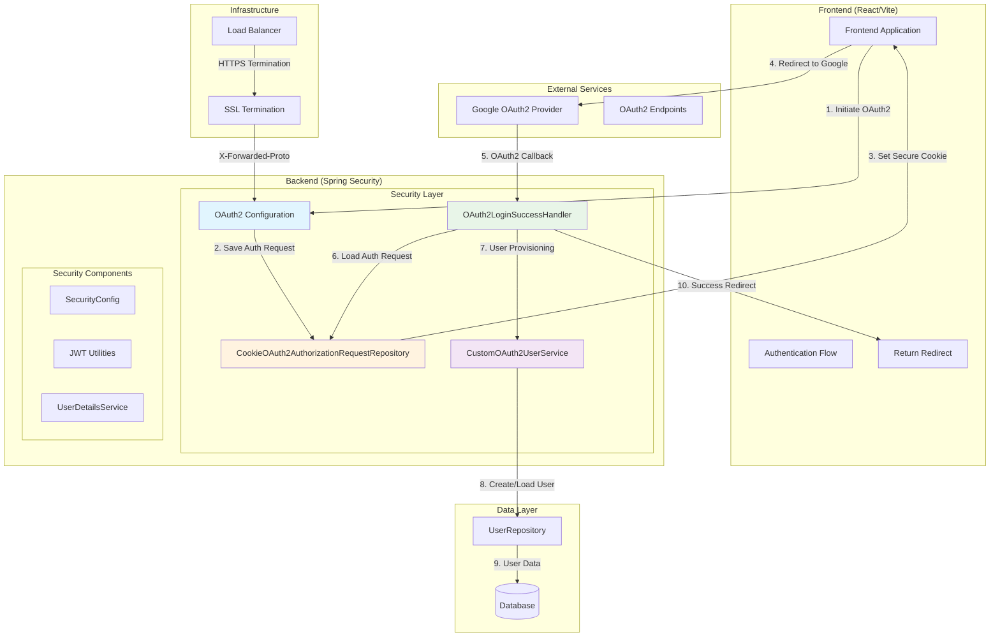
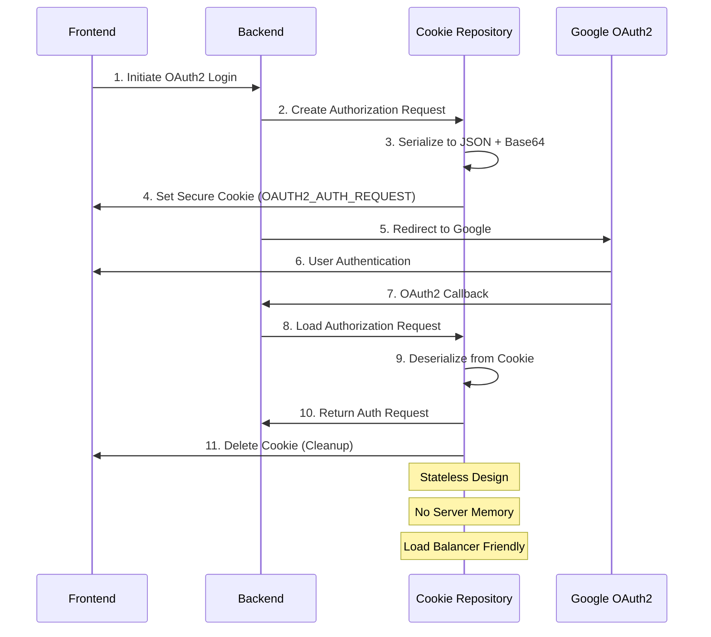
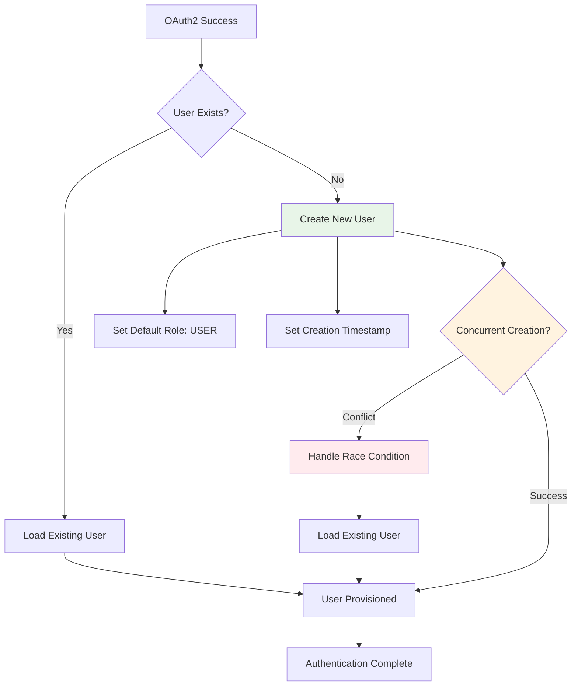
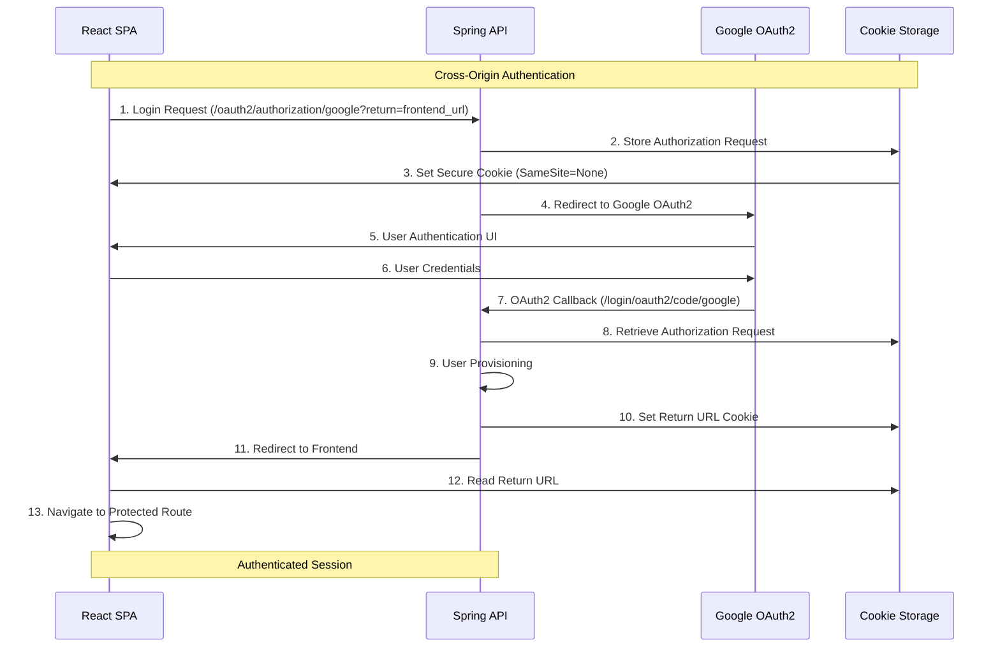
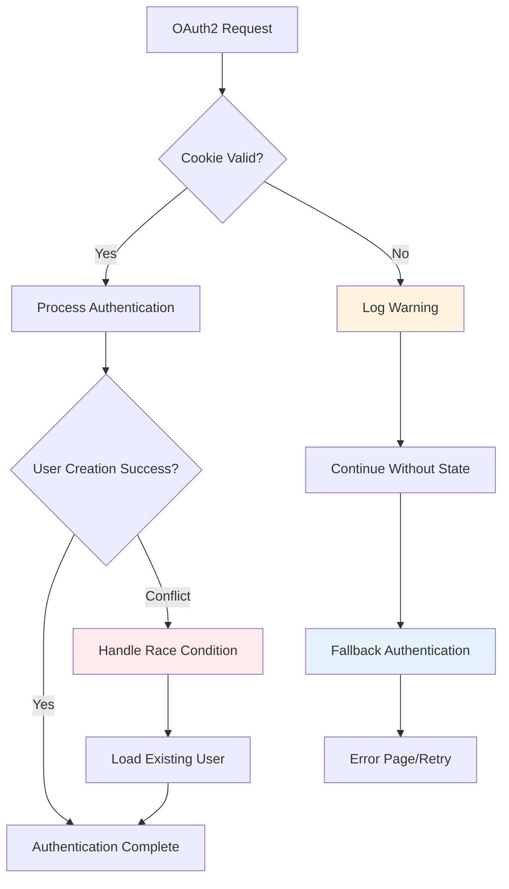

# OAuth2 Security Architecture

## Architecture Overview

The SmartSupplyPro OAuth2 security architecture implements enterprise-grade authentication using Google OAuth2 with stateless authorization request management and automatic user provisioning. This architecture is designed for high availability, horizontal scalability, and secure cross-origin authentication flows.

## System Architecture Diagram



## Core Security Components

### 1. OAuth2 Configuration Architecture

#### Spring Security OAuth2 Configuration
```java
@Configuration
@EnableWebSecurity
public class SecurityConfig {
    
    @Bean
    public SecurityFilterChain filterChain(HttpSecurity http) throws Exception {
        return http
            .oauth2Login(oauth -> oauth
                .authorizationEndpoint(ae -> ae
                    .authorizationRequestRepository(cookieOAuth2AuthorizationRequestRepository)
                )
                .userInfoEndpoint(ui -> ui
                    .oidcUserService(customOidcUserService)
                    .userService(customOAuth2UserService)
                )
                .successHandler(oAuth2LoginSuccessHandler)
                .failureHandler(oauthFailureHandler(securityProperties))
            )
            .build();
    }
}
```

#### OAuth2 Provider Configuration
```yaml
spring:
  security:
    oauth2:
      client:
        registration:
          google:
            client-id: ${GOOGLE_CLIENT_ID}
            client-secret: ${GOOGLE_CLIENT_SECRET}
            scope: openid,profile,email
            redirect-uri: "{baseUrl}/login/oauth2/code/{registrationId}"
        provider:
          google:
            authorization-uri: https://accounts.google.com/o/oauth2/v2/auth
            token-uri: https://oauth2.googleapis.com/token
            user-info-uri: https://www.googleapis.com/oauth2/v3/userinfo
            jwk-set-uri: https://www.googleapis.com/oauth2/v3/certs
```

### 2. Stateless Authorization Request Management

#### Cookie-Based State Persistence


#### Cookie Security Attributes
```java
// Enterprise Cookie Security Configuration
Cookie authRequestCookie = new Cookie(AUTH_REQUEST_COOKIE_NAME, encodedValue);
authRequestCookie.setHttpOnly(true);          // XSS Protection
authRequestCookie.setSecure(isHttpsRequest);   // HTTPS Enforcement
authRequestCookie.setPath("/");                // Application-wide scope
authRequestCookie.setMaxAge(180);              // 3-minute expiration
// SameSite=None for cross-origin flows (set via header)
```

### 3. User Provisioning Architecture

#### Automatic User Creation Flow


#### User Entity Structure
```java
@Entity
@Table(name = "users")
public class AppUser {
    @Id
    @Column(unique = true, nullable = false)
    private String email;           // OAuth2 email as primary identifier
    
    @Column(nullable = false)
    private String name;            // Display name from OAuth2 provider
    
    @Enumerated(EnumType.STRING)
    private Role role = Role.USER;  // Default role for OAuth2 users
    
    private LocalDateTime createdAt; // Audit trail for user creation
    private LocalDateTime lastLoginAt; // Track user activity
}
```

### 4. Cross-Origin Authentication Flow

#### Frontend-Backend Integration


#### Return URL Security
```java
// Enterprise Return URL Validation
private static final List<String> ALLOWED_ORIGINS = List.of(
    "http://localhost:5173",                    // Development
    "https://localhost:5173",                   // Development HTTPS
    "https://inventory-service.koyeb.app"       // Production
);

// Origin allowlist prevents open redirect attacks
if (returnUrl != null && ALLOWED_ORIGINS.contains(returnUrl)) {
    Cookie returnCookie = new Cookie("SSP_RETURN", returnUrl);
    returnCookie.setHttpOnly(false);  // Frontend needs read access
    returnCookie.setSecure(isHttpsRequest);
    returnCookie.setPath("/");
    returnCookie.setMaxAge(300);      // 5-minute expiration
    addCookieWithSameSite(response, returnCookie, "None");
}
```

## Security Implementation Layers

### 1. Transport Security Layer

#### HTTPS Enforcement
```java
// Enterprise HTTPS Detection
private static boolean isSecureOrForwardedHttps(HttpServletRequest request) {
    // Direct HTTPS detection
    if (request.isSecure()) return true;
    
    // Load balancer HTTPS detection
    String xForwardedProto = request.getHeader("X-Forwarded-Proto");
    return xForwardedProto != null && xForwardedProto.equalsIgnoreCase("https");
}
```

#### Load Balancer Integration
```yaml
# Infrastructure Configuration
server:
  forward-headers-strategy: native  # X-Forwarded-* header support
  
# Cookie security with load balancer SSL termination
management:
  server:
    ssl:
      enabled: false  # SSL terminated at load balancer
```

### 2. Cookie Security Layer

#### Cookie Security Matrix
| Attribute | Value | Purpose | Security Benefit |
|-----------|-------|---------|------------------|
| HttpOnly | true | XSS Protection | Prevent JavaScript access |
| Secure | auto-detect | HTTPS Enforcement | Encrypted transport only |
| SameSite | None | Cross-Origin Support | Legitimate cross-site flows |
| MaxAge | 180/300s | Timeout Protection | Limited exposure window |
| Path | / | Application Scope | Application-wide availability |

#### SameSite Cookie Implementation
```java
// Enterprise Cross-Origin Cookie Support
private static void addCookieWithSameSite(HttpServletResponse response, 
                                         Cookie cookie, String sameSite) {
    StringBuilder cookieHeader = new StringBuilder();
    cookieHeader.append(cookie.getName()).append('=').append(cookie.getValue());
    cookieHeader.append("; Path=").append(cookie.getPath());
    
    if (cookie.getMaxAge() >= 0) {
        cookieHeader.append("; Max-Age=").append(cookie.getMaxAge());
    }
    if (cookie.getSecure()) {
        cookieHeader.append("; Secure");
    }
    if (cookie.isHttpOnly()) {
        cookieHeader.append("; HttpOnly");
    }
    if (sameSite != null && !sameSite.isBlank()) {
        cookieHeader.append("; SameSite=").append(sameSite);
    }
    
    response.addHeader("Set-Cookie", cookieHeader.toString());
}
```

### 3. Application Security Layer

#### OAuth2 Custom User Services
```java
@Service
public class CustomOAuth2UserService implements OAuth2UserService<OAuth2UserRequest, OAuth2User> {
    
    @Override
    public OAuth2User loadUser(OAuth2UserRequest userRequest) throws OAuth2AuthenticationException {
        // Load user from OAuth2 provider
        OAuth2User oauth2User = defaultService.loadUser(userRequest);
        
        // Extract user information
        String email = oauth2User.getAttribute("email");
        String name = oauth2User.getAttribute("name");
        
        // Provision user in local database
        AppUser user = userService.findOrCreateUser(email, name);
        
        // Return custom principal with local user information
        return new CustomOAuth2User(oauth2User, user);
    }
}
```

#### OIDC User Service Integration
```java
@Service
public class CustomOidcUserService implements OAuth2UserService<OidcUserRequest, OidcUser> {
    
    @Override
    public OidcUser loadUser(OidcUserRequest userRequest) throws OAuth2AuthenticationException {
        // Process OIDC ID token
        OidcUser oidcUser = defaultService.loadUser(userRequest);
        
        // Extract verified email from ID token
        String email = oidcUser.getEmail();
        String name = oidcUser.getFullName();
        
        // Provision user with OIDC claims
        AppUser user = userService.findOrCreateUser(email, name);
        
        return new CustomOidcUser(oidcUser, user);
    }
}
```

## Scalability and Performance Architecture

### 1. Horizontal Scaling Design

#### Stateless Session Management
```mermaid
graph TB
    subgraph "Load Balancer"
        LB[HTTPS Load Balancer]
    end
    
    subgraph "Application Instances"
        APP1[Instance 1]
        APP2[Instance 2]
        APP3[Instance 3]
    end
    
    subgraph "Shared State"
        DB[(User Database)]
        COOKIES[Client Cookies]
    end
    
    LB -->|Round Robin| APP1
    LB -->|Round Robin| APP2
    LB -->|Round Robin| APP3
    
    APP1 -->|User Data| DB
    APP2 -->|User Data| DB
    APP3 -->|User Data| DB
    
    APP1 -.->|OAuth2 State| COOKIES
    APP2 -.->|OAuth2 State| COOKIES
    APP3 -.->|OAuth2 State| COOKIES
    
    Note over COOKIES: No Session Affinity Required
    Note over DB: Shared User State
```

#### Instance Independence Benefits
- **OAuth2 Callbacks**: Any instance can handle OAuth2 provider callbacks
- **No Session Replication**: Cookie-based state eliminates session synchronization
- **Load Balancer Flexibility**: No sticky sessions required
- **Auto-Scaling**: Instances can be added/removed without state migration

### 2. Performance Optimization

#### Cookie Serialization Optimization
```java
// Enterprise Serialization: Minimal JSON structure
private String writeJson(OAuth2AuthorizationRequest request) {
    Map<String, Object> minimalState = Map.of(
        "authorizationUri", request.getAuthorizationUri(),
        "clientId", request.getClientId(),
        "redirectUri", request.getRedirectUri(),
        "scopes", request.getScopes(),
        "state", request.getState(),
        "responseType", request.getResponseType().getValue(),
        "additionalParameters", request.getAdditionalParameters(),
        "attributes", request.getAttributes(),
        "authorizationRequestUri", request.getAuthorizationRequestUri()
    );
    
    return objectMapper.writeValueAsString(minimalState);
}
```

#### Database Optimization
```sql
-- User provisioning optimization
CREATE INDEX idx_users_email ON users(email);        -- Fast user lookup
CREATE INDEX idx_users_created_at ON users(created_at); -- Audit queries
CREATE INDEX idx_users_last_login ON users(last_login_at); -- Activity tracking

-- Constraint for concurrent user creation
ALTER TABLE users ADD CONSTRAINT uk_users_email UNIQUE (email);
```

## Error Handling and Resilience Architecture

### 1. OAuth2 Flow Error Handling

#### Graceful Degradation Strategy


#### Error Recovery Patterns
```java
// Enterprise Error Handling: Multi-layer resilience
public Optional<OAuth2AuthorizationRequest> loadAuthorizationRequest(HttpServletRequest request) {
    Cookie[] cookies = request.getCookies();
    if (cookies == null) return Optional.empty();
    
    // Search all cookies for valid authorization request
    for (Cookie cookie : cookies) {
        if (AUTH_REQUEST_COOKIE_NAME.equals(cookie.getName())) {
            try {
                // Attempt deserialization
                String json = new String(Base64.getUrlDecoder()
                    .decode(cookie.getValue()), StandardCharsets.UTF_8);
                OAuth2AuthorizationRequest request = readJson(json);
                if (request != null) {
                    return Optional.of(request);
                }
            } catch (Exception e) {
                // Enterprise Resilience: Log and continue search
                log.debug("Failed to deserialize authorization request cookie", e);
            }
        }
    }
    
    return Optional.empty();  // Graceful fallback
}
```

### 2. Concurrent User Creation Handling

#### Race Condition Resolution
```java
// Enterprise Concurrency: Database constraint-based resolution
private AppUser createUserSafely(String email, String name) {
    try {
        AppUser newUser = new AppUser(email, name);
        newUser.setRole(Role.USER);
        newUser.setCreatedAt(LocalDateTime.now());
        return userRepository.save(newUser);
    } catch (DataIntegrityViolationException e) {
        // Handle concurrent creation attempt
        return userRepository.findByEmail(email)
            .orElseThrow(() -> new IllegalStateException(
                "User already exists but cannot be loaded: " + email));
    }
}
```

## Security Monitoring and Audit Architecture

### 1. Security Event Logging

#### Audit Trail Structure
```java
// Enterprise Security Logging
@Component
public class SecurityAuditLogger {
    
    public void logAuthenticationSuccess(String email, String origin) {
        log.info("OAuth2 authentication success: user={}, origin={}", email, origin);
    }
    
    public void logUserProvisioning(String email, boolean isNewUser) {
        log.info("User provisioning: email={}, newUser={}", email, isNewUser);
    }
    
    public void logSecurityViolation(String event, String details) {
        log.warn("Security violation: event={}, details={}", event, details);
    }
    
    public void logReturnUrlViolation(String requestedUrl, String clientIp) {
        log.warn("Invalid return URL attempted: url={}, ip={}", requestedUrl, clientIp);
    }
}
```

### 2. Security Metrics Collection

#### Monitoring Metrics
```yaml
# Security monitoring configuration
management:
  metrics:
    tags:
      service: inventory-service
      layer: security
  endpoints:
    web:
      exposure:
        include: health,metrics,info
        
# Custom security metrics
security:
  metrics:
    oauth2:
      success-rate: true      # Authentication success percentage
      user-provisioning: true # New user creation rate
      security-violations: true # Invalid requests
      cookie-errors: true     # State deserialization failures
```

## Production Deployment Architecture

### 1. Environment Configuration

#### Multi-Environment Security Setup
```yaml
# Development Environment
spring:
  profiles: dev
  security:
    oauth2:
      allowed-origins:
        - "http://localhost:5173"
        - "https://localhost:5173"
      cookie:
        secure: false  # Allow HTTP in development
        
# Production Environment  
spring:
  profiles: prod
  security:
    oauth2:
      allowed-origins:
        - "https://inventory-service.koyeb.app"
      cookie:
        secure: true   # Enforce HTTPS in production
```

### 2. Infrastructure Integration

#### Container Deployment Configuration
```dockerfile
# Security-focused container configuration
FROM openjdk:17-jre-slim

# Security: Non-root user
RUN groupadd -r appuser && useradd -r -g appuser appuser
USER appuser

# OAuth2 configuration via environment variables
ENV GOOGLE_CLIENT_ID=""
ENV GOOGLE_CLIENT_SECRET=""
ENV SPRING_PROFILES_ACTIVE="prod"

# HTTPS enforcement
ENV SERVER_FORWARD_HEADERS_STRATEGY="native"

EXPOSE 8080
```

#### Load Balancer Configuration
```nginx
# NGINX load balancer with SSL termination
upstream backend {
    server app1:8080;
    server app2:8080;
    server app3:8080;
}

server {
    listen 443 ssl http2;
    server_name inventory-service.koyeb.app;
    
    # SSL configuration
    ssl_certificate /etc/ssl/certs/app.crt;
    ssl_certificate_key /etc/ssl/private/app.key;
    
    location / {
        proxy_pass http://backend;
        proxy_set_header Host $host;
        proxy_set_header X-Real-IP $remote_addr;
        proxy_set_header X-Forwarded-For $proxy_add_x_forwarded_for;
        proxy_set_header X-Forwarded-Proto $scheme;
        
        # OAuth2 callback support
        proxy_cookie_path / /;
        proxy_cookie_flags ~ secure samesite=none;
    }
}
```

## Testing and Validation Architecture

### 1. Security Integration Testing

#### Test Coverage Matrix
```java
@SpringBootTest
@TestMethodOrder(OrderAnnotation.class)
class OAuth2SecurityArchitectureTest {
    
    @Test @Order(1)
    void testStatelessOAuth2Flow() {
        // Verify cross-instance OAuth2 callback handling
    }
    
    @Test @Order(2) 
    void testUserProvisioningConcurrency() {
        // Test race condition handling in user creation
    }
    
    @Test @Order(3)
    void testReturnUrlSecurity() {
        // Verify origin allowlist enforcement
    }
    
    @Test @Order(4)
    void testCookieSecurityAttributes() {
        // Validate HttpOnly, Secure, SameSite attributes
    }
    
    @Test @Order(5)
    void testCrossOriginAuthentication() {
        // Test SameSite=None cross-origin flows
    }
}
```

### 2. Security Threat Testing

#### Penetration Testing Scenarios
```java
@TestMethodOrder(OrderAnnotation.class)
class SecurityThreatTest {
    
    @Test @Order(1)
    void testOpenRedirectPrevention() {
        // Attempt malicious return URL injection
    }
    
    @Test @Order(2)
    void testCookieTampering() {
        // Test modified authorization state handling
    }
    
    @Test @Order(3)
    void testSessionFixation() {
        // Verify session security patterns
    }
    
    @Test @Order(4)
    void testCSRFProtection() {
        // Test cross-site request forgery prevention
    }
}
```

## Related Documentation

- **Implementation Patterns**: See [Security Implementation Patterns](security-implementation-patterns.md)
- **Configuration Integration**: See [Configuration Patterns](configuration-patterns.md)
- **API Documentation**: See [OAuth2 API Documentation](../../api/endpoints/authentication.md)
- **Deployment Guide**: See [Production Deployment](../deployment/production-deployment.md)
- **Security Compliance**: See [Security Compliance](../compliance/security-standards.md)

---

*This document provides the comprehensive OAuth2 security architecture for enterprise-grade authentication, stateless session management, and secure cross-origin authentication flows in the SmartSupplyPro inventory management system.*