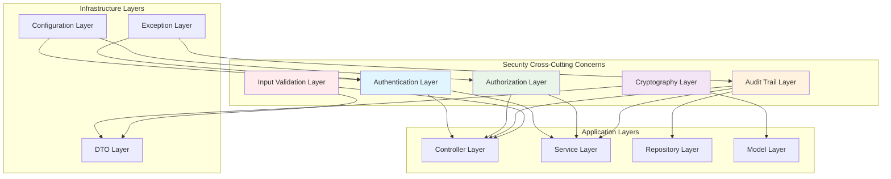

# Security Cross-Cutting Patterns

## Overview

This document outlines the cross-cutting security patterns that span across all layers of the SmartSupplyPro inventory management system. These patterns ensure consistent security implementation, enterprise-grade protection, and seamless integration between security components and other system layers.

## Enterprise Security Framework

### 1. Security Layer Integration Pattern

#### Multi-Layer Security Architecture


### 2. Security Context Propagation Pattern

#### Thread-Safe Security Context
```java
// Enterprise Security Context Management
@Component
public class SecurityContextManager {
    
    /**
     * Enterprise Security: Get current authenticated user with null safety
     * 
     * This method provides thread-safe access to the current security context
     * and handles cases where no authentication is present (e.g., public endpoints).
     * 
     * @return Current authenticated user or null if not authenticated
     */
    public static AppUser getCurrentUser() {
        Authentication auth = SecurityContextHolder.getContext().getAuthentication();
        if (auth == null || !auth.isAuthenticated() || auth instanceof AnonymousAuthenticationToken) {
            return null;
        }
        
        // Extract user from OAuth2 authentication
        if (auth.getPrincipal() instanceof CustomOAuth2User oauth2User) {
            return oauth2User.getAppUser();
        }
        
        // Extract user from OIDC authentication
        if (auth.getPrincipal() instanceof CustomOidcUser oidcUser) {
            return oidcUser.getAppUser();
        }
        
        return null;
    }
    
    /**
     * Enterprise Security: Get current user email with fallback handling
     * 
     * Provides safe access to user email for audit logging and user identification
     * with graceful handling of unauthenticated sessions.
     * 
     * @return User email or "anonymous" for unauthenticated users
     */
    public static String getCurrentUserEmail() {
        AppUser user = getCurrentUser();
        return user != null ? user.getEmail() : "anonymous";
    }
    
    /**
     * Enterprise Security: Check if current user has specific role
     * 
     * Provides role-based access control checking with null safety
     * for authorization decisions throughout the application.
     * 
     * @param role Required role for authorization
     * @return true if user has required role, false otherwise
     */
    public static boolean hasRole(Role role) {
        AppUser user = getCurrentUser();
        return user != null && user.getRole() == role;
    }
}
```

## Authentication Cross-Cutting Patterns

### 1. OAuth2 Integration Across Layers

#### Controller Layer Integration
```java
// Enterprise OAuth2: Controller-level authentication patterns
@RestController
@RequestMapping("/api/v1/inventory")
@PreAuthorize("hasRole('USER')")  // Enterprise authorization at class level
public class InventoryController {
    
    /**
     * Enterprise Security: Authenticated endpoint with user context
     * 
     * Demonstrates automatic OAuth2 user context injection and role-based
     * access control integration with business logic.
     */
    @GetMapping("/items")
    @PreAuthorize("hasAnyRole('USER', 'ADMIN')")
    public ResponseEntity<List<InventoryItemResponse>> getAllItems() {
        // Enterprise Context: Automatic user context from OAuth2 authentication
        String userEmail = SecurityContextManager.getCurrentUserEmail();
        log.info("Inventory access by user: {}", userEmail);
        
        // Business logic with security context
        List<InventoryItem> items = inventoryService.findAllItems(userEmail);
        return ResponseEntity.ok(items.stream()
            .map(inventoryMapper::toResponse)
            .toList());
    }
    
    /**
     * Enterprise Security: Admin-only endpoint with enhanced logging
     * 
     * Demonstrates role-based access control with comprehensive audit logging
     * for sensitive administrative operations.
     */
    @PostMapping("/items")
    @PreAuthorize("hasRole('ADMIN')")
    public ResponseEntity<InventoryItemResponse> createItem(
            @Valid @RequestBody CreateInventoryItemRequest request) {
        
        // Enterprise Audit: Enhanced logging for admin operations
        String adminEmail = SecurityContextManager.getCurrentUserEmail();
        log.info("Admin inventory creation: admin={}, item={}", adminEmail, request.getName());
        
        InventoryItem item = inventoryService.createItem(request, adminEmail);
        return ResponseEntity.status(HttpStatus.CREATED)
            .body(inventoryMapper.toResponse(item));
    }
}
```

#### Service Layer Security Integration
```java
// Enterprise Security: Service-level authorization and audit patterns
@Service
@Transactional
@Slf4j
public class InventoryService {
    
    /**
     * Enterprise Security: User context-aware business logic
     * 
     * Integrates OAuth2 user context with business operations for
     * user-specific data access and audit trail generation.
     */
    public List<InventoryItem> findAllItems(String userEmail) {
        // Enterprise Audit: User-specific access logging
        log.info("Inventory access request from user: {}", userEmail);
        
        // Business logic with user context
        List<InventoryItem> items = inventoryRepository.findAll();
        
        // Enterprise Audit: Access result logging
        log.debug("Returned {} inventory items to user: {}", items.size(), userEmail);
        
        return items;
    }
    
    /**
     * Enterprise Security: Administrative operation with enhanced audit
     * 
     * Demonstrates admin-level operations with comprehensive audit logging
     * and security context validation.
     */
    public InventoryItem createItem(CreateInventoryItemRequest request, String adminEmail) {
        // Enterprise Security: Validate admin context
        if (!SecurityContextManager.hasRole(Role.ADMIN)) {
            throw new AccessDeniedException("Admin role required for item creation");
        }
        
        // Enterprise Audit: Administrative action logging
        log.info("Admin creating inventory item: admin={}, name={}, quantity={}", 
            adminEmail, request.getName(), request.getQuantity());
        
        // Business logic with audit context
        InventoryItem item = new InventoryItem();
        item.setName(request.getName());
        item.setQuantity(request.getQuantity());
        item.setCreatedBy(adminEmail);
        item.setCreatedAt(LocalDateTime.now());
        
        InventoryItem saved = inventoryRepository.save(item);
        
        // Enterprise Audit: Success logging
        log.info("Inventory item created successfully: id={}, admin={}", saved.getId(), adminEmail);
        
        return saved;
    }
}
```

### 2. Security Context in Repository Layer

#### User-Aware Data Access
```java
// Enterprise Security: Repository-level user context integration
@Repository
public interface InventoryRepository extends JpaRepository<InventoryItem, Long> {
    
    /**
     * Enterprise Security: User-specific data queries
     * 
     * Demonstrates data access patterns that incorporate user context
     * for multi-tenant or user-specific data isolation.
     */
    @Query("SELECT i FROM InventoryItem i WHERE i.createdBy = :userEmail OR i.isPublic = true")
    List<InventoryItem> findAccessibleItems(@Param("userEmail") String userEmail);
    
    /**
     * Enterprise Audit: User activity tracking
     * 
     * Provides audit queries for tracking user-specific actions
     * and maintaining compliance audit trails.
     */
    @Query("SELECT i FROM InventoryItem i WHERE i.createdBy = :userEmail AND i.createdAt >= :since")
    List<InventoryItem> findUserItemsSince(@Param("userEmail") String userEmail, 
                                          @Param("since") LocalDateTime since);
    
    /**
     * Enterprise Security: Admin-level data access
     * 
     * Administrative queries with enhanced audit logging for
     * sensitive data access operations.
     */
    @Query("SELECT i FROM InventoryItem i WHERE i.status = :status")
    @Modifying
    @Query("UPDATE InventoryItem i SET i.lastModifiedBy = :adminEmail, i.lastModifiedAt = CURRENT_TIMESTAMP WHERE i.id = :id")
    void adminUpdateItem(@Param("id") Long id, @Param("adminEmail") String adminEmail);
}
```

## Authorization Cross-Cutting Patterns

### 1. Role-Based Access Control (RBAC)

#### Hierarchical Role System
```java
// Enterprise Authorization: Hierarchical role enumeration
public enum Role {
    USER("ROLE_USER", 1),
    ADMIN("ROLE_ADMIN", 2),
    SUPER_ADMIN("ROLE_SUPER_ADMIN", 3);
    
    private final String authority;
    private final int level;
    
    Role(String authority, int level) {
        this.authority = authority;
        this.level = level;
    }
    
    /**
     * Enterprise Authorization: Role hierarchy checking
     * 
     * Enables hierarchical role-based access where higher-level roles
     * inherit permissions from lower-level roles.
     */
    public boolean hasPermission(Role requiredRole) {
        return this.level >= requiredRole.level;
    }
    
    /**
     * Enterprise Security: Spring Security authority integration
     * 
     * Provides seamless integration with Spring Security's
     * role-based authorization mechanisms.
     */
    public String getAuthority() {
        return authority;
    }
}
```

#### Method-Level Authorization
```java
// Enterprise Authorization: Method-level security patterns
@Component
@Slf4j
public class AuthorizationService {
    
    /**
     * Enterprise Authorization: Dynamic permission checking
     * 
     * Provides runtime authorization checking for complex business rules
     * that go beyond simple role-based access control.
     */
    @PreAuthorize("hasRole('USER')")
    public boolean canAccessResource(Long resourceId, String operation) {
        AppUser currentUser = SecurityContextManager.getCurrentUser();
        if (currentUser == null) return false;
        
        // Enterprise Authorization: Resource ownership checking
        if (operation.equals("READ")) {
            return hasReadPermission(currentUser, resourceId);
        } else if (operation.equals("WRITE")) {
            return hasWritePermission(currentUser, resourceId);
        } else if (operation.equals("DELETE")) {
            return hasDeletePermission(currentUser, resourceId);
        }
        
        return false;
    }
    
    /**
     * Enterprise Authorization: Resource-specific permission logic
     * 
     * Implements fine-grained authorization rules based on resource
     * ownership, sharing permissions, and role hierarchies.
     */
    private boolean hasReadPermission(AppUser user, Long resourceId) {
        // Check resource ownership or public access
        InventoryItem item = inventoryRepository.findById(resourceId).orElse(null);
        if (item == null) return false;
        
        // Owner can always read
        if (user.getEmail().equals(item.getCreatedBy())) return true;
        
        // Public items can be read by any authenticated user
        if (item.isPublic()) return true;
        
        // Admin can read all items
        return user.getRole().hasPermission(Role.ADMIN);
    }
    
    private boolean hasWritePermission(AppUser user, Long resourceId) {
        // Only owner or admin can modify
        InventoryItem item = inventoryRepository.findById(resourceId).orElse(null);
        if (item == null) return false;
        
        return user.getEmail().equals(item.getCreatedBy()) || 
               user.getRole().hasPermission(Role.ADMIN);
    }
    
    private boolean hasDeletePermission(AppUser user, Long resourceId) {
        // Only admin can delete items
        return user.getRole().hasPermission(Role.ADMIN);
    }
}
```

### 2. Custom Security Annotations

#### Business-Logic Authorization Annotations
```java
// Enterprise Authorization: Custom authorization annotations
@Target(ElementType.METHOD)
@Retention(RetentionPolicy.RUNTIME)
@PreAuthorize("@authorizationService.canAccessResource(#resourceId, 'READ')")
public @interface RequireReadAccess {
    String value() default "";
}

@Target(ElementType.METHOD)
@Retention(RetentionPolicy.RUNTIME)
@PreAuthorize("@authorizationService.canAccessResource(#resourceId, 'WRITE')")
public @interface RequireWriteAccess {
    String value() default "";
}

@Target(ElementType.METHOD)
@Retention(RetentionPolicy.RUNTIME)
@PreAuthorize("hasRole('ADMIN')")
public @interface RequireAdmin {
    String value() default "";
}
```

#### Annotation Usage in Business Logic
```java
// Enterprise Authorization: Declarative security in controllers
@RestController
@RequestMapping("/api/v1/inventory")
public class InventoryController {
    
    /**
     * Enterprise Security: Resource-specific authorization
     * 
     * Uses custom authorization annotation to enforce fine-grained
     * access control based on resource ownership and permissions.
     */
    @GetMapping("/items/{id}")
    @RequireReadAccess
    public ResponseEntity<InventoryItemResponse> getItem(@PathVariable Long id) {
        // Authorization enforced by annotation
        InventoryItem item = inventoryService.findById(id);
        return ResponseEntity.ok(inventoryMapper.toResponse(item));
    }
    
    /**
     * Enterprise Security: Write access control
     * 
     * Enforces write permissions for item modification operations
     * with automatic authorization checking.
     */
    @PutMapping("/items/{id}")
    @RequireWriteAccess
    public ResponseEntity<InventoryItemResponse> updateItem(
            @PathVariable Long id,
            @Valid @RequestBody UpdateInventoryItemRequest request) {
        
        InventoryItem updated = inventoryService.updateItem(id, request);
        return ResponseEntity.ok(inventoryMapper.toResponse(updated));
    }
    
    /**
     * Enterprise Security: Administrative access control
     * 
     * Restricts dangerous operations to administrative users only
     * with comprehensive audit logging.
     */
    @DeleteMapping("/items/{id}")
    @RequireAdmin
    public ResponseEntity<Void> deleteItem(@PathVariable Long id) {
        String adminEmail = SecurityContextManager.getCurrentUserEmail();
        log.warn("Admin deletion request: admin={}, itemId={}", adminEmail, id);
        
        inventoryService.deleteItem(id);
        return ResponseEntity.noContent().build();
    }
}
```

## Audit and Monitoring Cross-Cutting Patterns

### 1. Security Event Logging

#### Comprehensive Audit Trail System
```java
// Enterprise Audit: Security event logging service
@Service
@Slf4j
public class SecurityAuditService {
    
    private final AuditEventRepository auditRepository;
    private final ObjectMapper objectMapper;
    
    /**
     * Enterprise Audit: Authentication event logging
     * 
     * Captures all authentication events for security monitoring
     * and compliance reporting with structured data.
     */
    public void logAuthenticationEvent(String event, String userEmail, 
                                     String ipAddress, boolean success) {
        AuditEvent auditEvent = AuditEvent.builder()
            .eventType("AUTHENTICATION")
            .eventName(event)
            .userEmail(userEmail)
            .ipAddress(ipAddress)
            .success(success)
            .timestamp(LocalDateTime.now())
            .build();
            
        auditRepository.save(auditEvent);
        
        // Enterprise Monitoring: Real-time security alerting
        if (!success) {
            log.warn("Authentication failure: user={}, ip={}, event={}", 
                userEmail, ipAddress, event);
        } else {
            log.info("Authentication success: user={}, ip={}, event={}", 
                userEmail, ipAddress, event);
        }
    }
    
    /**
     * Enterprise Audit: Authorization event logging
     * 
     * Tracks all authorization decisions for access control monitoring
     * and security compliance with detailed context information.
     */
    public void logAuthorizationEvent(String resource, String action, 
                                    String userEmail, boolean granted) {
        AuditEvent auditEvent = AuditEvent.builder()
            .eventType("AUTHORIZATION")
            .eventName(action)
            .resourceName(resource)
            .userEmail(userEmail)
            .success(granted)
            .timestamp(LocalDateTime.now())
            .build();
            
        auditRepository.save(auditEvent);
        
        // Enterprise Security: Access violation alerting
        if (!granted) {
            log.warn("Access denied: user={}, resource={}, action={}", 
                userEmail, resource, action);
        }
    }
    
    /**
     * Enterprise Audit: Data access event logging
     * 
     * Monitors data access patterns for anomaly detection
     * and compliance with data protection regulations.
     */
    public void logDataAccess(String dataType, Long recordId, 
                            String operation, String userEmail) {
        AuditEvent auditEvent = AuditEvent.builder()
            .eventType("DATA_ACCESS")
            .eventName(operation)
            .resourceName(dataType)
            .resourceId(recordId.toString())
            .userEmail(userEmail)
            .success(true)
            .timestamp(LocalDateTime.now())
            .build();
            
        auditRepository.save(auditEvent);
        
        log.debug("Data access: user={}, type={}, id={}, operation={}", 
            userEmail, dataType, recordId, operation);
    }
}
```

### 2. Security Metrics Collection

#### Real-Time Security Monitoring
```java
// Enterprise Monitoring: Security metrics service
@Service
@Component
public class SecurityMetricsService {
    
    private final MeterRegistry meterRegistry;
    private final Counter authenticationAttempts;
    private final Counter authenticationFailures;
    private final Counter authorizationDenials;
    private final Timer authenticationDuration;
    
    public SecurityMetricsService(MeterRegistry meterRegistry) {
        this.meterRegistry = meterRegistry;
        this.authenticationAttempts = Counter.builder("security.authentication.attempts")
            .description("Total authentication attempts")
            .register(meterRegistry);
        this.authenticationFailures = Counter.builder("security.authentication.failures")
            .description("Failed authentication attempts")
            .register(meterRegistry);
        this.authorizationDenials = Counter.builder("security.authorization.denials")
            .description("Authorization access denials")
            .register(meterRegistry);
        this.authenticationDuration = Timer.builder("security.authentication.duration")
            .description("Authentication processing time")
            .register(meterRegistry);
    }
    
    /**
     * Enterprise Monitoring: Authentication metrics tracking
     * 
     * Collects real-time metrics for authentication events
     * enabling security monitoring and alerting systems.
     */
    public void recordAuthenticationAttempt(boolean success, Duration duration) {
        authenticationAttempts.increment();
        authenticationDuration.record(duration);
        
        if (!success) {
            authenticationFailures.increment();
        }
        
        // Enterprise Alerting: Threshold-based security alerts
        double failureRate = authenticationFailures.count() / authenticationAttempts.count();
        if (failureRate > 0.1) { // 10% failure rate threshold
            log.warn("High authentication failure rate detected: {}%", failureRate * 100);
        }
    }
    
    /**
     * Enterprise Monitoring: Authorization metrics tracking
     * 
     * Monitors authorization decisions for access control
     * effectiveness and potential security threats.
     */
    public void recordAuthorizationDenial(String resource, String user) {
        authorizationDenials.increment(
            Tags.of("resource", resource, "user", user));
            
        log.info("Authorization denial recorded: resource={}, user={}", resource, user);
    }
}
```

## Input Validation Cross-Cutting Patterns

### 1. Security-Focused Validation

#### Multi-Layer Input Validation
```java
// Enterprise Security: Comprehensive input validation
@Component
public class SecurityValidator {
    
    /**
     * Enterprise Security: SQL injection prevention
     * 
     * Validates input parameters to prevent SQL injection attacks
     * through malicious input in user-provided data.
     */
    public boolean isSafeForDatabase(String input) {
        if (input == null) return true;
        
        // Check for SQL injection patterns
        String[] sqlKeywords = {"select", "insert", "update", "delete", "drop", 
                               "union", "exec", "execute", "script", "--", "/*", "*/"};
        String lowerInput = input.toLowerCase();
        
        for (String keyword : sqlKeywords) {
            if (lowerInput.contains(keyword)) {
                log.warn("Potential SQL injection attempt detected: {}", input);
                return false;
            }
        }
        
        return true;
    }
    
    /**
     * Enterprise Security: XSS prevention validation
     * 
     * Validates input for cross-site scripting (XSS) attack patterns
     * to prevent malicious script injection.
     */
    public boolean isSafeForDisplay(String input) {
        if (input == null) return true;
        
        // Check for XSS patterns
        String[] xssPatterns = {"<script", "</script>", "javascript:", "onclick=", 
                               "onload=", "onerror=", "<iframe", "eval(", "alert("};
        String lowerInput = input.toLowerCase();
        
        for (String pattern : xssPatterns) {
            if (lowerInput.contains(pattern)) {
                log.warn("Potential XSS attempt detected: {}", input);
                return false;
            }
        }
        
        return true;
    }
    
    /**
     * Enterprise Security: Path traversal prevention
     * 
     * Validates file paths to prevent directory traversal attacks
     * that could access unauthorized file system resources.
     */
    public boolean isSafeFilePath(String path) {
        if (path == null) return true;
        
        // Check for path traversal patterns
        return !path.contains("..") && 
               !path.contains("./") && 
               !path.contains("\\") &&
               !path.startsWith("/");
    }
}
```

### 2. Custom Validation Annotations

#### Security-Aware Validation Annotations
```java
// Enterprise Security: Custom validation annotations
@Target({ElementType.FIELD, ElementType.PARAMETER})
@Retention(RetentionPolicy.RUNTIME)
@Constraint(validatedBy = SafeStringValidator.class)
public @interface SafeString {
    String message() default "Input contains potentially unsafe content";
    Class<?>[] groups() default {};
    Class<? extends Payload>[] payload() default {};
}

@Target({ElementType.FIELD, ElementType.PARAMETER})
@Retention(RetentionPolicy.RUNTIME)
@Constraint(validatedBy = SafeFilePathValidator.class)
public @interface SafeFilePath {
    String message() default "File path contains unsafe characters";
    Class<?>[] groups() default {};
    Class<? extends Payload>[] payload() default {};
}

// Validator implementations
public class SafeStringValidator implements ConstraintValidator<SafeString, String> {
    
    @Autowired
    private SecurityValidator securityValidator;
    
    @Override
    public boolean isValid(String value, ConstraintValidatorContext context) {
        return securityValidator.isSafeForDatabase(value) && 
               securityValidator.isSafeForDisplay(value);
    }
}
```

## Exception Handling Cross-Cutting Patterns

### 1. Security Exception Management

#### Unified Security Exception Handler
```java
// Enterprise Security: Centralized security exception handling
@ControllerAdvice
@Slf4j
public class SecurityExceptionHandler {
    
    private final SecurityAuditService auditService;
    
    /**
     * Enterprise Security: Authentication exception handling
     * 
     * Handles authentication failures with consistent response format
     * and comprehensive audit logging for security monitoring.
     */
    @ExceptionHandler(AuthenticationException.class)
    public ResponseEntity<ErrorResponse> handleAuthenticationException(
            AuthenticationException ex, HttpServletRequest request) {
        
        String userEmail = SecurityContextManager.getCurrentUserEmail();
        String ipAddress = getClientIpAddress(request);
        
        // Enterprise Audit: Authentication failure logging
        auditService.logAuthenticationEvent("AUTHENTICATION_FAILED", 
            userEmail, ipAddress, false);
        
        log.warn("Authentication failed: user={}, ip={}, error={}", 
            userEmail, ipAddress, ex.getMessage());
        
        ErrorResponse error = ErrorResponse.builder()
            .error("AUTHENTICATION_FAILED")
            .message("Authentication required")
            .timestamp(LocalDateTime.now())
            .path(request.getRequestURI())
            .build();
            
        return ResponseEntity.status(HttpStatus.UNAUTHORIZED).body(error);
    }
    
    /**
     * Enterprise Security: Authorization exception handling
     * 
     * Handles access denied scenarios with security logging
     * and user-friendly error responses.
     */
    @ExceptionHandler(AccessDeniedException.class)
    public ResponseEntity<ErrorResponse> handleAccessDeniedException(
            AccessDeniedException ex, HttpServletRequest request) {
        
        String userEmail = SecurityContextManager.getCurrentUserEmail();
        String resource = request.getRequestURI();
        
        // Enterprise Audit: Authorization failure logging
        auditService.logAuthorizationEvent(resource, "ACCESS_DENIED", userEmail, false);
        
        log.warn("Access denied: user={}, resource={}, error={}", 
            userEmail, resource, ex.getMessage());
        
        ErrorResponse error = ErrorResponse.builder()
            .error("ACCESS_DENIED")
            .message("Insufficient permissions")
            .timestamp(LocalDateTime.now())
            .path(request.getRequestURI())
            .build();
            
        return ResponseEntity.status(HttpStatus.FORBIDDEN).body(error);
    }
    
    /**
     * Enterprise Security: OAuth2 exception handling
     * 
     * Handles OAuth2-specific authentication failures with
     * appropriate redirect and error messaging.
     */
    @ExceptionHandler(OAuth2AuthenticationException.class)
    public ResponseEntity<ErrorResponse> handleOAuth2Exception(
            OAuth2AuthenticationException ex, HttpServletRequest request) {
        
        String ipAddress = getClientIpAddress(request);
        
        // Enterprise Audit: OAuth2 failure logging
        auditService.logAuthenticationEvent("OAUTH2_FAILED", 
            "unknown", ipAddress, false);
        
        log.error("OAuth2 authentication failed: ip={}, error={}", 
            ipAddress, ex.getMessage());
        
        ErrorResponse error = ErrorResponse.builder()
            .error("OAUTH2_AUTHENTICATION_FAILED")
            .message("OAuth2 authentication failed")
            .timestamp(LocalDateTime.now())
            .path(request.getRequestURI())
            .build();
            
        return ResponseEntity.status(HttpStatus.UNAUTHORIZED).body(error);
    }
    
    private String getClientIpAddress(HttpServletRequest request) {
        String xForwardedFor = request.getHeader("X-Forwarded-For");
        if (xForwardedFor != null && !xForwardedFor.isEmpty()) {
            return xForwardedFor.split(",")[0].trim();
        }
        return request.getRemoteAddr();
    }
}
```

## Configuration Cross-Cutting Patterns

### 1. Security Configuration Integration

#### Environment-Aware Security Configuration
```java
// Enterprise Security: Environment-specific security configuration
@Configuration
@EnableWebSecurity
@EnableMethodSecurity(prePostEnabled = true)
@Profile({"!test"})  // Exclude from test environment
public class ProductionSecurityConfig {
    
    @Value("${app.security.oauth2.allowed-origins}")
    private List<String> allowedOrigins;
    
    @Value("${app.security.session.timeout:1800}")  // 30 minutes default
    private int sessionTimeout;
    
    /**
     * Enterprise Security: Production security configuration
     * 
     * Configures comprehensive security for production environment
     * with enhanced protection and monitoring capabilities.
     */
    @Bean
    @Profile("prod")
    public SecurityFilterChain productionSecurityFilterChain(HttpSecurity http) throws Exception {
        return http
            .sessionManagement(session -> session
                .sessionCreationPolicy(SessionCreationPolicy.IF_REQUIRED)
                .maximumSessions(1)  // Single session per user
                .maxSessionsPreventsLogin(false)  // Allow new login to invalidate old session
                .sessionRegistry(sessionRegistry())
            )
            .oauth2Login(oauth -> oauth
                .authorizationEndpoint(ae -> ae
                    .authorizationRequestRepository(cookieOAuth2AuthorizationRequestRepository)
                )
                .successHandler(oAuth2LoginSuccessHandler)
                .failureHandler(securityExceptionHandler::handleOAuth2Failure)
            )
            .headers(headers -> headers
                .frameOptions().deny()  // Prevent clickjacking
                .contentTypeOptions().and()  // Prevent MIME sniffing
                .httpStrictTransportSecurity(hsts -> hsts
                    .maxAgeInSeconds(31536000)  // 1 year HSTS
                    .includeSubdomains(true)
                )
            )
            .csrf(csrf -> csrf
                .csrfTokenRepository(cookieCsrfTokenRepository())
                .ignoringRequestMatchers("/api/v1/auth/**")  // OAuth2 endpoints
            )
            .build();
    }
    
    /**
     * Enterprise Security: Development security configuration
     * 
     * Provides relaxed security settings for development environment
     * while maintaining essential security features.
     */
    @Bean
    @Profile("dev")
    public SecurityFilterChain developmentSecurityFilterChain(HttpSecurity http) throws Exception {
        return http
            .sessionManagement(session -> session
                .sessionCreationPolicy(SessionCreationPolicy.IF_REQUIRED)
            )
            .oauth2Login(oauth -> oauth
                .authorizationEndpoint(ae -> ae
                    .authorizationRequestRepository(cookieOAuth2AuthorizationRequestRepository)
                )
                .successHandler(oAuth2LoginSuccessHandler)
            )
            .headers(headers -> headers
                .frameOptions().sameOrigin()  // Allow same-origin frames for development
            )
            .csrf(csrf -> csrf.disable())  // Simplified CSRF for development
            .build();
    }
}
```

## Performance and Caching Cross-Cutting Patterns

### 1. Security-Aware Caching

#### User Context-Aware Caching
```java
// Enterprise Security: Security-aware caching service
@Service
@Slf4j
public class SecureCachingService {
    
    private final CacheManager cacheManager;
    
    /**
     * Enterprise Security: User-specific cache keys
     * 
     * Implements user-scoped caching to prevent cross-user data leakage
     * while maintaining performance benefits of caching.
     */
    public <T> T getCachedUserData(String cacheKey, String userEmail, 
                                  Supplier<T> dataSupplier, Class<T> type) {
        String secureKey = generateSecureCacheKey(cacheKey, userEmail);
        Cache cache = cacheManager.getCache("user-data");
        
        Cache.ValueWrapper cached = cache.get(secureKey);
        if (cached != null) {
            log.debug("Cache hit for user data: user={}, key={}", userEmail, cacheKey);
            return type.cast(cached.get());
        }
        
        // Load data if not cached
        T data = dataSupplier.get();
        cache.put(secureKey, data);
        
        log.debug("Cache miss, data loaded: user={}, key={}", userEmail, cacheKey);
        return data;
    }
    
    /**
     * Enterprise Security: Role-based cache invalidation
     * 
     * Invalidates cached data based on user role changes or
     * authorization updates to maintain data consistency.
     */
    public void invalidateUserCache(String userEmail) {
        Cache cache = cacheManager.getCache("user-data");
        cache.evictIfPresent(generateSecureCacheKey("*", userEmail));
        
        log.info("User cache invalidated: user={}", userEmail);
    }
    
    private String generateSecureCacheKey(String key, String userEmail) {
        return String.format("%s::%s", userEmail, key);
    }
}
```

## Testing Cross-Cutting Patterns

### 1. Security Integration Testing

#### Comprehensive Security Test Suite
```java
// Enterprise Security: Security integration testing patterns
@SpringBootTest
@AutoConfigureTestDatabase
@Testcontainers
class SecurityCrossCuttingTest {
    
    @Container
    static PostgreSQLContainer<?> postgres = new PostgreSQLContainer<>("postgres:15")
            .withDatabaseName("test_db")
            .withUsername("test")
            .withPassword("test");
    
    @MockBean
    private OAuth2UserService<OAuth2UserRequest, OAuth2User> oauth2UserService;
    
    /**
     * Enterprise Security: End-to-end OAuth2 flow testing
     * 
     * Tests complete OAuth2 authentication flow with user provisioning
     * and cross-cutting security concerns integration.
     */
    @Test
    @WithMockOAuth2User(email = "test@example.com", role = "USER")
    void testOAuth2FlowWithCrossCuttingConcerns() {
        // Test authentication
        mockMvc.perform(get("/api/v1/inventory/items"))
            .andExpect(status().isOk())
            .andExpect(jsonPath("$").isArray());
        
        // Verify audit logging
        List<AuditEvent> events = auditRepository.findByUserEmail("test@example.com");
        assertThat(events).isNotEmpty();
        assertThat(events.get(0).getEventType()).isEqualTo("DATA_ACCESS");
        
        // Verify security metrics
        Counter authAttempts = meterRegistry.get("security.authentication.attempts").counter();
        assertThat(authAttempts.count()).isGreaterThan(0);
    }
    
    /**
     * Enterprise Security: Authorization cross-cutting testing
     * 
     * Tests role-based access control integration across
     * multiple layers with comprehensive validation.
     */
    @Test
    @WithMockOAuth2User(email = "admin@example.com", role = "ADMIN")
    void testAdminAuthorizationAcrossLayers() {
        // Test admin endpoint access
        mockMvc.perform(post("/api/v1/inventory/items")
                .contentType(MediaType.APPLICATION_JSON)
                .content("""
                    {
                        "name": "Test Item",
                        "quantity": 100,
                        "price": 29.99
                    }
                    """))
            .andExpect(status().isCreated());
        
        // Verify audit trail
        List<AuditEvent> events = auditRepository.findByEventType("DATA_ACCESS");
        assertThat(events).anyMatch(e -> e.getUserEmail().equals("admin@example.com"));
        
        // Verify authorization metrics
        Counter authDenials = meterRegistry.get("security.authorization.denials").counter();
        assertThat(authDenials.count()).isEqualTo(0);  // No denials for valid admin
    }
    
    /**
     * Enterprise Security: Input validation cross-cutting testing
     * 
     * Tests security input validation across all layers
     * with malicious input attempt detection.
     */
    @Test
    @WithMockOAuth2User(email = "user@example.com", role = "USER")
    void testInputValidationCrossCutting() {
        // Test SQL injection attempt
        mockMvc.perform(post("/api/v1/inventory/items")
                .contentType(MediaType.APPLICATION_JSON)
                .content("""
                    {
                        "name": "'; DROP TABLE items; --",
                        "quantity": 1,
                        "price": 1.0
                    }
                    """))
            .andExpected(status().isBadRequest());
        
        // Verify security logging
        // Should log potential SQL injection attempt
    }
}
```

## Related Documentation

- **Security Implementation**: See [Security Implementation Patterns](security-implementation-patterns.md)
- **OAuth2 Architecture**: See [OAuth2 Security Architecture](oauth2-security-architecture.md)
- **Configuration Security**: See [Configuration Patterns](configuration-patterns.md)
- **Service Layer Security**: See [Service Patterns](service-patterns.md)
- **Controller Security**: See [Controller Patterns](controller-patterns.md)

---

*This document provides comprehensive cross-cutting security patterns that ensure consistent, enterprise-grade security implementation across all layers of the SmartSupplyPro inventory management system, enabling robust authentication, authorization, audit, and input validation throughout the application.*

