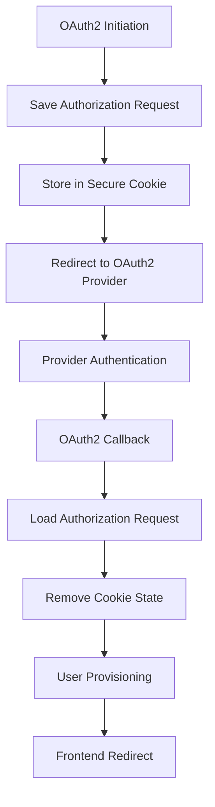

# Security Implementation Patterns

## Overview

The Security layer provides enterprise-grade OAuth2 authentication implementation with stateless authorization request management and automatic user provisioning. This document details the implementation patterns, security mechanisms, and enterprise integration strategies used in the SmartSupplyPro security architecture.

## Core Implementation Patterns

### 1. Stateless OAuth2 Authorization Request Management

#### Pattern: Cookie-Based Authorization State Persistence

```java
// CookieOAuth2AuthorizationRequestRepository - Stateless authorization state
@Override
public void saveAuthorizationRequest(OAuth2AuthorizationRequest authorizationRequest,
                                     HttpServletRequest request,
                                     HttpServletResponse response) {
    // Enterprise Serialization: Convert authorization request to secure cookie format
    String json = writeJson(authorizationRequest);
    String encoded = Base64.getUrlEncoder()
            .encodeToString(json.getBytes(StandardCharsets.UTF_8));

    // Enterprise Cookie Security: HttpOnly, Secure, SameSite=None for cross-origin flows
    Cookie cookie = new Cookie(AUTH_REQUEST_COOKIE_NAME, encoded);
    cookie.setHttpOnly(true);  // Enterprise Security: Prevent XSS access
    cookie.setSecure(isSecureOrForwardedHttps(request));
    cookie.setPath("/");
    cookie.setMaxAge(COOKIE_EXPIRE_SECONDS);  // Enterprise timeout: 3 minutes
}
```

**Enterprise Benefits:**
- **Stateless Scalability**: No server-side session storage required
- **High Availability**: OAuth2 callbacks work across multiple application instances
- **Load Balancer Friendly**: No session affinity requirements
- **Security**: HttpOnly cookies prevent XSS attacks on OAuth2 state

**Implementation Details:**
- **Cookie Lifespan**: 3-minute expiration for OAuth2 flow completion
- **Security Attributes**: HttpOnly, Secure, SameSite=None for cross-origin compatibility
- **Serialization**: JSON-based with Base64 encoding for cookie transport
- **Error Resilience**: Graceful handling of malformed or expired cookies

### 2. Automatic User Provisioning Pattern

#### Pattern: Just-in-Time User Creation with Role Assignment

```java
// OAuth2LoginSuccessHandler - Enterprise user provisioning
try {
    // Enterprise Provisioning: Automatic user creation with default role assignment
    userRepository.findById(email).orElseGet(() -> {
        AppUser newUser = new AppUser(email, name);
        newUser.setRole(Role.USER);  // Enterprise default: USER role for OAuth2 users
        newUser.setCreatedAt(LocalDateTime.now());
        return userRepository.save(newUser);
    });
} catch (DataIntegrityViolationException e) {
    // Enterprise Concurrency: Handle race conditions in multi-instance deployments
    userRepository.findByEmail(email).orElseThrow(() ->
        new IllegalStateException("User already exists but cannot be loaded."));
}
```

**Enterprise Features:**
- **Automatic Onboarding**: No manual user creation required
- **Default Role Assignment**: USER role for OAuth2-authenticated users
- **Concurrency Safety**: Handles race conditions in clustered deployments
- **Audit Trail**: Automatic creation timestamp for compliance

**Security Considerations:**
- **Identity Verification**: Email-based identity from trusted OAuth2 provider (Google)
- **Role Security**: Default USER role with principle of least privilege
- **Duplicate Prevention**: Database constraints prevent duplicate accounts

### 3. Secure Return URL Management Pattern

#### Pattern: Origin Allowlist with Custom Redirect Handling

```java
// Return URL security with allowlist validation
String ret = request.getParameter("return");
if (ret != null && !ret.isBlank()) {
    // Enterprise Security: Origin allowlist prevents open redirect attacks
    List<String> allowed = List.of(
        "http://localhost:5173",     // Development environment
        "https://localhost:5173",    // Development HTTPS
        "https://inventory-service.koyeb.app"  // Production frontend
    );
    if (allowed.contains(ret)) {
        // Enterprise State Management: Store return URL for success handler
        Cookie r = new Cookie("SSP_RETURN", ret);
        r.setHttpOnly(false);  // Frontend needs read access for custom routing
        r.setSecure(isSecureOrForwardedHttps(request));
        r.setPath("/");
        r.setMaxAge(300); // Enterprise timeout: 5 minutes
        addCookieWithSameSite(response, r, "None");
    }
}
```

**Security Benefits:**
- **Open Redirect Prevention**: Explicit allowlist prevents malicious redirects
- **Environment Flexibility**: Different URLs for development and production
- **Custom Routing**: Support for SPA-specific post-authentication routing
- **Timeout Protection**: 5-minute expiration prevents stale redirects

## OAuth2 Integration Architecture

### 1. Google OAuth2 Provider Integration

#### Configuration Pattern
```yaml
# OAuth2 provider configuration
spring:
  security:
    oauth2:
      client:
        registration:
          google:
            client-id: ${GOOGLE_CLIENT_ID}
            client-secret: ${GOOGLE_CLIENT_SECRET}
            scope: openid,profile,email
            redirect-uri: "{baseUrl}/login/oauth2/code/{registrationId}"
```

#### Custom User Service Integration
```java
// SecurityConfig integration with custom user services
.oauth2Login(oauth -> oauth
    .userInfoEndpoint(ui -> ui
        .oidcUserService(customOidcUserService)  // Custom OIDC processing
        .userService(customOAuth2UserService)    // Non-OIDC provider support
    )
    .successHandler(successHandler)              // Post-login processing
    .failureHandler(oauthFailureHandler(props))  // Error handling
)
```

**Integration Features:**
- **OIDC Compliance**: Full OpenID Connect integration with Google
- **Custom User Processing**: Automatic local user account creation
- **Error Handling**: Graceful failure processing with user-friendly messages
- **Flexible Providers**: Support for additional OAuth2 providers

### 2. Cross-Origin Authentication Flow

#### SameSite Cookie Configuration
```java
// Enterprise Cookie Security: Cross-origin compatibility
private static void addCookieWithSameSite(HttpServletResponse response, Cookie cookie, String sameSite) {
    StringBuilder sb = new StringBuilder();
    sb.append(cookie.getName()).append('=').append(cookie.getValue());
    sb.append("; Path=").append(cookie.getPath());
    if (cookie.getMaxAge() >= 0) sb.append("; Max-Age=").append(cookie.getMaxAge());
    if (cookie.getSecure()) sb.append("; Secure");
    if (cookie.isHttpOnly()) sb.append("; HttpOnly");
    if (sameSite != null && !sameSite.isBlank()) sb.append("; SameSite=").append(sameSite);
    response.addHeader("Set-Cookie", sb.toString());
}
```

**Cross-Origin Features:**
- **SameSite=None**: Enables cross-site authentication flows
- **Secure Requirement**: HTTPS enforcement for production security
- **Load Balancer Support**: X-Forwarded-Proto header detection
- **Browser Compatibility**: Modern browser security compliance

## Security State Management Patterns

### 1. Authorization Request Lifecycle

#### State Transition Pattern


**Lifecycle Management:**
- **Creation**: Authorization request serialized to secure cookie
- **Persistence**: 3-minute lifespan for OAuth2 flow completion
- **Retrieval**: Base64 decoding with error resilience
- **Cleanup**: Automatic cookie removal after successful authentication

### 2. Cookie Security Architecture

#### Security Attributes Matrix
| Cookie Type | HttpOnly | Secure | SameSite | MaxAge | Purpose |
|-------------|----------|--------|----------|---------|---------|
| OAUTH2_AUTH_REQUEST | ✅ | ✅ | None | 180s | Authorization state |
| SSP_RETURN | ❌ | ✅ | None | 300s | Return URL routing |
| SESSION | ✅ | ✅ | None | Session | User authentication |

**Security Controls:**
- **XSS Protection**: HttpOnly cookies prevent JavaScript access
- **HTTPS Enforcement**: Secure flag requires encrypted transport
- **Cross-Origin Support**: SameSite=None enables legitimate cross-site flows
- **Expiration Management**: Short lifespans limit exposure window

## Enterprise Integration Patterns

### 1. Load Balancer Compatibility

#### HTTPS Detection Pattern
```java
// Enterprise Security: HTTPS context detection
private static boolean isSecureOrForwardedHttps(HttpServletRequest request) {
    if (request.isSecure()) return true;
    String xfProto = request.getHeader("X-Forwarded-Proto");  // Load balancer support
    return xfProto != null && xfProto.equalsIgnoreCase("https");
}
```

**Load Balancer Features:**
- **Direct HTTPS**: Native servlet container HTTPS detection
- **Proxy Support**: X-Forwarded-Proto header handling
- **SSL Termination**: Support for load balancer SSL termination
- **Security Consistency**: Proper secure cookie behavior

### 2. Multi-Instance Deployment

#### Stateless Design Benefits
```java
// No server-side session storage required
// Authorization state in client-side cookies
// Database-backed user provisioning
// Horizontal scaling without session affinity
```

**Scalability Features:**
- **Horizontal Scaling**: No session replication required
- **Instance Independence**: OAuth2 callbacks work on any instance
- **Database Consistency**: User provisioning with conflict resolution
- **Performance**: No session lookup overhead

## Error Handling and Resilience Patterns

### 1. OAuth2 Flow Error Handling

#### Graceful Degradation Pattern
```java
// Enterprise Resilience: Error handling in deserialization
try {
    String json = new String(Base64.getUrlDecoder().decode(c.getValue()), StandardCharsets.UTF_8);
    OAuth2AuthorizationRequest o = readJson(json);
    if (o != null) {
        return Optional.of(o);
    }
} catch (Exception ignored) {
    // Enterprise Resilience: Ignore malformed cookies, continue search
}
```

**Error Resilience:**
- **Malformed Cookies**: Graceful handling of corrupted state
- **JSON Parse Errors**: Fallback to empty state
- **Base64 Decode Errors**: Silent failure with continued processing
- **State Recovery**: Multiple cookie search for valid state

### 2. Concurrent User Creation

#### Race Condition Handling
```java
// Enterprise Concurrency: Handle race conditions
try {
    // Attempt user creation
    return userRepository.save(newUser);
} catch (DataIntegrityViolationException e) {
    // Handle concurrent creation attempt
    userRepository.findByEmail(email).orElseThrow(() ->
        new IllegalStateException("User already exists but cannot be loaded."));
}
```

**Concurrency Features:**
- **Database Constraints**: Email uniqueness enforcement
- **Exception Handling**: Graceful handling of constraint violations
- **State Recovery**: Load existing user on creation conflict
- **Consistency**: Guaranteed single user per email address

## Security Monitoring and Audit Patterns

### 1. Authentication Event Logging

#### Audit Trail Pattern
```java
// Enterprise audit logging for security events
log.info("OAuth2 success → redirecting to FE: {}", target);
log.debug("Set SSP_RETURN cookie for {}", ret);
log.warn("Ignored non-whitelisted return origin: {}", ret);
log.debug("Saved {} cookie. secure={}, maxAge={}, sameSite=None", 
    AUTH_REQUEST_COOKIE_NAME, cookie.getSecure(), cookie.getMaxAge());
```

**Audit Features:**
- **Success Events**: Authentication and redirect logging
- **Security Events**: Invalid return URL attempts
- **State Management**: Cookie lifecycle logging
- **Debug Information**: Detailed troubleshooting data

### 2. Security Validation Logging

#### Threat Detection Pattern
```java
// Security validation with audit trail
if (allowed.contains(ret)) {
    log.debug("Set SSP_RETURN cookie for {}", ret);
} else {
    log.warn("Ignored non-whitelisted return origin: {}", ret);
}
```

**Threat Detection:**
- **Open Redirect Attempts**: Log suspicious return URLs
- **Origin Validation**: Track allowlist enforcement
- **Attack Pattern Recognition**: Identify potential security threats
- **Compliance**: Audit trail for security reviews

## Performance Optimization Patterns

### 1. Cookie Size Optimization

#### Efficient Serialization Pattern
```java
// Enterprise serialization: Minimal JSON structure
Map<String, Object> m = Map.of(
    "authorizationUri",        r.getAuthorizationUri(),
    "clientId",                r.getClientId(),
    "redirectUri",             r.getRedirectUri(),
    "scopes",                  r.getScopes(),
    "state",                   r.getState(),
    "responseType",            r.getResponseType().getValue(),
    "additionalParameters",    r.getAdditionalParameters(),
    "attributes",              r.getAttributes(),
    "authorizationRequestUri", r.getAuthorizationRequestUri()
);
```

**Optimization Features:**
- **Minimal Payload**: Only essential OAuth2 state preserved
- **Efficient Encoding**: Base64 encoding for cookie transport
- **Compression**: JSON structure optimization
- **Size Limits**: Respect browser cookie size limitations

### 2. Cookie Cleanup Optimization

#### Lifecycle Management Pattern
```java
// Enterprise cleanup: Immediate cookie removal after use
OAuth2AuthorizationRequest existing = read(request).orElse(null);
deleteCookie(request, response);  // Clean up single-use state
return existing;
```

**Cleanup Benefits:**
- **Memory Efficiency**: Immediate state cleanup
- **Security**: Minimize exposure time of sensitive state
- **Performance**: Reduce cookie overhead on subsequent requests
- **Browser Limits**: Prevent cookie accumulation

## Testing and Validation Patterns

### 1. Security Integration Testing

#### Test Coverage Areas
```java
// Test scenarios for security implementation
@Test void testStatelessOAuth2Flow()           // Cross-instance OAuth2 flow
@Test void testUserProvisioningConcurrency()   // Race condition handling
@Test void testReturnUrlValidation()           // Origin allowlist security
@Test void testCookieSecurityAttributes()      // Cookie security verification
@Test void testErrorResilience()               // Malformed state handling
```

### 2. Security Validation Testing

#### Threat Model Testing
```java
// Security threat testing scenarios
@Test void testOpenRedirectPrevention()        // Malicious return URLs
@Test void testCookieTampering()               // Modified authorization state
@Test void testCrossOriginAttacks()            // CSRF and XSS prevention
@Test void testSessionFixation()               // Session security
@Test void testPrivilegeEscalation()           // Role assignment security
```

## Production Deployment Considerations

### 1. Environment Configuration

#### Security Configuration Matrix
| Environment | HTTPS Required | Debug Logging | Cookie Secure | Return URLs |
|-------------|----------------|---------------|---------------|-------------|
| Development | Optional | Enabled | Auto-detect | localhost:* |
| Staging | Required | Limited | Enforced | staging.domain |
| Production | Required | Disabled | Enforced | production.domain |

### 2. Monitoring and Alerting

#### Security Metrics
- **Authentication Success Rate**: OAuth2 flow completion percentage
- **User Provisioning Rate**: New user creation frequency
- **Security Violations**: Invalid return URL attempts
- **Cookie Errors**: Malformed or expired state incidents
- **Concurrent Creation**: Race condition occurrence frequency

## Related Documentation

- **Security Configuration**: See [Security Patterns](security-patterns.md) for overall architecture
- **Configuration Layer**: See [Configuration Patterns](configuration-patterns.md) for security configuration
- **OAuth2 Integration**: See [Configuration API Integration](configuration-api-integration.md) for frontend flows
- **User Management**: See service layer documentation for user role management
- **Session Security**: See session management patterns in configuration documentation

---

*This document provides comprehensive security implementation patterns for OAuth2 authentication, stateless authorization management, and enterprise security integration in the SmartSupplyPro inventory management system.*