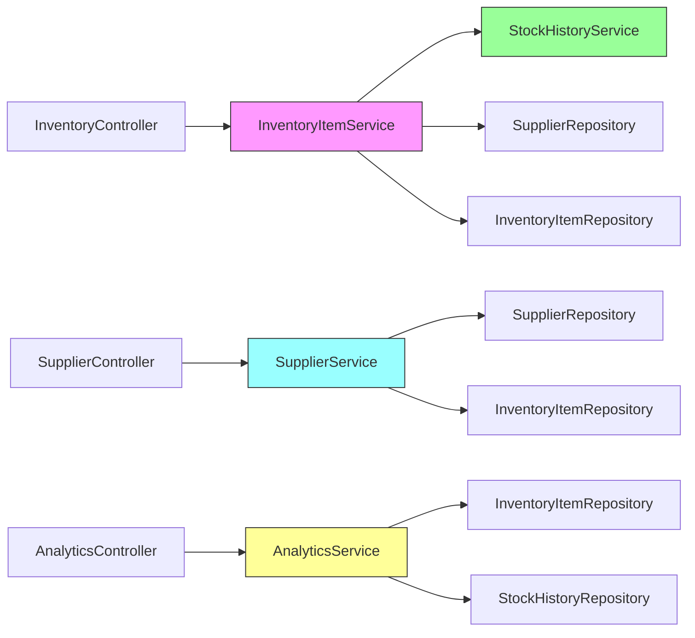

# Service Layer Architecture

**Layer**: Business Logic  
**Pattern**: Interface-based service layer with implementation classes  
**Transaction Management**: Declarative (`@Transactional`)  
**Validation**: Delegated to static validator utilities

---

## 📋 Service Catalog

### Core Business Services

#### 1. AnalyticsServiceImpl
**File**: `src/main/java/com/smartsupplypro/inventory/service/impl/AnalyticsServiceImpl.java`  
**Interface**: `AnalyticsService`  
**Complexity**: 🔴 **HIGH**  
**Lines**: 880 (after documentation)

**Responsibilities**:
- Business insights and KPI calculations
- Weighted Average Cost (WAC) algorithm
- Trend analysis (daily/weekly/monthly)
- Low stock alerts
- Supplier performance metrics

**Key Patterns**:
- WAC calculator (candidate for extraction)
- Read-only transactions
- Complex aggregations
- No audit trail (read-only operations)

**[📖 Full Documentation](/docs/architecture/services/analytics-service.md)**

---

#### 2. InventoryItemServiceImpl
**File**: `src/main/java/com/smartsupplypro/inventory/service/impl/InventoryItemServiceImpl.java`  
**Interface**: `InventoryItemService`  
**Complexity**: 🟡 **MEDIUM**  
**Lines**: 1,092 (after documentation)

**Responsibilities**:
- Inventory item CRUD operations
- Stock level management
- Reorder threshold tracking
- Stock history integration
- Comprehensive audit trail

**Key Patterns**:
- Stock history logging on every change
- Security context integration (createdBy)
- Inline validation (candidate for extraction)
- Transactional data management

**[📖 Full Documentation](/docs/architecture/services/inventory-item-service.md)**

---

#### 3. SupplierServiceImpl
**File**: `src/main/java/com/smartsupplypro/inventory/service/impl/SupplierServiceImpl.java`  
**Interface**: `SupplierService`  
**Complexity**: 🟢 **LOW**  
**Lines**: 861 (after documentation)

**Responsibilities**:
- Supplier master data management
- Referential integrity enforcement
- Name uniqueness constraint (case-insensitive)
- Minimal audit trail (createdAt only)

**Key Patterns**:
- Validation delegation (SupplierValidator)
- Static mapper pattern
- Master data (infrequent changes)
- Deletion protection (check inventory items)

**[📖 Full Documentation](/docs/architecture/services/supplier-service.md)**

---

#### 4. StockHistoryService
**File**: `src/main/java/com/smartsupplypro/inventory/service/StockHistoryService.java`  
**Type**: Direct `@Service` (no interface)  
**Complexity**: 🟢 **LOW**  
**Lines**: 199

**Responsibilities**:
- Append-only audit log for stock movements
- Denormalized supplier snapshots
- Paginated history queries
- Price snapshot tracking (priceAtChange)

**Key Patterns**:
- Event sourcing (append-only)
- Denormalization (supplierId stored)
- No update/delete operations
- Server-authoritative timestamps

**[📖 Full Documentation](/docs/architecture/services/stock-history-service.md)**

---

### Authentication Services

#### 5. CustomOAuth2UserService
**File**: `src/main/java/com/smartsupplypro/inventory/service/CustomOAuth2UserService.java`  
**Type**: Spring Security integration  
**Complexity**: 🟡 **MEDIUM**  
**Lines**: 102

**Responsibilities**:
- OAuth2 user attribute mapping
- User principal creation
- First-time user registration

**[📖 Full Documentation](/docs/architecture/services/oauth2-services.md)**

---

#### 6. CustomOidcUserService
**File**: `src/main/java/com/smartsupplypro/inventory/service/CustomOidcUserService.java`  
**Type**: Spring Security integration  
**Complexity**: 🟡 **MEDIUM**  
**Lines**: 105

**Responsibilities**:
- OIDC token handling
- ID token claims processing
- User principal creation

**[📖 Full Documentation](/docs/architecture/services/oauth2-services.md)**

---

## 🏗️ Architecture Patterns

### Layered Architecture

```
┌─────────────────────────────────────────────┐
│           Controller Layer                  │
│  (HTTP, @RestController, @RequestMapping)   │
└──────────────────┬──────────────────────────┘
                   │
                   ▼
┌─────────────────────────────────────────────┐
│            Service Layer                    │
│  (@Service, @Transactional, Business Logic) │
└──────────────────┬──────────────────────────┘
                   │
                   ▼
┌─────────────────────────────────────────────┐
│          Repository Layer                   │
│     (JPA, @Repository, Spring Data)         │
└──────────────────┬──────────────────────────┘
                   │
                   ▼
┌─────────────────────────────────────────────┐
│            Database Layer                   │
│         (Oracle Autonomous DB)              │
└─────────────────────────────────────────────┘
```

### Service Interaction Patterns



---

## 🔄 Transaction Management

### Strategy: Declarative Transactions

All service implementations use `@Transactional`:

- **Class-level**: Default to READ-WRITE transactions
- **Method-level override**: `@Transactional(readOnly = true)` for query methods

**Example** (SupplierServiceImpl):
```java
@Service
@Transactional  // Default: read-write
public class SupplierServiceImpl {
    
    @Transactional(readOnly = true)  // Override: read-only
    public List<SupplierDTO> findAll() { ... }
    
    // Uses class-level read-write transaction
    public SupplierDTO create(SupplierDTO dto) { ... }
}
```

**Benefits**:
- ✅ Automatic rollback on exceptions
- ✅ Performance optimization for read-only queries
- ✅ Consistent transaction boundaries
- ✅ No manual transaction management

---

## 🛡️ Validation Strategy

### Pattern: Delegated Validation

All complex validation is delegated to static validator utilities:

| Service | Validator Class | Methods |
|---------|----------------|---------|
| SupplierServiceImpl | `SupplierValidator` | `validateBase()`, `assertUniqueName()`, `assertDeletable()` |
| InventoryItemServiceImpl | Inline (candidate for extraction) | Inline validation checks |
| StockHistoryService | `StockHistoryValidator` | `validate()`, `validateEnum()` |

**Refactoring Goal**: Extract `InventoryItemValidator` for consistency.

See [Validation Patterns](../patterns/validation-patterns.md) for details.

---

## 🗺️ Data Mapping

### Pattern: Static Mapper Utilities

All DTO ↔ Entity conversions use static mapper classes:

| Mapper | Purpose |
|--------|---------|
| `SupplierMapper` | `SupplierDTO` ↔ `Supplier` entity |
| `InventoryItemMapper` | `InventoryItemDTO` ↔ `InventoryItem` entity |
| `StockHistoryMapper` | `StockHistoryDTO` ↔ `StockHistory` entity |

**Example**:
```java
// DTO → Entity
Supplier entity = SupplierMapper.toEntity(dto);

// Entity → DTO
SupplierDTO dto = SupplierMapper.toDTO(entity);
```

See [Mapper Patterns](../patterns/mapper-patterns.md) for details.

---

## 📊 Complexity Metrics

| Service | Lines | Methods | Complexity | Refactoring Priority |
|---------|-------|---------|------------|---------------------|
| AnalyticsServiceImpl | 880 | 12 | 🔴 HIGH | WAC extraction ⭐⭐⭐ |
| InventoryItemServiceImpl | 1,092 | 9 | 🟡 MEDIUM | Validator extraction ⭐⭐ |
| SupplierServiceImpl | 861 | 7 | 🟢 LOW | Entity audit fields ⭐ |
| StockHistoryService | 199 | 8 | 🟢 LOW | None ✅ |
| OAuth2 Services | 207 | ~6 | 🟡 MEDIUM | None ✅ |

---

## 🔗 Cross-Service Dependencies

### High Coupling
- **InventoryItemServiceImpl** → **StockHistoryService**: Logs every stock change
- **SupplierServiceImpl** → **InventoryItemRepository**: Referential integrity checks

### Low Coupling
- **AnalyticsServiceImpl**: Read-only, no dependencies on other services
- **StockHistoryService**: Append-only, no dependencies on other services

### Refactoring Opportunity
Consider **SecurityContextUtils** extraction (used in InventoryItemServiceImpl, planned for SupplierServiceImpl).

---

## 🧪 Testing Strategy

| Test Type | Coverage | Location |
|-----------|----------|----------|
| Unit Tests | Per-service | `src/test/java/...service/impl/*Test.java` |
| Integration Tests | Controller + Service + DB | `src/test/java/...controller/*Test.java` |
| Coverage Report | 268 tests, [Live Report](https://keglev.github.io/inventory-service/backend/coverage/index.html) | GitHub Pages |


## 📚 Further Reading


---

**Last Updated**: October 7, 2025
