# Supplier Service Architecture

**File**: `src/main/java/com/smartsupplypro/inventory/service/impl/SupplierServiceImpl.java`  
**Interface**: `SupplierService`  
**Complexity**: 🟢 **LOW**  
**Type**: Master Data Management  
**Last Updated**: October 7, 2025

---

## 📋 Overview

The Supplier Service manages the **master data** for suppliers in the inventory system. Unlike transactional services (e.g., InventoryItemService), this service handles **reference data** that changes infrequently and is used across the system for lookups and relationships.

### Core Characteristics
- **Data Type**: Master data (reference catalog)
- **Change Frequency**: Low (monthly/quarterly additions)
- **Typical Record Count**: 10-500 suppliers
- **Business Logic Complexity**: Low (validation + uniqueness + referential integrity)
- **Caching Potential**: High (5-minute cache feasible)

---

## 🎯 Responsibilities

### 1. Supplier Lifecycle Management
- Create new supplier records
- Update supplier contact information
- Delete suppliers (with referential integrity checks)

### 2. Data Integrity Enforcement
- **Uniqueness Constraint**: Supplier names must be unique (case-insensitive)
- **Referential Integrity**: Prevent deletion if inventory items reference the supplier
- **Server-Authoritative Fields**: Auto-generate UUID and timestamps

### 3. Search and Retrieval
- List all suppliers (acceptable for master data)
- Find by ID (individual supplier lookup)
- Find by name (partial match, case-insensitive search)

### 4. KPI Metrics
- Count total suppliers (dashboard metric)

---

## 🏗️ Architecture Diagram

### Service Dependencies


### Component Relationships

| Component | Type | Purpose | Relationship |
|-----------|------|---------|--------------|
| **SupplierController** | REST Controller | HTTP endpoints | Calls SupplierService |
| **SupplierServiceImpl** | Service | Business logic | **THIS COMPONENT** |
| **SupplierValidator** | Static Utility | Validation rules | Called by service |
| **SupplierMapper** | Static Utility | DTO ↔ Entity | Called by service |
| **SupplierRepository** | JPA Repository | Data persistence | Called by service |
| **InventoryItemRepository** | JPA Repository | Referential checks | Called by service (deletion only) |

---

## 🔄 Operation Flows

### 1. Create Supplier

```mermaid
sequenceDiagram
    participant C as SupplierController
    participant S as SupplierService
    participant V as SupplierValidator
    participant R as SupplierRepository
    participant M as SupplierMapper
    
    C->>S: create(dto)
    S->>V: validateBase(dto)
    V->>V: Check non-blank name
    V->>V: Validate email format
    V->>V: Validate phone format
    V-->>S: ✅ Valid
    
    S->>V: assertUniqueName(name, null)
    V->>R: findByNameIgnoreCase(name)
    R-->>V: Optional.empty()
    V-->>S: ✅ Unique
    
    S->>M: toEntity(dto)
    M-->>S: Supplier entity
    
    S->>S: Generate UUID
    S->>S: Set createdAt = now()
    
    S->>R: save(entity)
    R->>R: INSERT INTO suppliers
    R-->>S: Saved entity
    
    S->>M: toDTO(entity)
    M-->>S: SupplierDTO
    S-->>C: Return DTO
```



**Steps Explained**:

1. **Validate DTO Fields**: Check non-blank name/contact, valid email/phone format
2. **Check Name Uniqueness**: Query database for existing supplier with same name (case-insensitive)
   - `null` parameter = new supplier (no ID to exclude from search)
3. **Convert DTO to Entity**: Static mapper call
4. **Generate Server-Side Fields**:
   - `id`: New UUID (client-provided ID ignored)
   - `createdAt`: Current timestamp
   - `createdBy`: TODO (not yet implemented, requires SecurityContextUtils)
5. **Persist to Database**: JPA save operation (INSERT)
6. **Return Saved DTO**: Convert entity back to DTO with generated fields

---

### 2. Update Supplier

```mermaid
sequenceDiagram
    participant C as SupplierController
    participant S as SupplierService
    participant V as SupplierValidator
    participant R as SupplierRepository
    participant M as SupplierMapper
    
    C->>S: update(id, dto)
    
    S->>R: findById(id)
    alt Supplier not found
        R-->>S: Optional.empty()
        S-->>C: ❌ NoSuchElementException (404)
    else Supplier found
        R-->>S: Existing entity
        
        S->>V: validateBase(dto)
        V-->>S: ✅ Valid
        
        S->>V: assertUniqueName(name, id)
        V->>R: findByNameIgnoreCase(name)
        R-->>V: Optional(other supplier OR empty)
        alt Name conflicts with different supplier
            V-->>S: ❌ DuplicateResourceException (409)
        else Name unique OR same supplier
            V-->>S: ✅ Unique
            
            S->>S: Update mutable fields
            S->>S: Set updatedAt (TODO: not in entity)
            
            S->>R: save(entity)
            R->>R: UPDATE suppliers
            R-->>S: Updated entity
            
            S->>M: toDTO(entity)
            M-->>S: SupplierDTO
            S-->>C: Return DTO
        end
    end
```



**Key Differences from Create**:
- **Path ID Authoritative**: Path parameter `id` determines which supplier to update (DTO ID ignored)
- **Uniqueness Check**: Excludes current supplier ID from search (allow keeping same name)
- **Immutable Fields**: ID and createdAt never overwritten
- **Audit Fields**: updatedAt/updatedBy not yet implemented (entity missing fields)

---

### 3. Delete Supplier (Referential Integrity)

```mermaid
sequenceDiagram
    participant C as SupplierController
    participant S as SupplierService
    participant V as SupplierValidator
    participant IIR as InventoryItemRepository
    participant SR as SupplierRepository
    
    C->>S: delete(id)
    
    S->>V: assertDeletable(id, checkFn)
    V->>IIR: existsActiveStockForSupplier(id, 0)
    
    alt Inventory items reference supplier
        IIR-->>V: true (count > 0)
        V-->>S: ❌ IllegalStateException (409)
        S-->>C: "Cannot delete: items reference supplier"
    else No references
        IIR-->>V: false (count = 0)
        V-->>S: ✅ Deletable
        
        S->>SR: existsById(id)
        alt Supplier not found
            SR-->>S: false
            S-->>C: ❌ NoSuchElementException (404)
        else Supplier exists
            SR-->>S: true
            
            S->>SR: deleteById(id)
            SR->>SR: DELETE FROM suppliers
            SR-->>S: ✅ Deleted
            S-->>C: Success (204 No Content)
        end
    end
```



**Referential Integrity Enforcement**:
- **Query**: `SELECT COUNT(*) FROM inventory_items WHERE supplier_id = ? AND quantity > ?`
- **Threshold**: `0` (checks ANY items, including depleted stock)
- **Rationale**: Preserve audit trail (historical supplier relationships)

---

## 📐 Business Rules

### Rule 1: Unique Supplier Names (Case-Insensitive)

**Description**: Two suppliers cannot have the same name, regardless of case.

**Rationale**:
- Prevents confusion in dropdowns and reports
- Ensures data quality for analytics
- Simplifies supplier selection in UI

**Enforcement**:
```java
SupplierValidator.assertUniqueName(repository, "ACME Corp", null);
// Throws DuplicateResourceException if "acme corp" or "Acme CORP" exists
```

**Exceptions**:
- During update: Supplier can keep its existing name (ID excluded from uniqueness check)

**HTTP Status**: `409 Conflict` if violation detected

---

### Rule 2: Referential Integrity (Deletion Protection)

**Description**: A supplier cannot be deleted if any inventory items reference it.

**Rationale**:
- Prevents orphaned foreign keys
- Maintains audit trail for historical data
- Enforces data consistency

**Enforcement**:
```java
SupplierValidator.assertDeletable(id, () -> 
    inventoryItemRepository.existsActiveStockForSupplier(id, 0)
);
```

**Scenarios**:

| Scenario | Inventory Items | Deletion Allowed? |
|----------|----------------|-------------------|
| New supplier (never used) | 0 items | ✅ YES |
| Active stock (quantity > 0) | 5 items (50 laptops) | ❌ NO - Transfer items first |
| Depleted stock (quantity = 0) | 5 items (0 laptops) | ❌ NO - Preserve audit trail |
| All items deleted | 0 items | ✅ YES |

**Alternative Strategies** (Not Implemented):
- **Soft Delete**: Add `deletedAt` timestamp, hide from findAll()
- **Cascade Nullify**: Set `supplier_id = NULL` on items (loses audit trail)
- **Cascade Delete**: Delete linked items (dangerous, data loss)

**HTTP Status**: `409 Conflict` if deletion blocked

---

### Rule 3: Server-Authoritative Fields

**Description**: ID and timestamps are always generated server-side.

**Rationale**:
- **Security**: Prevent client manipulation of IDs (e.g., ID collision attacks)
- **Consistency**: Ensure UUIDs are properly formatted and unique
- **Audit Trail**: Timestamps reflect actual server time (not client time)

**Enforcement**:
```java
entity.setId(UUID.randomUUID().toString());  // Always new UUID
entity.setCreatedAt(LocalDateTime.now());    // Server timestamp
// Client-provided dto.getId() is IGNORED
```

**Fields**:
- `id`: UUID format (e.g., `550e8400-e29b-41d4-a716-446655440000`)
- `createdAt`: ISO-8601 timestamp (e.g., `2025-10-07T14:30:00`)
- `createdBy`: TODO (requires SecurityContextUtils - not yet implemented)
- `updatedAt`: TODO (entity missing field)
- `updatedBy`: TODO (entity missing field)

---

### Rule 4: Validation Requirements

**Description**: Supplier data must meet format and content requirements.

**Validation Rules**:

| Field | Constraint | Error Message | HTTP Status |
|-------|-----------|---------------|-------------|
| `name` | Non-blank | "Supplier name is required" | 400 Bad Request |
| `contactName` | Non-blank | "Contact name is required" | 400 Bad Request |
| `email` | Valid format | "Invalid email format" | 400 Bad Request |
| `phone` | Valid format | "Invalid phone format" | 400 Bad Request |

**Enforcement**: `SupplierValidator.validateBase(dto)` before persistence

---

## 🎨 Design Patterns

### Pattern 1: Validation Delegation

**Intent**: Separate validation logic from business logic for reusability and testability.

**Implementation**:
```java
// Service delegates to static validator
SupplierValidator.validateBase(dto);
SupplierValidator.assertUniqueName(repository, name, excludeId);
SupplierValidator.assertDeletable(id, checkFunction);
```

**Benefits**:
- ✅ **Testability**: Validator can be unit tested independently
- ✅ **Reusability**: Validation logic can be called from multiple services
- ✅ **Clean Service Code**: Business logic not cluttered with validation

**Trade-offs**:
- ⚠️ **Indirection**: Validation logic not immediately visible in service method
- ⚠️ **Static Methods**: Cannot be mocked in tests (must use integration tests)

**Comparison**: InventoryItemServiceImpl uses **inline validation** (candidate for refactoring).

See [Validation Patterns](../patterns/validation-patterns.md) for details.

---

### Pattern 2: Static Mapper

**Intent**: Convert between DTOs and entities without introducing dependencies on mapping frameworks.

**Implementation**:
```java
// DTO → Entity
Supplier entity = SupplierMapper.toEntity(dto);

// Entity → DTO
SupplierDTO dto = SupplierMapper.toDTO(entity);
```

**Benefits**:
- ✅ **No Framework Dependency**: No MapStruct, ModelMapper, Dozer
- ✅ **Full Control**: Explicit field mapping, easy to debug
- ✅ **Performance**: No reflection overhead

**Trade-offs**:
- ⚠️ **Boilerplate**: Must write mapping code manually
- ⚠️ **Maintenance**: Must update mapper when entity/DTO changes

See [Mapper Patterns](../patterns/mapper-patterns.md) for details.

---

### Pattern 3: Master Data Management

**Intent**: Optimize for infrequent changes and high read volume.

**Characteristics**:
- **Low Change Frequency**: Suppliers added/updated monthly or quarterly
- **High Read Frequency**: Used in dropdowns, reports, analytics
- **Small Dataset**: Typically 10-500 records
- **Referential Integrity**: Many-to-one from InventoryItem

**Optimizations**:
- **No Pagination**: `findAll()` returns all suppliers (acceptable for <1000 records)
- **Caching Opportunity**: Cache `findAll()` and `countSuppliers()` for 5 minutes
- **Read-Only Transactions**: Optimize query methods with `@Transactional(readOnly = true)`

**When to Paginate**: If supplier count exceeds 1000, implement pagination.

---

## 🔗 API Documentation

### REST Endpoints

| Method | Endpoint | Operation | JavaDoc | OpenAPI |
|--------|----------|-----------|---------|---------|
| GET | `/api/suppliers` | List all | [Code](../../../../src/main/java/com/smartsupplypro/inventory/service/impl/SupplierServiceImpl.java#L310) | [API Docs](../../api.html#tag/Suppliers/operation/getAllSuppliers) |
| GET | `/api/suppliers/{id}` | Find by ID | [Code](../../../../src/main/java/com/smartsupplypro/inventory/service/impl/SupplierServiceImpl.java#L335) | [API Docs](../../api.html#tag/Suppliers/operation/getSupplierById) |
| GET | `/api/suppliers/search?name={name}` | Search by name | [Code](../../../../src/main/java/com/smartsupplypro/inventory/service/impl/SupplierServiceImpl.java#L360) | [API Docs](../../api.html#tag/Suppliers/operation/searchSuppliers) |
| POST | `/api/suppliers` | Create supplier | [Code](../../../../src/main/java/com/smartsupplypro/inventory/service/impl/SupplierServiceImpl.java#L410) | [API Docs](../../api.html#tag/Suppliers/operation/createSupplier) |
| PUT | `/api/suppliers/{id}` | Update supplier | [Code](../../../../src/main/java/com/smartsupplypro/inventory/service/impl/SupplierServiceImpl.java#L480) | [API Docs](../../api.html#tag/Suppliers/operation/updateSupplier) |
| DELETE | `/api/suppliers/{id}` | Delete supplier | [Code](../../../../src/main/java/com/smartsupplypro/inventory/service/impl/SupplierServiceImpl.java#L630) | [API Docs](../../api.html#tag/Suppliers/operation/deleteSupplier) |
| GET | `/api/suppliers/count` | Count suppliers | [Code](../../../../src/main/java/com/smartsupplypro/inventory/service/impl/SupplierServiceImpl.java#L750) | [API Docs](../../api.html#tag/Suppliers/operation/countSuppliers) |

**Interactive API Documentation**: [Redoc UI](../../api.html)

---

## 🧩 Related Components

### Direct Dependencies
- **SupplierRepository** (JPA): Primary data access
- **InventoryItemRepository** (JPA): Referential integrity checks (deletion only)
- **SupplierValidator** (Static Utility): Validation logic
- **SupplierMapper** (Static Utility): DTO ↔ Entity conversion

### Downstream Consumers
- **SupplierController**: REST API endpoints
- **InventoryItemServiceImpl**: Supplier lookup when creating/updating items
- **AnalyticsServiceImpl**: Supplier performance metrics

### Database Schema
```sql
CREATE TABLE suppliers (
    id VARCHAR2(36) PRIMARY KEY,
    name VARCHAR2(255) NOT NULL,
    contact_name VARCHAR2(255) NOT NULL,
    phone VARCHAR2(50),
    email VARCHAR2(255),
    created_at TIMESTAMP NOT NULL,
    created_by VARCHAR2(100),  -- TODO: Not populated yet
    updated_at TIMESTAMP,       -- TODO: Not in entity yet
    updated_by VARCHAR2(100)    -- TODO: Not in entity yet
);

-- Case-insensitive uniqueness constraint
CREATE UNIQUE INDEX idx_supplier_name_unique ON suppliers (UPPER(name));

-- Foreign key from inventory_items
ALTER TABLE inventory_items
    ADD CONSTRAINT fk_supplier
    FOREIGN KEY (supplier_id) REFERENCES suppliers(id);
```

---

## 🔧 Refactoring Notes

### Priority 1: Entity Audit Fields ⭐ (LOW PRIORITY)

**Current State**: Supplier entity missing audit fields.

**Blocked Operations**:
```java
// In create() - TODO commented out
// entity.setCreatedBy(SecurityContextUtils.getCurrentUsername());

// In update() - TODO commented out
// existing.setUpdatedBy(SecurityContextUtils.getCurrentUsername());
// existing.setUpdatedAt(LocalDateTime.now());
```

**Required Changes**:
1. Add fields to `Supplier` entity:
   ```java
   @Column(name = "created_by", length = 100)
   private String createdBy;
   
   @Column(name = "updated_by", length = 100)
   private String updatedBy;
   
   @Column(name = "updated_at")
   private LocalDateTime updatedAt;
   ```

2. Database migration (Flyway):
   ```sql
   ALTER TABLE suppliers
       ADD COLUMN created_by VARCHAR2(100),
       ADD COLUMN updated_by VARCHAR2(100),
       ADD COLUMN updated_at TIMESTAMP;
   ```

3. Create `SecurityContextUtils` utility (see below)

4. Uncomment TODO lines in service

**Estimated Effort**: 2 hours (entity, migration, service update, testing)

**See**: [SUPPLIERSERVICEIMPL_REFACTORING_ANALYSIS.md](../../../../SUPPLIERSERVICEIMPL_REFACTORING_ANALYSIS.md)

---

### Priority 2: SecurityContextUtils Extraction ⭐⭐⭐ (HIGH PRIORITY - Cross-Layer)

**Status**: **CONFIRMED NEEDED** (3 files require this pattern)

**Current Implementations**:
- InventoryItemServiceImpl: `currentUsername()` helper method ✅
- SupplierServiceImpl: TODO comments ⏸️
- AnalyticsServiceImpl: Not applicable (read-only) ➖

**Proposed Utility**:
```java
public class SecurityContextUtils {
    public static String getCurrentUsername() {
        Authentication auth = SecurityContextHolder.getContext().getAuthentication();
        if (auth == null || !auth.isAuthenticated()) {
            return "system";
        }
        
        Object principal = auth.getPrincipal();
        if (principal instanceof OAuth2User) {
            return ((OAuth2User) principal).getAttribute("email");
        }
        return auth.getName();
    }
}
```

**Impact**: 3+ files, eliminates code duplication

**Estimated Effort**: 2 hours (utility creation, service updates, testing)

**See**: [Cross-Layer Refactoring](../refactoring/cross-layer-utilities.md)

---

### Priority 3: Caching Strategy ⭐ (LOW PRIORITY - Performance)

**Opportunity**: Supplier data changes infrequently (master data).

**Cacheable Methods**:
- `findAll()`: Returns all suppliers (used in dropdowns)
- `countSuppliers()`: KPI metric (dashboard tile)
- `findById()`: Individual supplier lookup

**Implementation** (Spring Cache):
```java
@Cacheable(value = "suppliers", key = "'all'")
public List<SupplierDTO> findAll() { ... }

@Cacheable(value = "suppliers", key = "#id")
public Optional<SupplierDTO> findById(String id) { ... }

@CacheEvict(value = "suppliers", allEntries = true)
public SupplierDTO create(SupplierDTO dto) { ... }
```

**Performance Impact**:
- findAll(): 50-100ms → <1ms (99% reduction on cache hit)
- countSuppliers(): 5-10ms → <1ms (95% reduction)

**When to Implement**:
- ✅ Dashboard loads `findAll()` > 10 times/minute
- ✅ Supplier count exceeds 500 records
- ❌ Supplier data changes multiple times per minute

**Estimated Effort**: 2 hours (config, annotations, testing)

**See**: [SUPPLIERSERVICEIMPL_REFACTORING_ANALYSIS.md - Section 2.4](../../../../SUPPLIERSERVICEIMPL_REFACTORING_ANALYSIS.md#24-caching-strategy--low-priority---future-optimization)

---

## 📊 Performance Considerations

### Query Performance

| Operation | Query | Performance | Optimization |
|-----------|-------|-------------|--------------|
| `findAll()` | `SELECT * FROM suppliers` | 50-100ms (all records) | ✅ Acceptable for <1000 records |
| `findById()` | `SELECT * WHERE id = ?` | <5ms (PK lookup) | ✅ Optimal |
| `findByName()` | `SELECT * WHERE UPPER(name) LIKE ?` | 10-50ms (wildcard) | ⚠️ Consider index on UPPER(name) |
| `countSuppliers()` | `SELECT COUNT(*) FROM suppliers` | <10ms | ✅ Optimal |
| `assertUniqueName()` | `SELECT * WHERE UPPER(name) = ?` | <10ms | ✅ Uses unique index |

### Recommended Indexes

```sql
-- Existing (enforces uniqueness)
CREATE UNIQUE INDEX idx_supplier_name_unique ON suppliers (UPPER(name));

-- Recommended for search performance
CREATE INDEX idx_supplier_name_search ON suppliers (UPPER(name));
```

### Scalability Thresholds

| Metric | Current | Threshold | Action |
|--------|---------|-----------|--------|
| Supplier Count | <100 | 1,000 | Implement pagination |
| findAll() Frequency | Low | 10 req/min | Implement caching |
| Search Query Time | 10-50ms | 100ms | Add database index |

---

## 🧪 Testing Strategy

### Unit Tests

**File**: `src/test/java/com/smartsupplypro/inventory/service/impl/SupplierServiceImplTest.java`

**Coverage**: Business logic, validation, edge cases

**Example Tests**:
```java
@Test
void create_ValidSupplier_Success() { ... }

@Test
void create_DuplicateName_ThrowsDuplicateResourceException() { ... }

@Test
void delete_SupplierWithInventoryItems_ThrowsIllegalStateException() { ... }

@Test
void update_PathIdAuthoritative_IgnoresDtoId() { ... }
```

### Integration Tests

**File**: `src/test/java/com/smartsupplypro/inventory/controller/SupplierControllerTest.java`

**Coverage**: Controller → Service → Repository → Database

**Example Tests**:
```java
@Test
void getAllSuppliers_ReturnsAllSuppliers() { ... }

@Test
void createSupplier_ValidData_Returns201Created() { ... }

@Test
void deleteSupplier_HasLinkedItems_Returns409Conflict() { ... }
```

### Test Coverage

**Current**: See [JaCoCo Report](https://keglev.github.io/inventory-service/backend/coverage/index.html)

**Target**: 80%+ line coverage for service layer

---

## 📚 Further Reading

- **[Validation Patterns](../patterns/validation-patterns.md)** - Delegated validation strategy
- **[Mapper Patterns](../patterns/mapper-patterns.md)** - Static DTO ↔ Entity conversion
- **[Audit Trail Patterns](../patterns/audit-trail.md)** - createdBy/updatedBy tracking
- **[Refactoring Roadmap](../refactoring/README.md)** - Cross-layer improvements
- **[API Documentation](../../api.html)** - REST API reference (Redoc)

---

**Last Updated**: October 7, 2025  
**Next Review**: After entity audit fields implemented
