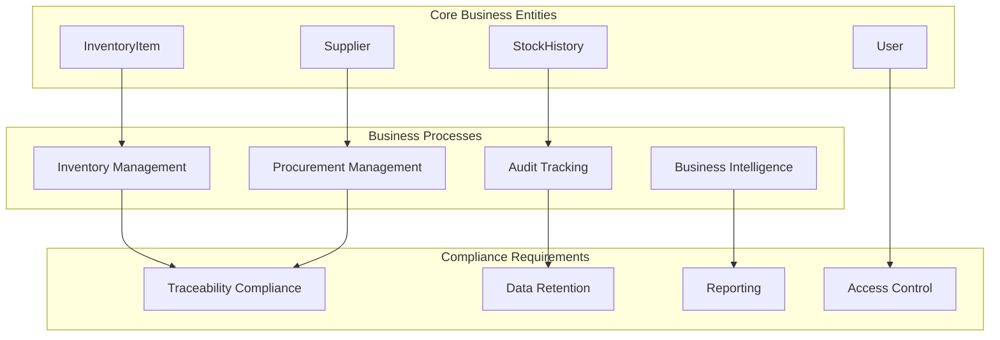

# Enterprise Test Patterns & Best Practices

**Supply Chain Domain Testing - Business Context Integration**

---

## 🏢 **Enterprise Domain Context**

### **Supply Chain Business Model**


### **Business Context Testing Philosophy**
> **"Every test must justify its existence through business value"**

- **Procurement Protection**: Tests validate critical supplier workflows
- **Supply Chain Integrity**: Tests ensure data consistency across operations
- **Compliance Assurance**: Tests verify audit trail and regulatory requirements
- **Operational Transparency**: Tests maintain visibility for stakeholder confidence

---

## 🎯 **Enterprise Test Patterns**

### **1. Business Process Validation Pattern**

#### **Pattern Structure**
```java
/**
 * ENTERPRISE CONTEXT: {Business Process Name}
 * BUSINESS VALUE: {Why this test protects business operations}
 * COMPLIANCE: {Regulatory or policy requirement addressed}
 * 
 * GIVEN: {Business scenario setup}
 * WHEN: {Business action performed}
 * THEN: {Expected business outcome}
 */
@Test
void shouldProtect{BusinessProcess}() {
    // Test implementation with business context
}
```

#### **Example Implementation**
```java
/**
 * ENTERPRISE CONTEXT: Procurement Workflow Protection
 * BUSINESS VALUE: Prevents disruption of critical supplier relationships 
 *                 that could impact production schedules
 * COMPLIANCE: Supply chain traceability requirements (ISO 9001)
 * 
 * GIVEN: An authenticated admin user attempts to delete an active supplier
 * WHEN: The supplier has existing inventory dependencies
 * THEN: The system must prevent deletion to maintain supply chain integrity
 */
@Test
@WithMockAdmin
void shouldProtectProcurementWorkflowWhenDeletingActiveSupplier() throws Exception {
    // Arrange: Setup supplier with dependencies
    Long supplierId = 1L;
    when(supplierService.deleteSupplier(supplierId))
        .thenThrow(new SupplierDeletionException("Cannot delete supplier with active inventory"));
    
    // Act & Assert: Verify protection mechanism
    mockMvc.perform(delete("/api/suppliers/{id}", supplierId)
        .with(user("admin").roles("ADMIN")))
        .andExpect(status().isConflict())
        .andExpect(jsonPath("$.message", 
                   containsString("Cannot delete supplier with active inventory")));
    
    // Verify business rule enforcement
    verify(supplierService).deleteSupplier(supplierId);
}
```

### **2. Role-Based Business Authority Pattern**

#### **Pattern Structure**
```java
/**
 * ENTERPRISE CONTEXT: {Authority/Permission Context}
 * BUSINESS JUSTIFICATION: {Why role restriction protects business}
 * 
 * Tests both allowed and denied scenarios for business context
 */
@ParameterizedTest
@EnumSource(UserRole.class)
void shouldEnforce{BusinessFunction}AuthorityFor(UserRole role) {
    // Role-based business authority testing
}
```

#### **Example Implementation**
```java
/**
 * ENTERPRISE CONTEXT: Strategic Analytics Access Control
 * BUSINESS JUSTIFICATION: Business intelligence data contains sensitive
 *                        competitive information that must be restricted
 *                        to authorized decision-makers only
 */
@Test
void shouldEnforceStrategicAnalyticsAccessControl() throws Exception {
    // Test USER role (should be denied)
    mockMvc.perform(get("/api/analytics/strategic-metrics")
        .with(user("regularuser").roles("USER")))
        .andExpect(status().isForbidden())
        .andExpect(jsonPath("$.message", 
                   containsString("Insufficient privileges for strategic analytics")));
    
    // Test ADMIN role (should be allowed)
    when(analyticsService.getStrategicMetrics(any()))
        .thenReturn(createMockStrategicMetrics());
        
    mockMvc.perform(get("/api/analytics/strategic-metrics")
        .with(user("admin").roles("ADMIN")))
        .andExpect(status().isOk())
        .andExpect(jsonPath("$.revenue.total", notNullValue()))
        .andExpect(jsonPath("$.profitMargins", notNullValue()));
}
```

### **3. Data Integrity Validation Pattern**

#### **Pattern Structure**
```java
/**
 * ENTERPRISE CONTEXT: Data Integrity Enforcement
 * BUSINESS IMPACT: {Consequences of data corruption}
 * PREVENTION: {How test prevents business data issues}
 */
@Test
void shouldEnforce{DataConstraint}ForBusinessIntegrity() {
    // Data validation testing with business context
}
```

#### **Example Implementation**
```java
/**
 * ENTERPRISE CONTEXT: Supplier Data Integrity Enforcement
 * BUSINESS IMPACT: Corrupted supplier data leads to procurement failures,
 *                  delivery delays, and customer satisfaction issues
 * PREVENTION: Validates all required business data before persistence
 */
@Test
void shouldEnforceSupplierDataIntegrityForBusinessReliability() throws Exception {
    // Test missing critical business information
    SupplierDTO invalidSupplier = SupplierDTO.builder()
        .name("")  // Missing: Business name required for procurement
        .contactInfo(ContactInfoDTO.builder()
            .email("invalid-email")  // Invalid: Corrupts communication
            .build())
        .address(null)  // Missing: Required for delivery logistics
        .build();
    
    mockMvc.perform(post("/api/suppliers")
        .contentType(MediaType.APPLICATION_JSON)
        .content(objectMapper.writeValueAsString(invalidSupplier))
        .with(user("admin").roles("ADMIN")))
        .andExpect(status().isBadRequest())
        .andExpect(jsonPath("$.errors[?(@.field == 'name')].message",
                   hasItem("Supplier name is required for procurement tracking")))
        .andExpect(jsonPath("$.errors[?(@.field == 'contactInfo.email')].message",
                   hasItem("Valid email required for supplier communication")))
        .andExpect(jsonPath("$.errors[?(@.field == 'address')].message",
                   hasItem("Address required for delivery logistics")));
}
```

### **4. Audit Trail Compliance Pattern**

#### **Pattern Structure**
```java
/**
 * ENTERPRISE CONTEXT: Audit Trail Compliance
 * REGULATORY: {Specific compliance requirement}
 * BUSINESS VALUE: {How audit trail protects business}
 */
@Test
void shouldMaintain{AuditType}ForCompliance() {
    // Audit trail validation testing
}
```

#### **Example Implementation**
```java
/**
 * ENTERPRISE CONTEXT: Stock Movement Audit Trail Compliance
 * REGULATORY: SOX compliance requires complete inventory movement tracking
 * BUSINESS VALUE: Enables financial reconciliation and fraud prevention,
 *                protects against inventory shrinkage claims
 */
@Test
void shouldMaintainStockMovementAuditTrailForCompliance() throws Exception {
    // Setup audit trail data
    LocalDateTime startDate = LocalDateTime.of(2025, 1, 1, 0, 0);
    LocalDateTime endDate = LocalDateTime.of(2025, 12, 31, 23, 59);
    
    List<StockHistoryDTO> auditTrail = Arrays.asList(
        createStockHistoryEntry("INBOUND", "Supplier delivery", startDate.plusDays(1)),
        createStockHistoryEntry("OUTBOUND", "Customer order", startDate.plusDays(15)),
        createStockHistoryEntry("ADJUSTMENT", "Inventory count", startDate.plusDays(30))
    );
    
    when(stockHistoryService.getStockHistory(any(), any(), any()))
        .thenReturn(auditTrail);
    
    // Verify complete audit trail accessibility
    mockMvc.perform(get("/api/stock-history")
        .param("startDate", startDate.toString())
        .param("endDate", endDate.toString())
        .param("itemId", "12345")
        .with(user("auditor").roles("USER", "AUDITOR")))
        .andExpect(status().isOk())
        .andExpect(jsonPath("$", hasSize(3)))
        .andExpect(jsonPath("$[0].movementType", is("INBOUND")))
        .andExpect(jsonPath("$[0].reason", containsString("Supplier delivery")))
        .andExpect(jsonPath("$[1].movementType", is("OUTBOUND")))
        .andExpect(jsonPath("$[2].movementType", is("ADJUSTMENT")));
    
    // Verify audit trail completeness
    verify(stockHistoryService).getStockHistory(eq(startDate), eq(endDate), eq("12345"));
}
```

---

## 🔒 **Security Testing Enterprise Patterns**

### **Multi-Role Business Scenario Testing**

#### **Supply Chain Role Matrix**
```java
public enum SupplyChainRole {
    PROCUREMENT_MANAGER("Manages supplier relationships", List.of("SUPPLIER_READ", "SUPPLIER_WRITE")),
    INVENTORY_ANALYST("Analyzes stock levels", List.of("INVENTORY_READ", "ANALYTICS_READ")),
    OPERATIONS_DIRECTOR("Strategic oversight", List.of("ALL_READ", "ANALYTICS_ADMIN")),
    AUDITOR("Compliance verification", List.of("AUDIT_READ", "HISTORY_READ"));
    
    private final String businessFunction;
    private final List<String> authorities;
}
```

#### **Role-Based Business Testing**
```java
/**
 * ENTERPRISE CONTEXT: Supply Chain Role-Based Access Control
 * BUSINESS JUSTIFICATION: Different roles need different data access levels
 *                        to perform their business functions effectively
 *                        while maintaining data security
 */
@ParameterizedTest
@EnumSource(SupplyChainRole.class)
void shouldEnforceRoleBasedAccessForSupplyChainOperations(SupplyChainRole role) throws Exception {
    // Configure role-specific expectations
    switch (role) {
        case PROCUREMENT_MANAGER:
            mockMvc.perform(get("/api/suppliers")
                .with(user("procurementmgr").authorities(role.getAuthorities())))
                .andExpect(status().isOk());
            break;
            
        case INVENTORY_ANALYST:
            mockMvc.perform(get("/api/analytics/inventory")
                .with(user("analyst").authorities(role.getAuthorities())))
                .andExpect(status().isOk());
            break;
            
        case AUDITOR:
            mockMvc.perform(get("/api/stock-history")
                .with(user("auditor").authorities(role.getAuthorities())))
                .andExpect(status().isOk());
            break;
            
        default:
            // Test access denial for inappropriate operations
            mockMvc.perform(delete("/api/suppliers/1")
                .with(user("user").authorities(role.getAuthorities())))
                .andExpected(status().isForbidden());
    }
}
```

---

## 📊 **Performance Testing Enterprise Patterns**

### **Business SLA Validation Pattern**

#### **Performance Requirements by Business Function**
```java
public class BusinessSLARequirements {
    public static final Duration SUPPLIER_LOOKUP_SLA = Duration.ofMillis(200);
    public static final Duration ANALYTICS_GENERATION_SLA = Duration.ofSeconds(5);
    public static final Duration AUDIT_QUERY_SLA = Duration.ofSeconds(2);
    public static final Duration INVENTORY_UPDATE_SLA = Duration.ofMillis(500);
}
```

#### **SLA Compliance Testing**
```java
/**
 * ENTERPRISE CONTEXT: Supplier Lookup Performance SLA
 * BUSINESS IMPACT: Slow supplier lookups delay procurement decisions,
 *                 impacting production schedules and customer commitments
 * SLA REQUIREMENT: 200ms response time for supplier search operations
 */
@Test
@Timeout(value = 200, unit = TimeUnit.MILLISECONDS)
void shouldMeetSupplierLookupSLAForProcurementEfficiency() throws Exception {
    // Setup performance test data
    when(supplierService.searchSuppliers(any()))
        .thenReturn(createLargeSupplierDataset(1000));
    
    // Measure performance under business load
    long startTime = System.currentTimeMillis();
    
    mockMvc.perform(get("/api/suppliers/search")
        .param("query", "electronics")
        .param("region", "north-america")
        .with(user("procurementmgr").roles("PROCUREMENT")))
        .andExpect(status().isOk())
        .andExpect(jsonPath("$.content", hasSize(greaterThan(0))));
    
    long duration = System.currentTimeMillis() - startTime;
    assertTrue(duration < 200, 
        "Supplier lookup exceeded SLA: " + duration + "ms > 200ms");
}
```

### **Load Testing for Business Scenarios**

#### **Peak Business Period Simulation**
```java
/**
 * ENTERPRISE CONTEXT: End-of-Quarter Analytics Load Testing
 * BUSINESS SCENARIO: Financial close requires simultaneous analytics access
 *                   by multiple stakeholders (CFO, operations, procurement)
 * PERFORMANCE REQUIREMENT: System must handle 50 concurrent analytics requests
 */
@Test
void shouldHandleEndOfQuarterAnalyticsLoad() throws Exception {
    int concurrentUsers = 50;
    ExecutorService executor = Executors.newFixedThreadPool(concurrentUsers);
    CountDownLatch latch = new CountDownLatch(concurrentUsers);
    AtomicInteger successCount = new AtomicInteger(0);
    AtomicInteger failureCount = new AtomicInteger(0);
    
    // Simulate concurrent business users
    for (int i = 0; i < concurrentUsers; i++) {
        final int userId = i;
        executor.submit(() -> {
            try {
                mockMvc.perform(get("/api/analytics/quarterly-summary")
                    .param("quarter", "Q4")
                    .param("year", "2025")
                    .with(user("user" + userId).roles("ANALYST")))
                    .andExpect(status().isOk());
                    
                successCount.incrementAndGet();
            } catch (Exception e) {
                failureCount.incrementAndGet();
                System.err.println("Load test failure for user " + userId + ": " + e.getMessage());
            } finally {
                latch.countDown();
            }
        });
    }
    
    // Verify business load handling
    assertTrue(latch.await(30, TimeUnit.SECONDS), 
        "Load test did not complete within business acceptable timeframe");
    
    double successRate = (double) successCount.get() / concurrentUsers;
    assertTrue(successRate >= 0.95, 
        "Success rate " + successRate + " below business requirement of 95%");
}
```

---

## 🧪 **Data-Driven Testing Enterprise Patterns**

### **Business Scenario Test Data**

#### **Realistic Business Data Factory**
```java
public class EnterpriseTestDataFactory {
    
    public static class SupplierScenarios {
        public static SupplierDTO createTier1Supplier() {
            return SupplierDTO.builder()
                .name("GlobalTech Solutions")
                .tier("TIER_1")
                .contactInfo(ContactInfoDTO.builder()
                    .email("procurement@globaltech.com")
                    .phone("+1-800-555-TECH")
                    .businessHours("8AM-6PM EST")
                    .build())
                .certifications(List.of("ISO9001", "AS9100", "ITAR"))
                .paymentTerms("NET30")
                .minimumOrderValue(BigDecimal.valueOf(10000))
                .build();
        }
        
        public static SupplierDTO createRegionalSupplier() {
            return SupplierDTO.builder()
                .name("Regional Components Inc")
                .tier("TIER_2")
                .contactInfo(ContactInfoDTO.builder()
                    .email("orders@regionalcomp.com")
                    .phone("+1-555-REGIONAL")
                    .build())
                .paymentTerms("NET15")
                .minimumOrderValue(BigDecimal.valueOf(1000))
                .build();
        }
    }
    
    public static class InventoryScenarios {
        public static InventoryItemDTO createHighVolumeItem() {
            return InventoryItemDTO.builder()
                .sku("HV-ELECTRONICS-001")
                .name("High-Volume Electronic Component")
                .category("ELECTRONICS")
                .currentStock(10000)
                .reorderPoint(2000)
                .maxStock(50000)
                .unitCost(BigDecimal.valueOf(2.50))
                .supplier(SupplierScenarios.createTier1Supplier())
                .build();
        }
        
        public static InventoryItemDTO createCriticalItem() {
            return InventoryItemDTO.builder()
                .sku("CRIT-SAFETY-001")
                .name("Critical Safety Component")
                .category("SAFETY")
                .currentStock(50)
                .reorderPoint(20)
                .maxStock(200)
                .unitCost(BigDecimal.valueOf(125.00))
                .criticality("HIGH")
                .supplier(SupplierScenarios.createTier1Supplier())
                .build();
        }
    }
}
```

#### **Business Scenario Driven Tests**
```java
/**
 * ENTERPRISE CONTEXT: Critical Inventory Management
 * BUSINESS SCENARIO: Safety-critical components require special handling
 * COMPLIANCE: FDA/FAA requirements for safety component traceability
 */
@Test
void shouldEnforceCriticalInventoryBusinessRules() throws Exception {
    // Arrange: Critical safety component scenario
    InventoryItemDTO criticalItem = EnterpriseTestDataFactory
        .InventoryScenarios.createCriticalItem();
    
    when(inventoryService.updateInventoryItem(any(), any()))
        .thenAnswer(invocation -> {
            InventoryItemDTO item = invocation.getArgument(1);
            // Business rule: Critical items require additional validation
            if ("HIGH".equals(item.getCriticality()) && item.getCurrentStock() < item.getReorderPoint()) {
                throw new CriticalInventoryException("Critical item below reorder point requires immediate attention");
            }
            return item;
        });
    
    // Act & Assert: Test critical inventory business rule
    criticalItem.setCurrentStock(10); // Below reorder point of 20
    
    mockMvc.perform(put("/api/inventory/{id}", criticalItem.getId())
        .contentType(MediaType.APPLICATION_JSON)
        .content(objectMapper.writeValueAsString(criticalItem))
        .with(user("inventorymgr").roles("INVENTORY_MANAGER")))
        .andExpect(status().isConflict())
        .andExpect(jsonPath("$.message", 
                   containsString("Critical item below reorder point requires immediate attention")))
        .andExpect(jsonPath("$.errorCode", is("CRITICAL_INVENTORY_ALERT")));
}
```

---

## 📝 **Documentation Integration Patterns**

### **Living Documentation Pattern**

#### **Test-Driven API Documentation**
```java
/**
 * ENTERPRISE API DOCUMENTATION: Supplier Management Endpoint
 * 
 * BUSINESS PURPOSE: Enables procurement teams to manage supplier relationships
 * AUTHORIZATION: ADMIN role required for supplier modifications
 * RATE LIMIT: 100 requests/minute per user
 * 
 * @apiNote This test serves as living documentation for the supplier API
 * @businessContext Supplier management is critical for procurement workflow
 * @complianceNote All supplier changes are audit logged per SOX requirements
 */
@Test
@DisplayName("POST /api/suppliers - Create new supplier (Business Documentation)")
void shouldCreateSupplierWithBusinessDocumentation() throws Exception {
    // Given: Valid supplier business data
    SupplierDTO supplierRequest = EnterpriseTestDataFactory
        .SupplierScenarios.createTier1Supplier();
        
    SupplierDTO supplierResponse = supplierRequest.toBuilder()
        .id(1L)
        .createdDate(LocalDateTime.now())
        .status("ACTIVE")
        .build();
    
    when(supplierService.createSupplier(any())).thenReturn(supplierResponse);
    
    // When: Admin creates supplier
    // Then: Supplier created with business metadata
    mockMvc.perform(post("/api/suppliers")
        .contentType(MediaType.APPLICATION_JSON)
        .content(objectMapper.writeValueAsString(supplierRequest))
        .with(user("admin").roles("ADMIN")))
        .andExpect(status().isCreated())
        .andExpect(header().exists("Location"))
        .andExpect(jsonPath("$.id", notNullValue()))
        .andExpect(jsonPath("$.name", is("GlobalTech Solutions")))
        .andExpect(jsonPath("$.tier", is("TIER_1")))
        .andExpect(jsonPath("$.status", is("ACTIVE")))
        .andExpect(jsonPath("$.createdDate", notNullValue()))
        // Business validation
        .andExpect(jsonPath("$.certifications", hasItem("ISO9001")))
        .andExpect(jsonPath("$.paymentTerms", is("NET30")))
        .andExpect(jsonPath("$.minimumOrderValue", is(10000)));
        
    // Verify business process execution
    verify(supplierService).createSupplier(argThat(supplier -> 
        "GlobalTech Solutions".equals(supplier.getName()) &&
        "TIER_1".equals(supplier.getTier())
    ));
}
```

### **Cross-Reference Integration**

#### **Test Relationship Documentation**
```java
/**
 * CROSS-REFERENCE DOCUMENTATION
 * 
 * Related Tests:
 * @see SupplierServiceTest#shouldCreateSupplierWithValidation() - Service layer validation
 * @see SupplierIntegrationTest#shouldPersistSupplierToDatabase() - Database integration
 * @see SecuritySmokeTest#shouldEnforceSupplierEndpointSecurity() - Security validation
 * 
 * Related Business Processes:
 * @businessProcess ProcurementWorkflow - Supplier onboarding
 * @businessProcess InventoryManagement - Supplier-inventory relationships
 * @businessProcess ComplianceAudit - Supplier audit requirements
 * 
 * Monitoring & Alerting:
 * @metric supplier.creation.count - Business metric for supplier onboarding
 * @alert supplier.creation.failure - Alert on supplier creation failures
 */
@Test
void shouldMaintainCrossLayerSupplierConsistency() {
    // Implementation with cross-reference context
}
```

---

*Enterprise Test Patterns & Best Practices - Supply Chain Domain Integration*  
*Updated: October 2025 | Version: 1.0*