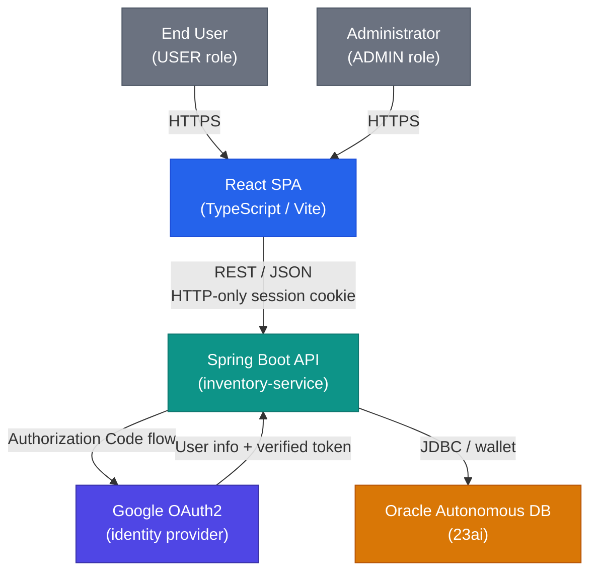

# §3 Context & Scope

## Business Context

Smart Supply Pro (SSP) is a full-stack inventory management system for small-to-medium
businesses. It lets authorised staff track stock levels, manage supplier relationships,
and analyse purchasing trends in real time. Two roles interact with the system: `USER`
(view inventory, record stock movements) and `ADMIN` (full CRUD over suppliers and
inventory items, financial analytics).

## Technical Context

| External System | Role | Integration |
|---|---|---|
| React SPA (frontend) | Primary client — all user interaction | REST over HTTPS, **cross-origin** (Koyeb → Fly.io); HTTP-only session cookie with `SameSite=None; Secure` |
| Google OAuth2 | Identity provider | Authorization Code flow; backend exchanges code for token server-to-server; no token is stored or forwarded to the frontend |
| Oracle Autonomous Database 23ai | Persistent store | JDBC via wallet authentication (`cwallet.sso`, `TNS_ADMIN` at runtime); H2 in Oracle-compatibility mode for local dev and CI |

## Context Diagram (C4 Level 1)

## System Boundary

**Inside** (owned and deployed by this project):

- Spring Boot backend (`/src`) — REST API, business logic, security, persistence
- React frontend (`/frontend`) — SPA served as a static build behind Nginx on Koyeb

**Outside** (external, not controlled by this project):

- Google OAuth2 — user identity and token issuance
- Oracle Cloud — database hosting and automated backup
- Fly.io / Nginx — container runtime and reverse proxy (see [§7](07-deployment.md))

## Key Integration Facts

- **Token handling**: the OAuth2 code exchange is backend-to-backend; the frontend
  never receives or stores a token. The backend issues an HTTP-only, `SameSite=None;
  Secure` session cookie; the browser includes it automatically on every subsequent
  request.
- **Cross-origin in production**: the SPA on Koyeb calls the Fly.io origin directly
  (`VITE_API_BASE`), so CORS allow-lists the Koyeb origin and the session cookie uses
  `SameSite=None; Secure` — see [ADR 0007](09-decisions/adr-0007-cross-origin-auth-cookie.md).
  Koyeb's Nginx also ships proxy locations for `/api/` and the OAuth2 paths, providing
  a same-origin fallback topology that the deployed SPA does not currently use.
- **Local development**: Vite's dev server proxies `/api` to `localhost:8080`; Spring
  Security CORS is enabled for `localhost:3000` only in the default profile.
- **Demo mode**: `AppProperties.demoReadonly` allows unauthenticated read-only access
  without removing `@PreAuthorize` from any endpoint — the flag is evaluated inside
  the SpEL expression, not by bypassing the security filter chain.
