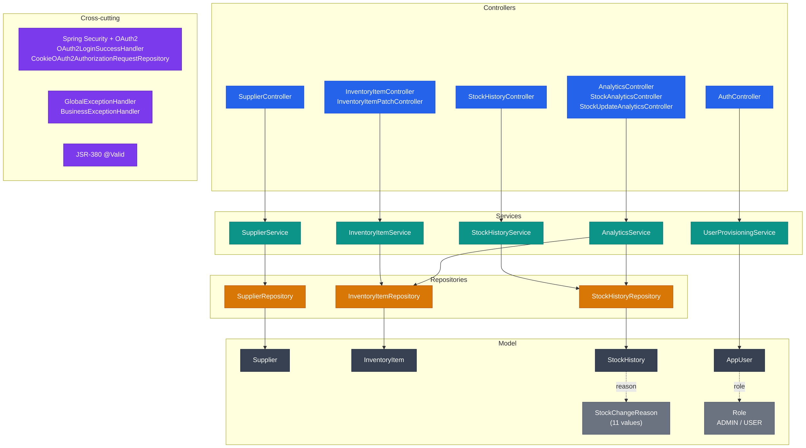
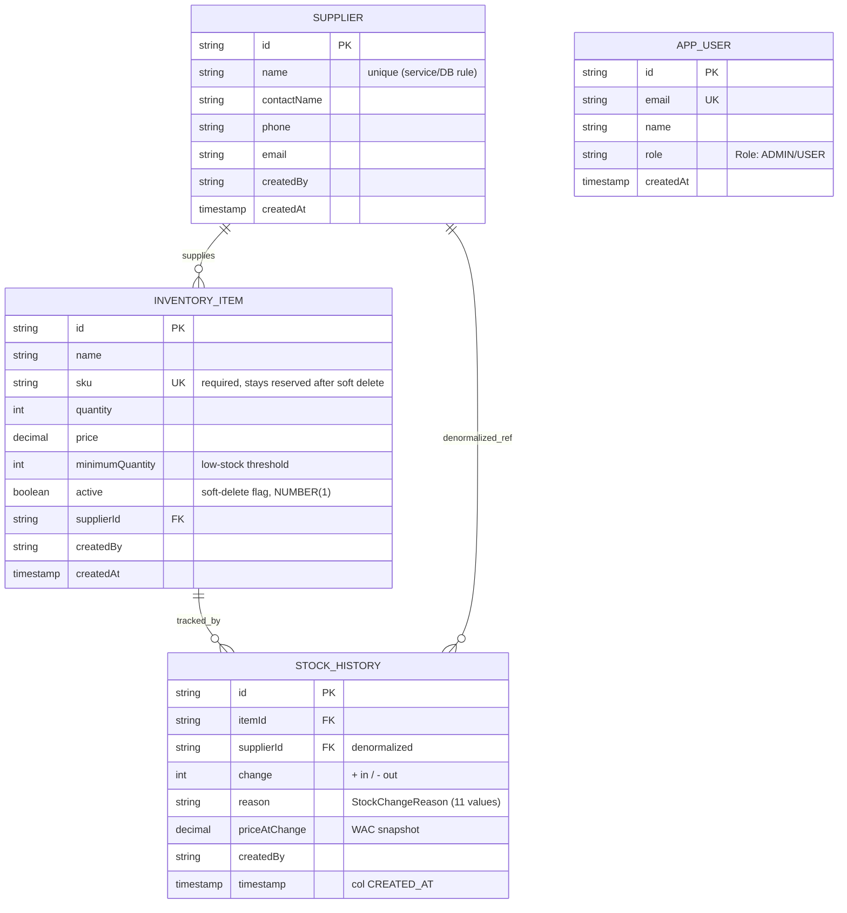

# §5 Building Block View

## Controller Layer

Eleven `@RestController` classes form the HTTP boundary, grouped by domain path; a
twelfth class, `RootRedirectController`, is a plain `@Controller` that redirects the
site root.

| Controller | Base path | Responsibility |
|---|---|---|
| `SupplierController` | `/api/suppliers` | Full supplier CRUD |
| `InventoryItemController` | `/api/inventory` | Create, read, delete, list |
| `InventoryItemPatchController` | `/api/inventory` | Price and quantity patch operations (kept separate to keep each class focused) |
| `StockHistoryController` | `/api/stock-history` | Paginated read and search |
| `AnalyticsController` | `/api/analytics` | Dashboard and financial summaries |
| `StockAnalyticsController` | `/api/analytics` | Stock-per-supplier, low-stock, movement |
| `StockUpdateAnalyticsController` | `/api/analytics` | Stock update query and post |
| `StockReasonAnalyticsController` | `/api/analytics` | Update-reason breakdown |
| `EmployeeAnalyticsController` | `/api/analytics` | Per-employee update analytics |
| `HealthCheckController` | `/api/health` | Application and database health |
| `AuthController` | `/api` | `/auth/me` and logout |
| `RootRedirectController` | `/` | Site-root redirect (plain `@Controller`) |

The health endpoint runs the database ping live on every request (503 when it fails,
designed for Oracle Free Tier auto-pausing); only the JDBC product name is cached
after the first successful ping. Every mutating endpoint carries `@PreAuthorize`;
inbound DTOs are validated with JSR-380 (`@Valid`) before reaching the service layer.
Controllers perform DTO conversion and response building — no business logic lives
here.

## Service Layer

Business logic and transaction boundaries live in the service tier. All service
interfaces are constructor-injected; every state-mutating operation is wrapped in
`@Transactional`.

| Service | Responsibility |
|---|---|
| `SupplierService` | Supplier business rules and orchestration |
| `InventoryItemService` | Item lifecycle, uniqueness, soft-delete gating |
| `StockHistoryService` | Audit-trail writes and paginated reads |
| `AnalyticsService` (`AnalyticsServiceImpl`) | Facade over the analytics sub-services |
| `StockAnalyticsService` | Stock-movement calculations (sub-service) |
| `FinancialAnalyticsService` | Weighted-average-cost (WAC) calculations (sub-service) |
| `UserProvisioningService` | Single authoritative OAuth2 provisioner |

`UserProvisioningService` is called at token load by `CustomOAuth2UserService` and
`CustomOidcUserService`; it finds or creates the user and heals the role against the
admin allow-list on every login.

## Repository Layer

| Repository | Kind | Notes |
|---|---|---|
| `SupplierRepository` | Spring Data JPA | Core domain |
| `InventoryItemRepository` | Spring Data JPA | `@EntityGraph(attributePaths = {"supplier"})` on `findAll()` and `searchActiveItems()` eager-loads the supplier in one JOIN, preventing N+1 on the two hot list paths |
| `StockHistoryRepository` | Spring Data JPA | Core domain |
| `AppUserRepository` | Spring Data JPA | Written only by `UserProvisioningService`; read by `AuthController` (`/auth/me`) and `EmployeeAnalyticsService` (display names); outside the domain mutation flow |
| `StockDetailQueryRepository` + `Impl` | Custom analytics | Dialect-specific SQL |
| `StockMetricsRepository` + `Impl` | Custom analytics | Dialect-specific SQL; static `StockMetricsSqlBuilder` |
| `StockTrendAnalyticsRepository` + `Impl` | Custom analytics | Dialect-specific SQL |

The three custom analytics implementations handle aggregations that exceed what JPQL
can express cleanly, backed by dedicated SQL builders in `repository/custom/util/`.
They build dialect-specific SQL (H2 in tests, Oracle in prod) selected at runtime via
`DatabaseDialectDetector`, and return either raw `Object[]` tuples mapped to DTOs in
the service layer or, in two cases, typed projections (`StockEventRowDTO`,
`PriceTrendDTO`). See ADR-0006.

## Model Layer

| Entity | Table | Typed fields |
|---|---|---|
| `Supplier` | `SUPPLIER` | — |
| `InventoryItem` | `INVENTORY_ITEM` | `active` flag (soft delete) |
| `StockHistory` | `STOCK_HISTORY` | `reason`: `StockChangeReason` (11 values, stored as `STRING`) |
| `AppUser` | `users_app` | `role`: `Role` (`ADMIN` / `USER`, stored as `STRING`) |

All entities carry exactly two audit fields: `createdBy` (plain `String`, not a FK)
and `createdAt` (`LocalDateTime`). There is no `@Version`, no optimistic locking, and
no `updatedAt`.

## Cross-cutting

| Component | Role |
|---|---|
| `SecurityConfig` + `SecurityFilterHelper`, `SecurityAuthorizationHelper`, `SecurityEntryPointHelper` | Spring Security filter chain, OAuth2 login, CORS |
| `OAuth2LoginSuccessHandler` | Post-login redirect (provisioning already happened at token load in the user services) |
| `CookieOAuth2AuthorizationRequestRepository` | Serialises OAuth2 state into an HTTP-only cookie |
| `GlobalExceptionHandler` | `@ControllerAdvice` for framework exceptions |
| `BusinessExceptionHandler` | `@ControllerAdvice` for domain exceptions (`DuplicateResourceException`, `InvalidRequestException`) |

Both exception handlers produce a three-field `ErrorResponse`:
`{ "error": "...", "message": "...", "timestamp": "..." }` where `error` is
`HttpStatus.name().toLowerCase()`.

## Building-Block Diagram

## Domain Model (ER Diagram)

## Reference

The detailed class-level surface is documented authoritatively in two places:

- **HTTP API surface** (endpoints, request/response DTOs, the `StockChangeReason` enum, error responses) — see the [OpenAPI specification](../api/index.html).
- **Internal structure** (entities, repositories, cross-cutting concerns) — documented in the sections above: [Model Layer](#model-layer), [Repository Layer](#repository-layer), and [Cross-cutting](#cross-cutting).
