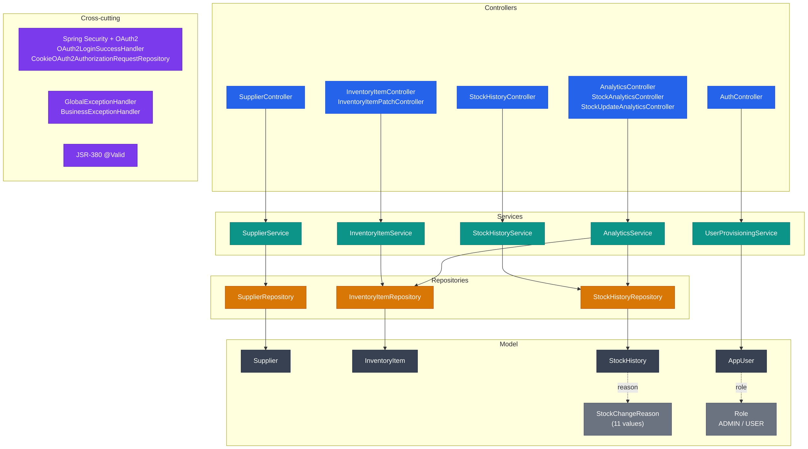
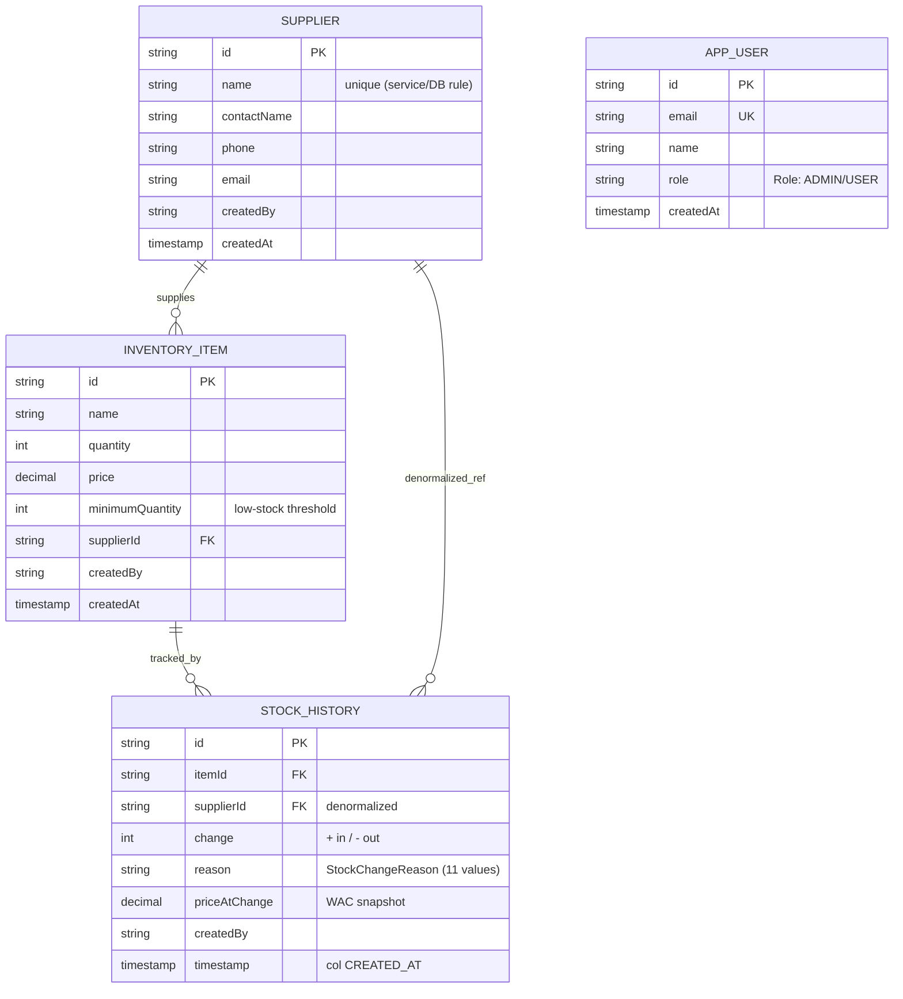

# §5 Building Block View

## Controller Layer

Eleven `@RestController` classes form the HTTP boundary, grouped by domain path (a twelfth class, `RootRedirectController`, is a plain `@Controller` that redirects the site root).
`SupplierController` (`/api/suppliers`) handles full CRUD for suppliers.
`InventoryItemController` (`/api/inventory`) handles create, read, delete, and list;
`InventoryItemPatchController` (same path) handles price and quantity patch operations
separately to keep each class focused. `StockHistoryController` (`/api/stock-history`)
exposes paginated read and search. Five analytics controllers share `/api/analytics`: `AnalyticsController` (dashboard and financial summaries), `StockAnalyticsController` (stock-per-supplier, low-stock, movement), `StockUpdateAnalyticsController` (stock update query and post), `StockReasonAnalyticsController` (update-reason breakdown), and `EmployeeAnalyticsController` (per-employee update analytics). `HealthCheckController` (`/api/health`) reports application and database health.
`AuthController` (`/api`) exposes `/auth/me` and logout.
Every mutating endpoint carries `@PreAuthorize`; inbound DTOs are validated with JSR-380
(`@Valid`) before reaching the service layer. Controllers perform DTO conversion and
response building — no business logic lives here.

## Service Layer

Business logic and transaction boundaries live in four service interfaces and their
implementations: `SupplierService`, `InventoryItemService`, `StockHistoryService`, and
`AnalyticsService` (implemented by `AnalyticsServiceImpl`, with `StockAnalyticsService`
and `FinancialAnalyticsService` as focused sub-services for WAC and stock-movement
calculations). `UserProvisioningService` is the single authoritative provisioner for OAuth2 logins: `CustomOAuth2UserService` and `CustomOidcUserService` delegate to it at token load, and it finds or creates the user and heals the role against the admin allow-list on every login. All service interfaces are constructor-injected; every
state-mutating operation is wrapped in `@Transactional`.

## Repository Layer

`SupplierRepository`, `InventoryItemRepository`, and `StockHistoryRepository` are
Spring Data JPA interfaces that cover the core domain. `InventoryItemRepository`
declares `@EntityGraph(attributePaths = {"supplier"})` on both `findAll()` and
`searchActiveItems()` to eager-load the supplier association in a single JOIN,
preventing N+1 queries on the two hot list paths. Complex analytics aggregations that
exceed what JPQL can express cleanly are handled by three custom repository
implementations: `StockDetailQueryRepositoryImpl`, `StockMetricsRepositoryImpl`, and
`StockTrendAnalyticsRepositoryImpl`, each backed by dedicated SQL builders in
`repository/custom/util/`. `AppUserRepository` is written only by
`UserProvisioningService` (OAuth2 provisioning); it is additionally read by
`AuthController` (`/auth/me`) and `EmployeeAnalyticsService` (display names), but
does not participate in the domain mutation flow.

**Analytics/reporting repositories** with custom implementations —
`StockDetailQueryRepository`, `StockMetricsRepository`,
`StockTrendAnalyticsRepository` (each with a `*Impl`), plus the static
`StockMetricsSqlBuilder` — form a distinct group. These build dialect-specific SQL
(H2 in tests, Oracle in prod) selected at runtime via `DatabaseDialectDetector`, and
return either raw `Object[]` tuples mapped to DTOs in the service layer or, in two
cases, typed projections (`StockEventRowDTO`, `PriceTrendDTO`). See ADR-0006.

## Model Layer

Four JPA entities map to Oracle tables: `Supplier` (table `SUPPLIER`), `InventoryItem`
(table `INVENTORY_ITEM`), `StockHistory` (table `STOCK_HISTORY`), and `AppUser` (table
`users_app`). All entities carry exactly two audit fields: `createdBy` (plain `String`,
not a FK) and `createdAt` (`LocalDateTime`). There is no `@Version`, no optimistic
locking, and no `updatedAt`. `StockHistory.reason` is typed as `StockChangeReason`
(11 values, stored as `STRING`); `AppUser.role` is typed as `Role` (`ADMIN` / `USER`,
stored as `STRING`).

## Cross-cutting

`SecurityConfig` and its helper split-classes (`SecurityFilterHelper`,
`SecurityAuthorizationHelper`, `SecurityEntryPointHelper`) configure the Spring Security
filter chain, OAuth2 login, and CORS. `OAuth2LoginSuccessHandler` performs the post-login redirect (provisioning already
happened at token load in the user services); `CookieOAuth2AuthorizationRequestRepository`
serialises OAuth2 state into an HTTP-only cookie. All exceptions funnel through two
`@ControllerAdvice` handlers: `GlobalExceptionHandler` for framework exceptions and
`BusinessExceptionHandler` for domain exceptions (`DuplicateResourceException`,
`InvalidRequestException`). Both produce a three-field `ErrorResponse`:
`{ "error": "...", "message": "...", "timestamp": "..." }` where `error` is
`HttpStatus.name().toLowerCase()`.

## Building-Block Diagram

## Domain Model (ER Diagram)

## Reference

The detailed class-level surface is documented authoritatively in two places:

- **HTTP API surface** (endpoints, request/response DTOs, the `StockChangeReason` enum, error responses) — see the [OpenAPI specification](../api/index.html).
- **Internal structure** (entities, repositories, cross-cutting concerns) — documented in the sections above: [Model Layer](#model-layer), [Repository Layer](#repository-layer), and [Cross-cutting](#cross-cutting).
