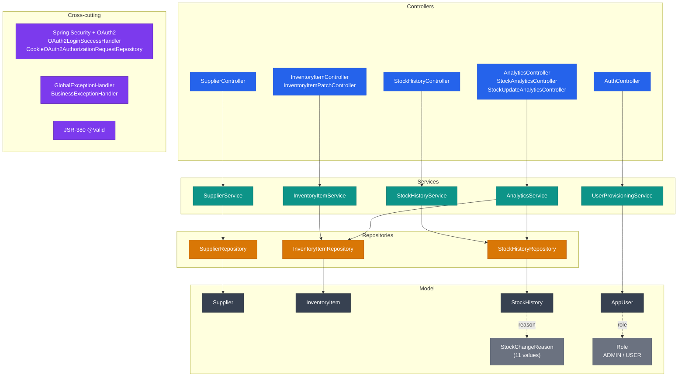
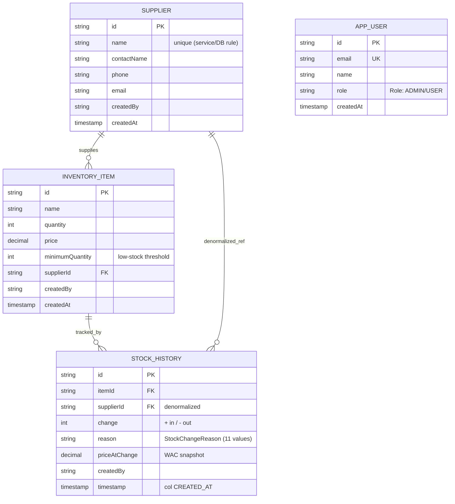

# §5 Building Block View

## Controller Layer

Eight `@RestController` classes form the HTTP boundary, grouped by domain path.
`SupplierController` (`/api/suppliers`) handles full CRUD for suppliers.
`InventoryItemController` (`/api/inventory`) handles create, read, delete, and list;
`InventoryItemPatchController` (same path) handles price and quantity patch operations
separately to keep each class focused. `StockHistoryController` (`/api/stock-history`)
exposes paginated read and search. Three analytics controllers share `/api/analytics`:
`AnalyticsController` (dashboard and financial summaries), `StockAnalyticsController`
(stock-per-supplier, low-stock, movement), and `StockUpdateAnalyticsController` (stock
update query and post). `AuthController` (`/api`) exposes `/auth/me` and logout.
Every mutating endpoint carries `@PreAuthorize`; inbound DTOs are validated with JSR-380
(`@Valid`) before reaching the service layer. Controllers perform DTO conversion and
response building — no business logic lives here.

## Service Layer

Business logic and transaction boundaries live in four service interfaces and their
implementations: `SupplierService`, `InventoryItemService`, `StockHistoryService`, and
`AnalyticsService` (implemented by `AnalyticsServiceImpl`, with `StockAnalyticsService`
and `FinancialAnalyticsService` as focused sub-services for WAC and stock-movement
calculations). `UserProvisioningService` owns the OAuth2 user-creation and
role-assignment flow on first login; `SecurityService` exposes the current principal
for `createdBy` stamping. All service interfaces are constructor-injected; every
state-mutating operation is wrapped in `@Transactional`.

## Repository Layer

`SupplierRepository`, `InventoryItemRepository`, and `StockHistoryRepository` are
Spring Data JPA interfaces that cover the core domain. `InventoryItemRepository`
declares `@EntityGraph(attributePaths = {"supplier"})` on both `findAll()` and
`findByNameSortedByPrice()` to eager-load the supplier association in a single JOIN,
preventing N+1 queries on the two hot list paths. Complex analytics aggregations that
exceed what JPQL can express cleanly are handled by three custom repository
implementations: `StockDetailQueryRepositoryImpl`, `StockMetricsRepositoryImpl`, and
`StockTrendAnalyticsRepositoryImpl`, each backed by dedicated SQL builders in
`repository/custom/util/`. `AppUserRepository` is used exclusively by
`UserProvisioningService` for OAuth2 user lookup and provisioning and does not
participate in the domain service flow.

## Model Layer

Four JPA entities map to Oracle tables: `Supplier` (table `SUPPLIER`), `InventoryItem`
(table `INVENTORY_ITEM`), `StockHistory` (table `STOCK_HISTORY`), and `AppUser` (table
`users_app`). All entities carry exactly two audit fields: `createdBy` (plain `String`,
not a FK) and `createdAt` (`LocalDateTime`). There is no `@Version`, no optimistic
locking, and no `updatedAt`. `StockHistory.reason` is typed as `StockChangeReason`
(11 values, stored as `STRING`); `AppUser.role` is typed as `Role` (`ADMIN` / `USER`,
stored as `STRING`).

## Cross-cutting

`SecurityConfig` and its helper split-classes (`SecurityFilterHelper`,
`SecurityAuthorizationHelper`, `SecurityEntryPointHelper`) configure the Spring Security
filter chain, OAuth2 login, and CORS. `OAuth2LoginSuccessHandler` delegates to
`UserProvisioningService` on first login; `CookieOAuth2AuthorizationRequestRepository`
serialises OAuth2 state into an HTTP-only cookie. All exceptions funnel through two
`@ControllerAdvice` handlers: `GlobalExceptionHandler` for framework exceptions and
`BusinessExceptionHandler` for domain exceptions (`DuplicateResourceException`,
`InvalidRequestException`). Both produce a three-field `ErrorResponse`:
`{ "error": "...", "message": "...", "timestamp": "..." }` where `error` is
`HttpStatus.name().toLowerCase()`.

## Building-Block Diagram

## Domain Model (ER Diagram)

## Reference

Class-level detail for each package — navigate down for specifics:

- [Controller reference](reference/controller/index.md)
- [DTO reference](reference/dto/index.md)
- [Model reference](reference/model/index.md)
- [Repository reference](reference/repository/index.md)
- [Config reference](reference/config/index.md)
- [Enums reference](reference/enums/index.md)
- [Exception reference](reference/exception/index.md)
- [Resources reference](reference/resources/index.md)
