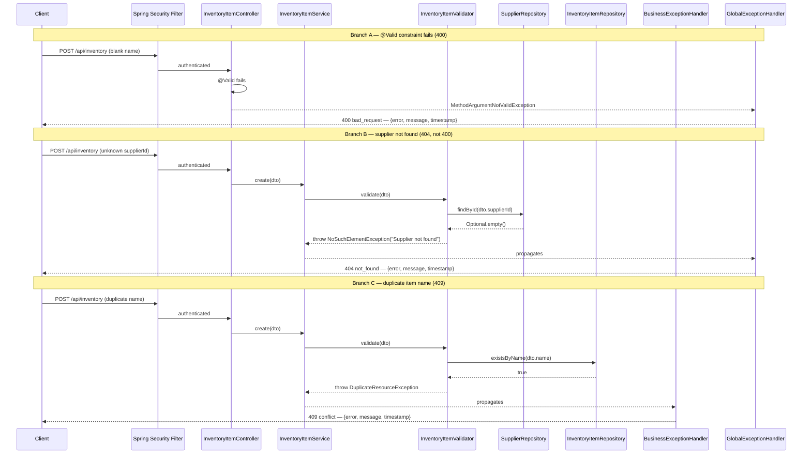

# §6 Runtime View

## Exception-to-Status Reference

Both `@ControllerAdvice` handlers produce
`{ "error": "...", "message": "...", "timestamp": "..." }`.
The `error` token is `HttpStatus.name().toLowerCase()`. There is no `correlationId`.

| Exception | Handler | Status | `error` token |
|---|---|---|---|
| `InvalidRequestException` | `BusinessExceptionHandler` | 400 | `bad_request` |
| `MethodArgumentNotValidException` | `GlobalExceptionHandler` | 400 | `bad_request` |
| `ConstraintViolationException` | `GlobalExceptionHandler` | 400 | `bad_request` |
| `AuthenticationException` | `GlobalExceptionHandler` | 401 | `unauthorized` |
| `AccessDeniedException` | `GlobalExceptionHandler` | 403 | `forbidden` |
| `NoSuchElementException` | `GlobalExceptionHandler` | **404** | `not_found` |
| `IllegalArgumentException` | `GlobalExceptionHandler` | **404** | `not_found` |
| `DuplicateResourceException` | `BusinessExceptionHandler` | 409 | `conflict` |
| `IllegalStateException` | `BusinessExceptionHandler` | 409 | `conflict` |
| `DataIntegrityViolationException` | `GlobalExceptionHandler` | 409 | `conflict` |
| `Exception` (fallback) | `GlobalExceptionHandler` | 500 | `internal_server_error` |

---

## Scenario 1a — Create Inventory Item: Happy Path

```mermaid
sequenceDiagram
    participant Client
    participant SF as Spring Security Filter
    participant IC as InventoryItemController
    participant IS as InventoryItemService
    participant IV as InventoryItemValidator
    participant SR as SupplierRepository
    participant IR as InventoryItemRepository
    participant DB as Oracle ADB

    Client->>SF: POST /api/inventory (session cookie + JSON body)
    SF->>SF: validate session; populate SecurityContext
    SF->>IC: authenticated request

    IC->>IC: @Valid — deserialise InventoryItemDTO
    IC->>IS: create(dto)
    IS->>IV: validate(dto)

    IV->>SR: findById(dto.supplierId)
    SR->>DB: SELECT SUPPLIER WHERE id=?
    DB-->>SR: Supplier row
    SR-->>IV: Optional[Supplier]

    IV->>IR: existsByName(dto.name)
    IR->>DB: SELECT COUNT WHERE name=?
    DB-->>IR: 0
    IR-->>IV: false
    IV-->>IS: validation passed

    IS->>IS: map DTO to InventoryItem; set createdBy from SecurityContext
    IS->>IR: save(item)
    IR->>DB: INSERT INTO INVENTORY_ITEM
    DB-->>IR: saved entity
    IR-->>IS: InventoryItem
    IS-->>IC: InventoryItemDTO
    IC-->>Client: 201 Created — InventoryItemDTO
```

## Scenario 1b — Create Inventory Item: Error Path

Three distinct error branches. Branch B illustrates the key correction:
`NoSuchElementException` → 404, not 400.



## Scenario 2 — OAuth2 Login

```mermaid
sequenceDiagram
    participant User
    participant Browser
    participant Backend as Spring Boot Backend
    participant CR as CookieOAuth2AuthorizationRequestRepository
    participant Google as Google OAuth2
    participant SH as OAuth2LoginSuccessHandler
    participant UPS as UserProvisioningService
    participant DB as Oracle ADB (users_app)

    User->>Browser: click "Sign in with Google"
    Browser->>Backend: GET /oauth2/authorization/google
    Backend->>CR: saveAuthorizationRequest(request, response)
    CR-->>Browser: Set-Cookie: oauth2_state (HTTP-only)
    Backend-->>Browser: 302 Redirect to Google authorization URL
    Browser->>Google: GET /o/oauth2/auth?client_id=...&state=...
    User->>Google: enter credentials
    Google-->>Browser: 302 Redirect to /login/oauth2/code/google?code=...&state=...
    Browser->>Backend: GET /login/oauth2/code/google?code=...&state=...
    Backend->>CR: removeAuthorizationRequest(request, response)
    CR-->>Backend: AuthorizationRequest (state verified)
    Backend->>Google: POST /token — exchange code (server-to-server)
    Google-->>Backend: access_token + user info (email, name)
    Backend->>SH: onAuthenticationSuccess(request, response, authentication)
    SH->>UPS: getOrCreate(oAuth2User)
    UPS->>DB: findByEmail(email)

    alt first login
        DB-->>UPS: empty
        UPS->>DB: save new AppUser (role=USER, createdAt=now)
        DB-->>UPS: AppUser
    else returning user
        DB-->>UPS: AppUser
    end

    UPS-->>SH: AppUser
    SH-->>Browser: Set-Cookie: SESSION (HTTP-only, SameSite=None; Secure — cross-origin Koyeb→Fly.io; Strict would drop it); 302 to /auth
```

## Scenario 3 — Analytics Read

```mermaid
sequenceDiagram
    participant Client
    participant SF as Spring Security Filter
    participant AC as AnalyticsController
    participant AS as AnalyticsService
    participant IR as InventoryItemRepository
    participant SMR as StockMetricsRepositoryImpl
    participant DB as Oracle ADB

    Client->>SF: GET /api/analytics/dashboard-summary (session cookie)
    SF->>SF: validate session; populate SecurityContext
    SF->>AC: authenticated (USER or ADMIN role accepted)

    AC->>AS: getDashboardSummary()

    AS->>IR: findAll() — @EntityGraph(attributePaths={"supplier"})
    IR->>DB: SELECT INVENTORY_ITEM JOIN SUPPLIER
    DB-->>IR: item + supplier rows (single query, no N+1)
    IR-->>AS: List<InventoryItem>

    AS->>SMR: aggregate low-stock count and total stock value
    SMR->>DB: native SQL over INVENTORY_ITEM and STOCK_HISTORY
    DB-->>SMR: aggregated rows
    SMR-->>AS: stock metrics

    AS->>AS: compute WAC snapshot, low-stock items, movement summary
    AS-->>AC: DashboardSummaryDTO
    AC-->>Client: 200 OK — DashboardSummaryDTO
```
