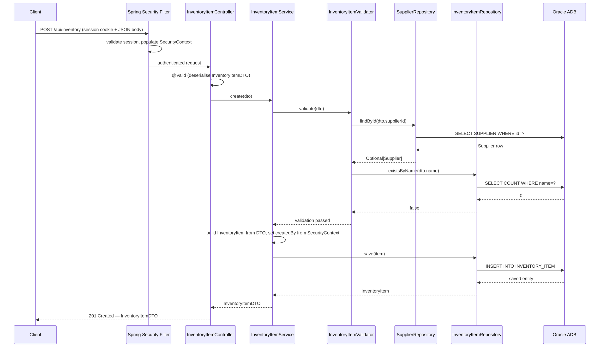
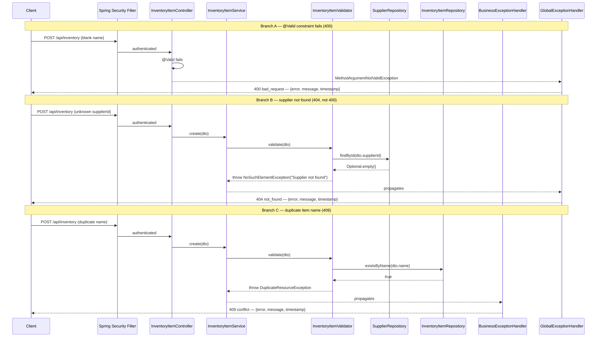
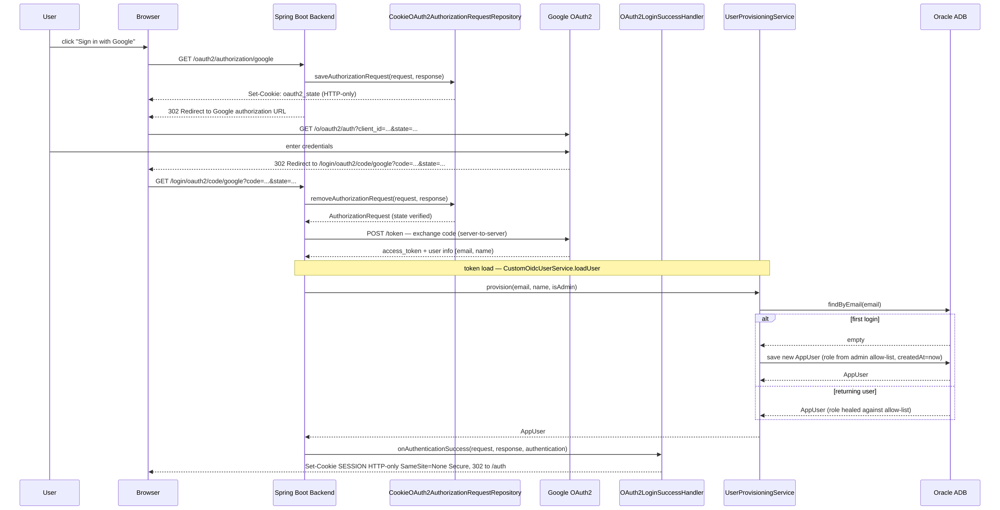
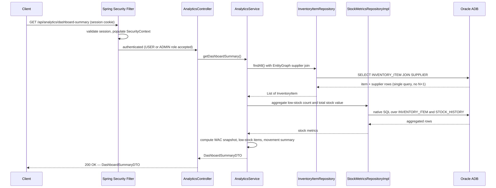
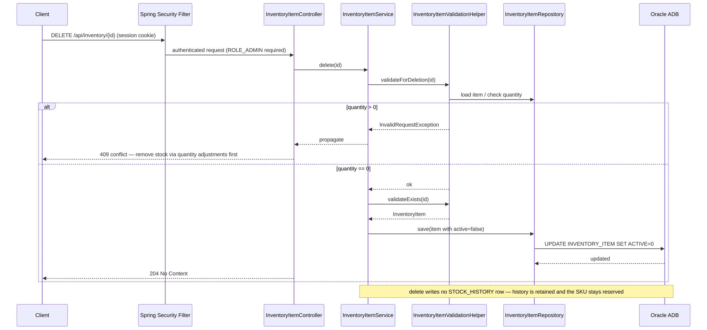

# §6 Runtime View

## Exception-to-Status Reference

Both `@ControllerAdvice` handlers produce
`{ "error": "...", "message": "...", "timestamp": "..." }`, plus an optional
`fieldErrors` map on bean-validation failures.
The `error` token is `HttpStatus.name().toLowerCase()`. There is no `correlationId`.

| Exception | Handler | Status | `error` token |
|---|---|---|---|
| `InvalidRequestException` | `BusinessExceptionHandler` | 400 | `bad_request` |
| `MethodArgumentNotValidException` | `GlobalExceptionHandler` | 400 | `bad_request` |
| `ConstraintViolationException` | `GlobalExceptionHandler` | 400 | `bad_request` |
| `AuthenticationException` | `GlobalExceptionHandler` | 401 | `unauthorized` |
| `AccessDeniedException` | `GlobalExceptionHandler` | 403 | `forbidden` |
| `NoSuchElementException` | `GlobalExceptionHandler` | **404** | `not_found` |
| `IllegalArgumentException` | `GlobalExceptionHandler` | **404** | `not_found` |
| `DuplicateResourceException` | `BusinessExceptionHandler` | 409 | `conflict` |
| `IllegalStateException` | `BusinessExceptionHandler` | 409 | `conflict` |
| `DataIntegrityViolationException` | `GlobalExceptionHandler` | 409 | `conflict` |
| `HttpMessageNotReadableException` | `GlobalExceptionHandler` | 400 | `bad_request` |
| `MissingServletRequestParameterException`, `MethodArgumentTypeMismatchException` | `GlobalExceptionHandler` | 400 | `bad_request` |
| `NoResourceFoundException` (static assets) | `GlobalExceptionHandler` | 404 | — (no body) |
| `ObjectOptimisticLockingFailureException` | `GlobalExceptionHandler` | 409 | `conflict` (defensive — unreachable today, no entity declares `@Version`) |
| `ResponseStatusException` | `GlobalExceptionHandler` | as thrown | token of the preserved status |
| `Exception` (fallback) | `GlobalExceptionHandler` | 500 | `internal_server_error` |

---

## Scenario 1a — Create Inventory Item: Happy Path

## Scenario 1b — Create Inventory Item: Error Path

Three distinct error branches. Branch B illustrates the key correction:
`NoSuchElementException` → 404, not 400.

## Scenario 2 — OAuth2 Login

## Scenario 3 — Analytics Read

## Scenario 4 — Delete Inventory Item: Soft Delete

Deletion never removes the row. A business rule gates the operation: the item must
hold zero stock, so remaining quantity is first drained through audited adjustments.
A permitted delete flips the `active` flag; all stock history survives and the item's
SKU stays reserved by the unique constraint.

