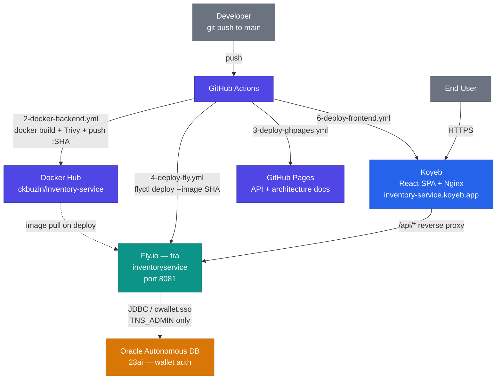
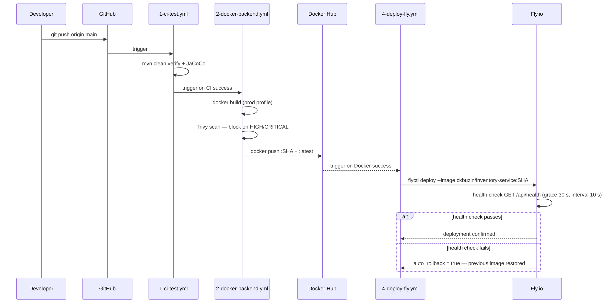

# §7 Deployment View

## Topology

The backend runs on **Fly.io** (region `fra`, Frankfurt) as a Docker container on a
`shared-cpu-1x` / 1 GB RAM machine, listening internally on port 8081. The React
frontend SPA is served by **Koyeb** (`https://inventory-service.koyeb.app`) behind
**Nginx** (`ops/nginx/`), which reverse-proxies `/api/*` to the Fly.io backend — making
the two appear same-origin to the browser so session cookies work without CORS.
Persistent data lives in **Oracle Autonomous Database 23ai**, authenticated via wallet
(no password at runtime). Architecture and API documentation are published to
**GitHub Pages** via a separate docs pipeline.

## Deployment Diagram

## CI/CD Pipeline

Seven GitHub Actions workflows run on push to `main`:

| Workflow | Purpose |
|---|---|
| `1-ci-test.yml` | `mvn clean verify` — compile, unit + integration tests, JaCoCo coverage report |
| `2-docker-backend.yml` | `docker build` (prod profile), Trivy CVE scan (blocks on HIGH/CRITICAL), `docker push :SHA :latest` to Docker Hub |
| `4-deploy-fly.yml` | `flyctl deploy --image <SHA>`, polls `GET /api/health` (5-minute timeout), auto-rollback on failure |
| `docs-pipeline.yml` | Generates OpenAPI docs (Redocly) and converts architecture markdown to HTML (Pandoc + Lua filter) |
| `3-deploy-ghpages.yml` | Publishes docs-site artifact to the `gh-pages` branch (GitHub Pages) |
| `5-frontend-ci.yml` | Vitest unit tests, Docker image build (Nginx + Vite bundle), push to Docker Hub |
| `6-deploy-frontend.yml` | Deploys built frontend to Koyeb |

### Backend Pipeline Chain

## Immutable SHA Strategy

Every Docker image is tagged with the commit SHA
(e.g., `ckbuzin/inventory-service:a1b2c3d`). `4-deploy-fly.yml` always deploys by
SHA, never by `latest`. This means:

- Any commit can be redeployed exactly by re-running `flyctl deploy --image <SHA>`.
- Rolling back is deploying the previous SHA — no rebuild required.
- The `latest` tag is a convenience alias only and is never used in production deploys.

## Runtime Environment

| Environment | Spring Profile | Database | Secret Source |
|---|---|---|---|
| Local dev | (none) | H2 in-memory | `.env` file or IDE run config |
| CI / test | `test` | H2 (Oracle-compatibility mode) | `application-test.yml` |
| Production | `prod` | Oracle Autonomous DB 23ai | Fly.io secrets vault |

`SPRING_PROFILES_ACTIVE=prod` is set in `fly.toml` `[env]`. Non-sensitive runtime
flags (`APP_DEMO_READONLY`, `APP_FRONTEND_BASE_URL`, `APP_FRONTEND_LANDING_PATH`) are
also declared in `fly.toml`. Sensitive credentials are stored exclusively as Fly.io
secrets and injected as environment variables at container start — they are never
committed to source control.

## Oracle Wallet Authentication

The production connection to Oracle Autonomous Database is **passwordless**. The Oracle
wallet (`oracle_wallet/Wallet_sspdb_fixed/cwallet.sso`) is bundled into the Docker
image. At runtime only `TNS_ADMIN` needs to point to the wallet directory — no
username/password is stored or injected. See
[ADR 0001](09-decisions/0001-oracle-wallet-autologin.md).

## Environment Variables and Secrets

| Variable | Source | Purpose |
|---|---|---|
| `SPRING_PROFILES_ACTIVE` | `fly.toml [env]` | Activates `prod` profile |
| `APP_DEMO_READONLY` | `fly.toml [env]` | Enables read-only demo mode |
| `APP_FRONTEND_BASE_URL` | `fly.toml [env]` | CORS allowed origin for Koyeb frontend |
| `TNS_ADMIN` | Fly.io secret | Path to Oracle wallet directory inside container |
| `OAUTH2_CLIENT_ID` | Fly.io secret | Google OAuth2 client ID |
| `OAUTH2_CLIENT_SECRET` | Fly.io secret | Google OAuth2 client secret |
