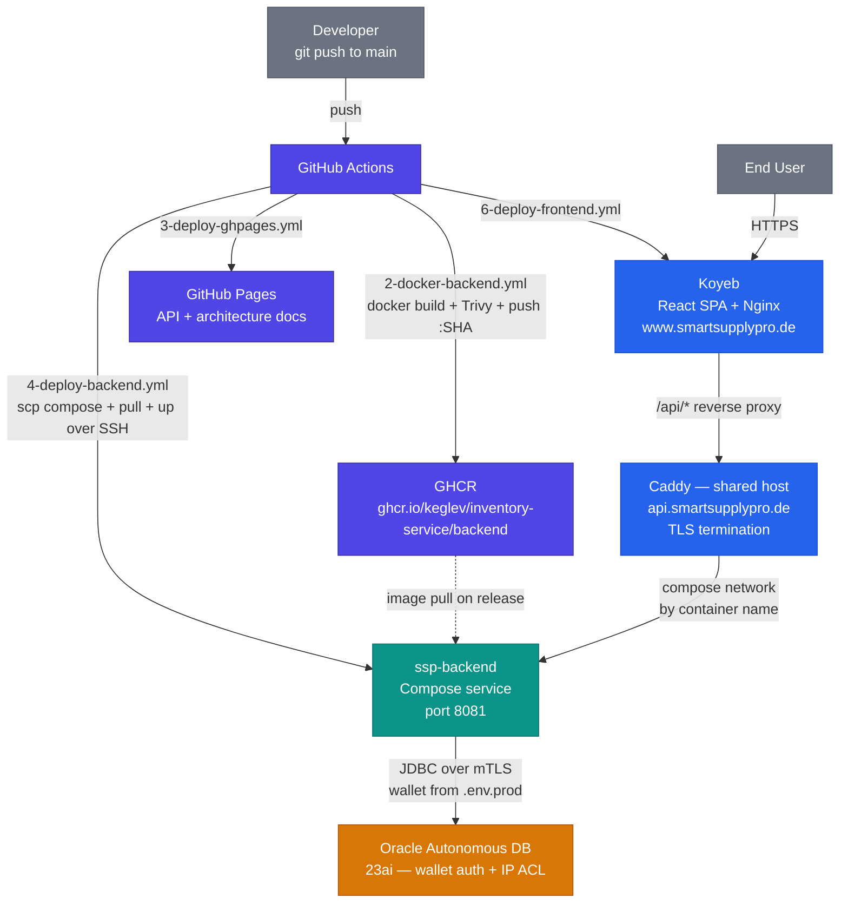

# §7 Deployment View

## Topology

The backend runs as a single **Docker Compose** service (`ssp-backend`) on a shared
**Hetzner Cloud CX33**, which also hosts the maintenance-assistant project. The
container listens internally on port 8081 and publishes no port of its own. TLS and
the public hostname `https://api.smartsupplypro.de` are terminated by the
neighbouring project's **Caddy**, which reaches the container by name over the
compose network the two projects share and forwards `X-Forwarded-Host` as the
canonical `www` origin.

The React frontend SPA is served by **Koyeb** on the project's own domain
(`https://www.smartsupplypro.de`, [ADR 0010](09-decisions/adr-0010-custom-domain-and-canonical-host.md)) behind
**Nginx** (`ops/nginx/`), which rewrites the built API base to the frontend host at
serve time (`sub_filter`) and reverse-proxies `/api/*` and the OAuth2 paths to the
backend — browser traffic is same-origin on Koyeb, with the session cookie
re-domained by the proxy. Because the API and the frontend now share a registrable
domain, the session cookie is `SameSite=Lax` rather than `SameSite=None`
([ADR 0012](09-decisions/adr-0012-backend-hosting-on-shared-hetzner-host.md); the
cross-origin reasoning it replaces is recorded in
[ADR 0007](09-decisions/adr-0007-cross-origin-auth-cookie.md)).

Persistent data lives in **Oracle Autonomous Database 23ai**, authenticated over
mTLS via an Oracle wallet delivered as a runtime secret
([ADR 0009](09-decisions/adr-0009-runtime-wallet-delivery.md)). Database access is
additionally restricted by an Oracle **IP access control list** holding the host's
static IPv4 address, so the database is reachable only from that machine.
Architecture and API documentation are published to **GitHub Pages** via a separate
docs pipeline.

**Previous hosting.** The backend previously ran on a single-tenant 1 GB VM at a
managed platform provider. The migration to the shared host, its cost and the
shared-fate trade-off it accepts are recorded in
[ADR 0012](09-decisions/adr-0012-backend-hosting-on-shared-hetzner-host.md).

## Deployment Diagram

```mermaid
graph TB
    Dev["Developer\ngit push to main"]:::actor
    GHA["GitHub Actions"]:::external
    GHCR["GHCR\nghcr.io/keglev/inventory-service/backend"]:::external
    Caddy["Caddy — shared host\napi.smartsupplypro.de\nTLS termination"]:::controller
    SSP["ssp-backend\nCompose service\nport 8081"]:::service
    OADB["Oracle Autonomous DB\n23ai — wallet auth + IP ACL"]:::repository
    Koyeb["Koyeb\nReact SPA + Nginx\nwww.smartsupplypro.de"]:::controller
    GHP["GitHub Pages\nAPI + architecture docs"]:::external
    User["End User"]:::actor

    Dev -->|push| GHA
    GHA -->|2-docker-backend.yml\ndocker build + Trivy + push :SHA| GHCR
    GHA -->|4-deploy-backend.yml\nscp compose + pull + up over SSH| SSP
    GHCR -.->|image pull on release| SSP
    GHA -->|6-deploy-frontend.yml| Koyeb
    GHA -->|3-deploy-ghpages.yml| GHP
    SSP -->|"JDBC over mTLS\nwallet from .env.prod"| OADB
    User -->|HTTPS| Koyeb
    Koyeb -->|/api/* reverse proxy| Caddy
    Caddy -->|compose network\nby container name| SSP

    classDef actor      fill:#6b7280,color:#fff,stroke:#4b5563;
    classDef controller fill:#2563eb,color:#fff,stroke:#1d4ed8;
    classDef service    fill:#0d9488,color:#fff,stroke:#0f766e;
    classDef repository fill:#d97706,color:#fff,stroke:#b45309;
    classDef external   fill:#4f46e5,color:#fff,stroke:#3730a3;
```

## CI/CD Pipeline

Eight GitHub Actions workflows make up the pipeline:

| Workflow | Purpose |
|---|---|
| `1-ci-test.yml` | `mvn clean verify` — compile, unit + integration tests, JaCoCo coverage report |
| `2-docker-backend.yml` | `docker build` (prod profile), Trivy CVE scan (blocks on HIGH/CRITICAL), `docker push :SHA :latest` to GHCR |
| `4-deploy-backend.yml` | Copies the compose file to the host over SSH, validates it, pulls the SHA-tagged image, restarts only the backend service, then runs the health and smoke checks against `api.smartsupplypro.de` |
| `docs-pipeline.yml` | Generates OpenAPI docs (Redocly), converts architecture markdown to HTML (Pandoc + Lua filter) and checks internal links |
| `docs-pr-check.yml` | Pull request gate for documentation: builds the site and verifies internal links without publishing |
| `3-deploy-ghpages.yml` | Publishes docs-site artifact to the `gh-pages` branch (GitHub Pages) |
| `5-frontend-ci.yml` | Vitest unit tests, Docker image build (Nginx + Vite bundle), push to Docker Hub |
| `6-deploy-frontend.yml` | Deploys built frontend to Koyeb |

The backend chain is strictly sequential: the image is built only after the test
suite passes, and the release runs only after the image has been scanned. There is
no direct push trigger on the image build, so nothing is released in parallel with
the tests meant to gate it.

### Backend Pipeline Chain

```mermaid
%%{init: {"sequence": {"useMaxWidth": false}}}%%
sequenceDiagram
    participant Dev as Developer
    participant GH as GitHub
    participant CI as 1-ci-test.yml
    participant Docker as 2-docker-backend.yml
    participant GHCR as GHCR
    participant Deploy as 4-deploy-backend.yml
    participant Host as Hetzner host

    Dev->>GH: git push origin main
    GH->>CI: trigger
    CI->>CI: mvn clean verify + JaCoCo
    CI->>Docker: trigger on CI success
    Docker->>Docker: docker build (prod profile)
    Docker->>Docker: Trivy scan — block on HIGH/CRITICAL
    Docker->>GHCR: docker push :SHA + :latest
    GHCR-->>Deploy: trigger on Docker success
    Deploy->>Host: scp docker-compose.prod.yml
    Deploy->>Host: compose config, pull backend, up -d backend
    Deploy->>Host: health check + smoke tests via api.smartsupplypro.de
    alt checks pass
        Host-->>Deploy: release confirmed
    else checks fail
        Host-->>Deploy: workflow fails; roll back by releasing a previous SHA
    end
```

## Immutable SHA Strategy

Every Docker image is tagged with the commit SHA
(e.g., `ghcr.io/keglev/inventory-service/backend:a1b2c3d`). `4-deploy-backend.yml`
always releases by SHA, never by `latest`, so the container that runs is the one the
pipeline scanned. This means:

- Any commit can be released exactly by exporting `BACKEND_IMAGE` to its SHA tag and
  running `docker compose up -d backend` on the host.
- Rolling back is releasing the previous SHA — no rebuild required.
- The `latest` tag is a convenience alias only and is never used in production
  releases.

## Runtime Environment

| Environment | Spring Profile | Database | Secret Source |
|---|---|---|---|
| Local dev | (none) | H2 in-memory | `.env` file or IDE run config |
| CI / test | `test` | H2 (Oracle-compatibility mode) | `application-test.yml` |
| Production | `prod` | Oracle Autonomous DB 23ai | `/opt/smartsupplypro/.env.prod` on the host |

`SPRING_PROFILES_ACTIVE=prod` and the non-sensitive runtime flags
(`APP_DEMO_READONLY`, `APP_FRONTEND_BASE_URL`, `APP_FRONTEND_LANDING_PATH`) are set in
the same env file. Sensitive credentials live only in `/opt/smartsupplypro/.env.prod`,
which is hand-managed on the host and never written, read or logged by CI — the
release workflow copies the compose file and nothing else.

The container is capped at **1400 MiB** with swap excluded, and the JVM sizes its heap
against that cap through `-XX:MaxRAMPercentage=75` rather than a fixed `-Xmx`, which
yields roughly a 1 GiB heap. The limit is mandatory rather than advisory: without it
the JVM would measure itself against the whole host and starve the neighbouring
project's containers.

## Oracle Wallet Authentication

The wallet is **not** part of the image or the repository. At startup,
`scripts/start.sh` decodes the base64 `ORACLE_WALLET_B64` value from the host env
file, extracts it to `/app/wallet/Wallet_sspdb_fixed`, verifies `tnsnames.ora` and
`ewallet.p12`, sets `TNS_ADMIN` itself, and passes the runtime wallet password
(`ORACLE_WALLET_PASSWORD`) to the JDBC driver. The schema account authenticates
separately via `DB_USER`/`DB_PASS`. Full record:
[ADR 0009](09-decisions/adr-0009-runtime-wallet-delivery.md).

## Environment Variables and Secrets

All production values come from `/opt/smartsupplypro/.env.prod` on the host. The full
key list and the host operating rules are kept in `docker/README.md`.

| Variable | Source | Purpose |
|---|---|---|
| `SPRING_PROFILES_ACTIVE` | `.env.prod` | Activates `prod` profile |
| `APP_DEMO_READONLY` | `.env.prod` | Enables read-only demo mode |
| `APP_FRONTEND_BASE_URL` | `.env.prod` | CORS allowed origin for the Koyeb frontend |
| `APP_FRONTEND_LANDING_PATH` | `.env.prod` | Post-login redirect path in the SPA |
| `ORACLE_WALLET_B64` | `.env.prod` | Base64 wallet archive, extracted by `start.sh` at startup |
| `ORACLE_WALLET_PASSWORD` | `.env.prod` | Opens the encrypted wallet (`oracle.net.wallet_password`) |
| `DB_URL`, `DB_USER`, `DB_PASS` | `.env.prod` | Datasource URL (TNS alias) and schema credentials |
| `SPRING_SECURITY_OAUTH2_CLIENT_REGISTRATION_GOOGLE_CLIENT_ID` | `.env.prod` | Google OAuth2 client ID |
| `SPRING_SECURITY_OAUTH2_CLIENT_REGISTRATION_GOOGLE_CLIENT_SECRET` | `.env.prod` | Google OAuth2 client secret |
| `APP_ADMIN_EMAILS` | `.env.prod` | Sign-in allow-list and admin role assignment |
| `SERVER_PORT` | Compose `environment:` | Internal listen port (8081) |
| `TNS_ADMIN` | Set by `start.sh` | Points to the extracted wallet directory (not a secret) |
