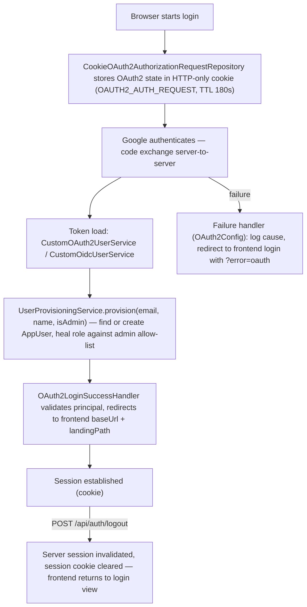

# §8 Cross-cutting Concepts

## Security

Authentication uses the OAuth2 Authorization Code flow with Google as the sole
identity provider. The code exchange is server-to-server; the browser never sees a
token.



Provisioning happens at token load — `UserProvisioningService` is the single
authoritative provisioner, and role healing runs on every login.

Access is gated before provisioning: the user services reject any email that is
not on the admin allow-list with an `access_denied` error, so no local account
is created for an unauthorized identity. The failure handler routes those to the
frontend login with `?error=unauthorized` (distinct from the generic
`?error=oauth`), which renders a localized "not authorized" message.

| Role | Rights |
|---|---|
| `ADMIN` | Full CRUD, analytics |
| `USER` | Read + basic stock ops |

Roles are stored as `STRING` on `AppUser.role`. Every mutating endpoint carries
`@PreAuthorize`; the frontend hides UI elements, but the backend enforces each rule
independently and does not trust the client's claimed role.

| Setting | Value | Why |
|---|---|---|
| OAuth2 state cookie | `OAUTH2_AUTH_REQUEST`, HTTP-only, TTL 180 s | Configurable via `AppProperties.Cookie` |
| Session cookie | `HttpOnly`, `Secure=true`, `SameSite=None` | Same-origin behind the serve-time rewrite proxy; `None` retained so the direct Fly.io-origin path stays functional ([ADR-0008](09-decisions/adr-0008-serve-time-api-base-rewrite.md)) |
| CORS allowed origins | dev `http://localhost:5173`; prod `https://www.smartsupplypro.de` | Per profile in `AppProperties.cors.allowedOrigins`; the platform-generated Koyeb hostname is deliberately not allow-listed ([ADR-0010](09-decisions/adr-0010-custom-domain-and-canonical-host.md)) |
| Audit attribution | `createdBy` is read from the security context (`SecurityAuditHelper.currentUsername()`), never from the request body | The OAuth2 principal carries `email` as its name attribute; unauthenticated callers (migrations, batch) attribute to `system`. A client is not trusted to state who created a row. `SecurityAuditHelper` is the single resolution point — reading the principal name anywhere else re-introduces a copy that can drift. Reading `Authentication` for authorization (`InventoryItemSecurityValidator`) is a separate concern and stays where it is |
| Demo mode | `AppProperties.isDemoReadonly` (env `APP_DEMO_READONLY`, default `true` in prod) | Permits unauthenticated read access; evaluated inside `@PreAuthorize` SpEL (`SecuritySpelBridgeConfig` exposes `@appProperties`); does NOT disable the security filter chain |

See [§5 Cross-cutting](05-building-blocks.md#cross-cutting).

---

## Validation

Three tiers enforce data integrity in sequence:

1. **Controller — JSR-380** (`@Valid` on `@RequestBody`): Bean Validation constraints
   (`@NotBlank`, `@NotNull`, `@Size`, `@Positive`, etc.) fire before the method body
   executes. Failures throw `MethodArgumentNotValidException` → 400.

2. **Service — business rules**: dedicated validator classes (`SupplierValidator`,
   `InventoryItemValidator`, `InventoryItemLookupValidator`,
   `InventoryItemSecurityValidator`, `StockHistoryValidator`) enforce uniqueness,
   referential integrity, and state guards that require database reads. Failures throw
   `InvalidRequestException` → 400 or `DuplicateResourceException` → 409.

3. **Database — constraints**: `NOT NULL`, `UNIQUE`, and foreign-key constraints in
   Oracle act as the final safety net. Violations surface as
   `DataIntegrityViolationException` → 409. SQL detail is stripped by
   `GlobalExceptionHandler.sanitize()` before the message reaches the client.

**SKU** — every inventory item carries a Stock Keeping Unit: required on create and
update, globally unique, enforced both in the service tier and by database constraints
(Flyway V4). Because deletion is soft, a deleted item's SKU stays reserved by the
unique constraint — reusing it requires a distinct value, which keeps historical
records unambiguous.

See [§5 Cross-cutting](05-building-blocks.md#cross-cutting).

---

## Exception Handling

Two `@ControllerAdvice` handlers cover all exceptions without overlap:

**`BusinessExceptionHandler`** (`@Order(HIGHEST_PRECEDENCE)`) handles domain exceptions:

| Exception | Status |
|---|---|
| `InvalidRequestException` | 400 |
| `DuplicateResourceException` | 409 |
| `IllegalStateException` | 409 |

**`GlobalExceptionHandler`** (`@Order(HIGHEST_PRECEDENCE + 1)`) handles framework exceptions:

| Exception | Status |
|---|---|
| `MethodArgumentNotValidException`, `ConstraintViolationException`, `HttpMessageNotReadableException` | 400 |
| `AuthenticationException` | 401 |
| `AccessDeniedException` | 403 |
| `NoSuchElementException`, `IllegalArgumentException` | 404 |
| `DataIntegrityViolationException`, `ObjectOptimisticLockingFailureException` | 409 |
| `Exception` (fallback) | 500 |

**Error contract** — every response body (except static-resource 404s, which return no
body) is:

```json
{ "error": "not_found", "message": "...", "timestamp": "2025-..." }
```

`error` = `HttpStatus.name().toLowerCase()` (e.g. `bad_request`, `not_found`,
`conflict`). There is no `correlationId` field.

**`sanitize()`** strips the following from exception messages before they reach the
client: Windows and Unix file paths → `[PATH]`; `.java`/`.class` file references and
`com.smartsupplypro.*` class names → `[INTERNAL]`; SQL fragments → `"Database
operation failed"`; strings starting with `Password` or `Token` → `"Authentication
failed"`. A `null` input returns `"Unknown error"`.

See [§5 Cross-cutting](05-building-blocks.md#cross-cutting).

---

See also: [Infrastructure concepts — Configuration, Persistence, Logging](08b-concepts-infra.md)
