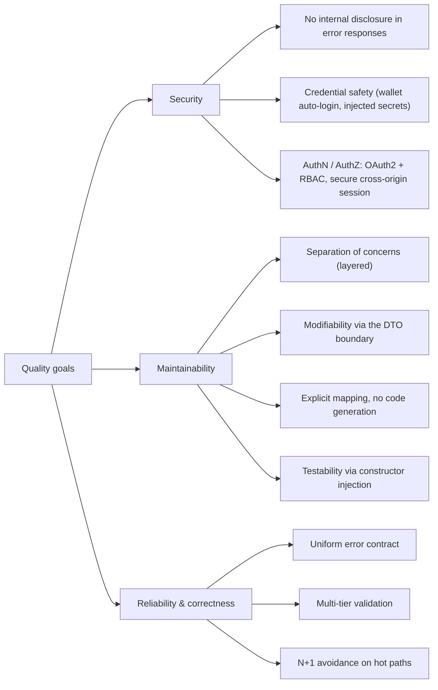

# Quality Requirements

This section makes SmartSupplyPro's quality goals explicit and testable. It refines
the top-level goals stated in the architecture overview — **security**,
**maintainability**, and **separation of concerns** — into a quality tree and a set
of concrete, measurable scenarios. Each scenario points to the decision (§9 ADR) or
view (§5–§8) where the property is realised, so quality goals are traceable rather
than aspirational.

## 10.1 Quality Tree

Top-level quality goals, refined into the sub-characteristics this architecture
actually targets. Separation of concerns and testability sit under maintainability;
correctness and performance sit under reliability.

## 10.2 Quality Scenarios

Each scenario is a stimulus → response pair with a concrete measure. The source
column links to the decision or view that guarantees it.

| ID | Quality goal | Scenario (stimulus → response) | Measure / source |
|------|--------------|--------------------------------|------------------|
| Q-01 | Security — no internal disclosure | An exception whose message carries a file path, class name, SQL fragment, or credential is thrown while handling a request | Response body contains none of them — replaced by `[PATH]`, `[INTERNAL]`, `Database operation failed`, or `Authentication failed`. See [ADR-0005](./09-decisions/adr-0005-error-message-sanitization.md), [§8](./08-concepts.md) |
| Q-02 | Security — credential safety | The production image and Fly.io configuration are inspected | The image and repository contain no credential material at all — the wallet, its password, and the schema credentials are Fly secrets delivered at runtime; startup fails fast if any is missing. See [ADR-0009](./09-decisions/adr-0009-runtime-wallet-delivery.md) |
| Q-03 | Security — cross-origin auth | A browser request from the Koyeb frontend origin calls the Fly.io backend | The session cookie is sent `SameSite=None; Secure`; the request authenticates; OAuth2 success redirects to `/auth`. See [§6](./06-runtime.md) |
| Q-04 | Maintainability — modifiability | A new persisted field is added to an entity | The change is localised to the entity, its DTO, and one mapper method; no controller or repository signature changes. See [ADR-0002](./09-decisions/adr-0002-manual-mapping-over-mapstruct.md), [ADR-0003](./09-decisions/adr-0003-dto-boundary-no-entity-exposure.md) |
| Q-05 | Maintainability — API stability | A persistence column is renamed | The public REST contract (DTO JSON shape) is unchanged; the OpenAPI schema diff is empty. See [ADR-0003](./09-decisions/adr-0003-dto-boundary-no-entity-exposure.md) |
| Q-06 | Reliability — error consistency | Any handled failure occurs (validation, not-found, conflict, access-denied, unexpected) | The body is `{error, message, timestamp}` — plus `fieldErrors` only on bean-validation failures — with `error == HttpStatus.name().toLowerCase()`; no correlation ID, no stack trace. See [ADR-0004](./09-decisions/adr-0004-http-status-as-envelope.md) |
| Q-07 | Reliability — performance | The inventory list endpoint is queried as the item count grows | Suppliers load via `@EntityGraph` in a single join; the SQL query count stays constant regardless of row count (no N+1). See [§6](./06-runtime.md) |
