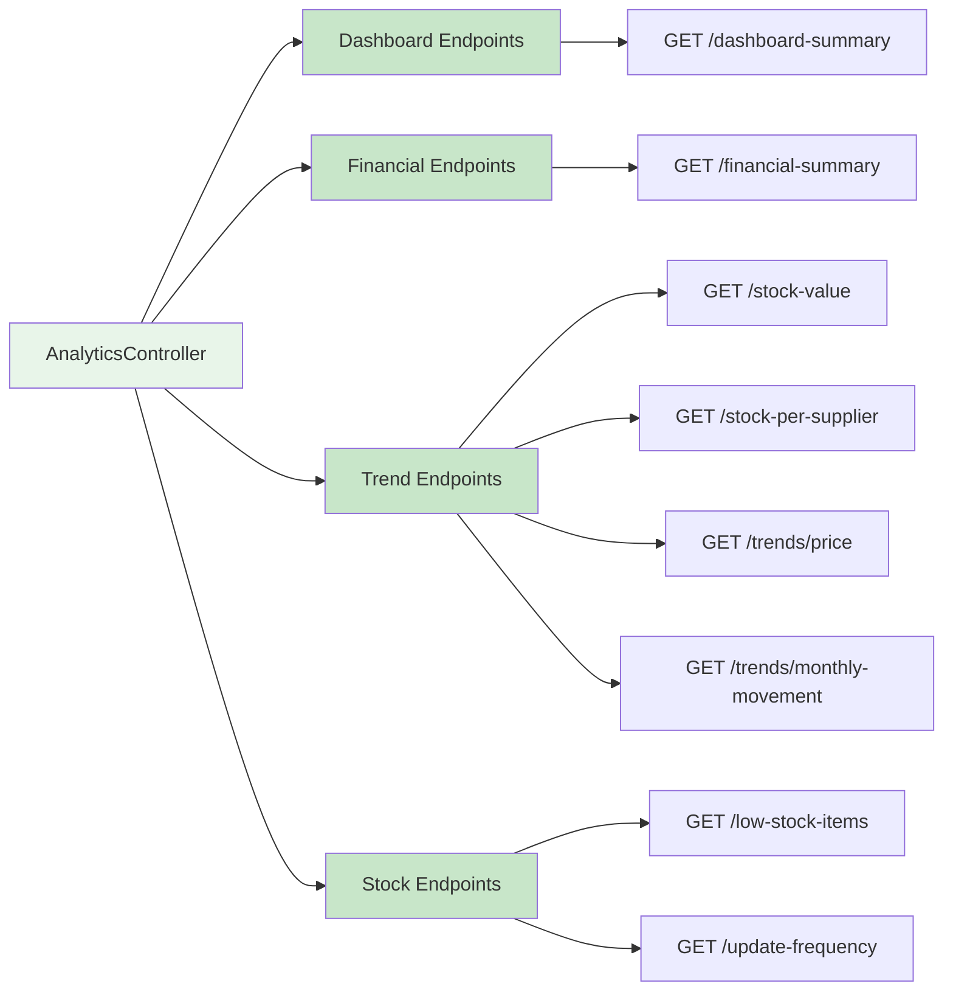

[⬅️ Back to Controller Overview](./index.md)

# Analytics Controller

## Overview

The `AnalyticsController` provides reporting and KPI endpoints for business intelligence. Includes dashboard summaries, financial analysis, trends, and stock metrics with date range filtering and pagination.

**Package:** `com.smartsupplypro.inventory.controller`  
**Base Path:** `/api/analytics`  
**Services:** `StockAnalyticsService`, `FinancialAnalyticsService`  
**Helpers:** `AnalyticsDashboardHelper`, `AnalyticsControllerValidationHelper`

**Important:** Analytics endpoints perform heavy aggregations. Use date range filters for performance.

---

## Endpoint Reference



---

## Dashboard Endpoints

### GET /api/analytics/dashboard-summary

**Get overall dashboard KPIs**

#### Request

```
GET /api/analytics/dashboard-summary
Authorization: Bearer <token> (optional in demo mode)
```

#### Authorization

`@PreAuthorize("isAuthenticated() or @appProperties.demoReadonly")`

#### Response (200 OK)

```json
{
  "totalItemsCount": 1250,
  "totalSuppliers": 42,
  "totalStockValue": 125750.50,
  "lowStockItemsCount": 23,
  "totalStockQuantity": 5420,
  "averageItemPrice": 23.19,
  "criticalStockItems": 5,
  "recentTransactionCount": 157
}
```

#### KPI Definitions

| KPI | Calculation | Use Case |
|-----|-------------|----------|
| `totalItemsCount` | COUNT(InventoryItem) | Inventory breadth |
| `totalSuppliers` | COUNT(Supplier) | Supplier base size |
| `totalStockValue` | SUM(quantity * price) | Inventory asset value |
| `lowStockItemsCount` | COUNT(quantity <= reorderLevel) | Replenishment urgency |
| `totalStockQuantity` | SUM(quantity) | Total units held |
| `averageItemPrice` | AVG(price) | Pricing analysis |
| `criticalStockItems` | COUNT(quantity <= reorderLevel * 0.5) | Urgent items |
| `recentTransactionCount` | COUNT(StockHistory in last 30 days) | Activity level |

---

### GET /api/analytics/financial-summary

**Get detailed financial metrics**

#### Request

```
GET /api/analytics/financial-summary?startDate=2025-11-01&endDate=2025-11-30
Authorization: Bearer <token> (optional in demo mode)
```

#### Authorization

`@PreAuthorize("isAuthenticated() or @appProperties.demoReadonly")`

#### Query Parameters

| Name | Type | Required | Description |
|------|------|----------|-------------|
| `startDate` | Date | Yes | Start date (ISO: `yyyy-MM-dd`) |
| `endDate` | Date | Yes | End date (ISO: `yyyy-MM-dd`) |

#### Response (200 OK)

```json
{
  "periodStartDate": "2025-11-01",
  "periodEndDate": "2025-11-30",
  "beginningInventoryValue": 125750.50,
  "purchasedValue": 35600.00,
  "soldValue": 18500.25,
  "adjustmentValue": -250.00,
  "endingInventoryValue": 142600.25,
  "totalCostOfGoodsSold": 18500.25,
  "inventoryTurnover": 3.45,
  "inventoryHoldingCost": 2850.00,
  "averageInventoryValue": 134175.38
}
```

#### Financial Metrics

| Metric | Definition | Importance |
|--------|-----------|-----------|
| `beginningInventoryValue` | Stock value at start of period | Balance sheet |
| `purchasedValue` | Cost of goods purchased | Expense tracking |
| `soldValue` | Revenue from sold items | Sales analysis |
| `adjustmentValue` | Damage/loss/adjustments | Waste tracking |
| `endingInventoryValue` | Stock value at end of period | Balance sheet |
| `totalCostOfGoodsSold` | Cost of sold items | P&L statement |
| `inventoryTurnover` | Sold value / Avg inventory value | Efficiency KPI |
| `inventoryHoldingCost` | Cost to hold stock (estimated) | Working capital |
| `averageInventoryValue` | Mean of beginning & ending | Financial planning |

---

## Trend Endpoints

### GET /api/analytics/stock-value

**Time series of total stock value**

#### Request

```
GET /api/analytics/stock-value?start=2025-11-01&end=2025-11-30&supplierId=SUP-001
Authorization: Bearer <token> (optional in demo mode)
```

#### Authorization

`@PreAuthorize("isAuthenticated() or @appProperties.demoReadonly")`

#### Query Parameters

| Name | Type | Required | Description |
|------|------|----------|-------------|
| `start` | Date | Yes | Start date (ISO: `yyyy-MM-dd`) |
| `end` | Date | Yes | End date (ISO: `yyyy-MM-dd`) |
| `supplierId` | String | No | Filter by supplier (optional) |

#### Response (200 OK)

```json
[
  {
    "date": "2025-11-01",
    "totalStockValue": 125750.50,
    "itemCount": 1250,
    "totalQuantity": 5420
  },
  {
    "date": "2025-11-02",
    "totalStockValue": 127200.75,
    "itemCount": 1250,
    "totalQuantity": 5480
  },
  {
    "date": "2025-11-03",
    "totalStockValue": 126850.25,
    "itemCount": 1248,
    "totalQuantity": 5420
  }
]
```

#### DTO: StockValueOverTimeDTO

```java
public record StockValueOverTimeDTO(
    LocalDate date,
    BigDecimal totalStockValue,
    Integer itemCount,
    Integer totalQuantity
) {}
```

---

### GET /api/analytics/stock-per-supplier

**Stock distribution by supplier**

#### Request

```
GET /api/analytics/stock-per-supplier
Authorization: Bearer <token> (optional in demo mode)
```

#### Authorization

`@PreAuthorize("isAuthenticated() or @appProperties.demoReadonly")`

#### Response (200 OK)

```json
[
  {
    "supplierId": "SUP-001",
    "supplierName": "ACME Corp",
    "totalStockQuantity": 1250,
    "totalStockValue": 45600.75,
    "itemCount": 180
  },
  {
    "supplierId": "SUP-002",
    "supplierName": "Global Supplies",
    "totalStockQuantity": 2100,
    "totalStockValue": 62400.50,
    "itemCount": 245
  }
]
```

#### Use Cases

- Distribution analysis by supplier
- Supply chain risk (concentration)
- Supplier performance comparison

---

### GET /api/analytics/trends/price

**Price trend analysis**

#### Request

```
GET /api/analytics/trends/price?startDate=2025-09-01&endDate=2025-11-30&supplierId=SUP-001
Authorization: Bearer <token> (optional in demo mode)
```

#### Authorization

`@PreAuthorize("isAuthenticated() or @appProperties.demoReadonly")`

#### Query Parameters

| Name | Type | Required | Description |
|------|------|----------|-------------|
| `startDate` | Date | Yes | Period start |
| `endDate` | Date | Yes | Period end |
| `supplierId` | String | No | Filter by supplier |

#### Response (200 OK)

```json
[
  {
    "date": "2025-09-01",
    "averagePrice": 19.50,
    "minPrice": 10.00,
    "maxPrice": 99.99,
    "priceChangePercent": 0.0
  },
  {
    "date": "2025-10-01",
    "averagePrice": 19.85,
    "minPrice": 10.00,
    "maxPrice": 99.99,
    "priceChangePercent": 1.79
  },
  {
    "date": "2025-11-01",
    "averagePrice": 20.50,
    "minPrice": 10.00,
    "maxPrice": 99.99,
    "priceChangePercent": 3.27
  }
]
```

---

### GET /api/analytics/trends/monthly-movement

**Monthly stock movement trends**

#### Request

```
GET /api/analytics/trends/monthly-movement?startDate=2025-09-01&endDate=2025-11-30
Authorization: Bearer <token> (optional in demo mode)
```

#### Response (200 OK)

```json
[
  {
    "month": "2025-09",
    "itemsReceived": 450,
    "itemsSold": 380,
    "adjustments": 15,
    "netChange": 55
  },
  {
    "month": "2025-10",
    "itemsReceived": 520,
    "itemsSold": 420,
    "adjustments": 25,
    "netChange": 75
  },
  {
    "month": "2025-11",
    "itemsReceived": 485,
    "itemsSold": 410,
    "adjustments": 10,
    "netChange": 65
  }
]
```

#### DTO: MonthlyStockMovementDTO

```java
public record MonthlyStockMovementDTO(
    String month,          // "yyyy-MM"
    Integer itemsReceived,
    Integer itemsSold,
    Integer adjustments,
    Integer netChange     // received - sold - adjustments
) {}
```

---

## Stock Endpoints

### GET /api/analytics/low-stock-items

**Items below reorder level**

#### Request

```
GET /api/analytics/low-stock-items?page=0&size=20&supplierId=SUP-001
Authorization: Bearer <token> (optional in demo mode)
```

#### Authorization

`@PreAuthorize("isAuthenticated() or @appProperties.demoReadonly")`

#### Query Parameters

| Name | Type | Required | Description |
|------|------|----------|-------------|
| `supplierId` | String | No | Filter by supplier |
| `page` | Integer | No | Page number (default: 0) |
| `size` | Integer | No | Items per page (default: 20) |

#### Response (200 OK)

```json
{
  "content": [
    {
      "id": "ITEM-001",
      "name": "Widget A",
      "currentQuantity": 45,
      "reorderLevel": 50,
      "quantityBelow": 5,
      "supplierId": "SUP-001",
      "supplierName": "ACME Corp",
      "price": 19.99,
      "estimatedReplenishmentCost": 99.95
    }
  ],
  "pageable": { ... },
  "totalElements": 23,
  "totalPages": 2
}
```

#### Use Cases

- Procurement planning
- Automatic replenishment alerts
- Critical inventory management

---

### GET /api/analytics/update-frequency

**How often items are updated**

#### Request

```
GET /api/analytics/update-frequency?page=0&size=50
Authorization: Bearer <token> (optional in demo mode)
```

#### Response (200 OK)

```json
{
  "content": [
    {
      "itemId": "ITEM-001",
      "itemName": "Widget A",
      "updateCount": 45,
      "lastUpdate": "2025-11-19T14:30:00Z",
      "updateFrequencyDays": 7.5
    }
  ],
  "pageable": { ... },
  "totalElements": 1250,
  "totalPages": 25
}
```

#### Use Cases

- Identify stale inventory
- Analyze fast-moving vs. slow-moving items
- Optimize replenishment frequency

---

## Performance Considerations

### Heavy Aggregations

Financial and trend endpoints perform complex aggregations. Recommendations:

```
✅ DO:   Use date range filters (limit data processed)
✅ DO:   Cache results (analytics don't need real-time)
✅ DO:   Paginate large result sets (200 items/page)
❌ DON'T: Run without date filters (full table scans)
❌ DON'T: Request very large date ranges (e.g., 10+ years)
```

### Suggested Caching

```java
@Cacheable(value = "analytics", key = "#startDate + '-' + #endDate")
public FinancialSummaryDTO getFinancialSummary(LocalDate startDate, LocalDate endDate) {
    // Heavy calculation
}
```

---

## Testing

**Location:** `src/test/java/.../controller/analytics/`

**Test Classes:**
- `AnalyticsControllerFinancialTest`
- `AnalyticsControllerTrendsSecurityTest`
- `AbstractAnalyticsControllerSecurityTest`

**Coverage:**
- ✅ Dashboard summary calculations
- ✅ Financial metrics accuracy
- ✅ Trend data filtering
- ✅ Date range validation
- ✅ Authorization checks
- ✅ Pagination

---

## Summary

| Aspect | Detail |
|--------|--------|
| **Base path** | `/api/analytics` |
| **Operations** | Read-only reporting endpoints |
| **Authorization** | USER + ADMIN (authenticated), demo mode allowed |
| **Pagination** | Default 20/page, max 200 |
| **Caching** | Recommended (analytics are not real-time) |
| **Performance** | Heavy aggregations; use date filters |
| **DTOs** | 10+ DTO types for different reports |
| **Services** | `StockAnalyticsService`, `FinancialAnalyticsService` |
| **Helpers** | `AnalyticsDashboardHelper`, `AnalyticsControllerValidationHelper` |

---

[⬅️ Back to Controller Overview](./index.md)
