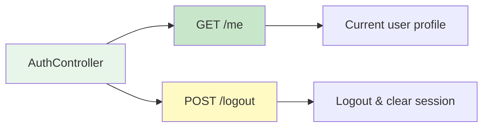
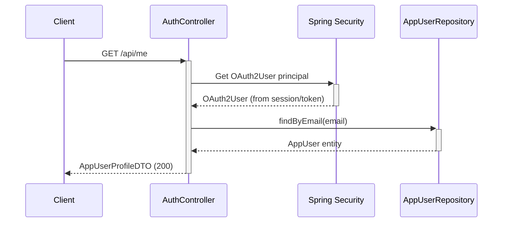
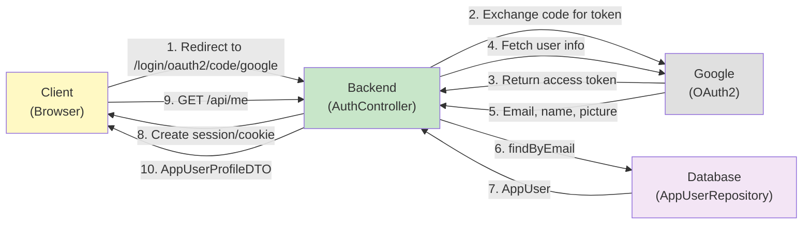

[⬅️ Back to Controller Overview](./index.md)

# Auth Controller

## Overview

The `AuthController` handles authentication-related operations: retrieving the current user's profile and logout. Integration with OAuth2 (Google) is handled by Spring Security; this controller provides the HTTP API for OAuth2 user management.

**Package:** `com.smartsupplypro.inventory.controller`  
**Base Path:** `/api`  
**Service:** `AppUserRepository`, Spring Security  
**Entity:** `AppUser`

---

## Endpoint Reference



---

## GET /api/me

**Get authenticated user's profile**

### Request

```
GET /api/me
Authorization: Bearer <token>
```

### Authorization

**None required** (endpoint is accessible to any authenticated user)

- ✅ Any authenticated user (via OAuth2)
- ❌ Anonymous users (returns 401)

### Response (200 OK)

```json
{
  "email": "user@example.com",
  "fullName": "John Smith",
  "role": "USER",
  "pictureUrl": "https://lh3.googleusercontent.com/a/..."
}
```

### Response Fields

| Field | Type | Description |
|-------|------|-------------|
| `email` | String | User's email address (from OAuth2 provider) |
| `fullName` | String | Display name |
| `role` | String | User role (`USER` or `ADMIN`) |
| `pictureUrl` | String | Profile picture URL (optional, from OAuth2 provider) |

### Error Response (401 Unauthorized)

```json
{
  "error": "Unauthorized",
  "message": "No authentication provided",
  "status": 401
}
```

**Cause:** User not authenticated or session expired.

### Flow Diagram



### User Role Assignment

Roles are assigned based on email matching:

1. Extract email from OAuth2 provider (Google)
2. Look up `AppUser` by email
3. Check if email is in `APP_ADMIN_EMAILS` environment variable
4. Return user's role (ADMIN or USER)

**Configuration:**

```bash
export APP_ADMIN_EMAILS="admin@company.com,manager@company.com"
```

See [Feature Flags & Demo Mode](../config/feature-flags-and-demo-mode.md) for details.

---

## POST /api/logout

**Logout and clear session**

### Request

```
POST /api/logout
Authorization: Bearer <token>
```

### Authorization

**None required** (any authenticated user can logout)

### Request Body

None (empty body)

### Response (200 OK)

```json
{
  "message": "Logged out successfully"
}
```

### Behind the Scenes

1. Spring Security clears the security context
2. Session cookie is invalidated
3. CSRF tokens are cleared
4. User is logged out on backend

### Client-Side Handling

After logout, the client should:

1. Clear any cached JWT or session tokens
2. Redirect to login page or public page
3. Disable authenticated endpoints

### Security Headers

Response includes cache-control headers to prevent cached credentials:

```
Cache-Control: no-cache, no-store, must-revalidate
Pragma: no-cache
Expires: 0
```

---

## DTOs

### AppUserProfileDTO (Response)

```java
public record AppUserProfileDTO(
    String email,
    String fullName,
    String role,
    String pictureUrl
) {}
```

**Immutable record** — created from `AppUser` entity and OAuth2 attributes.

---

## OAuth2 Integration

### Authentication Flow



### First-Time Login

1. User clicks "Sign in with Google"
2. Redirected to Google login
3. User authenticates
4. Google redirects back with authorization code
5. Backend exchanges code for tokens
6. Backend fetches user profile (email, name, picture)
7. `OAuth2LoginSuccessHandler` creates or updates `AppUser` entity
8. Session is established
9. User is redirected to frontend

### Session Management

- **Cookie-based sessions** (HttpOnly, Secure, SameSite=None)
- **Session store**: In-memory or database (configurable)
- **TTL**: Configured by Spring Security (default: browser session)

See [Configuration](../config/) for OAuth2 settings.

---

## Related Endpoints

### Login Flow (Automatic)

```
GET /login                   → Login page
GET /oauth2/authorization/google    → Initiate Google login
GET /login/oauth2/code/google       → OAuth2 callback (handled by Spring)
```

**These are handled by Spring Security, not by this controller.**

### Health Check

```
GET /actuator/health        → Application health (public)
```

---

## Testing

**Location:** `src/test/java/.../controller/auth/`

**Test Coverage:**
- ✅ Get profile (authenticated)
- ✅ Get profile without auth (401)
- ✅ Logout (clears session)
- ✅ OAuth2User principal extraction
- ✅ AppUser role assignment
- ✅ Admin email matching

---

## Security Considerations

### CSRF Protection

- All POST/PUT/DELETE requests require CSRF token
- Tokens are included in session cookies
- `/logout` validates CSRF token

### Session Security

| Setting | Value | Purpose |
|---------|-------|---------|
| HttpOnly | true | Prevent JS access to session cookie |
| Secure | true | HTTPS only (prod); HTTP allowed (local dev) |
| SameSite | None | Allow cross-site cookies for OAuth2 |

### Token Expiration

- **Session timeout:** Configured per environment
- **Inactivity timeout:** Automatically expires idle sessions
- **Absolute timeout:** Long sessions expire after max duration

---

## Summary

| Aspect | Detail |
|--------|--------|
| **Base path** | `/api` |
| **Endpoints** | `/me`, `/logout` |
| **Authentication** | OAuth2 (Google), session-based |
| **Authorization** | Authenticated users only |
| **DTOs** | `AppUserProfileDTO` |
| **Entity** | `AppUser` |
| **Service** | Spring Security, `AppUserRepository` |
| **Session type** | Cookie-based (HttpOnly, Secure) |
| **CSRF protection** | Enabled by default |
| **Tests** | `src/test/java/.../controller/auth/` |

---

[⬅️ Back to Controller Overview](./index.md)
