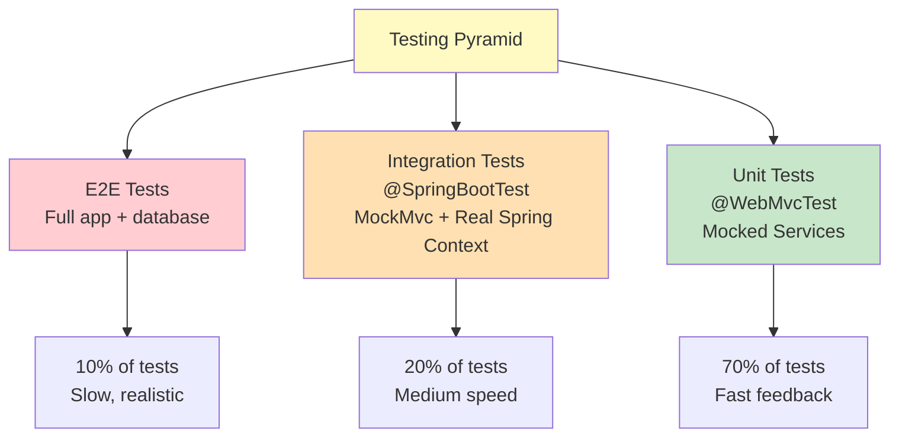

[⬅️ Back to Controller Overview](./index.md)

# Controller Testing Strategy

## Overview

This document outlines testing patterns for REST controllers, including unit tests (`@WebMvcTest`) and integration tests (`@SpringBootTest`). Covers endpoint validation, authorization checks, and response shape verification.

**Test Location:** `src/test/java/.../controller/`  
**Frameworks:** JUnit 5, Mockito, Spring Test, RestAssured

---

## Testing Pyramid



---

## Unit Testing with @WebMvcTest

### Purpose

Test controller request/response mapping **without** service layer.

### Template

```java
@WebMvcTest(SupplierController.class)
class SupplierControllerTest {
    
    @Autowired
    private MockMvc mockMvc;
    
    @MockBean
    private SupplierService supplierService;
    
    @Test
    void testGetSupplier_Returns200WithData() throws Exception {
        // ARRANGE
        SupplierDTO mockSupplier = new SupplierDTO(
            "SUP-001", "ACME Corp", "acme@example.com", "active", null
        );
        when(supplierService.getSupplier("SUP-001"))
            .thenReturn(Optional.of(mockSupplier));
        
        // ACT & ASSERT
        mockMvc.perform(
            get("/api/suppliers/SUP-001")
                .contentType(MediaType.APPLICATION_JSON)
        )
        .andExpect(status().isOk())
        .andExpect(jsonPath("$.id").value("SUP-001"))
        .andExpect(jsonPath("$.name").value("ACME Corp"));
        
        // VERIFY
        verify(supplierService, times(1)).getSupplier("SUP-001");
    }
}
```

### Characteristics

| Aspect | Detail |
|--------|--------|
| **Speed** | Very fast (~50ms per test) |
| **Isolation** | Services mocked, pure MVC testing |
| **Scope** | Controller layer only (routing, binding, serialization) |
| **Deployment** | @WebMvcTest creates minimal Spring context |
| **Mocking** | @MockBean for services, repositories |

### Common Assertions

```java
// Status codes
.andExpect(status().isOk())
.andExpect(status().isCreated())
.andExpect(status().isBadRequest())
.andExpect(status().isUnauthorized())
.andExpect(status().isForbidden())
.andExpect(status().isNotFound())

// JSON path assertions
.andExpect(jsonPath("$.id").exists())
.andExpect(jsonPath("$.id").value("SUP-001"))
.andExpect(jsonPath("$.suppliers[0].name").value("ACME"))
.andExpect(jsonPath("$", hasSize(3)))

// Headers
.andExpect(header().exists("Location"))
.andExpect(header().string("Content-Type", containsString("application/json")))

// Content
.andExpect(content().json("{\"id\":\"SUP-001\"}"))
```

---

## Integration Testing with @SpringBootTest

### Purpose

Test controllers with **real services** and database operations.

### Template

```java
@SpringBootTest
@ActiveProfiles("test")  // Uses H2, application-test.yml
class SupplierControllerIntegrationTest {
    
    @Autowired
    private TestRestTemplate restTemplate;
    
    @Autowired
    private SupplierRepository supplierRepository;
    
    @BeforeEach
    void setup() {
        supplierRepository.deleteAll();
        supplierRepository.save(new Supplier(
            "SUP-001", "ACME Corp", "acme@example.com", "active"
        ));
    }
    
    @Test
    void testGetSupplier_WithRealDatabase() {
        ResponseEntity<SupplierDTO> response = restTemplate.getForEntity(
            "/api/suppliers/SUP-001",
            SupplierDTO.class
        );
        
        assertThat(response.getStatusCode()).isEqualTo(HttpStatus.OK);
        assertThat(response.getBody().getName()).isEqualTo("ACME Corp");
    }
}
```

### Characteristics

| Aspect | Detail |
|--------|--------|
| **Speed** | Slower (~500ms per test), but realistic |
| **Isolation** | Full Spring context, real services, H2 database |
| **Scope** | End-to-end from controller to database |
| **Deployment** | Full `@SpringBootTest` application context |
| **Database** | H2 in-memory (from `application-test.yml`) |

---

## Authorization Testing

### Testing @PreAuthorize Annotations

```java
@WebMvcTest(SupplierController.class)
class SupplierControllerSecurityTest {
    
    @Autowired
    private MockMvc mockMvc;
    
    @MockBean
    private SupplierService supplierService;
    
    @Test
    @WithAnonymousUser  // No authentication
    void testCreateSupplier_WithAnonymous_Returns403() throws Exception {
        mockMvc.perform(
            post("/api/suppliers")
                .contentType(MediaType.APPLICATION_JSON)
                .content("{\"name\": \"New Corp\"}")
        )
        .andExpect(status().isForbidden());
    }
    
    @Test
    @WithMockUser(roles = "USER")  // USER role
    void testCreateSupplier_WithUserRole_Returns403() throws Exception {
        mockMvc.perform(
            post("/api/suppliers")
                .contentType(MediaType.APPLICATION_JSON)
                .content("{\"name\": \"New Corp\"}")
        )
        .andExpect(status().isForbidden());  // Only ADMIN allowed
    }
    
    @Test
    @WithMockUser(roles = "ADMIN")  // ADMIN role
    void testCreateSupplier_WithAdminRole_Returns201() throws Exception {
        SupplierDTO newSupplier = new SupplierDTO(
            "SUP-999", "New Corp", "new@example.com", "active", null
        );
        when(supplierService.createSupplier(any()))
            .thenReturn(newSupplier);
        
        mockMvc.perform(
            post("/api/suppliers")
                .contentType(MediaType.APPLICATION_JSON)
                .content(objectMapper.writeValueAsString(newSupplier))
        )
        .andExpect(status().isCreated());
    }
}
```

### Authorization Annotations

| Annotation | Use Case |
|-----------|----------|
| `@WithAnonymousUser` | Test public endpoints & 403 paths |
| `@WithMockUser` | Test authenticated USER behavior |
| `@WithMockUser(roles="ADMIN")` | Test ADMIN-only endpoints |
| `@WithSecurityContext` | Custom security context setup |

---

## Endpoint Testing by Controller

### Supplier Controller Tests

**Location:** `src/test/java/.../controller/supplier/`

```
SupplierControllerTest
├── testGetSuppliers_Returns200WithPagination
├── testGetSupplier_WithValidId_Returns200
├── testGetSupplier_WithInvalidId_Returns404
├── testCreateSupplier_WithAdminRole_Returns201
├── testCreateSupplier_WithUserRole_Returns403
├── testUpdateSupplier_WithValidData_Returns200
├── testDeleteSupplier_SoftDelete_Returns204
└── testSearchSupplier_ByName_ReturnsList

SupplierControllerSecurityTest
├── testCreateSupplier_WithAnonymousUser_Returns403
├── testUpdateSupplier_WithAnonymousUser_Returns403
└── testDeleteSupplier_WithAnonymousUser_Returns403
```

### Inventory Item Controller Tests

**Location:** `src/test/java/.../controller/inventoryitem/`

```
InventoryItemControllerCreateReadTest
├── testGetItems_WithDefaultPagination_Returns20Items
├── testGetItems_WithSortByPrice_ReturnsSorted
├── testGetItem_WithValidId_Returns200
├── testCreateItem_WithValidData_Returns201
├── testUpdateItem_WithValidData_Returns200
└── testDeleteItem_SoftDelete_Returns204

InventoryItemControllerPatchTest
├── testUpdateStock_IncreasesQuantity_UpdatesStockHistory
├── testUpdateStock_DecreasesQuantity_CreatesNegativeEntry
├── testUpdatePrice_WithValidPrice_Returns200
└── testSearchItem_ByName_ReturnsList

InventoryItemControllerRenameTest
├── testRenameItem_AdminSuccess_Returns200
├── testRenameItem_UserRole_Forbidden_Returns403
├── testRenameItem_Unauthenticated_Returns401
├── testRenameItem_NotFound_Returns404
├── testRenameItem_DuplicateName_Returns409
├── testRenameItem_EmptyName_Returns400
├── testRenameItem_WhitespaceOnlyName_Returns400
├── testRenameItem_SpecialCharacters_Returns200
├── testRenameItem_CaseInsensitiveDuplicate_Returns409
└── testRenameItem_MissingNameParam_Returns400

InventoryItemControllerSecurityTest
├── testUpdateStock_WithUserRole_Returns403
├── testCreateItem_WithDemoMode_Returns405
└── testDeleteItem_WithUserRole_Returns403
```

### Stock History Controller Tests

**Location:** `src/test/java/.../controller/stockhistory/`

```
StockHistoryControllerTest
├── testGetStockHistory_Paginated_Returns20Items
├── testGetStockHistoryById_WithValidId_Returns200
├── testGetHistoryByItem_Filtered_ReturnsList
├── testGetHistoryBySupplier_Filtered_ReturnsList
└── testGetHistoryWithDateRange_Filtered_ReturnsList

StockHistoryControllerSecurityTest
└── testGetStockHistory_PublicDemo_Returns200
```

### Auth Controller Tests

**Location:** `src/test/java/.../controller/auth/`

```
AuthControllerTest
├── testGetMe_WithAuthenticatedUser_Returns200WithProfile
├── testGetMe_WithAnonymousUser_RedirectsToLogin
└── testLogout_InvalidatesSession_Returns302Redirect

AuthControllerSecurityTest
├── testGetMe_CreatesSessionCookie_SameSiteNone
├── testLogout_ClearsSessionCookie
└── testOAuth2Login_AssignsUserRole_ByDefault
```

### Analytics Controller Tests

**Location:** `src/test/java/.../controller/analytics/`

```
AnalyticsControllerTest
├── testDashboardSummary_CalculatesKPIs_Returns200
├── testFinancialSummary_WithDateRange_Returns200
├── testStockValue_TimeSeries_ReturnsList
├── testStockPerSupplier_Distribution_ReturnsList
├── testPriceTrends_WithSupplierFilter_ReturnsList
└── testMonthlyMovement_AggregatesData_ReturnsList

AnalyticsControllerSecurityTest
└── testDashboardSummary_PublicDemo_Returns200
```

---

## Testing PATCH Endpoints: Update Price & Rename

### PATCH /api/inventory/{id}/price Pattern

For updating item price, test successful update and price validation:

```java
@WebMvcTest(InventoryItemController.class)
class InventoryItemControllerPriceTest {
    
    @MockBean
    private InventoryItemService service;
    
    @Test
    @WithMockUser
    void testUpdatePrice_WithValidPrice_Returns200() throws Exception {
        InventoryItemDTO updated = new InventoryItemDTO(
            "ITEM-001", "Widget", 100, new BigDecimal("24.99"), 50, "SUP-001", "ACTIVE"
        );
        when(service.updatePrice("ITEM-001", new BigDecimal("24.99")))
            .thenReturn(updated);
        
        mockMvc.perform(
            patch("/api/inventory/ITEM-001/price")
                .param("price", "24.99")
        )
        .andExpect(status().isOk())
        .andExpect(jsonPath("$.price").value(24.99));
    }
}
```

### PATCH /api/inventory/{id}/name Pattern - Rename with Authorization

Testing rename requires testing three critical aspects:

1. **Authorization** - Only ADMIN can rename
2. **Validation** - Name cannot be empty/duplicate
3. **Error Mapping** - `IllegalArgumentException` → proper HTTP status

```java
@WebMvcTest(InventoryItemController.class)
class InventoryItemControllerRenameTest {
    
    @Autowired
    private MockMvc mockMvc;
    
    @MockBean
    private InventoryItemService service;
    
    // Test 1: Admin success
    @Test
    @WithMockUser(roles = "ADMIN")
    void testRenameItem_AdminSuccess_Returns200() throws Exception {
        InventoryItemDTO renamed = new InventoryItemDTO(
            "ITEM-001", "Widget Pro", 100, new BigDecimal("19.99"), 50, "SUP-001", "ACTIVE"
        );
        when(service.renameItem("ITEM-001", "Widget Pro"))
            .thenReturn(renamed);
        
        mockMvc.perform(
            patch("/api/inventory/ITEM-001/name")
                .param("name", "Widget Pro")
                .with(csrf())  // CSRF token required for state-changing requests
        )
        .andExpect(status().isOk())
        .andExpect(jsonPath("$.name").value("Widget Pro"));
        
        verify(service).renameItem("ITEM-001", "Widget Pro");
    }
    
    // Test 2: User forbidden (non-admin)
    @Test
    @WithMockUser(roles = "USER")  // User role, not admin
    void testRenameItem_UserRole_Forbidden_Returns403() throws Exception {
        mockMvc.perform(
            patch("/api/inventory/ITEM-001/name")
                .param("name", "Widget Pro")
                .with(csrf())
        )
        .andExpect(status().isForbidden());
        
        verify(service, never()).renameItem(any(), any());  // Service should not be called
    }
    
    // Test 3: Duplicate name detection
    @Test
    @WithMockUser(roles = "ADMIN")
    void testRenameItem_DuplicateName_Returns409Conflict() throws Exception {
        when(service.renameItem("ITEM-001", "Existing Item Name"))
            .thenThrow(new IllegalArgumentException(
                "An item with this name already exists for this supplier"
            ));
        
        mockMvc.perform(
            patch("/api/inventory/ITEM-001/name")
                .param("name", "Existing Item Name")
                .with(csrf())
        )
        .andExpect(status().isConflict());  // 409, not 404
    }
    
    // Test 4: Empty name validation
    @Test
    @WithMockUser(roles = "ADMIN")
    void testRenameItem_EmptyName_Returns400BadRequest() throws Exception {
        when(service.renameItem("ITEM-001", "   "))
            .thenThrow(new IllegalArgumentException("Item name cannot be empty"));
        
        mockMvc.perform(
            patch("/api/inventory/ITEM-001/name")
                .param("name", "   ")  // Whitespace-only
                .with(csrf())
        )
        .andExpect(status().isBadRequest());  // 400, not 404
    }
    
    // Test 5: Item not found
    @Test
    @WithMockUser(roles = "ADMIN")
    void testRenameItem_NotFound_Returns404() throws Exception {
        when(service.renameItem("INVALID-ID", "New Name"))
            .thenThrow(new NoSuchElementException("Item not found"));
        
        mockMvc.perform(
            patch("/api/inventory/INVALID-ID/name")
                .param("name", "New Name")
                .with(csrf())
        )
        .andExpect(status().isNotFound());  // 404
    }
}
```

**Key Points for Rename Testing:**

| Aspect | Strategy |
|--------|----------|
| **Authorization** | Use `@WithMockUser(roles="ADMIN")` for success, `@WithMockUser(roles="USER")` for failure |
| **Error Mapping** | Service throws `IllegalArgumentException`, controller maps to 400/404/409 based on message |
| **CSRF Token** | Include `.with(csrf())` for state-changing PATCH requests |
| **Validation** | Test empty name, whitespace, duplicates, not found separately |
| **Verification** | Use `verify(service)` to ensure service is called only when authorized |


### Verify Paginated Responses

```java
@Test
void testGetSuppliers_WithPagination_ReturnsPageStructure() throws Exception {
    mockMvc.perform(
        get("/api/suppliers?page=0&size=20")
            .contentType(MediaType.APPLICATION_JSON)
    )
    .andExpect(status().isOk())
    .andExpect(jsonPath("$.content").isArray())
    .andExpect(jsonPath("$.content[0].id").exists())
    .andExpect(jsonPath("$.pageable.pageNumber").value(0))
    .andExpect(jsonPath("$.pageable.pageSize").value(20))
    .andExpect(jsonPath("$.totalElements").isNumber());
}
```

### Verify Single Resource Response

```java
@Test
void testGetSupplier_ReturnsDTOStructure() throws Exception {
    mockMvc.perform(get("/api/suppliers/SUP-001"))
        .andExpect(status().isOk())
        .andExpect(jsonPath("$.id").value("SUP-001"))
        .andExpect(jsonPath("$.name").value("ACME Corp"))
        .andExpect(jsonPath("$.email").value("acme@example.com"))
        .andExpect(jsonPath("$.status").value("active"));
}
```

### Verify Error Response

```java
@Test
void testGetSupplier_WithInvalidId_Returns404WithErrorMessage() throws Exception {
    mockMvc.perform(get("/api/suppliers/INVALID"))
        .andExpect(status().isNotFound())
        .andExpect(jsonPath("$.error").value("SUPPLIER_NOT_FOUND"))
        .andExpect(jsonPath("$.message").exists())
        .andExpect(jsonPath("$.timestamp").exists());
}
```

---

## Mocking Services

### Mock Service Dependencies

```java
@WebMvcTest(SupplierController.class)
class SupplierControllerTest {
    
    @MockBean
    private SupplierService supplierService;
    
    // Mock responses for service calls
    @Test
    void testGetSupplier_DelegatestoService() throws Exception {
        SupplierDTO mock = new SupplierDTO("SUP-001", "ACME", ...);
        when(supplierService.getSupplier("SUP-001"))
            .thenReturn(Optional.of(mock));
        
        mockMvc.perform(get("/api/suppliers/SUP-001"))
            .andExpect(status().isOk());
        
        verify(supplierService).getSupplier("SUP-001");
    }
}
```

### Mock Exception Throwing

```java
@Test
void testGetSupplier_WithServiceException_Returns500() throws Exception {
    when(supplierService.getSupplier(any()))
        .thenThrow(new DatabaseException("Connection timeout"));
    
    mockMvc.perform(get("/api/suppliers/INVALID"))
        .andExpect(status().isInternalServerError());
}
```

---

## Running Tests

### Run All Tests

```bash
# Maven
mvn clean test

# Gradle
gradle clean test
```

### Run Specific Test Class

```bash
mvn test -Dtest=SupplierControllerTest
```

### Run Specific Test Method

```bash
mvn test -Dtest=SupplierControllerTest#testGetSupplier_Returns200WithData
```

### Run with Coverage

```bash
mvn clean test jacoco:report
# Report: target/site/jacoco/index.html
```

---

## Test Coverage Goals

| Layer | Target | Rationale |
|-------|--------|-----------|
| **Controller** | >80% | Business logic verified |
| **Service** | >85% | Critical business rules |
| **Repository** | >70% | Query logic tested |
| **Overall** | >75% | Adequate safety net |

---

## Best Practices

```
✅ DO:
  • One test per scenario (single assertion focus)
  • Use @BeforeEach for common setup
  • Name tests clearly: testMethod_Condition_Expected
  • Mock external dependencies (@MockBean)
  • Test authorization separately from business logic
  • Use @ActiveProfiles("test") for H2 database
  • Verify method calls with verify()

❌ DON'T:
  • Test framework code (Spring handles it)
  • Create tight coupling between tests
  • Use Thread.sleep() (use testcontainers instead)
  • Skip authorization tests
  • Mix @WebMvcTest with real database
  • Test multiple scenarios in one test
```

---

## Summary

| Test Type | Use Case | Speed | Isolation | Coverage |
|-----------|----------|-------|-----------|----------|
| **Unit (@WebMvcTest)** | Controller logic, routing | Fast | High | Shallow (controller only) |
| **Integration (@SpringBootTest)** | End-to-end flows | Slow | Low | Deep (full stack) |
| **Authorization** | Role checks, @PreAuthorize | Medium | Medium | Security coverage |

**Recommended Ratio:** 70% unit + 20% integration + 10% E2E tests.

---

[⬅️ Back to Controller Overview](./index.md)
