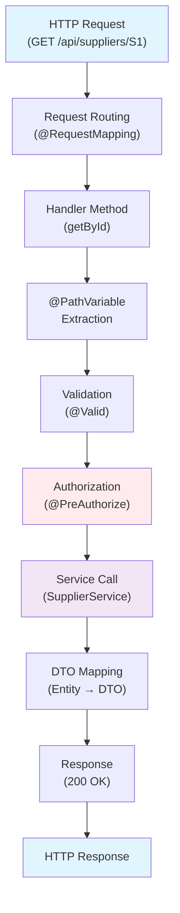

[⬅️ Back to Architecture](../index.md)

# Controller Documentation

This section documents the REST API controllers that handle HTTP requests and responses. Controllers bridge the HTTP protocol with business logic by mapping endpoints, validating inputs, enforcing authorization, and orchestrating services.

## What is Controller Documentation?

Unlike the [Controller Layer Overview](../layers/controller/index.md) which explains architectural patterns, **this documentation** focuses on:

- **Concrete endpoints**: `/api/suppliers`, `/api/inventory/items`, etc.
- **Request/response shapes**: What DTOs, query parameters, path variables
- **Authorization requirements**: Which roles can access each endpoint
- **Service interaction**: Which services handle the business logic
- **Test structure**: Where tests are located and what they cover

## Controller Packages & Files

```
src/main/java/.../controller/
├── SupplierController.java                  → supplier-controller.md
├── InventoryItemController.java             → inventory-item-controller.md
├── StockHistoryController.java              → stock-history-controller.md
├── AuthController.java                      → auth-controller.md
├── AnalyticsController.java                 → analytics-controller.md
├── analytics/
│   ├── AnalyticsControllerValidationHelper.java
│   ├── AnalyticsDashboardHelper.java
│   └── ...
└── (other helpers)

src/test/java/.../controller/
├── supplier/
├── inventoryitem/
├── stockhistory/
├── auth/
├── analytics/
└── security/
```

## Quick Links

| Controller | Endpoints | Documentation |
|------------|-----------|---------------|
| **Supplier** | `/api/suppliers` CRUD + search | [supplier-controller.md](./supplier-controller.md) |
| **Inventory Item** | `/api/inventory/items` CRUD + stock operations | [inventory-item-controller.md](./inventory-item-controller.md) |
| **Stock History** | `/api/stock-history` audit trail (read-only) | [stock-history-controller.md](./stock-history-controller.md) |
| **Analytics** | `/api/analytics/*` reporting & KPIs | [analytics-controller.md](./analytics-controller.md) |
| **Authentication** | `/api/auth/user`, `/api/logout` | [auth-controller.md](./auth-controller.md) |

## Common Patterns

### Base Path Convention

All API endpoints follow this pattern:

```
/api/{resource}          → List/Create
/api/{resource}/{id}     → Get/Update/Delete
/api/{resource}/search   → Search with filters
/api/{resource}/count    → Aggregate count
```

### Authorization Levels

| Level | Required | Use Case |
|-------|----------|----------|
| **Public** | None (demo mode) | Read-only access in demo; public health checks |
| **Authenticated** | `isAuthenticated()` | Standard user actions (read/write) |
| **Admin** | `hasRole('ADMIN')` | System administration, sensitive operations |

### Response Shapes

#### Single Resource
```json
{
  "id": "ITEM-001",
  "name": "Product Name",
  "price": 99.99
}
```

#### List Response
```json
[
  { "id": "ITEM-001", "name": "Product 1", ... },
  { "id": "ITEM-002", "name": "Product 2", ... }
]
```

#### Paginated Response
```json
{
  "content": [ { ... }, { ... } ],
  "pageable": { "pageNumber": 0, "pageSize": 20 },
  "totalElements": 150,
  "totalPages": 8
}
```

---

## Documentation by Topic

| Topic | File | Content |
|-------|------|---------|
| **Routing & Conventions** | [routing-and-conventions.md](./routing-and-conventions.md) | Base paths, naming, pagination, filtering |
| **Supplier Controller** | [supplier-controller.md](./supplier-controller.md) | CRUD, search, 5 endpoints |
| **Inventory Item Controller** | [inventory-item-controller.md](./inventory-item-controller.md) | CRUD, stock management, 6+ endpoints |
| **Stock History Controller** | [stock-history-controller.md](./stock-history-controller.md) | Read-only audit trail, filtering, 4 endpoints |
| **Analytics Controller** | [analytics-controller.md](./analytics-controller.md) | Reports, KPIs, trends, financial summaries |
| **Auth Controller** | [auth-controller.md](./auth-controller.md) | User profile, logout, OAuth2 integration |
| **Security Endpoints** | [security-endpoints.md](./security-endpoints.md) | Authorization matrix by endpoint |
| **Controller Testing** | [controller-testing.md](./controller-testing.md) | Test structure, strategies, patterns |

---

## Request/Response Flow



---

## Error Handling

Controllers translate business exceptions to HTTP responses:

| HTTP Status | Spring Exception | Controller Handling |
|-------------|------------------|-------------------|
| **400** | `BadRequestException` | Invalid input, validation failure |
| **401** | `AuthenticationException` | Not authenticated |
| **403** | `AccessDeniedException` | Authenticated but not authorized |
| **404** | `NoSuchElementException` | Resource not found |
| **409** | `ConflictException` | Duplicate entry, business rule violation |
| **500** | Unexpected exceptions | Server error |

See `GlobalExceptionHandler` in security/exception handling docs.

---

## API Documentation

Complete API contract (endpoint details, request/response schemas):

- **OpenAPI/Swagger**: Available at `/api/docs` (when Springdoc configured)
- **ReDoc**: HTML documentation at `/api/docs-ui.html`
- **OpenAPI JSON**: `/api/docs.json`

---

## Related Documentation

**Architecture layers:**
- [Controller Layer Overview](../layers/controller/index.md) — Architectural patterns
- [Authorization Patterns](../layers/controller/authorization.md) — Security model
- [DTO & Validation](../dto/) — Request/response shapes
- [Service Layer](../layers/service/index.md) — Business logic orchestration

**Deployment & testing:**
- [Deployment Guide](../deployment/) — Production API endpoints
- [Integration Testing](../testing/) — Test strategies
- [Security Overview](../security/) — Authentication & OAuth2

---

[⬅️ Back to Architecture](../index.md)
