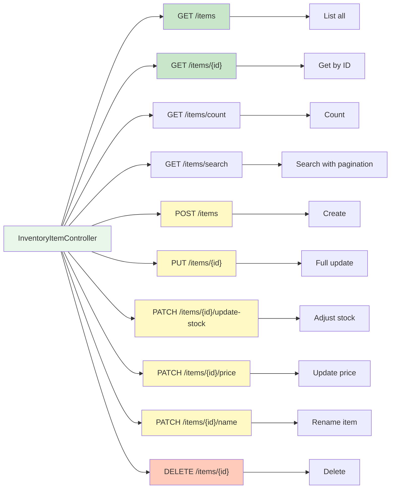

[⬅️ Back to Controller Overview](./index.md)

# Inventory Item Controller

## Overview

The `InventoryItemController` manages inventory items (products/SKUs) with full CRUD and stock update operations. Supports advanced search with pagination and sorting.

**Package:** `com.smartsupplypro.inventory.controller`  
**Base Path:** `/api/inventory`  
**Service:** `InventoryItemService`  
**Entity:** `InventoryItem` → DTO: `InventoryItemDTO`

---

## Endpoint Reference



---

## GET /api/inventory/items

**List all inventory items**

### Request

```
GET /api/inventory/items
Authorization: Bearer <token> (optional in demo mode)
```

### Authorization

`@PreAuthorize("isAuthenticated() or @appProperties.demoReadonly")`

### Response (200 OK)

```json
[
  {
    "id": "ITEM-001",
    "name": "Widget A",
    "quantity": 150,
    "price": 19.99,
    "reorderLevel": 50,
    "supplierId": "SUP-001",
    "status": "ACTIVE"
  },
  {
    "id": "ITEM-002",
    "name": "Widget B",
    "quantity": 75,
    "price": 29.99,
    "reorderLevel": 30,
    "supplierId": "SUP-001",
    "status": "ACTIVE"
  }
]
```

### Notes

- Returns **non-paginated list** (all items)
- Use `/search` endpoint for pagination
- See `InventoryItemService.getAll()`

---

## GET /api/inventory/items/{id}

**Get single inventory item**

### Request

```
GET /api/inventory/items/ITEM-001
Authorization: Bearer <token>
```

### Authorization

`@PreAuthorize("isAuthenticated()")`

### Path Parameters

| Name | Type | Description |
|------|------|-------------|
| `id` | String | Item unique identifier |

### Response (200 OK)

```json
{
  "id": "ITEM-001",
  "name": "Widget A",
  "quantity": 150,
  "price": 19.99,
  "reorderLevel": 50,
  "supplierId": "SUP-001",
  "status": "ACTIVE"
}
```

### Error Response (404 Not Found)

```json
{
  "error": "Not Found",
  "message": "Item not found",
  "status": 404
}
```

---

## GET /api/inventory/items/count

**Get total item count**

### Request

```
GET /api/inventory/items/count
Authorization: Bearer <token> (optional in demo mode)
```

### Response (200 OK)

```
1250
```

---

## GET /api/inventory/items/search

**Search items with pagination and sorting**

### Request

```
GET /api/inventory/items/search?name=widget&page=0&size=20&sort=price,desc
Authorization: Bearer <token> (optional in demo mode)
```

### Authorization

`@PreAuthorize("isAuthenticated() or @appProperties.demoReadonly")`

### Query Parameters

| Name | Type | Required | Default | Description |
|------|------|----------|---------|-------------|
| `name` | String | Yes | — | Partial name (case-insensitive) |
| `page` | Integer | No | `0` | Page number (zero-indexed) |
| `size` | Integer | No | `20` | Items per page |
| `sort` | String | No | `price` | Sort field and direction (e.g., `price,desc`) |

### Response (200 OK)

```json
{
  "content": [
    {
      "id": "ITEM-001",
      "name": "Widget A",
      "quantity": 150,
      "price": 19.99,
      "reorderLevel": 50,
      "supplierId": "SUP-001",
      "status": "ACTIVE"
    },
    {
      "id": "ITEM-002",
      "name": "Widget B",
      "quantity": 75,
      "price": 29.99,
      "reorderLevel": 30,
      "supplierId": "SUP-001",
      "status": "ACTIVE"
    }
  ],
  "pageable": {
    "pageNumber": 0,
    "pageSize": 20,
    "sort": [
      {
        "property": "price",
        "direction": "DESC"
      }
    ]
  },
  "totalElements": 485,
  "totalPages": 25,
  "first": true,
  "last": false,
  "empty": false
}
```

### Sorting

Default sort: `price` (ascending)

Available sort fields:
- `name`
- `price`
- `quantity`
- `reorderLevel`
- `createdDate`

Direction: `asc` (default) or `desc`

---

## POST /api/inventory/items

**Create new inventory item**

### Request

```
POST /api/inventory/items
Authorization: Bearer <token>
Content-Type: application/json

{
  "name": "New Widget",
  "quantity": 100,
  "price": 24.99,
  "reorderLevel": 40,
  "supplierId": "SUP-001",
  "status": "ACTIVE"
}
```

### Authorization

`@PreAuthorize("hasRole('ADMIN') and !@securityService.isDemo()")`

- ✅ ADMIN users (not in demo mode)
- ❌ USER users (all blocked)
- ❌ Demo users (all blocked, even ADMIN)

### Request Body

```java
@NotBlank(message = "Name must not be blank")
String name;

@NotNull(message = "Quantity must not be null")
@Min(value = 0, message = "Quantity must be >= 0")
Integer quantity;

@NotNull(message = "Price must not be null")
@DecimalMin(value = "0.01", message = "Price must be > 0")
BigDecimal price;

@NotNull(message = "Reorder level must not be null")
@Min(value = 0, message = "Reorder level must be >= 0")
Integer reorderLevel;

@NotNull(message = "Supplier ID must not be null")
String supplierId;

ItemStatus status;  // ACTIVE, INACTIVE, DISCONTINUED
```

### Response (201 Created)

```
Location: /api/inventory/items/ITEM-1234

{
  "id": "ITEM-1234",
  "name": "New Widget",
  "quantity": 100,
  "price": 24.99,
  "reorderLevel": 40,
  "supplierId": "SUP-001",
  "status": "ACTIVE"
}
```

---

## PUT /api/inventory/items/{id}

**Update entire inventory item**

### Request

```
PUT /api/inventory/items/ITEM-001
Authorization: Bearer <token>
Content-Type: application/json

{
  "id": "ITEM-001",
  "name": "Widget A (Updated)",
  "quantity": 150,
  "price": 21.99,
  "reorderLevel": 60,
  "supplierId": "SUP-002",
  "status": "ACTIVE"
}
```

### Authorization

`@PreAuthorize("hasRole('ADMIN') and !@securityService.isDemo()")`

- ✅ ADMIN users (not in demo mode)
- ❌ USER users (all blocked)
- ❌ Demo users (all blocked, even ADMIN)

### Response (200 OK)

```json
{
  "id": "ITEM-001",
  "name": "Widget A (Updated)",
  "quantity": 150,
  "price": 21.99,
  "reorderLevel": 60,
  "supplierId": "SUP-002",
  "status": "ACTIVE"
}
```

---

## PATCH /api/inventory/items/{id}/update-stock

**Adjust stock quantity (specialized endpoint)**

### Request

```
PATCH /api/inventory/items/ITEM-001/update-stock
Authorization: Bearer <token>
Content-Type: application/json

{
  "newQuantity": 120,
  "reason": "SOLD",
  "notes": "Sale order #12345"
}
```

### Authorization

`@PreAuthorize("hasAnyRole('USER','ADMIN') and !@securityService.isDemo()")`

- ✅ USER and ADMIN users (not in demo mode)
- ❌ Demo users (all blocked, even ADMIN)

### Path Parameters

| Name | Type | Description |
|------|------|-------------|
| `id` | String | Item ID to adjust |

### Request Body

```java
@NotNull(message = "New quantity must not be null")
@Min(value = 0, message = "Quantity must be >= 0")
Integer newQuantity;

@NotNull(message = "Reason must not be null")
StockChangeReason reason;  // RECEIVED, SOLD, ADJUSTED, DAMAGED, LOSS

String notes;  // Optional audit notes
```

### Response (200 OK)

```json
{
  "id": "ITEM-001",
  "name": "Widget A",
  "quantity": 120,
  "price": 19.99,
  "reorderLevel": 50,
  "supplierId": "SUP-001",
  "status": "ACTIVE"
}
```

### Notes

- Creates audit trail (`StockHistory` entry)
- Emits analytics events
- Validates new quantity against reorder level
- Records reason and optional notes

---

## PATCH /api/inventory/items/{id}/price

**Update item unit price**

### Request

```
PATCH /api/inventory/items/ITEM-001/price?price=24.99
Authorization: Bearer <token>
```

### Authorization

`@PreAuthorize("hasAnyRole('USER','ADMIN') and !@securityService.isDemo()")`

- ✅ USER and ADMIN users (not in demo mode)
- ❌ Demo users (all blocked, even ADMIN)

### Path Parameters

| Name | Type | Description |
|------|------|-------------|
| `id` | String | Item unique identifier |

### Query Parameters

| Name | Type | Required | Description |
|------|------|----------|-------------|
| `price` | BigDecimal | Yes | New unit price (must be > 0) |

### Response (200 OK)

```json
{
  "id": "ITEM-001",
  "name": "Widget A",
  "quantity": 150,
  "price": 24.99,
  "reorderLevel": 50,
  "supplierId": "SUP-001",
  "status": "ACTIVE"
}
```

### Error Responses

| Code | Message | Reason |
|------|---------|--------|
| 400 | Price must be > 0 | Invalid price value |
| 404 | Item not found | Item ID does not exist |

---

## PATCH /api/inventory/items/{id}/name

**Rename inventory item (ADMIN only)**

### Request

```
PATCH /api/inventory/items/ITEM-001/name?name=Widget%20A%20Pro
Authorization: Bearer <token>
```

### Authorization

`@PreAuthorize("hasRole('ADMIN') and !@securityService.isDemo()")`

- ✅ ADMIN users (not in demo mode)
- ❌ USER users (all blocked)
- ❌ Demo users (all blocked, even ADMIN)

### Path Parameters

| Name | Type | Description |
|------|------|-------------|
| `id` | String | Item unique identifier |

### Query Parameters

| Name | Type | Required | Description |
|------|------|----------|-------------|
| `name` | String | Yes | New item name (must not be empty) |

### Response (200 OK)

```json
{
  "id": "ITEM-001",
  "name": "Widget A Pro",
  "quantity": 150,
  "price": 19.99,
  "reorderLevel": 50,
  "supplierId": "SUP-001",
  "status": "ACTIVE"
}
```

### Error Responses

| Code | Message | Reason |
|------|---------|--------|
| 400 | Item name cannot be empty | Name parameter is empty or whitespace-only |
| 401 | Authentication required | No valid authentication token |
| 403 | Access denied | User does not have ADMIN role |
| 404 | Item not found | Item ID does not exist |
| 409 | An item with this name already exists for this supplier | Duplicate name within same supplier |

### Validation Rules

- **Name cannot be empty** - Must contain at least one non-whitespace character
- **Unique per supplier** - Case-insensitive duplicate detection within same supplier
- **Admin-only** - Only ADMIN users can perform rename operations
- **Item must exist** - Returns 404 if item ID not found

---

## DELETE /api/inventory/items/{id}

**Delete inventory item**

### Request

```
DELETE /api/inventory/items/ITEM-001
Authorization: Bearer <token>
```

### Authorization

`@PreAuthorize("hasRole('ADMIN') and !@securityService.isDemo()")`

- ✅ ADMIN users (not in demo mode)
- ❌ USER users (all blocked)
- ❌ Demo users (all blocked, even ADMIN)

### Response (204 No Content)

```
(empty body)
```

---

## DTOs

### InventoryItemDTO

```java
public record InventoryItemDTO(
    String id,
    String name,
    Integer quantity,
    BigDecimal price,
    Integer reorderLevel,
    String supplierId,
    ItemStatus status
) {}
```

### StockUpdateRequest

```java
public record StockUpdateRequest(
    Integer newQuantity,
    StockChangeReason reason,
    String notes
) {}
```

---

## Validation Highlights

**At Controller Level:**
- `@Valid` triggers bean validation on DTO
- `@Validated` enables method-level constraints
- Custom validators for business rules

**At Service Level:**
- Supplier exists check
- Reorder level consistency
- Stock history audit trail

---

## Testing

**Location:** `src/test/java/.../controller/inventoryitem/`

**Test Coverage:**
- ✅ CRUD operations (happy path)
- ✅ Pagination and sorting
- ✅ Stock update with audit
- ✅ Price update validation
- ✅ Rename (ADMIN-only, duplicate detection, validation)
- ✅ Not found (404)
- ✅ Unauthorized (401)
- ✅ Forbidden (403)
- ✅ Conflict (409 - duplicates)
- ✅ Validation errors (400)

**Test Files:**
- `InventoryItemControllerCreateReadTest.java` - CRUD operations
- `InventoryItemControllerPatchTest.java` - Stock and price updates
- `InventoryItemControllerRenameTest.java` - Rename functionality

---

## Summary

| Aspect | Detail |
|--------|--------|
| **Base path** | `/api/inventory/items` |
| **Operations** | List, Get, Create, Update, Delete, Search, Stock adjustment, Price update, Rename |
| **Authorization** | USER (read), ADMIN (write, stock update, price update, rename) |
| **Demo mode** | Read-only access allowed |
| **Pagination** | Default 20 items/page, max 500 |
| **Sorting** | By price, name, quantity, reorder level, created date |
| **Audit trail** | Stock updates create `StockHistory` entries |
| **DTO** | `InventoryItemDTO` (record), `StockUpdateRequest` |
| **Entity** | `InventoryItem` |
| **Service** | `InventoryItemService` |

---

[⬅️ Back to Controller Overview](./index.md)
