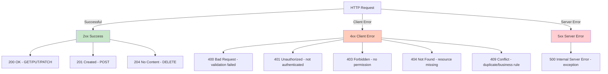

[⬅️ Back to Controller Overview](./index.md)

# Routing and Conventions

## Overview

This document establishes consistent conventions for URL routing, parameter naming, pagination, filtering, and response shapes across all API endpoints.

---

## Base Path Convention

All API endpoints are prefixed with `/api`:

```
/api/{resource}              → List all, create new
/api/{resource}/{id}         → Get by ID, update, delete
/api/{resource}/search       → Search with filters
/api/{resource}/count        → Get count (aggregate)
```

## Resource Naming

Resources are plural, lowercase, and kebab-case:

```
/api/suppliers                           ✅
/api/inventory-items                     ✅ (not inventory_items)
/api/stock-history                       ✅
/api/analytics/trends                    ✅

/api/Suppliers                           ❌ (not capitalized)
/api/supplier                            ❌ (not singular)
/api/inventoryItem                       ❌ (not camelCase)
```

## HTTP Methods

| Method | Endpoint | Semantics | Response |
|--------|----------|-----------|----------|
| **GET** | `/api/suppliers` | List all resources | 200 OK |
| **GET** | `/api/suppliers/{id}` | Get single resource | 200 OK or 404 |
| **POST** | `/api/suppliers` | Create new resource | 201 Created + Location header |
| **PUT** | `/api/suppliers/{id}` | Update entire resource | 200 OK |
| **PATCH** | `/api/suppliers/{id}` | Partial update (stock changes) | 200 OK |
| **DELETE** | `/api/suppliers/{id}` | Delete resource | 204 No Content |

### Create Response Pattern

```
POST /api/suppliers
Content-Type: application/json
{ "name": "ACME Corp" }

→ 201 Created
Location: http://api.example.com/api/suppliers/SUP-1234
Content-Type: application/json
{ "id": "SUP-1234", "name": "ACME Corp", ... }
```

The `Location` header points to the newly created resource for REST clients.

### Delete Response Pattern

```
DELETE /api/suppliers/SUP-1234

→ 204 No Content
(empty body)
```

---

## Query Parameters

### Pagination

```
GET /api/inventory/items/search?name=widget&page=0&size=20&sort=price,desc
```

| Parameter | Type | Default | Example |
|-----------|------|---------|---------|
| `page` | Integer | `0` | `/search?page=2` → 3rd page |
| `size` | Integer | `20` | `/search?size=50` → 50 items per page |
| `sort` | String | Field-dependent | `sort=price,desc` or `sort=name,asc` |

**Pagination rules:**
- Zero-indexed (page 0 = first page)
- Max size: typically 200–500 items per page (set per endpoint)
- Default sort: usually by date created (descending) or relevance

### Filtering

```
GET /api/stock-history/search?itemId=ITEM-001&reason=SOLD&startDate=2025-01-01
```

**Common filter parameters:**

| Parameter | Type | Usage |
|-----------|------|-------|
| `name` | String | Substring match (case-insensitive) |
| `itemId` | String | Exact match on item ID |
| `supplierId` | String | Exact match on supplier |
| `reason` | Enum | Stock change reason (RECEIVED, SOLD, ADJUSTED, etc.) |
| `fromDate`, `toDate` | Date | Date range filters (ISO 8601: `yyyy-MM-dd`) |
| `startDate`, `endDate` | DateTime | DateTime range filters (ISO 8601: `yyyy-MM-ddTHH:mm:ss`) |

### Query Parameter Validation

- **Required**: Explicitly marked in endpoint docs
- **Optional**: Can be omitted (use sensible defaults)
- **Format**: ISO 8601 for dates/times (e.g., `2025-11-19` or `2025-11-19T14:30:00`)
- **Encoding**: URL-encoded (spaces as `%20` or `+`)

---

## Response Shapes

### Single Resource

```json
{
  "id": "ITEM-001",
  "name": "Widget A",
  "price": 19.99,
  "quantity": 150,
  "reorderLevel": 50
}
```

**Status:** 200 OK

### List (Non-Paginated)

```json
[
  { "id": "SUP-001", "name": "ACME Corp", ... },
  { "id": "SUP-002", "name": "Global Supplies", ... }
]
```

**Status:** 200 OK

**When to use:** Small datasets (<100 items) or admin endpoints

### Paginated List

```json
{
  "content": [
    { "id": "ITEM-001", "name": "Widget A", ... },
    { "id": "ITEM-002", "name": "Widget B", ... }
  ],
  "pageable": {
    "pageNumber": 0,
    "pageSize": 20,
    "sort": [
      {
        "property": "price",
        "direction": "ASC",
        "ignoreCase": false
      }
    ]
  },
  "totalElements": 1543,
  "totalPages": 78,
  "number": 0,
  "size": 20,
  "first": true,
  "last": false,
  "empty": false
}
```

**Status:** 200 OK

**When to use:** Large result sets (>100 items), user-facing lists

### Aggregate Response (Count)

```
GET /api/suppliers/count

→ 200 OK
42
```

**Status:** 200 OK, plain number

### Error Response

```json
{
  "error": "Not Found",
  "message": "Supplier not found: SUP-999",
  "status": 404,
  "timestamp": "2025-11-19T14:30:00Z"
}
```

**Status:** 400–500 depending on error type

---

## Authorization Conventions

### Public Endpoints (Demo Mode)

```
GET /api/suppliers              ✅ Accessible without login (if demo-readonly=true)
GET /api/inventory/items        ✅ Accessible without login (if demo-readonly=true)
GET /api/analytics/trends       ✅ Accessible without login (if demo-readonly=true)
```

Annotation: `@PreAuthorize("isAuthenticated() or @appProperties.demoReadonly")`

### Authenticated Endpoints

```
GET /api/suppliers/{id}         → Requires login
POST /api/suppliers             → Requires login + ADMIN role
PUT /api/suppliers/{id}         → Requires login + ADMIN role
DELETE /api/suppliers/{id}      → Requires login + ADMIN role
```

Annotation: `@PreAuthorize("hasRole('ADMIN')")` for writes

### Read-Only Endpoints

```
GET /api/stock-history          → Read-only (no POST/PUT/DELETE)
GET /api/analytics/*            → Read-only (aggregation endpoints)
```

---

## Status Code Conventions



| Status | When | Example |
|--------|------|---------|
| **200** | Successful read/update | `GET /api/suppliers/S1` returns supplier |
| **201** | Resource created | `POST /api/suppliers` returns created supplier |
| **204** | Resource deleted (no content) | `DELETE /api/suppliers/S1` (empty body) |
| **400** | Validation failed | Missing required field, bad date format |
| **401** | Not authenticated | No OAuth2 token, session expired |
| **403** | Not authorized | Authenticated but no ADMIN role |
| **404** | Not found | `GET /api/suppliers/NONEXISTENT` |
| **409** | Conflict | Duplicate name, business rule violation |
| **500** | Unexpected error | Unhandled exception in service |

---

## Content Type

All endpoints use JSON:

```
Content-Type: application/json
Accept: application/json
```

---

## Date/Time Formats

All dates and times use **ISO 8601** format:

| Type | Format | Example |
|------|--------|---------|
| **Date** | `yyyy-MM-dd` | `2025-11-19` |
| **DateTime** | `yyyy-MM-ddTHH:mm:ss` | `2025-11-19T14:30:00` |
| **DateTime with TZ** | `yyyy-MM-ddTHH:mm:ssZ` | `2025-11-19T14:30:00Z` |

---

## Endpoint Limits

### Rate Limiting

Not currently implemented but recommended for production:

```
X-RateLimit-Limit: 1000
X-RateLimit-Remaining: 999
X-RateLimit-Reset: 1605900000
```

### Pagination Limits

```
Maximum page size: 200
Default page size: 20
```

---

## Request Validation

Controllers validate using:

- **`@Valid`**: Triggers bean validation on DTO
- **`@Validated`**: Enables method-level validation groups
- **Custom validators**: Complex business rules

Example error response:

```json
{
  "error": "Bad Request",
  "message": "Validation failed",
  "status": 400,
  "errors": [
    {
      "field": "name",
      "message": "Name must not be blank"
    },
    {
      "field": "price",
      "message": "Price must be greater than 0"
    }
  ]
}
```

---

## Security Headers

Standard HTTP security headers (set by Spring Security):

```
Strict-Transport-Security: max-age=31536000
X-Content-Type-Options: nosniff
X-Frame-Options: DENY
X-XSS-Protection: 1; mode=block
```

---

## Summary

| Aspect | Convention |
|--------|-----------|
| **Base path** | `/api/{resource}` |
| **Method** | GET, POST, PUT, PATCH, DELETE |
| **Status codes** | 200, 201, 204, 400, 401, 403, 404, 409, 500 |
| **Pagination** | `page`, `size`, `sort` query params |
| **Filtering** | Resource-specific query params |
| **Response format** | JSON with `content`, `pageable`, `totalElements` for lists |
| **Date format** | ISO 8601 (yyyy-MM-dd, yyyy-MM-ddTHH:mm:ss) |
| **Authorization** | `@PreAuthorize` annotations per endpoint |

---

[⬅️ Back to Controller Overview](./index.md)
