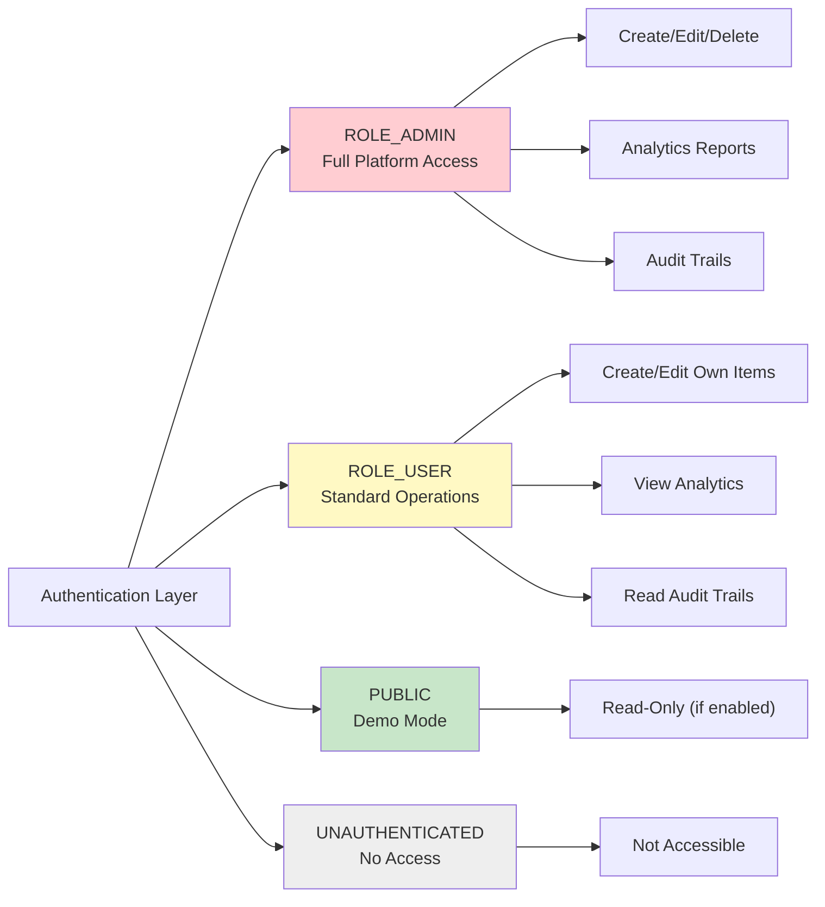

[⬅️ Back to Controller Overview](./index.md)

# Security Endpoints Matrix

## Authorization Overview

This document maps roles to endpoints across all controllers. Use this matrix to understand who can access what.

**Key Principles:**
- `ADMIN` = Full access (creation, modification, deletion, reporting)
- `USER` = Read & limited write (own data, standard operations)
- `PUBLIC` = Unauthenticated demo mode (read-only where `@appProperties.demoReadonly`)
- `AUTHENTICATED` = Any logged-in user (role-agnostic operations)

---

## Role Definitions



---

## Supplier Controller Authorization

| Endpoint | Method | Public | USER | ADMIN | Notes |
|----------|--------|--------|------|-------|-------|
| `/api/suppliers` | GET | ✅ | ✅ | ✅ | List all suppliers (paginated) |
| `/api/suppliers/{id}` | GET | ✅ | ✅ | ✅ | Get supplier by ID |
| `/api/suppliers` | POST | ❌ | ❌ | ✅ | Create supplier (ADMIN only) |
| `/api/suppliers/{id}` | PUT | ❌ | ❌ | ✅ | Update supplier (ADMIN only) |
| `/api/suppliers/{id}` | DELETE | ❌ | ❌ | ✅ | Soft delete supplier (ADMIN only) |
| `/api/suppliers/count` | GET | ✅ | ✅ | ✅ | Count suppliers |
| `/api/suppliers/search` | GET | ✅ | ✅ | ✅ | Search suppliers by name |

### Authorization Annotations

```java
// READ (Public allowed in demo mode)
@PreAuthorize("isAuthenticated() or @appProperties.demoReadonly")

// CREATE/UPDATE/DELETE (ADMIN only)
@PreAuthorize("hasRole('ADMIN')")
```

---

## Inventory Item Controller Authorization

| Endpoint | Method | Public | USER | ADMIN | Notes |
|----------|--------|--------|------|-------|-------|
| `/api/items` | GET | ✅ | ✅ | ✅ | List all items (paginated) |
| `/api/items/{id}` | GET | ✅ | ✅ | ✅ | Get item details |
| `/api/items` | POST | ❌ | ❌ | ✅ | Create item (ADMIN only) |
| `/api/items/{id}` | PUT | ❌ | ❌ | ✅ | Update item (ADMIN only) |
| `/api/items/{id}` | DELETE | ❌ | ❌ | ✅ | Soft delete item (ADMIN only) |
| `/api/items/{id}/update-stock` | PATCH | ❌ | ❌ | ✅ | Update stock quantity (ADMIN only) |
| `/api/items/count` | GET | ✅ | ✅ | ✅ | Count items |
| `/api/items/search` | GET | ✅ | ✅ | ✅ | Search items by name |

### Authorization Pattern

```java
// READ operations
@PreAuthorize("isAuthenticated() or @appProperties.demoReadonly")

// WRITE operations (stock updates, creation)
@PreAuthorize("hasRole('ADMIN')")
```

**Critical:** Stock updates (`PATCH /api/items/{id}/update-stock`) require ADMIN role and create audit trail entries via `StockHistory`.

---

## Stock History Controller Authorization

| Endpoint | Method | Public | USER | ADMIN | Notes |
|----------|--------|--------|------|-------|-------|
| `/api/stock-history` | GET | ✅ | ✅ | ✅ | List all stock changes |
| `/api/stock-history/{id}` | GET | ✅ | ✅ | ✅ | Get specific change entry |
| `/api/stock-history/by-item/{itemId}` | GET | ✅ | ✅ | ✅ | Changes for one item |
| `/api/stock-history/by-supplier/{supplierId}` | GET | ✅ | ✅ | ✅ | Changes for one supplier |

### Authorization Pattern

```java
// ALL operations (Read-only audit trail)
@PreAuthorize("isAuthenticated() or @appProperties.demoReadonly")
```

**Note:** Stock History is **immutable read-only** audit trail. No write operations exposed.

---

## Authentication Controller Authorization

| Endpoint | Method | Public | USER | ADMIN | Notes |
|----------|--------|--------|------|-------|-------|
| `/api/me` | GET | ❌ | ✅ | ✅ | Get current user profile |
| `/api/logout` | POST | ❌ | ✅ | ✅ | Invalidate session |

### Authorization Pattern

```java
// User profile & logout (Authenticated only)
@PreAuthorize("isAuthenticated()")
```

**OAuth2 Flow:**
- GET `/api/me` triggers auto-authentication if not logged in
- POST `/api/logout` clears cookies and redirects to home

---

## Analytics Controller Authorization

| Endpoint | Method | Public | USER | ADMIN | Notes |
|----------|--------|--------|------|-------|-------|
| `/api/analytics/dashboard-summary` | GET | ✅ | ✅ | ✅ | KPI dashboard |
| `/api/analytics/financial-summary` | GET | ✅ | ✅ | ✅ | P&L and inventory metrics |
| `/api/analytics/stock-value` | GET | ✅ | ✅ | ✅ | Time series data |
| `/api/analytics/stock-per-supplier` | GET | ✅ | ✅ | ✅ | Supplier distribution |
| `/api/analytics/trends/price` | GET | ✅ | ✅ | ✅ | Price trends over time |
| `/api/analytics/trends/monthly-movement` | GET | ✅ | ✅ | ✅ | Monthly activity |
| `/api/analytics/low-stock-items` | GET | ✅ | ✅ | ✅ | Items below reorder level |
| `/api/analytics/update-frequency` | GET | ✅ | ✅ | ✅ | Item activity analysis |

### Authorization Pattern

```java
// All analytics endpoints (Read-only)
@PreAuthorize("isAuthenticated() or @appProperties.demoReadonly")
```

**Feature:** Analytics are safe for public demo mode (no sensitive data mutation).

---

## Consolidated Access Matrix

```
╔══════════════════════════════════╦═══════╦══════╦═══════╗
║ Controller Group                 ║ PUBLIC║ USER ║ ADMIN ║
╠══════════════════════════════════╬═══════╬══════╬═══════╣
║ SUPPLIER - List/Get              ║   ✅  ║  ✅  ║  ✅   ║
║ SUPPLIER - Create/Update/Delete  ║   ❌  ║  ❌  ║  ✅   ║
║ INVENTORY - List/Get             ║   ✅  ║  ✅  ║  ✅   ║
║ INVENTORY - Create/Update/Delete ║   ❌  ║  ❌  ║  ✅   ║
║ INVENTORY - Update Stock         ║   ❌  ║  ❌  ║  ✅   ║
║ STOCK HISTORY - All              ║   ✅  ║  ✅  ║  ✅   ║
║ ANALYTICS - All                  ║   ✅  ║  ✅  ║  ✅   ║
║ AUTH - Get Profile/Logout        ║   ❌  ║  ✅  ║  ✅   ║
╚══════════════════════════════════╩═══════╩══════╩═══════╝
```

---

## Demo Mode Behavior

When `appProperties.demoReadonly = true`:

```java
// Public reads allowed
@PreAuthorize("isAuthenticated() or @appProperties.demoReadonly")

// Actual behavior:
if (demoReadonly) {
    // ✅ GET requests → Allowed
    // ❌ POST/PUT/PATCH/DELETE → Blocked (throws DemoModeException)
}
```

**Use Cases:**
- Public dashboards (analytics)
- Preview environments
- Sandboxes for training

---

## Security Validation Checklist

```
Before deploying:

☑ ADMIN roles assigned only to trusted users (via APP_ADMIN_EMAILS)
☑ OAuth2 configured (ClientId, ClientSecret in environment)
☑ HTTPS enabled in production (secure cookies)
☑ Session timeout configured (15–30 minutes)
☑ CSRF protection enabled (Spring Security default)
☑ Demo mode disabled in production (@appProperties.demoReadonly = false)
☑ Audit logging enabled (StockHistory captures all writes)
☑ Rate limiting configured (if using Spring Cloud)
```

---

## Role Assignment Logic

### ADMIN Role Assignment

```java
// From AuthController.java
if (APP_ADMIN_EMAILS.contains(user.getEmail())) {
    grantRole("ROLE_ADMIN");
    // Full platform access
} else {
    grantRole("ROLE_USER");
    // Read + limited write access
}
```

**Configuration:** Set via environment variable:
```
APP_ADMIN_EMAILS=admin@company.com,ops@company.com
```

---

## Summary

| Role | Access Level | Typical Users | Use Case |
|------|--------------|---------------|----------|
| **PUBLIC** | Read-only | Unauthenticated demo visitors | Dashboards, demo environments |
| **USER** | Read + Limited Write | Employees, staff | Daily operations, item viewing |
| **ADMIN** | Full CRUD | Managers, ops team | System configuration, creation, deletion |

**Default:** Users logged in via OAuth2 get `ROLE_USER`. Admins require email in `APP_ADMIN_EMAILS`.

---

[⬅️ Back to Controller Overview](./index.md)
