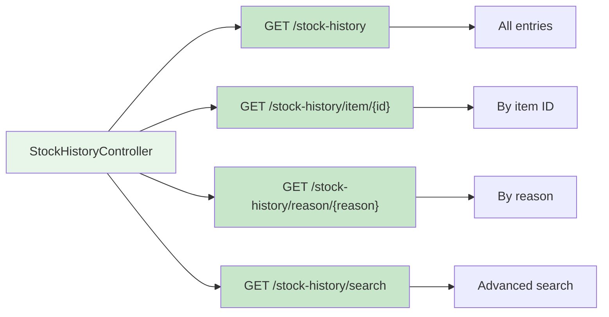
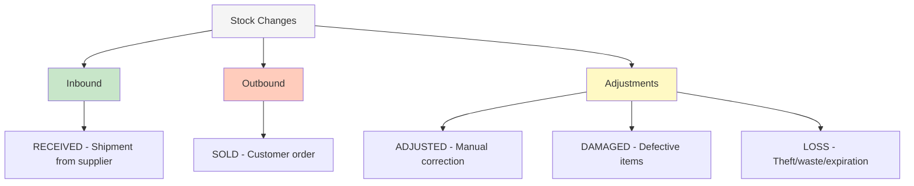

[⬅️ Back to Controller Overview](./index.md)

# Stock History Controller

## Overview

The `StockHistoryController` provides **read-only** access to the stock change audit trail. Stock history tracks every inventory adjustment with timestamps, reasons, and notes for compliance and analysis.

**Package:** `com.smartsupplypro.inventory.controller`  
**Base Path:** `/api/stock-history`  
**Service:** `StockHistoryService`  
**Entity:** `StockHistory` → DTO: `StockHistoryDTO`

**Important:** This is a **read-only** endpoint. Stock changes are created by the Inventory Item Controller's stock update endpoint, not directly via this controller.

---

## Endpoint Reference



---

## GET /api/stock-history

**Retrieve all stock history entries**

### Request

```
GET /api/stock-history
Authorization: Bearer <token>
```

### Authorization

`@PreAuthorize("hasAnyRole('ADMIN','USER')")`

- ✅ Authenticated users only
- ❌ Demo mode
- ❌ Anonymous

### Response (200 OK)

```json
[
  {
    "id": "SH-001",
    "itemId": "ITEM-001",
    "itemName": "Widget A",
    "previousQuantity": 150,
    "newQuantity": 140,
    "changeQuantity": -10,
    "reason": "SOLD",
    "notes": "Sale order #12345",
    "supplierId": "SUP-001",
    "supplierName": "ACME Corp",
    "timestamp": "2025-11-19T14:30:00Z",
    "userId": "user@example.com"
  },
  {
    "id": "SH-002",
    "itemId": "ITEM-001",
    "itemName": "Widget A",
    "previousQuantity": 150,
    "newQuantity": 150,
    "changeQuantity": 0,
    "reason": "ADJUSTMENT",
    "notes": "Inventory count correction",
    "supplierId": "SUP-001",
    "supplierName": "ACME Corp",
    "timestamp": "2025-11-19T10:15:00Z",
    "userId": "admin@example.com"
  }
]
```

### Notes

- Returns **non-paginated list** (all history)
- Use `/search` for paginated, filtered results
- Sorted by timestamp (descending) — newest first

---

## GET /api/stock-history/item/{itemId}

**Get stock history for specific item**

### Request

```
GET /api/stock-history/item/ITEM-001
Authorization: Bearer <token>
```

### Authorization

`@PreAuthorize("hasAnyRole('ADMIN','USER')")`

### Path Parameters

| Name | Type | Description |
|------|------|-------------|
| `itemId` | String | Inventory item ID |

### Response (200 OK)

```json
[
  {
    "id": "SH-001",
    "itemId": "ITEM-001",
    "itemName": "Widget A",
    "previousQuantity": 150,
    "newQuantity": 140,
    "changeQuantity": -10,
    "reason": "SOLD",
    "notes": "Sale order #12345",
    "supplierId": "SUP-001",
    "supplierName": "ACME Corp",
    "timestamp": "2025-11-19T14:30:00Z",
    "userId": "user@example.com"
  }
]
```

### Use Cases

- View audit trail for specific product
- Track stock changes for a SKU
- Investigate inventory discrepancies

---

## GET /api/stock-history/reason/{reason}

**Filter stock history by change reason**

### Request

```
GET /api/stock-history/reason/SOLD
Authorization: Bearer <token>
```

### Authorization

`@PreAuthorize("hasAnyRole('ADMIN','USER')")`

### Path Parameters

| Name | Type | Description |
|------|------|-------------|
| `reason` | Enum | Stock change reason |

### Valid Reasons

```
RECEIVED       → Inbound stock received from supplier
SOLD           → Stock sold to customer
ADJUSTED       → Manual inventory adjustment
DAMAGED        → Stock damaged or defective
LOSS           → Stock loss (theft, waste, expiration)
```

### Response (200 OK)

```json
[
  {
    "id": "SH-001",
    "itemId": "ITEM-001",
    "itemName": "Widget A",
    "previousQuantity": 150,
    "newQuantity": 140,
    "changeQuantity": -10,
    "reason": "SOLD",
    "notes": "Sale order #12345",
    "supplierId": "SUP-001",
    "supplierName": "ACME Corp",
    "timestamp": "2025-11-19T14:30:00Z",
    "userId": "user@example.com"
  }
]
```

### Use Cases

- Find all received shipments
- Track sold items
- Audit damage/loss incidents
- Verify adjustments

---

## GET /api/stock-history/search

**Advanced paginated search with multiple filters**

### Request

```
GET /api/stock-history/search?startDate=2025-11-01T00:00:00&endDate=2025-11-30T23:59:59&itemName=widget&supplierId=SUP-001&page=0&size=50
Authorization: Bearer <token>
```

### Authorization

`@PreAuthorize("hasAnyRole('ADMIN','USER')")`

### Query Parameters

| Name | Type | Required | Description |
|------|------|----------|-------------|
| `startDate` | DateTime | No | Inclusive start (ISO-8601: `yyyy-MM-ddTHH:mm:ss`) |
| `endDate` | DateTime | No | Inclusive end (ISO-8601: `yyyy-MM-ddTHH:mm:ss`) |
| `itemName` | String | No | Partial item name filter |
| `supplierId` | String | No | Supplier ID filter |
| `reason` | Enum | No | Stock change reason filter |
| `page` | Integer | No | Page number (default: 0) |
| `size` | Integer | No | Items per page (default: 20, max: 200) |

### Response (200 OK)

```json
{
  "content": [
    {
      "id": "SH-001",
      "itemId": "ITEM-001",
      "itemName": "Widget A",
      "previousQuantity": 150,
      "newQuantity": 140,
      "changeQuantity": -10,
      "reason": "SOLD",
      "notes": "Sale order #12345",
      "supplierId": "SUP-001",
      "supplierName": "ACME Corp",
      "timestamp": "2025-11-19T14:30:00Z",
      "userId": "user@example.com"
    }
  ],
  "pageable": {
    "pageNumber": 0,
    "pageSize": 50,
    "sort": [
      {
        "property": "timestamp",
        "direction": "DESC"
      }
    ]
  },
  "totalElements": 1254,
  "totalPages": 26,
  "first": true,
  "last": false,
  "empty": false
}
```

### Default Sorting

- **Primary:** Timestamp (descending) — newest first
- **Secondary:** Item ID

### Common Queries

**All sales in November:**

```
/search?reason=SOLD&startDate=2025-11-01T00:00:00&endDate=2025-11-30T23:59:59
```

**Items received from supplier:**

```
/search?supplierId=SUP-001&reason=RECEIVED
```

**Recent adjustments:**

```
/search?reason=ADJUSTED&startDate=2025-11-15T00:00:00
```

**Damage/loss audit:**

```
/search?reason=DAMAGED&reason=LOSS
```

---

## StockHistoryDTO

```java
public record StockHistoryDTO(
    String id,
    String itemId,
    String itemName,
    Integer previousQuantity,
    Integer newQuantity,
    Integer changeQuantity,      // new - previous
    StockChangeReason reason,
    String notes,
    String supplierId,
    String supplierName,
    LocalDateTime timestamp,
    String userId                // Email of user who made change
) {}
```

---

## Audit Trail Properties

| Property | Purpose |
|----------|---------|
| `id` | Unique history entry ID |
| `itemId` | Which inventory item changed |
| `itemName` | Item name (denormalized for query performance) |
| `previousQuantity` | Stock level before change |
| `newQuantity` | Stock level after change |
| `changeQuantity` | Net change (new - previous) |
| `reason` | Category of change (SOLD, RECEIVED, etc.) |
| `notes` | Optional details (order #, damage description) |
| `supplierId` | Supplier reference (denormalized) |
| `supplierName` | Supplier name (denormalized) |
| `timestamp` | When change occurred (UTC) |
| `userId` | Who made the change (email) |

---

## Stock Change Reasons



---

## Compliance & Audit

**Use cases:**

- **Inventory audits**: Verify stock movements match physical counts
- **Variance investigation**: Find unexplained quantity changes
- **Compliance reporting**: Document all stock movements for auditors
- **Damage tracking**: Identify patterns in damage/loss incidents
- **Supplier analysis**: Track received quantities vs. orders
- **Sales reporting**: Analyze sold items by date/supplier

---

## Pagination Limits

```
Default page size: 20
Maximum page size: 200
```

For large date ranges, pagination is recommended to avoid performance issues.

---

## Performance Considerations

**Indexed columns** (for fast queries):
- `itemId`
- `timestamp`
- `reason`
- `supplierId`

**Recommendation**: Use date range filters to avoid scanning entire table.

---

## Testing

**Location:** `src/test/java/.../controller/stockhistory/`

**Test Coverage:**
- ✅ List all (non-paginated)
- ✅ Get by item ID
- ✅ Filter by reason
- ✅ Advanced search with multiple filters
- ✅ Pagination and sorting
- ✅ Authorization checks
- ✅ Date range validation

---

## Summary

| Aspect | Detail |
|--------|--------|
| **Base path** | `/api/stock-history` |
| **Operations** | Read-only (List, Get, Filter, Search) |
| **Authorization** | USER + ADMIN only (authenticated) |
| **Demo mode** | Not accessible |
| **Pagination** | Default 20/page, max 200 |
| **Sorting** | By timestamp (descending) |
| **Audit trail** | Complete change history with user tracking |
| **DTO** | `StockHistoryDTO` |
| **Entity** | `StockHistory` |
| **Service** | `StockHistoryService` |
| **Data source** | Created by inventory item stock updates |

---

[⬅️ Back to Controller Overview](./index.md)
