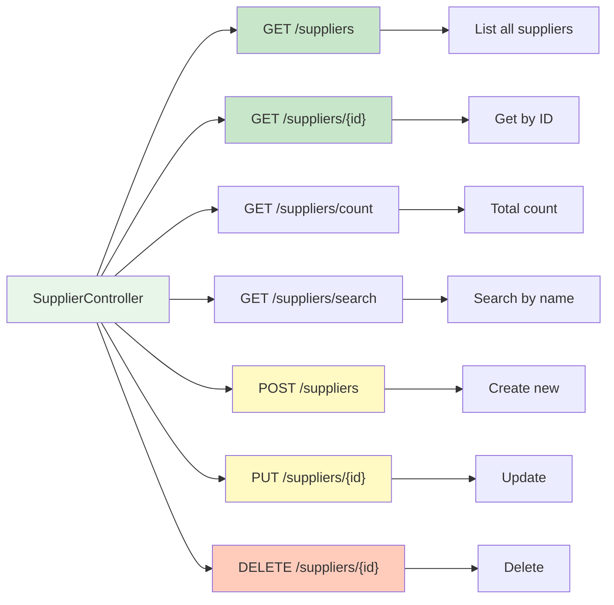
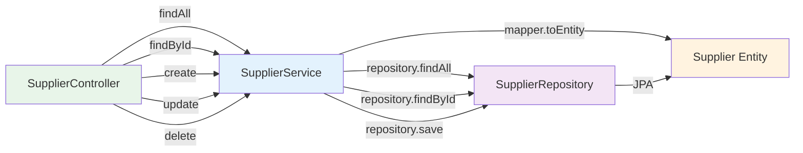

[⬅️ Back to Controller Overview](./index.md)

# Supplier Controller

## Overview

The `SupplierController` handles CRUD operations for supplier management. Suppliers are vendors from which inventory is purchased.

**Package:** `com.smartsupplypro.inventory.controller`  
**Base Path:** `/api/suppliers`  
**Service:** `SupplierService`  
**Entity:** `Supplier` → DTO: `SupplierDTO`

---

## Endpoint Reference



---

## GET /api/suppliers

**List all suppliers**

### Request

```
GET /api/suppliers
Authorization: Bearer <token> (optional in demo mode)
```

### Authorization

`@PreAuthorize("isAuthenticated() or @appProperties.demoReadonly")`

- ✅ Public in demo mode
- ✅ Any authenticated user
- ❌ Anonymous (unless demo mode)

### Response (200 OK)

```json
[
  {
    "id": "SUP-001",
    "name": "ACME Corp",
    "contactName": "John Smith",
    "phone": "555-1234",
    "email": "contact@acme.com",
    "address": "123 Main St, New York, NY"
  },
  {
    "id": "SUP-002",
    "name": "Global Supplies",
    "contactName": "Jane Doe",
    "phone": "555-5678",
    "email": "orders@globalsupplies.com",
    "address": "456 Oak Ave, Los Angeles, CA"
  }
]
```

### Notes

- Returns **non-paginated list** (all suppliers)
- Use `/search` endpoint for pagination
- See `SupplierService.findAll()`

---

## GET /api/suppliers/{id}

**Get single supplier by ID**

### Request

```
GET /api/suppliers/SUP-001
Authorization: Bearer <token>
```

### Authorization

`@PreAuthorize("isAuthenticated()")`

- ✅ Authenticated users
- ❌ Demo mode (read-only, not allowed)

### Path Parameters

| Name | Type | Description |
|------|------|-------------|
| `id` | String | Supplier unique identifier |

### Response (200 OK)

```json
{
  "id": "SUP-001",
  "name": "ACME Corp",
  "contactName": "John Smith",
  "phone": "555-1234",
  "email": "contact@acme.com",
  "address": "123 Main St, New York, NY"
}
```

### Error Response (404 Not Found)

```json
{
  "error": "Not Found",
  "message": "Supplier not found: SUP-999",
  "status": 404
}
```

---

## GET /api/suppliers/count

**Get total supplier count**

### Request

```
GET /api/suppliers/count
Authorization: Bearer <token> (optional in demo mode)
```

### Authorization

`@PreAuthorize("isAuthenticated() or @appProperties.demoReadonly")`

### Response (200 OK)

```
42
```

Plain number response, no JSON wrapper.

---

## GET /api/suppliers/search

**Search suppliers by name**

### Request

```
GET /api/suppliers/search?name=acme
Authorization: Bearer <token> (optional in demo mode)
```

### Authorization

`@PreAuthorize("isAuthenticated() or @appProperties.demoReadonly")`

### Query Parameters

| Name | Type | Required | Description |
|------|------|----------|-------------|
| `name` | String | Yes | Partial name to search (case-insensitive) |

### Response (200 OK)

```json
[
  {
    "id": "SUP-001",
    "name": "ACME Corp",
    "contactName": "John Smith",
    ...
  }
]
```

### Notes

- Substring match (e.g., "acme" matches "ACME Corp")
- Case-insensitive
- Returns **non-paginated list**

---

## POST /api/suppliers

**Create new supplier**

### Request

```
POST /api/suppliers
Authorization: Bearer <token>
Content-Type: application/json

{
  "name": "New Supplier Inc",
  "contactName": "Manager Name",
  "phone": "555-9999",
  "email": "manager@newsupplier.com",
  "address": "789 Pine St, Chicago, IL"
}
```

### Authorization

`@PreAuthorize("hasRole('ADMIN') and !@securityService.isDemo()")`

- ✅ ADMIN users (not in demo mode)
- ❌ USER users (all blocked)
- ❌ Demo users (all blocked, even ADMIN)

### Request Body

```java
@NotNull(message = "Name must not be null")
@NotBlank(message = "Name must not be blank")
String name;

@NotNull(message = "Contact name must not be null")
String contactName;

String phone;      // Optional
String email;      // Optional
String address;    // Optional
```

### Validation Rules

- `name`: Required, non-blank
- `contactName`: Required, non-null
- `id`: Must be **null** (server generates ID)

### Response (201 Created)

```
Location: /api/suppliers/SUP-1234
Content-Type: application/json

{
  "id": "SUP-1234",
  "name": "New Supplier Inc",
  "contactName": "Manager Name",
  "phone": "555-9999",
  "email": "manager@newsupplier.com",
  "address": "789 Pine St, Chicago, IL"
}
```

### Error Response (400 Bad Request)

```json
{
  "error": "Bad Request",
  "message": "ID must be null on create",
  "status": 400
}
```

---

## PUT /api/suppliers/{id}

**Update supplier**

### Request

```
PUT /api/suppliers/SUP-001
Authorization: Bearer <token>
Content-Type: application/json

{
  "id": "SUP-001",
  "name": "ACME Corp (Updated)",
  "contactName": "John Smith",
  "phone": "555-1111",
  "email": "newemail@acme.com",
  "address": "789 Main St, New York, NY"
}
```

### Authorization

`@PreAuthorize("hasRole('ADMIN') and !@securityService.isDemo()")`

- ✅ ADMIN users (not in demo mode)
- ❌ USER users (all blocked)
- ❌ Demo users (all blocked, even ADMIN)

### Path Parameters

| Name | Type | Description |
|------|------|-------------|
| `id` | String | Supplier ID to update |

### Request Body

All fields required (full replacement):

```java
@NotNull(message = "ID must not be null")
String id;

@NotNull(message = "Name must not be null")
@NotBlank(message = "Name must not be blank")
String name;

String contactName;
String phone;
String email;
String address;
```

### Response (200 OK)

```json
{
  "id": "SUP-001",
  "name": "ACME Corp (Updated)",
  "contactName": "John Smith",
  "phone": "555-1111",
  "email": "newemail@acme.com",
  "address": "789 Main St, New York, NY"
}
```

---

## DELETE /api/suppliers/{id}

**Delete supplier**

### Request

```
DELETE /api/suppliers/SUP-001
Authorization: Bearer <token>
```

### Authorization

`@PreAuthorize("hasRole('ADMIN') and !@securityService.isDemo()")`

- ✅ ADMIN users (not in demo mode)
- ❌ USER users (all blocked)
- ❌ Demo users (all blocked, even ADMIN)

### Path Parameters

| Name | Type | Description |
|------|------|-------------|
| `id` | String | Supplier ID to delete |

### Response (204 No Content)

```
(empty body)
```

### Notes

- No response body
- Cascading behavior: Depends on database constraints
- Associated inventory items may be affected

---

## DTOs

### SupplierDTO

```java
public record SupplierDTO(
    String id,
    String name,
    String contactName,
    String phone,
    String email,
    String address
) {}
```

**Mapping:**
- Request: JSON → `SupplierDTO`
- Response: `Supplier` entity → `SupplierDTO`

---

## Testing

**Location:** `src/test/java/.../controller/supplier/`

**Test Classes:**
- `SupplierControllerTest` — CRUD operations
- Integration tests with MockMvc

**Coverage:**
- ✅ Happy path (201, 200)
- ✅ Not found (404)
- ✅ Unauthorized (401)
- ✅ Forbidden (403)
- ✅ Validation errors (400)

---

## Service Integration



---

## Summary

| Aspect | Detail |
|--------|--------|
| **Base path** | `/api/suppliers` |
| **Operations** | List, Get, Create, Update, Delete, Search, Count |
| **Authorization** | USER (read), ADMIN (write) |
| **Demo mode** | Read-only access allowed |
| **DTO** | `SupplierDTO` (immutable record) |
| **Entity** | `Supplier` |
| **Service** | `SupplierService` |
| **Tests** | `src/test/java/.../controller/supplier/` |

---

[⬅️ Back to Controller Overview](./index.md)
