[⬅️ Back to Deployment Index](./index.html)

# CI/CD & Documentation Pipeline

## Overview

Smart Supply Pro uses **GitHub Actions** for fully automated continuous integration and continuous deployment. Three coordinated workflows ensure code is tested, documented, and deployed:

1. **1️⃣ Backend CI – Build & Test** (`1-ci-test.yml`) – Compile, test, build Docker image, scan for CVEs
2. **2️⃣ Documentation Pipeline** (`docs-pipeline.yml` + `2-deploy-ghpages.yml`) – Generate API/architecture docs, publish to GitHub Pages
3. **3️⃣ Deployment to Fly.io** (`3-deploy-fly.yml`) – Deploy to production (automatic after CI passes)

This document explains the workflow coordination, key steps, and how documentation is generated and published.

## Workflow Architecture

```mermaid
graph TD
    A["📝 Commit to main"] -->|Push| B["1️⃣ CI Build & Test<br/>(1-ci-test.yml)"]
    
    B -->|Stage 1: Compile| C["Maven: compile + test"]
    C -->|Stage 2: Package| D["Generate JaCoCo coverage<br/>Build Docker image<br/>Push to registry"]
    D -->|Stage 3: Security| E["Trivy scan<br/>Block on HIGH/CRITICAL"]
    
    E -->|✅ Pass| F["Artifacts ready"]
    E -->|❌ Fail| G["🚫 Deployment blocked"]
    
    F -->|Trigger| H["docs-pipeline.yml<br/>Build documentation"]
    F -->|Trigger| I["3-deploy-fly.yml<br/>Deploy to production"]
    
    H -->|Generate| J["OpenAPI docs<br/>Architecture HTML<br/>JaCoCo coverage"]
    J -->|Output| K["docs-site artifact"]
    
    K -->|Trigger| L["2-deploy-ghpages.yml<br/>Publish to gh-pages"]
    L -->|Git push| M["📚 GitHub Pages<br/>(Live docs)"]
    
    I -->|Validate| N["Health check<br/>Smoke tests"]
    N -->|✅ Healthy| O["🚀 Live App<br/>(https://inventoryservice.fly.dev)"]
    
    style B fill:#fff3e0
    style C fill:#f3e5f5
    style D fill:#f3e5f5
    style E fill:#fce4ec
    style H fill:#e3f2fd
    style J fill:#e1f5fe
    style M fill:#c8e6c9
    style O fill:#a5d6a7
```



## Workflow 1️⃣: CI Build & Test (`1-ci-test.yml`)

### Trigger
- Push to `main` or `develop` branch
- Changes in: backend source, `pom.xml`, Dockerfile, CI workflow itself
- Manual trigger: `workflow_dispatch`

### Pipeline Steps

| Step | Action | Input | Output | Purpose |
|------|--------|-------|--------|---------|
| 1 | Checkout code | Git commit | Source tree | Prepare build environment |
| 2 | Resolve backend path | `pom.xml` location | `$BACKEND_DIR` env var | Support repo-root or subdir layout |
| 3 | Set up JDK 17 | Temurin distribution | Java compiler | Compile with Java 17 |
| 4 | Cache Maven deps | `.m2` directory | Warm cache | Speed up dependency resolution |
| 5 | Build & Test | `mvn clean verify` | Tests, JaCoCo report | Compile, unit tests, integration tests |
| 6 | Display Spring versions | `mvn dependency:list` | Version report | Verify Spring Core & Security versions |
| 7 | Generate JaCoCo | `target/site/jacoco/` | HTML report | Code coverage metrics |
| 8 | Upload JaCoCo artifact | HTML files | `jacoco-html-{SHA}` artifact | Make available for docs pipeline |
| 9 | Docker login | Docker Hub credentials | Auth token | Prepare for image push |
| 10 | Build Docker image | Dockerfile, JAR, deps | `inventory-service:SHA` + `:latest` | Package for deployment |
| 11 | Inspect image | Run container, check contents | Verification output | Ensure prod image quality |
| 12 | Push Docker image | Auth + image | Registry entry | Store immutable artifact |
| 13 | Trivy scan | Docker image | CVE report | Block deployment if HIGH/CRITICAL |
| 14 | Job summary | Status, image tags | GitHub summary | Report results to developer |

### Example: Build & Test Step

```bash
mvn -U clean verify \
  -Dspring.profiles.active=test \
  -Dtestcontainers.enabled=false
```

Flags:
- `-U` – Update snapshots (fresh dependencies)
- `clean verify` – Full lifecycle (compile → test → package → verify)
- `-Dspring.profiles.active=test` – Use H2 database, test config
- `-Dtestcontainers.enabled=false` – Skip Docker-based integration tests in CI

### Security Gate: Trivy Vulnerability Scan

After image is built and pushed:

```bash
trivy image ckbuzin/inventory-service:${IMAGE_TAG_SHA} \
  --severity CRITICAL,HIGH \
  --exit-code 1
```

**Behavior:**
- Scans image for known CVEs in OS packages and libraries
- Reports only `CRITICAL` and `HIGH` severity
- **Blocks deployment** if vulnerabilities found (`exit-code: 1`)
- **Allows deployment** if no HIGH/CRITICAL (LOW/MEDIUM/unknown are logged)

**Example failure:**
```
CRITICAL   3 vulnerabilities found in base image
  - openssl 3.0.0 → Use 3.0.5 or later
  - glibc 2.31 → Use 2.34 or later
Exit code: 1 → Deployment blocked
```

**Resolution:**
1. Update base image in Dockerfile (e.g., newer `eclipse-temurin:17-jre`)
2. Or update vulnerable library in `pom.xml`
3. Push new commit → Re-run CI → Retry scan

### Artifacts Produced

| Artifact | Location | Size | Purpose | Consumed By |
|----------|----------|------|---------|-------------|
| `jacoco-html-{SHA}` | GitHub Actions artifact store | ~5 MB | Code coverage report | docs-pipeline.yml |
| Docker image | Docker Hub (`ckbuzin/inventory-service`) | ~400 MB | Packaged app | 3-deploy-fly.yml, docker pull |
| Test results | CI logs | (inline) | JUnit report | GitHub, developer review |

## Workflow 2️⃣: Documentation Pipeline (`docs-pipeline.yml` + `2-deploy-ghpages.yml`)

### Trigger
- Automatic: After `1-ci-test.yml` succeeds (via `workflow_run`)
- Manual: Direct push to `main` if docs/ or scripts/ changed

### Key Insight: Dual-Trigger Design

**Why two triggers?**

1. **After CI (workflow_run):** Rebuild docs whenever code changes
   - Ensures OpenAPI, coverage, architecture stay fresh
   - Consumes JaCoCo artifact from CI
   
2. **Direct push (direct trigger):** Rapid docs-only updates
   - Allows emergency doc fixes without rebuilding code
   - Skips JaCoCo (optional, not always available)

### Step 1: Build Documentation (`docs-pipeline.yml`)

#### Tools Used

| Tool | Purpose | Input | Output |
|------|---------|-------|--------|
| **Redocly CLI** | OpenAPI → interactive HTML docs | `docs/api/openapi/openapi.yaml` | ReDoc HTML site |
| **Pandoc** | Markdown → HTML conversion | `.md` architecture files | Static HTML pages |
| **Lua filter** | Mermaid diagram rendering in HTML | `mermaid` code blocks | Rendered diagrams |
| **Bash scripts** | Orchestrate build + artifact assembly | Source markdown + images | `docs-site/` directory |

#### Documentation Structure

```
docs-site/
├── index.html                    # Portal entry point
├── api/
│   ├── openapi.html             # Swagger/ReDoc interactive
│   └── index.html               # API overview
├── architecture/
│   ├── overview.html
│   ├── layers/
│   ├── resources/
│   ├── deployment/
│   └── ...                       # All architecture guides as HTML
├── backend/
│   ├── coverage/                # JaCoCo HTML report (from CI)
│   │   ├── index.html
│   │   ├── inventory-service/
│   │   └── ... (line-by-line coverage)
│   └── api/
└── ...
```

#### Build Scripts

**`scripts/build-openapi-docs.sh`**
```bash
#!/bin/bash
PROJECT_DIR=$1

# Install Redocly CLI (or use pre-installed)
npm install -g @redocly/cli

# Convert OpenAPI YAML → ReDoc HTML
redocly build-docs \
  $PROJECT_DIR/docs/api/openapi/openapi.yaml \
  -o $PROJECT_DIR/target/docs/api/openapi.html
```

**`scripts/build-architecture-docs.sh`**
```bash
#!/bin/bash
PROJECT_DIR=$1

# Install Pandoc
apt-get install pandoc

# Convert each markdown file to HTML with Lua filter for mermaid
for file in $PROJECT_DIR/docs/architecture/**/*.md; do
  output_file="${file%.md}.html"
  pandoc "$file" \
    --filter /path/to/mermaid-filter.lua \
    --template template.html \
    -o "$output_file"
done
```

**Lua Filter for Mermaid (`mermaid-filter.lua`)**
```lua
function CodeBlock(el)
  if el.classes:includes("mermaid") then
    -- Wrap in <div class="mermaid"> for mermaid.js to render
    return pandoc.RawBlock(
      'html',
      '<div class="mermaid">' .. el.text .. '</div>'
    )
  end
end
```

When HTML is served, mermaid.js renders the diagrams client-side.

### Step 2: Publish to GitHub Pages (`2-deploy-ghpages.yml`)

#### Why Separate Workflow?

- **Separation of concerns:** Build docs ≠ publish docs
- **Artifact staging:** docs-site is intermediate artifact
- **Coverage preservation:** If current build skips coverage, old coverage is retained
- **Deployment safety:** Can republish without rebuilding

#### Steps

```yaml
- name: Checkout gh-pages branch
  uses: actions/checkout@v4
  with:
    ref: gh-pages
    fetch-depth: 0

- name: Download docs-site artifact
  uses: actions/download-artifact@v4
  with:
    name: docs-site

- name: Preserve JaCoCo coverage if missing
  run: |
    if [ ! -d "docs-site/backend/coverage" ] && [ -d "backend/coverage" ]; then
      # Current build doesn't have coverage, but old one does
      mkdir -p /tmp/coverage-backup
      cp -R backend/coverage /tmp/coverage-backup/
      # ... (later restore)
    fi

- name: Sync docs-site to gh-pages root
  run: |
    # Remove everything except .git and docs-site
    find . -mindepth 1 -maxdepth 1 ! -name '.git' ! -name 'docs-site' -exec rm -rf {} +
    # Copy docs-site contents to root
    cp -R docs-site/* .
    # Restore coverage if preserved
    # ...

- name: Commit and push to gh-pages
  run: |
    git config user.name "github-actions[bot]"
    git config user.email "github-actions[bot]@users.noreply.github.com"
    
    if git status --porcelain | grep .; then
      git add .
      git commit -m "docs: publish docs-site"
      git push origin gh-pages
    else
      echo "No changes to publish"
    fi
```

### Output: Live Documentation

After push to `gh-pages`, documentation is live at:
```
https://keglev.github.io/inventory-service/
```

Site structure:
- `/` → `index.html` (portal)
- `/api/` → OpenAPI/ReDoc documentation
- `/architecture/` → Architecture guides (deployment, resources, etc.)
- `/backend/coverage/` → JaCoCo test coverage report

## Workflow 3️⃣: Deploy to Fly.io (`3-deploy-fly.yml`)

See [Fly.io Infrastructure](./flyio-infrastructure.html) for detailed deployment steps.

### Quick Summary

- **Trigger:** Automatic after CI success, OR manual via `workflow_dispatch`
- **Steps:**
  1. Validate Docker image exists in registry
  2. Verify Fly.io app exists
  3. Deploy: `flyctl deploy --image {SHA} --strategy immediate`
  4. Health check: Poll `/health` until HEALTHY (5-min timeout)
  5. Smoke tests: Validate API endpoints
  6. Report status

## Artifact Flow Diagram

```mermaid
graph LR
    A["JaCoCo Report<br/>(from CI)"] -->|artifact upload| B["jacoco-html-{SHA}<br/>(GitHub Actions)"]
    B -->|download| C["docs-pipeline.yml"]
    C -->|include| D["docs-site artifact"]
    
    E["OpenAPI YAML<br/>(code annotations)"] -->|build| C
    F["Architecture .md<br/>(git repo)"] -->|build| C
    
    D -->|download| G["2-deploy-ghpages.yml"]
    G -->|git push| H["gh-pages branch"]
    H -->|GitHub Pages| I["📚 Live Docs<br/>(https://...)"]
    
    style B fill:#e1f5fe
    style D fill:#e1f5fe
    style I fill:#c8e6c9
```



## Scripts Organization

### `/scripts/` Directory

```
scripts/
├── build-openapi-docs.sh      # Redocly: OpenAPI YAML → HTML
├── build-architecture-docs.sh # Pandoc: Markdown → HTML
├── mermaid-filter.lua         # Pandoc filter for mermaid diagrams
├── deploy-docs-scripts/       # (Optional) local deployment helpers
└── ...
```

These scripts are invoked by `docs-pipeline.yml` in CI environment.

## Troubleshooting

### Docs Build Fails: "Redocly CLI not found"
- Ensure `npm install -g @redocly/cli` in workflow step
- Check npm version compatibility (Node.js 20+)
- Review Redocly syntax: `redocly lint docs/api/openapi.yaml`

### Pandoc Conversion Fails: "Command not found"
- Install Pandoc: `apt-get install pandoc`
- Verify Lua filter path is correct
- Check Markdown syntax (review .md file)

### Mermaid Diagrams Not Rendering
- Verify Lua filter is wrapping code block in `<div class="mermaid">`
- Ensure HTML includes: `<script src="https://cdn.jsdelivr.net/npm/mermaid/dist/mermaid.min.js"></script>`
- Check diagram syntax: `mmdc -i diagram.md -o diagram.html`

### JaCoCo Coverage Missing from Docs
- Normal for docs-only pushes (JaCoCo only generated by CI)
- 2-deploy-ghpages.yml preserves old coverage if current build skips it
- To refresh coverage: Re-run `1-ci-test.yml`

### gh-pages Push Fails: "Permission denied"
- Verify GitHub token has `contents: write` permission
- Check branch is `gh-pages` (case-sensitive)
- Ensure git user is configured: `git config user.name/email`

### Docs Artifacts Too Large
- Review what's in `docs-site/` artifact
- Remove unnecessary images, large generated files
- Compress coverage HTML if needed
- Consider cleanup: `find . -name "*.tmp" -delete`

## Related Documentation

- **[Deployment Index](./index.html)** – Overview of entire pipeline
- **[Build & Docker Image](./build-and-docker-image.html)** – Maven and Docker build details
- **[Fly.io Infrastructure](./flyio-infrastructure.html)** – Production deployment
- **[Architecture Overview](../overview.html)** – System design

---

**Last Updated:** November 2025  
**Audience:** DevOps engineers, documentation maintainers, CI/CD administrators
