[⬅️ Back to Architecture Index](../index.html)

# Deployment Architecture & Operations

## Overview

Smart Supply Pro backend deployment follows a **fully automated, immutable infrastructure** approach:

```
Source Code → Maven Build → Docker Image → Fly.io Production
```

Every commit to `main` triggers a streamlined pipeline that builds, tests, packages, and deploys the backend service automatically. This documentation explains each stage and the files involved.

## Deployment Flow Diagram

```mermaid
graph LR
    A["📝 Source Code<br/>(main branch)"] -->|Git Push| B["1️⃣ CI Build<br/>(1-ci-test.yml)"]
    B -->|Maven + Tests| C["📦 Docker Image<br/>(Dockerfile)"]
    C -->|Trivy Scan| D["🔐 Security Gate<br/>(HIGH/CRITICAL)"]
    D -->|Pass| E["☁️ Docker Hub<br/>(ckbuzin/inventory-service)"]
    E -->|Manifest Ready| F["3️⃣ Deploy<br/>(3-deploy-fly.yml)"]
    F -->|flyctl deploy| G["🚀 Fly.io App<br/>(inventoryservice)"]
    G -->|Health Check| H["✅ Live<br/>(https://...)"]
    
    B -->|Also Triggers| I["2️⃣ Docs Pipeline<br/>(docs-pipeline.yml)"]
    I -->|Generates| J["📚 Documentation<br/>(OpenAPI, Architecture)"]
    J -->|Publishes| K["📖 GitHub Pages<br/>(gh-pages branch)"]
    
    style A fill:#e3f2fd
    style B fill:#fff3e0
    style C fill:#f3e5f5
    style D fill:#fce4ec
    style E fill:#e0f2f1
    style F fill:#fff9c4
    style G fill:#c8e6c9
    style H fill:#a5d6a7
    style I fill:#fff3e0
    style J fill:#e1f5fe
    style K fill:#b3e5fc
```



## Key Files & Folders

### Build & Packaging
- **`pom.xml`** – Maven project configuration; defines dependencies, plugins, build steps
- **`Dockerfile`** – Multi-stage Docker build: compile stage → runtime stage
- **`start.sh`** – Container entrypoint script; launches Spring Boot app with environment variables

### Infrastructure as Code
- **`fly.toml`** – Fly.io app configuration: machine size, regions, environment variables, secrets
- **`.github/workflows/`** – GitHub Actions workflow files for CI/CD automation
  - `1-ci-test.yml` – Build, test, Docker image, Trivy scan
  - `3-deploy-fly.yml` – Deploy to Fly.io (automatic + manual options)
  - `docs-pipeline.yml` – Build API/architecture documentation

### Configuration & Secrets
- **`.env.example`** – Template for local development environment variables
- **`/ops/nginx/`** – Nginx configuration (reverse proxy, routing, TLS if applicable)
- **`/oracle_wallet/`** – Oracle Wallet encrypted credentials (mounted at runtime)
- **`/lib/ojdbc11.jar`** – Oracle JDBC driver (included in Docker image)

### Scripts & Utilities
- **`/scripts/`** – Automation scripts:
  - `build-openapi-docs.sh` – Generate OpenAPI documentation from code
  - `build-architecture-docs.sh` – Convert architecture markdown to HTML
  - Various utility scripts for deployment and CI/CD

## Deployment Architecture at a Glance

| Stage | Tool/Service | Input | Output | Purpose |
|-------|--------------|-------|--------|---------|
| **Build** | Maven | Source code, pom.xml | Compiled JAR | Compile, test, package |
| **Package** | Docker | JAR, Dockerfile, dependencies | Docker image | Create immutable artifact |
| **Security** | Trivy | Docker image | Scan report | Detect CVEs (blocks HIGH/CRITICAL) |
| **Registry** | Docker Hub | Docker image | Tagged image (SHA, latest) | Store immutable artifact |
| **Deploy** | Fly.io CLI | Image reference, fly.toml | Running container | Launch app in production |
| **Validation** | Health checks | Running app | Status response | Ensure app healthy |
| **Docs** | Redocly + Pandoc | Source code, markdown | HTML docs | Generate API/architecture documentation |
| **Publishing** | Git | HTML docs | gh-pages branch | Publish to GitHub Pages |

## Pipeline Stages

### 1️⃣ CI Build & Test (`1-ci-test.yml`)
- **Trigger:** Push to main/develop
- **Steps:**
  1. Checkout code
  2. Set up JDK 17 + Maven cache
  3. Run `mvn clean verify` (compile, tests, integration tests)
  4. Generate JaCoCo coverage report
  5. Build Docker image (prod profile)
  6. Push to Docker Hub (tags: `SHA` + `latest`)
  7. Trivy security scan (blocks on HIGH/CRITICAL)
- **Output:** Immutable Docker image in registry, JaCoCo report artifact

### 2️⃣ Documentation Pipeline (`docs-pipeline.yml`)
- **Trigger:** After CI success OR docs-only push
- **Steps:**
  1. Download JaCoCo artifact from CI
  2. Generate OpenAPI docs (Swagger/ReDoc)
  3. Convert architecture markdown to HTML (Pandoc + Lua filter)
  4. Assemble docs-site artifact
- **Output:** docs-site artifact (consumed by 2-deploy-ghpages.yml)

### 2️⃣ Publish Docs to GitHub Pages (`2-deploy-ghpages.yml`)
- **Trigger:** After docs-pipeline success
- **Steps:**
  1. Checkout gh-pages branch
  2. Download docs-site artifact
  3. Preserve existing JaCoCo coverage (if not in current build)
  4. Commit and push to gh-pages
- **Output:** Live documentation at GitHub Pages

### 3️⃣ Deploy to Fly.io (`3-deploy-fly.yml`)
- **Trigger:** After CI success on main (automatic) OR manual via workflow_dispatch
- **Steps:**
  1. Validate Docker image exists in registry
  2. Verify Fly.io app exists
  3. Deploy using `flyctl deploy --image <SHA>`
  4. Poll `/health` endpoint (5-minute timeout)
  5. Run smoke tests (validate `/health` and `/` endpoints)
  6. Capture logs if health check fails
- **Output:** Running backend service at https://inventoryservice.fly.dev

## Immutable Deployment Strategy

Every Docker image is tagged by **commit SHA** (e.g., `ckbuzin/inventory-service:a1b2c3d4`), enabling:

- **Reproducible deployments** – Same code always produces same image
- **Easy rollback** – Deploy previous commit SHA anytime
- **Audit trail** – Git history = deployment history
- **No "latest" fragility** – "latest" tag is convenience reference only

## Environment Configuration

| Environment | Profile | Database | Logging | Secrets |
|-------------|---------|----------|---------|---------|
| **Local Dev** | (none) | H2 or Oracle (local) | DEBUG/TRACE | `.env` file |
| **Testing** | `test` | H2 in-memory | DEBUG/TRACE file output | `application-test.yml` |
| **Production** | `prod` | Oracle Autonomous DB | INFO only | Fly.io secrets vault |

Spring Boot selects profile via `SPRING_PROFILES_ACTIVE` environment variable (set in fly.toml).

## Key Documentation Files

This deployment documentation is organized as follows:

### Core Deployment Guides
- **[Build & Docker Image](./build-and-docker-image.html)** – How backend is compiled and packaged
- **[CI/CD & Docs Pipeline](./ci-cd-and-docs-pipeline.html)** – GitHub Actions automation and documentation generation
- **[Fly.io Infrastructure](./flyio-infrastructure.html)** – Cloud hosting, regions, machine resources, scaling

### Configuration & Networking
- **[Nginx & Routing](./nginx-and-routing.html)** – Reverse proxy configuration and request routing
- **[Environments & Secrets](./environments-and-secrets.html)** – Configuration management across environments
- **[Logs & Observability](./logs-and-observability.html)** – Logging architecture and debugging

## Quick Reference: From Commit to Production


## Troubleshooting Quick Links

| Issue | Location |
|-------|----------|
| Build fails | See [Build & Docker Image](./build-and-docker-image.html#troubleshooting) |
| Docker image won't push | See [Build & Docker Image](./build-and-docker-image.html#docker-registry) |
| Trivy scan blocks deployment | See [CI/CD & Docs Pipeline](./ci-cd-and-docs-pipeline.html#security-gates) |
| App unhealthy after deploy | See [Fly.io Infrastructure](./flyio-infrastructure.html#health-checks) |
| Logs not visible | See [Logs & Observability](./logs-and-observability.html) |
| Configuration not applied | See [Environments & Secrets](./environments-and-secrets.html) |

## Related Documentation

- **[Architecture Overview](../overview.html)** – High-level system design and components
- **[Resources & Configuration](../resources/index.html)** – Application properties, Spring profiles, database config
- **[Backend Layers](../layers/overview.html)** – Controller, Service, Repository architecture
- **[DevOps & Infrastructure](../devops/)** – Container orchestration, CI/CD best practices

---

**Last Updated:** November 2025  
**Audience:** DevOps engineers, backend developers, SRE, deployment operators
