[⬅️ Back to Deployment Index](./index.html)

# Logs & Observability

## Overview

Logging is critical for debugging, monitoring, and understanding application behavior in production. This document covers:

- Logging architecture (SLF4J, Logback)
- Log levels and configuration by environment
- Where logs go (stdout, files, Fly.io)
- How to view and search logs
- Common issues and debugging patterns

## Logging Architecture

```mermaid
graph LR
    A["Java Code<br/>(logger.info, logger.error)"] -->|SLF4J API| B["Logback<br/>(Implementation)"]
    B -->|stdout| C["Console"]
    B -->|File| D["/logs/app.log"]
    C -->|Docker| E["🐋 Container stdout"]
    D -->|Fly.io| F["☁️ Log Storage"]
    E -->|Captured by| F
    
    style A fill:#e3f2fd
    style B fill:#fff3e0
    style C fill:#f3e5f5
    style D fill:#e1f5fe
    style F fill:#c8e6c9
```



### SLF4J + Logback

- **SLF4J:** Simple Logging Facade for Java (standard interface)
- **Logback:** Implementation of SLF4J (produces actual log output)
- **Spring Boot:** Auto-configures Logback with sensible defaults

**Code usage:**
```java
import org.slf4j.Logger;
import org.slf4j.LoggerFactory;

public class ItemService {
  private static final Logger logger = LoggerFactory.getLogger(ItemService.class);
  
  public Item getItem(Long id) {
    logger.info("Fetching item with ID: {}", id);
    
    try {
      Item item = repository.findById(id);
      logger.debug("Found item: {}", item.getName());
      return item;
    } catch (Exception e) {
      logger.error("Error fetching item", e);  // Logs stack trace
      throw e;
    }
  }
}
```

## Logging Configuration

### By Environment

| Environment | Profile | Log Level | Output | Purpose |
|-------------|---------|-----------|--------|---------|
| **Local Dev** | dev | DEBUG | Console (stdout) | Development debugging |
| **Testing** | test | DEBUG/TRACE | Console + file (`/logs/test-app.log`) | Test debugging + coverage |
| **Production** | prod | INFO | Console (Fly.io captures) | Minimal noise, critical events |

### Configuration Files

**Base Configuration: `application.yml`**
```yaml
logging:
  level:
    root: INFO
    com.example.inventory: DEBUG
    org.springframework.security: INFO
  pattern:
    console: "%d{yyyy-MM-dd HH:mm:ss} [%-5level] %logger{36} - %msg%n"
```

**Development: `application-dev.yml`**
```yaml
logging:
  level:
    root: DEBUG
    com.example.inventory: DEBUG
    org.springframework: DEBUG
    org.springframework.web: DEBUG
    org.springframework.security: DEBUG
```

**Testing: `application-test.yml`**
```yaml
logging:
  level:
    root: DEBUG
    com.example.inventory: DEBUG
    org.hibernate.SQL: DEBUG
    org.hibernate.type.descriptor.sql.BasicBinder: TRACE
  file:
    name: logs/test-application.log
  pattern:
    file: "%d{yyyy-MM-dd HH:mm:ss} [%-5level] %logger{36} - %msg%n"
```

**Production: `application-prod.yml`**
```yaml
logging:
  level:
    root: INFO
    com.example.inventory: INFO
    org.springframework.security: INFO
  pattern:
    console: "%d{ISO8601} [%-5level] %logger{36} - %msg%n"
```

### Log Level Explanation

| Level | Severity | When to Use | Example |
|-------|----------|------------|---------|
| **TRACE** | Lowest | Extremely detailed debugging | Parameter bindings, query traces |
| **DEBUG** | Low | Development, diagnosing issues | Method entry/exit, local variables |
| **INFO** | Medium | Important events, lifecycle | Application startup, user actions |
| **WARN** | High | Potential problems | Deprecated API usage, slow queries |
| **ERROR** | Critical | Errors, exceptions | Failed requests, database errors |
| **FATAL** | Highest | Unrecoverable failures | Application won't start |

## Where Logs Go

### Local Development

**Destination:** Console (stdout)

```bash
2024-11-20 10:30:45 [INFO] Application started in 2.345s
2024-11-20 10:30:46 [DEBUG] ItemService.getItem(123)
2024-11-20 10:30:46 [INFO] GET /api/items/123 returned 200 OK
```

### Testing (CI)

**Destination:** Console + File (`/logs/test-application.log`)

```bash
# GitHub Actions captures stdout
# File logs are archived as artifacts (if needed)
```

### Production (Fly.io)

**Destination:** stdout (captured by Fly.io)

```bash
# App writes to stdout
# Fly.io captures and stores logs
# Access via: flyctl logs --app inventoryservice
```

## Viewing Logs

### Local Development

```bash
# Watch logs in real-time
./mvnw spring-boot:run

# Search logs
grep "ERROR" logs/app.log
grep "ItemService" logs/app.log

# Last 100 lines
tail -100 logs/app.log
```

### Fly.io Production

```bash
# Install flyctl
curl -L https://fly.io/install.sh | sh

# View latest logs (50 lines)
flyctl logs --app inventoryservice -n 50

# Follow logs in real-time
flyctl logs --app inventoryservice --follow

# Filter by log level
flyctl logs --app inventoryservice | grep ERROR
flyctl logs --app inventoryservice | grep WARN

# Search by date
flyctl logs --app inventoryservice --since 1h

# Full output (all available logs)
flyctl logs --app inventoryservice | less
```

## Common Logging Patterns

### API Request/Response Logging

```java
@RestController
@RequestMapping("/api/items")
public class ItemController {
  private static final Logger logger = LoggerFactory.getLogger(ItemController.class);
  
  @GetMapping("/{id}")
  public ItemDTO getItem(@PathVariable Long id) {
    logger.info("GET /api/items/{} - Request received", id);
    
    ItemDTO item = itemService.getItem(id);
    
    logger.info("GET /api/items/{} - Returning 200 OK", id);
    return item;
  }
}
```

**Output:**
```
2024-11-20 10:30:46 [INFO] ItemController - GET /api/items/123 - Request received
2024-11-20 10:30:46 [DEBUG] ItemService - ItemRepository.findById(123)
2024-11-20 10:30:46 [INFO] ItemController - GET /api/items/123 - Returning 200 OK
```

### Exception Logging

```java
@Service
public class ItemService {
  private static final Logger logger = LoggerFactory.getLogger(ItemService.class);
  
  public Item getItem(Long id) {
    try {
      return repository.findById(id)
        .orElseThrow(() -> new ItemNotFoundException(id));
    } catch (ItemNotFoundException e) {
      logger.warn("Item not found: {}", id);  // Expected error
      throw e;
    } catch (DatabaseException e) {
      logger.error("Database error while fetching item", e);  // Unexpected
      throw new RuntimeException("Failed to fetch item", e);
    }
  }
}
```

**Output:**
```
2024-11-20 10:30:46 [WARN] ItemService - Item not found: 999
2024-11-20 10:30:47 [ERROR] ItemService - Database error while fetching item
java.sql.SQLException: ORA-00917: missing comma
  at com.oracle.jdbc.OracleDriver.processSQL(OracleDriver.java:...)
  at com.example.inventory.repository.ItemRepository.findById(...)
```

### Performance/Slow Query Logging

```java
@Service
public class ItemService {
  private static final Logger logger = LoggerFactory.getLogger(ItemService.class);
  
  public List<Item> getAllItems(int pageSize) {
    long startTime = System.currentTimeMillis();
    
    List<Item> items = repository.findAll(pageSize);
    
    long duration = System.currentTimeMillis() - startTime;
    
    if (duration > 1000) {
      logger.warn("Slow query: getAllItems took {}ms", duration);
    } else {
      logger.debug("Query: getAllItems took {}ms", duration);
    }
    
    return items;
  }
}
```

**Output:**
```
2024-11-20 10:30:46 [DEBUG] ItemService - Query: getAllItems took 234ms
2024-11-20 10:30:47 [WARN] ItemService - Slow query: getAllItems took 1523ms
```

### Security Events

```java
@Component
public class SecurityEventLogger {
  private static final Logger logger = LoggerFactory.getLogger(SecurityEventLogger.class);
  
  @EventListener
  public void onAuthenticationSuccess(AuthenticationSuccessEvent event) {
    String username = event.getAuthentication().getName();
    logger.info("User login successful: {}", username);
  }
  
  @EventListener
  public void onAuthenticationFailure(AbstractAuthenticationFailureEvent event) {
    String username = event.getAuthentication().getName();
    logger.warn("Failed login attempt for user: {}", username);
  }
}
```

**Output:**
```
2024-11-20 10:30:46 [INFO] SecurityEventLogger - User login successful: john@example.com
2024-11-20 10:30:47 [WARN] SecurityEventLogger - Failed login attempt for user: hacker@example.com
```

## Error Handling & Logging

### GlobalExceptionHandler Integration

```java
@RestControllerAdvice
public class GlobalExceptionHandler {
  private static final Logger logger = LoggerFactory.getLogger(GlobalExceptionHandler.class);
  
  @ExceptionHandler(ItemNotFoundException.class)
  public ResponseEntity<ErrorResponse> handleItemNotFound(ItemNotFoundException e) {
    logger.info("ItemNotFoundException: {}", e.getMessage());
    
    return ResponseEntity.status(HttpStatus.NOT_FOUND)
      .body(new ErrorResponse("ITEM_NOT_FOUND", e.getMessage()));
  }
  
  @ExceptionHandler(DatabaseException.class)
  public ResponseEntity<ErrorResponse> handleDatabaseException(DatabaseException e) {
    logger.error("DatabaseException: {} - Stack trace:", e.getMessage(), e);
    
    return ResponseEntity.status(HttpStatus.INTERNAL_SERVER_ERROR)
      .body(new ErrorResponse("DB_ERROR", "Server error"));
  }
}
```

**Log mapping:**
- `ItemNotFoundException` → **INFO** (expected, client error)
- `DatabaseException` → **ERROR** (unexpected, server error)

## Structured Logging (Future Enhancement)

Currently: Unstructured text logs
```
2024-11-20 10:30:46 [INFO] ItemService - Fetching item with ID: 123
```

Future: Structured logging (JSON) for easier parsing:
```json
{
  "timestamp": "2024-11-20T10:30:46Z",
  "level": "INFO",
  "logger": "com.example.inventory.ItemService",
  "message": "Fetching item",
  "itemId": 123,
  "userId": "john@example.com",
  "duration_ms": 45
}
```

**Benefits:**
- Searchable fields (itemId, userId, duration)
- Filterable in log aggregation (Splunk, Datadog, ELK)
- Correlation tracking (trace IDs)

**Implementation:** Add `logstash-logback-encoder` dependency when needed.

## Troubleshooting

### Logs Not Showing Up

**Symptom:** No output in console or logs/

**Causes:**
1. Log level too high (INFO set, but trying to log DEBUG)
2. Logger name wrong (logged from `ItemService` but looking for `ItemController`)
3. Logback configuration syntax error

**Resolution:**
```bash
# Check log level
grep "logging.level" application-dev.yml

# Verify logger name matches
logger.debug("message");  // Logger name = class name

# Check Logback config syntax
mvn spring-boot:run  # Look for Logback initialization errors
```

### Logs Too Verbose

**Symptom:** INFO level has too much output
```
[INFO] JpaBaseConfiguration - Bootstrapping Spring Data JPA
[INFO] JpaBaseConfiguration - Eagerly initializing Spring Data repositories
[INFO] Version: 5.2.0.Final
... (hundreds of lines)
```

**Cause:** Third-party library logging at INFO level

**Resolution:**
```yaml
logging:
  level:
    root: WARN          # Raise root level to WARN
    com.example: INFO   # Keep app logs at INFO
    org.springframework: WARN
```

### Logs Not Found After Deploy

**Symptom:** App running, but logs don't show errors
```
flyctl logs --app inventoryservice
# (empty or no recent output)
```

**Causes:**
1. App crashed before logging setup
2. Fly.io log storage full
3. Wrong app name

**Resolution:**
```bash
# Verify app name
flyctl status --app inventoryservice

# Check recent deployment
flyctl status --app inventoryservice

# View logs with longer timespan
flyctl logs --app inventoryservice --since 1h

# Restart app
flyctl restart --app inventoryservice
```

### Performance: Too Much Logging

**Symptom:** High CPU/memory usage, slow requests
```
[DEBUG] SELECT * FROM items WHERE id = 123
[DEBUG] Parameter values: [123]
[DEBUG] Column names: [ID, NAME, ...]
```

**Cause:** DEBUG/TRACE logging in production wastes CPU, I/O

**Resolution:**
```yaml
# production (application-prod.yml)
logging:
  level:
    root: INFO  # Never DEBUG in prod
```

Or disable very verbose loggers:
```yaml
logging:
  level:
    root: INFO
    org.hibernate.SQL: OFF        # Disable SQL logging
    org.springframework: WARN      # Reduce Spring noise
```

## Observability Beyond Logs

### Future Monitoring Points

```java
// Metrics (Micrometer)
@Timed
public Item getItem(Long id) { }

// Traces (Spring Cloud Sleuth)
@Traced
public List<Item> getAllItems() { }

// Health indicators (Spring Boot Actuator)
@Component
public class ItemServiceHealth extends AbstractHealthIndicator { }
```

**When to implement:** Scale to hundreds of requests/second, multiple services.

## Related Documentation

- **[Deployment Index](./index.html)** – Deployment overview
- **[Fly.io Infrastructure](./flyio-infrastructure.html)** – Production monitoring
- **[Resources & Configuration](../resources/logging-config.html)** – Detailed logging configuration
- **[CI/CD & Docs Pipeline](./ci-cd-and-docs-pipeline.html)** – Test logs and JaCoCo coverage

---

**Last Updated:** November 2025  
**Audience:** Backend developers, DevOps engineers, SRE, on-call engineers
