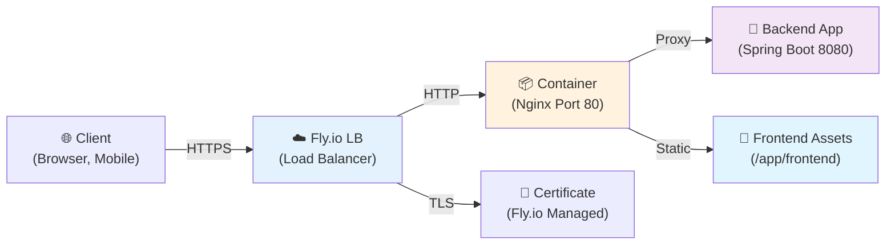

[⬅️ Back to Deployment Index](./index.html)

# Nginx & Routing

## Overview

Nginx is a high-performance reverse proxy and web server. In Smart Supply Pro, Nginx handles:

- **Reverse proxying** – Routes HTTP requests to backend service
- **TLS termination** – Manages HTTPS (though Fly.io also does this)
- **Static file serving** – Serves frontend assets with efficient caching
- **Routing rules** – Directs requests to appropriate backend/frontend endpoints
- **Compression** – GZIP compression for responses

This document explains the Nginx configuration, when it's used, and how it fits into the deployment architecture.

## Architecture: Where is Nginx Used?



### In Production (Fly.io)

Nginx runs **inside the same Docker container** as the backend:

1. **Entrypoint:** `start.sh` starts both Nginx and Java process
2. **Port 80:** Nginx listens (exposed to Fly.io load balancer)
3. **Port 8080:** Backend Java app listens (localhost only)
4. **Request flow:**
   - Client → Fly.io LB (TLS termination)
   - Fly.io LB → Nginx (port 80, plain HTTP inside container)
   - Nginx → Backend (port 8080, localhost proxy)

### In Local Development

**Option 1: Nginx locally (docker-compose)**
```yaml
services:
  nginx:
    image: nginx:latest
    ports:
      - "80:80"
      - "443:443"
    volumes:
      - ./ops/nginx/nginx.conf:/etc/nginx/nginx.conf
      - ./ops/nginx/conf.d:/etc/nginx/conf.d
  backend:
    build: .
    ports:
      - "8080:8080"
```

**Option 2: Direct backend (skip Nginx)**
```bash
# Access backend directly
http://localhost:8080/api/items
```

## Nginx Configuration: `/ops/nginx/`

### Directory Structure

```
ops/nginx/
├── nginx.conf              # Main Nginx configuration
├── conf.d/
│   ├── default.conf        # Default server block
│   ├── backend-proxy.conf  # Backend reverse proxy
│   ├── gzip.conf          # Compression settings
│   └── ssl.conf           # TLS settings (if applicable)
└── ssl/
    ├── server.crt         # Certificate (optional, Fly.io manages)
    └── server.key         # Private key (optional)
```

### Main Configuration: `nginx.conf`

```nginx
# Main context
user nginx;
worker_processes auto;  # Use all available CPU cores
error_log /var/log/nginx/error.log warn;
pid /var/run/nginx.pid;

events {
  worker_connections 1024;  # Connections per worker process
}

http {
  include /etc/nginx/mime.types;
  default_type application/octet-stream;

  # Logging format
  log_format main '$remote_addr - $remote_user [$time_local] "$request" '
                  '$status $body_bytes_sent "$http_referer" '
                  '"$http_user_agent" "$http_x_forwarded_for"';

  access_log /var/log/nginx/access.log main;

  # Performance tuning
  sendfile on;
  tcp_nopush on;
  tcp_nodelay on;
  keepalive_timeout 65;
  types_hash_max_size 2048;
  client_max_body_size 100M;  # Allow 100 MB uploads

  # Compression
  gzip on;
  gzip_vary on;
  gzip_proxied any;
  gzip_comp_level 6;
  gzip_types text/plain text/css text/xml text/javascript 
             application/json application/javascript application/xml+rss 
             application/rss+xml font/truetype font/opentype 
             application/vnd.ms-fontobject image/svg+xml;

  # Upstream: backend service
  upstream backend {
    server localhost:8080;  # Java app on port 8080
  }

  # Include per-domain configs
  include /etc/nginx/conf.d/*.conf;
}
```

### Backend Proxy: `conf.d/backend-proxy.conf`

```nginx
server {
  listen 80 default_server;
  listen [::]:80 default_server;
  
  server_name _;  # Match any domain

  # Forward headers for reverse proxy
  proxy_set_header Host $host;
  proxy_set_header X-Real-IP $remote_addr;
  proxy_set_header X-Forwarded-For $proxy_add_x_forwarded_for;
  proxy_set_header X-Forwarded-Proto $scheme;

  # Backend API routes
  location /api/ {
    # Proxy all /api/* requests to backend
    proxy_pass http://backend;
    proxy_redirect off;
  }

  # Health check endpoint (for Fly.io)
  location /health {
    proxy_pass http://backend;
    proxy_connect_timeout 2s;
    proxy_read_timeout 2s;
  }

  # Frontend static files (if served from Nginx)
  location / {
    # Serve frontend assets from container
    root /app/frontend;
    try_files $uri /index.html;  # SPA fallback: all routes → index.html
  }

  # Deny access to sensitive files
  location ~ /\. {
    deny all;
  }
}
```

### Key Features Explained

#### Reverse Proxy (`proxy_pass`)

```nginx
location /api/ {
  proxy_pass http://backend;  # Route /api/* → localhost:8080/api/*
}
```

- **What happens:**
  - Client requests: `GET /api/items`
  - Nginx forwards to: `GET http://localhost:8080/api/items`
  - Backend responds with JSON
  - Nginx returns response to client

#### Header Forwarding

```nginx
proxy_set_header X-Real-IP $remote_addr;
proxy_set_header X-Forwarded-For $proxy_add_x_forwarded_for;
proxy_set_header X-Forwarded-Proto $scheme;
```

- **Why needed:** Backend needs to know real client IP and protocol
- **Without headers:** Backend sees all requests coming from Nginx (127.0.0.1)
- **With headers:**
  - `X-Real-IP: 203.0.113.45` – Client's actual IP
  - `X-Forwarded-For: 203.0.113.45, 192.168.1.1` – Proxy chain
  - `X-Forwarded-Proto: https` – Original protocol (Fly.io → Nginx is HTTP, but Fly.io → Client is HTTPS)

#### SPA Fallback (`try_files`)

```nginx
location / {
  root /app/frontend;
  try_files $uri /index.html;  # If file not found, serve index.html
}
```

- **Problem:** Single-Page Apps (React, Vue) have all routes in index.html
- **Solution:** Nginx tries to serve file; if not found, serves index.html
- **Result:** All routes (/, /about, /products, etc.) are handled by frontend JavaScript router

#### GZIP Compression

```nginx
gzip on;
gzip_types text/plain text/css application/json;
```

- **Benefit:** Reduces response size by ~70% (JSON, HTML, CSS)
- **Tradeoff:** Minimal CPU overhead; significant bandwidth savings
- **Example:**
  - Uncompressed JSON: 100 KB
  - GZIP compressed: 25 KB (75% smaller)

#### Client Max Body Size

```nginx
client_max_body_size 100M;
```

- **Limits:** File uploads, bulk API requests
- **Default:** 1 MB (too small for most use cases)
- **Our setting:** 100 MB (allows large inventory imports)

## Routing Strategy

### API Routes

```
GET    /api/items              → Backend ItemController
POST   /api/items              → Create item
PUT    /api/items/{id}         → Update item
DELETE /api/items/{id}         → Delete item
GET    /api/suppliers          → Backend SupplierController
GET    /api/analytics          → Backend AnalyticsController
```

All `/api/*` requests are proxied to backend (port 8080).

### Frontend Routes

```
/                   → Serve frontend/index.html
/about              → Handled by React Router (returns index.html)
/products           → Handled by React Router
/products/{id}      → Handled by React Router
/api/*              → Proxied to backend
```

### Health & Status

```
GET /health         → Backend health check (Fly.io uses this)
GET /status         → Backend application status
GET /metrics        → Spring Boot Actuator metrics (if enabled)
```

## Docker Integration: Multi-Process Container

The Dockerfile includes Nginx:

```dockerfile
FROM eclipse-temurin:17-jre-jammy

# Install Nginx
RUN apt-get update && apt-get install -y nginx && rm -rf /var/lib/apt/lists/*

# Copy Nginx config
COPY ops/nginx /etc/nginx

# Copy backend JAR
COPY --from=builder /app/target/*.jar app.jar

# Copy frontend (built)
COPY frontend/dist frontend

# Start both services
COPY start.sh .
ENTRYPOINT ["./start.sh"]
```

### `start.sh`: Start Both Nginx and Java

```bash
#!/bin/bash
set -e

echo "Starting Nginx and backend..."

# Start Nginx in background
nginx -g 'daemon off;' &

# Start Java app in foreground
exec java -jar app.jar
```

**Why this approach?**

- **Single container:** Simpler deployment (one image, one process definition)
- **Both services:**
  - Nginx (port 80) – Public-facing reverse proxy
  - Java (port 8080) – Backend service (localhost only)
- **Process management:** Both can be stopped/started together

**Alternative:** Use `supervisor` or `docker-compose` for better process management:

```bash
# In start.sh
exec /usr/bin/supervisord -c /etc/supervisor/supervisord.conf
```

Then supervisord manages both Nginx and Java.

## Performance Considerations

### Connection Pooling

```nginx
upstream backend {
  server localhost:8080;
  keepalive 32;  # Keep up to 32 connections open to backend
}

# In proxy block
proxy_http_version 1.1;
proxy_set_header Connection "";
```

- **Benefit:** Reuse connections (avoid TCP handshake overhead)
- **Result:** ~20% faster response times

### Caching

```nginx
location /api/items {
  proxy_pass http://backend;
  
  # Cache GET requests for 5 minutes
  proxy_cache_valid 200 5m;
  proxy_cache_methods GET HEAD;
}
```

- **Caching static resources** (frontend assets)
- **Careful with API responses** (might be stale)

### Load Balancing (Multiple Backends)

```nginx
upstream backend {
  server backend1:8080;
  server backend2:8080;
  server backend3:8080;
  
  least_conn;  # Balance by connection count
}
```

For now, single backend instance; scale to multiple if needed.

## TLS/HTTPS Configuration

In production, **Fly.io manages TLS** (no Nginx-level SSL config needed).

If you need TLS at Nginx level (e.g., on-premise deployment):

```nginx
server {
  listen 443 ssl http2;
  ssl_certificate /etc/nginx/ssl/server.crt;
  ssl_certificate_key /etc/nginx/ssl/server.key;
  ssl_protocols TLSv1.2 TLSv1.3;
  ssl_ciphers HIGH:!aNULL:!MD5;
  ssl_prefer_server_ciphers on;
  
  location /api/ {
    proxy_pass http://backend;
  }
}

# Redirect HTTP → HTTPS
server {
  listen 80;
  return 301 https://$server_name$request_uri;
}
```

## Troubleshooting

### Nginx Won't Start: "Port already in use"

**Symptom:**
```
nginx: [emerg] bind() to 0.0.0.0:80 failed (98: Address already in use)
```

**Causes:**
- Another Nginx instance running
- Another service on port 80 (Apache, etc.)

**Resolution:**
```bash
# Find process on port 80
lsof -i :80

# Kill it
kill -9 <PID>

# Or change port in nginx.conf
listen 8000;  # Use 8000 instead of 80
```

### Backend Requests 502 Bad Gateway

**Symptom:**
```
502 Bad Gateway
```

**Causes:**
- Backend (Java app) not running or crashed
- Backend not listening on port 8080
- Connection timeout (backend slow)

**Resolution:**
```bash
# Check if backend is listening
lsof -i :8080

# Check Nginx logs
tail -f /var/log/nginx/error.log

# Increase timeout
proxy_connect_timeout 10s;
proxy_read_timeout 30s;
```

### Frontend Routes Return 404

**Symptom:**
```
404 Not Found (refreshing a deep link returns 404)
```

**Cause:**
- Missing `try_files` directive for SPA fallback

**Resolution:**
```nginx
location / {
  try_files $uri /index.html;
}
```

### CORS Errors: "Access-Control-Allow-Origin"

**Symptom:**
```
CORS policy: No 'Access-Control-Allow-Origin' header
```

**Causes:**
- Frontend domain ≠ Backend domain
- Backend doesn't allow CORS

**Resolution:**
In backend `SecurityConfig`:
```java
@Configuration
public class CorsConfig {
  @Bean
  public WebMvcConfigurer corsConfigurer() {
    return new WebMvcConfigurer() {
      @Override
      public void addCorsMappings(CorsRegistry registry) {
        registry.addMapping("/api/**")
          .allowedOrigins("https://inventory-service.koyeb.app")
          .allowedMethods("GET", "POST", "PUT", "DELETE")
          .allowCredentials(true);
      }
    };
  }
}
```

Or in Nginx:
```nginx
location /api/ {
  proxy_pass http://backend;
  add_header 'Access-Control-Allow-Origin' '*' always;
  add_header 'Access-Control-Allow-Methods' 'GET, POST, PUT, DELETE' always;
}
```

### Large Uploads Fail: "Request Entity Too Large"

**Symptom:**
```
413 Request Entity Too Large
```

**Cause:**
- `client_max_body_size` too small

**Resolution:**
```nginx
client_max_body_size 500M;  # Allow 500 MB uploads
```

## Related Documentation

- **[Deployment Index](./index.html)** – Deployment pipeline overview
- **[Fly.io Infrastructure](./flyio-infrastructure.html)** – Cloud hosting configuration
- **[Environments & Secrets](./environments-and-secrets.html)** – Configuration management
- **[Architecture Overview](../overview.html)** – System design

---

**Last Updated:** November 2025  
**Audience:** DevOps engineers, backend developers, infrastructure team
