# Analytics Flow

**Status**: Complete | **Last Updated**: 2025-11-20 | **Version**: 1.0.0

## Navigation

**Back to**: [Diagrams Index](./index.md) | [Architecture Index](../index.md)

---

## Overview

The analytics flow diagram shows how Smart Supply Pro aggregates data from repositories and transforms it into meaningful insights for decision-making, including cost analysis (WAC, FIFO), stock trends, and performance metrics.

---

## Analytics Data Flow

```mermaid
graph TB
    subgraph Data["Data Sources"]
        ItemRepo["📦 InventoryItem<br/>Repository"]
        HistoryRepo["📝 StockHistory<br/>Repository"]
    end
    
    subgraph Service["Analytics Service"]
        Engine["⚙️ AnalyticsService<br/>Data Aggregation<br/>Computation Engine"]
        WACCalc["💰 WAC Calculator<br/>(Weighted Average Cost)"]
        FIFOCalc["🔄 FIFO Calculator<br/>(First In First Out)"]
        TrendCalc["📈 Trend Calculator<br/>(Historical Analysis)"]
        KPICalc["📊 KPI Calculator<br/>(Key Performance Indicators)"]
    end
    
    subgraph DTO["Data Transfer Objects"]
        ItemDTO["Item Analytics DTO<br/>(SKU, name, costs)"]
        HistoryDTO["History Analytics DTO<br/>(movements, dates)"]
        ReportDTO["Report DTO<br/>(aggregated metrics)"]
        KPIDTO["KPI DTO<br/>(overall performance)"]
    end
    
    subgraph API["API Layer"]
        Controller["🎛️ AnalyticsController<br/>/api/analytics/wac<br/>/api/analytics/fifo<br/>/api/analytics/trends<br/>/api/analytics/kpis"]
    end
    
    Frontend["🖥️ Frontend<br/>(React Charts<br/>Dashboards)"]
    
    ItemRepo -->|"SELECT all items<br/>with prices"| Engine
    HistoryRepo -->|"SELECT all movements<br/>grouped by item/period"| Engine
    
    Engine -->|"Fetch prices &<br/>quantities"| WACCalc
    Engine -->|"Fetch in/out order<br/>with prices"| FIFOCalc
    Engine -->|"Fetch historical<br/>quantities"| TrendCalc
    Engine -->|"Aggregate all<br/>metrics"| KPICalc
    
    WACCalc -->|"Return WAC<br/>values"| ItemDTO
    FIFOCalc -->|"Return FIFO<br/>costs"| ItemDTO
    TrendCalc -->|"Return trends<br/>data"| HistoryDTO
    KPICalc -->|"Return KPIs"| KPIDTO
    
    ItemDTO -->|"REST API<br/>JSON"| Controller
    HistoryDTO -->|"REST API<br/>JSON"| Controller
    KPIDTO -->|"REST API<br/>JSON"| Controller
    ReportDTO -->|"REST API<br/>JSON"| Controller
    
    Controller -->|"HTTP 200<br/>JSON Data"| Frontend
    
    Frontend -->|"Display charts<br/>dashboards<br/>reports"| User["👤 User"]
    
    style Data fill:#fff3e0
    style Service fill:#e8f5e9
    style DTO fill:#e3f2fd
    style API fill:#f3e5f5
    style Frontend fill:#c8e6c9
    style User fill:#bbdefb
```



---

## Detailed Analytics Flows

### 1. WAC (Weighted Average Cost) Calculation

**Purpose**: Calculate average cost of inventory items based on historical purchases

**Flow**:
1. AnalyticsService queries InventoryItem repository
2. For each item, fetch all stock history records (purchases)
3. For each purchase, capture quantity and unit price
4. Calculate weighted average:
   - (sum of quantity × price) ÷ (sum of quantity)
5. Store result in WAC cache/DTO
6. Return to controller as JSON

**Example**:
```
Item: Widget
Purchase 1: 100 units @ $10 = $1,000
Purchase 2: 50 units @ $12 = $600
WAC = ($1,000 + $600) ÷ (100 + 50) = $10.67
```

**Business Value**:
- Accurate inventory valuation
- Cost-of-goods-sold (COGS) calculation
- Profitability analysis

---

### 2. FIFO (First In First Out) Calculation

**Purpose**: Calculate inventory cost using FIFO accounting method (US standard)

**Flow**:
1. AnalyticsService queries stock history ordered by date (oldest first)
2. Track consumed/sold inventory in FIFO order
3. Calculate cost of consumed items:
   - First purchases consumed at their original cost
   - Remaining inventory valued at latest purchase price
4. Generate FIFO cost report
5. Return to controller

**Example**:
```
Purchase 1 (earliest): 100 units @ $10
Purchase 2 (middle): 100 units @ $12
Purchase 3 (latest): 100 units @ $15
Current stock: 150 units

FIFO valuation:
- 100 units from Purchase 1 @ $10 = $1,000
- 50 units from Purchase 2 @ $12 = $600
- Total inventory value = $1,600
```

**Business Value**:
- Accounting compliance (US GAAP)
- Tax optimization
- Inventory valuation for financial statements

---

### 3. Stock Trend Analysis

**Purpose**: Analyze inventory movements over time

**Flow**:
1. Query stock history grouped by:
   - Time period (daily, weekly, monthly)
   - Item
   - Supplier
2. Calculate for each period:
   - Total quantity in
   - Total quantity out
   - Net change
   - Running balance
3. Generate trend report with:
   - Dates
   - Quantities
   - Trends (up/down/stable)
4. Return historical data

**Output Example**:
```
Item: Widget
2025-11-01: 100 units
2025-11-02: 95 units (5 sold)
2025-11-03: 120 units (25 purchased)
2025-11-04: 110 units (10 sold)
Trend: Stable, slight downward
```

**Business Value**:
- Identify fast-moving vs. slow-moving items
- Forecast demand
- Detect anomalies (unusual spikes/drops)

---

### 4. KPI (Key Performance Indicator) Calculation

**Purpose**: Calculate overall supply chain performance metrics

**KPIs Calculated**:

| KPI | Formula | Meaning |
|-----|---------|---------|
| Inventory Turnover | (COGS) ÷ (Avg Inventory Value) | How fast inventory sells |
| Days Inventory Outstanding | 365 ÷ Turnover | Average days to sell inventory |
| Stock Accuracy | (Counted) ÷ (System) × 100% | Accuracy of inventory records |
| Supplier Performance | (On-Time) ÷ (Total Orders) × 100% | Supplier reliability |
| Cost per Unit | Total Cost ÷ Total Units | Average cost per item |

**Flow**:
1. Gather all analytics data (WAC, FIFO, trends)
2. Aggregate across all items
3. Calculate ratios and percentages
4. Generate comprehensive KPI report
5. Compare to historical KPIs (trend analysis)

**Example KPI Report**:
```
Overall Inventory Turnover: 4.2 (units per year)
Days Inventory Outstanding: 87 days
Total Inventory Value: $125,000 (at WAC)
Total Inventory Value: $132,000 (at FIFO)
Stock Accuracy: 98.5%
Average Supplier Performance: 94%
```

---

## Daily Analytics Calculation Window


---

## API Endpoints

### Get WAC Analytics
```
GET /api/analytics/wac
Response: {
  "items": [
    {
      "id": "item-123",
      "sku": "WIDGET-001",
      "name": "Widget",
      "wac": 10.67,
      "quantity": 100,
      "totalValue": 1067.00
    },
    ...
  ],
  "totalValue": 125000.00,
  "calculatedAt": "2025-11-20T12:00:00Z"
}
```

### Get FIFO Analytics
```
GET /api/analytics/fifo
Response: {
  "items": [
    {
      "id": "item-123",
      "sku": "WIDGET-001",
      "name": "Widget",
      "fifoValue": 1200.00,
      "quantity": 100,
      "layers": [
        {"quantity": 100, "unitPrice": 10.00, "value": 1000.00},
        {"quantity": 0, "unitPrice": 12.00, "value": 0.00}
      ]
    }
  ],
  "totalValue": 132000.00,
  "calculatedAt": "2025-11-20T12:00:00Z"
}
```

### Get Trends
```
GET /api/analytics/trends?itemId=&period=DAILY
Response: {
  "data": [
    {"date": "2025-11-18", "quantity": 100},
    {"date": "2025-11-19", "quantity": 95},
    {"date": "2025-11-20", "quantity": 120}
  ],
  "trend": "STABLE"
}
```

### Get KPIs
```
GET /api/analytics/kpis
Response: {
  "inventoryTurnover": 4.2,
  "daysInventoryOutstanding": 87,
  "stockAccuracy": 0.985,
  "supplierPerformance": 0.94,
  "totalInventoryValue": 125000.00,
  "lastCalculated": "2025-11-20T00:00:00Z"
}
```

---

## Frontend Integration

**Charts & Visualizations:**
1. **WAC Breakdown**: Pie chart by item/supplier
2. **FIFO Layers**: Stacked bar chart showing inventory layers
3. **Trends**: Line chart showing quantity over time
4. **KPI Dashboard**: Cards showing key metrics with trends

**Update Frequency:**
- Real-time: Stock levels update on transaction
- Daily: WAC/FIFO recalculated at midnight
- Hourly: KPI dashboard refreshes
- On-demand: User can trigger manual recalculation

---

## Performance Considerations

**Optimization Strategies**:
1. **Caching**: Results cached for 24 hours
2. **Batch Queries**: Fetch all needed data in few queries
3. **Indexing**: Database indexes on stock_history (item_id, date)
4. **Pagination**: Large result sets paginated
5. **Aggregation**: Database-side aggregation when possible

**Typical Query Times**:
- WAC: < 1 second
- FIFO: < 2 seconds
- Trends: < 1 second
- KPIs: < 3 seconds

---

## Related Documentation

- [Context Diagram](./context-diagram.md) - System overview
- [Logical Architecture](./logical-architecture.md) - Service layer structure
- [Database ER Diagram](./database-er-diagram.md) - Stock history entity
- [Repository Layer](../repository/index.md) - Data access details
- [Service Layer](../services/index.md) - Business logic details
