# Context Diagram

**Status**: Complete | **Last Updated**: 2025-11-20 | **Version**: 1.0.0

## Navigation

**Back to**: [Diagrams Index](./index.md) | [Architecture Index](../index.md)

---

## Overview

The context diagram shows Smart Supply Pro as a complete system in its environment, including external actors, external systems, and major data flows.

---

## System Context

```mermaid
graph TB
    User["👤 End Users<br/>(Admin/Supplier Manager)"]
    Admin["👨‍💼 Admin User<br/>(System Administrator)"]
    Frontend["🖥️ Frontend<br/>(React SPA)<br/>inventory-service/frontend"]
    Backend["⚙️ Backend<br/>(Spring Boot REST API)<br/>inventory-service/src"]
    OAuth["🔐 OAuth2 Provider<br/>(Google Login)"]
    Database["💾 Oracle Database<br/>(Oracle Autonomous DB)"]
    
    User -->|"Uses"| Frontend
    Admin -->|"Uses"| Frontend
    Frontend -->|"HTTP/REST API<br/>JSON"| Backend
    Backend -->|"OAuth2<br/>Authorization Code"| OAuth
    OAuth -->|"User Info +<br/>Access Token"| Backend
    Backend -->|"SQL Queries<br/>CRUD"| Database
    Database -->|"Query Results"| Backend
    Frontend -->|"Display"| User
    Frontend -->|"Display"| Admin
    
    style User fill:#e3f2fd
    style Admin fill:#e3f2fd
    style Frontend fill:#f3e5f5
    style Backend fill:#e8f5e9
    style OAuth fill:#fff3e0
    style Database fill:#fce4ec
```

---

## Component Description

### External Actors

**End Users (Admin/Supplier Manager)**
- Use the React frontend to view inventory, manage stock, and access analytics
- Authenticate via OAuth2 (Google)
- View real-time stock levels and historical data

**System Administrator**
- Manages suppliers, inventory items, and system configuration
- Has full access to all system features
- Can view audit logs and system performance

### Core Systems

**Frontend (React SPA)**
- Single-page application for user interface
- Located at `/frontend` in the repository
- Communicates with backend via REST API (HTTP/JSON)
- Handles OAuth2 login flow with Google

**Backend (Spring Boot API)**
- RESTful API providing all business functionality
- Located at `/src/main/java` in the repository
- Handles OAuth2 token validation
- Manages all business logic (inventory, analytics, security)
- Communicates with Oracle database

**OAuth2 Provider (Google)**
- External authentication service
- Handles user identity verification
- Provides access tokens for authorized API access
- Prevents unauthorized access to sensitive data

**Oracle Autonomous Database**
- Persistent data storage
- Stores suppliers, inventory items, stock history, and user information
- Automatically managed by Oracle Cloud
- Accessed via JDBC connection pool

---

## Key Data Flows

### 1. User Login Flow
1. User clicks "Login with Google" on frontend
2. Frontend redirects to Google OAuth2 endpoint
3. User authenticates with Google credentials
4. Google redirects to backend callback URL with authorization code
5. Backend exchanges code for access token
6. Backend validates token and creates/retrieves user in database
7. Backend returns session/JWT to frontend
8. Frontend stores token and makes API requests with authentication

### 2. API Request Flow
1. Frontend sends HTTP request with authorization header
2. Backend validates token and establishes user context
3. Backend processes request (validation, business logic)
4. Backend queries/updates database as needed
5. Backend returns response (data or error)
6. Frontend receives response and updates UI

### 3. Data Update Flow
1. User performs action (create supplier, update inventory)
2. Frontend validates and sends HTTP POST/PUT to backend
3. Backend validates request data
4. Backend applies business rules
5. Backend saves changes to database
6. Database confirms transaction
7. Backend returns confirmation to frontend
8. Frontend updates UI to reflect changes

---

## System Boundaries

**Within System** (Smart Supply Pro):
- React frontend and all UI components
- Spring Boot backend and all business logic
- Internal domain model and validation rules
- Exception handling and error responses

**External Systems** (Beyond System Control):
- Google OAuth2 provider (user authentication)
- Oracle Cloud (database hosting)
- Internet/Network infrastructure (communication)

---

## Important Notes

- **OAuth2 Tokens**: All API requests (except login) require valid Google-issued access token
- **Database Security**: Oracle wallet-based authentication prevents credential exposure
- **API-First Design**: Backend is pure REST API (no server-side HTML rendering)
- **Stateless**: Backend doesn't maintain session state, enabling horizontal scaling
- **CORS**: Frontend communicates with backend across different origins (handled via CORS configuration)

---

## Related Documentation

- [Logical Architecture](./logical-architecture.md) - Internal backend structure
- [Deployment Diagram](./deployment-diagram.md) - How the system is deployed
- [Request Lifecycle](./request-lifecycle.md) - End-to-end request flow
- [Security Flow](./security-flow.md) - OAuth2 and authorization details
- [Architecture Overview](../overview.md) - Comprehensive architecture guide
