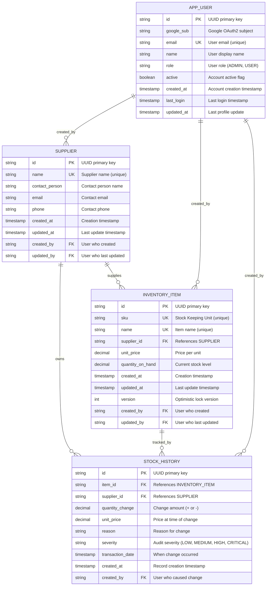

# Database ER Diagram

**Status**: Complete | **Last Updated**: 2025-11-20 | **Version**: 1.0.0

## Navigation

**Back to**: [Diagrams Index](./index.md) | [Architecture Index](../index.md)

---

## Overview

The Entity-Relationship (ER) diagram shows the domain model structure and relationships between key entities in the Smart Supply Pro system. This diagram represents the persistent data model stored in the Oracle Autonomous Database.

---

## Entity-Relationship Diagram



---

## Entity Descriptions

### SUPPLIER
**Purpose**: Stores supplier/vendor information

**Key Fields**:
- **id** (PK): Unique identifier (UUID)
- **name** (UNIQUE): Supplier name, must be unique to prevent duplicates
- **contact_person**: Primary contact name
- **email**: Contact email address
- **phone**: Contact phone number
- **created_at**: When supplier was added to system
- **updated_at**: Last time supplier info was modified
- **created_by** (FK): Reference to APP_USER who created
- **updated_by** (FK): Reference to APP_USER who last updated

**Relationships**:
- One supplier → Many inventory items (supplies)
- One supplier → Many stock history records (owns)
- One supplier ← One app_user (created_by)

**Business Rules**:
- Name must be unique (cannot have duplicate suppliers)
- Cannot delete supplier if it has inventory items

---

### INVENTORY_ITEM
**Purpose**: Stores product/inventory item information

**Key Fields**:
- **id** (PK): Unique identifier (UUID)
- **sku** (UNIQUE): Stock Keeping Unit, must be unique
- **name** (UNIQUE): Item name, must be unique
- **supplier_id** (FK): References SUPPLIER, cannot be null
- **unit_price**: Price per unit, used in cost calculations
- **quantity_on_hand**: Current stock level (updated by stock history)
- **created_at**: When item was added to inventory
- **updated_at**: Last time item was updated
- **version** (OPTIMISTIC LOCK): Prevents concurrent update conflicts
- **created_by** (FK): Reference to APP_USER who created
- **updated_by** (FK): Reference to APP_USER who last updated

**Relationships**:
- Many items ← One supplier (has supplier_id)
- One item → Many stock history records (tracked_by)
- Many items ← One app_user (created_by)

**Business Rules**:
- Must have valid supplier
- SKU and name must be unique
- Cannot go below zero quantity
- Version field prevents concurrent update collisions

---

### STOCK_HISTORY
**Purpose**: Audit trail of all stock movements and changes

**Key Fields**:
- **id** (PK): Unique identifier (UUID)
- **item_id** (FK): References INVENTORY_ITEM
- **supplier_id** (FK): Denormalized for analytics queries (also in INVENTORY_ITEM)
- **quantity_change**: Amount added/removed (positive or negative)
- **unit_price**: Price per unit at time of transaction
- **reason**: Why the stock changed (e.g., "Purchase", "Adjustment", "Damage")
- **severity**: Audit severity level (LOW, MEDIUM, HIGH, CRITICAL)
- **transaction_date**: When the stock movement occurred
- **created_at**: When this record was created
- **created_by** (FK): User who caused the change

**Relationships**:
- Many records ← One inventory item
- Many records ← One supplier (denormalized)
- Many records ← One app_user (created_by)

**Business Rules**:
- Records are immutable (never updated after creation)
- Supplier denormalized here for efficient analytics queries
- Created whenever quantity changes

---

### APP_USER
**Purpose**: Stores user authentication and profile information

**Key Fields**:
- **id** (PK): Unique identifier (UUID)
- **google_sub** (FK): Google OAuth2 subject identifier
- **email** (UNIQUE): Email address, unique per user
- **name**: User's display name
- **role** (ENUM): ADMIN or USER
- **active**: Whether account is active
- **created_at**: Account creation timestamp
- **last_login**: Timestamp of last login
- **updated_at**: Last profile update timestamp

**Relationships**:
- One user → Many suppliers created (created_by)
- One user → Many inventory items created (created_by)
- One user → Many stock history records (created_by)

**Business Rules**:
- Email must be unique
- Role determines access level (ADMIN has full access, USER has limited)
- Created automatically on first OAuth2 login

---

## Key Design Patterns

### Audit Fields
**Present in every entity** (except APP_USER):
- **created_at**: Immutable, set at creation
- **updated_at**: Updated on every change
- **created_by**: User who created (FK to APP_USER)
- **updated_by**: User who last updated (FK to APP_USER)

**Purpose**: Track who did what when for compliance and debugging

### Optimistic Locking
**Present in INVENTORY_ITEM**:
- **version**: Integer field incremented on each update
- Prevents two concurrent updates from overwriting each other
- If version doesn't match → OptimisticLockingFailureException → HTTP 409

**Pattern**:
```
SELECT * WHERE id=? AND version=?  [expect version=5]
UPDATE SET quantity=?, version=6 WHERE id=? AND version=5
```

### Denormalization
**STOCK_HISTORY.supplier_id** is technically denormalized (also available via item_id → supplier_id)
- Reason: Optimizes analytics queries that aggregate by supplier
- Kept in sync via foreign key constraints and triggers
- Improves query performance for common analytics reports

### Unique Constraints
**Natural keys for business concepts**:
- SUPPLIER.name: Prevents duplicate supplier names
- INVENTORY_ITEM.sku: Prevents duplicate stock keeping units
- INVENTORY_ITEM.name: Prevents duplicate item names
- APP_USER.email: Prevents duplicate user accounts

---

## Relationships & Cardinality

| From | Relationship | To | Meaning |
|------|--------------|-----|---------|
| SUPPLIER | supplies | INVENTORY_ITEM | One supplier has many items |
| SUPPLIER | owns | STOCK_HISTORY | One supplier has many history records |
| INVENTORY_ITEM | tracked_by | STOCK_HISTORY | One item has many history records |
| APP_USER | created_by | SUPPLIER/INVENTORY_ITEM/STOCK_HISTORY | One user created many entities |

---

## Database Constraints

**Primary Keys**: UUID (string) for distributed systems
**Foreign Keys**: All FK relationships have ON DELETE constraints
**Unique Constraints**: Prevent duplicates on business keys (name, sku, email)
**Not Null**: Critical fields enforce NOT NULL constraint
**Check Constraints**: Quantity must be >= 0, price must be >= 0

---

## Related Documentation

- [Logical Architecture](./logical-architecture.md) - Data layer overview
- [Context Diagram](./context-diagram.md) - System boundaries
- [Repository Layer](../repository/index.md) - Data access patterns
- [Model Documentation](../model/index.md) - Entity code details
- [Database Configuration](../deployment/database-config-and-oracle-wallet.md) - Database setup
