# Deployment Diagram

**Status**: Complete | **Last Updated**: 2025-11-20 | **Version**: 1.0.0

## Navigation

**Back to**: [Diagrams Index](./index.md) | [Architecture Index](../index.md)

---

## Overview

The deployment diagram shows how Smart Supply Pro is built, containerized, and deployed to cloud infrastructure, including the CI/CD pipeline, Docker workflow, and production topology.

---

## Build & Deployment Pipeline

```mermaid
graph LR
    Dev["👨‍💻 Developer<br/>Workstation"]
    Git["📦 GitHub<br/>Repository<br/>main branch"]
    CI["⚙️ GitHub Actions<br/>CI/CD Pipeline"]
    Build["🔨 Maven Build<br/>Compile<br/>Test<br/>Package JAR"]
    Docker["🐳 Docker<br/>Build Multi-stage<br/>Image"]
    Registry["📋 Container<br/>Registry<br/>(ghcr.io)"]
    Fly["☁️ Fly.io<br/>Cloud Platform"]
    
    subgraph Production["Production Environment"]
        App["🚀 Running App<br/>(Spring Boot)<br/>Health Checks"]
        Nginx["🌐 Nginx<br/>Reverse Proxy<br/>TLS/HTTPS<br/>Static Files"]
        Regions["🌍 Regions<br/>(iad, ord, lhr)"]
    end
    
    Oracle[("💾 Oracle<br/>Autonomous DB<br/>Wallet Auth")]
    
    Dev -->|git push| Git
    Git -->|Webhook trigger| CI
    CI -->|Checkout| Git
    CI -->|Build| Build
    Build -->|Docker build| Docker
    Docker -->|Push| Registry
    Registry -->|Deploy| Fly
    Fly -->|Run| Nginx
    Nginx -->|Route| App
    App -->|SQL| Oracle
    Fly -->|Distribute| Regions
    
    style Dev fill:#e3f2fd
    style Git fill:#bbdefb
    style CI fill:#90caf9
    style Build fill:#64b5f6
    style Docker fill:#42a5f5
    style Registry fill:#2196f3
    style Fly fill:#1976d2
    style Production fill:#e8f5e9
    style App fill:#81c784
    style Nginx fill:#66bb6a
    style Oracle fill:#1b5e20
```

---

## Detailed Component Description

### Development & Source Control

**Developer Workstation**
- Local development environment
- Runs tests and builds locally
- Commits code to Git repository
- Pushes changes to GitHub main branch

**GitHub Repository**
- Source code repository
- Includes: Source code, Dockerfile, pom.xml, configuration files
- Main branch triggers automated CI/CD pipeline on push
- Repository secrets: Docker credentials, deployment tokens

### CI/CD Pipeline (GitHub Actions)

**1-ci-test.yml**
- Triggered on every push to main branch
- Steps:
  1. Checkout code
  2. Set up Maven (Java 17)
  3. Run Maven build (compile, test, package)
  4. Run security scanning
  5. Build Docker image
  6. Push image to ghcr.io (GitHub Container Registry)

**docs-pipeline.yml**
- Generates API documentation
- Runs Redocly for OpenAPI documentation
- Generates architecture diagrams (Mermaid)
- Publishes documentation to GitHub Pages

**2-deploy-ghpages.yml**
- Deploys API docs and architecture docs to GitHub Pages
- Makes documentation publicly accessible

### Build Artifact

**Maven Build Output**
- Compiles Java source code
- Runs unit and integration tests
- Creates JAR file: `inventory-service-0.0.1-SNAPSHOT.jar`
- JAR includes: Classes, dependencies, embedded Tomcat

### Docker Containerization

**Multi-Stage Dockerfile**
- **Stage 1 (Builder)**: Compiles Java code, runs tests, creates JAR
- **Stage 2 (Runtime)**: Uses minimal base image, copies JAR, configures entry point
- Result: Optimized container image with only runtime dependencies
- Image size: ~500MB (JDK 17 + Spring Boot + dependencies)

**Docker Image Features**
- Base image: `eclipse-temurin:17-jre-alpine` (lightweight)
- Entry point: `java -jar application.jar`
- Exposed ports: 8080 (application), 8081 (health checks)
- Environment variables: Database credentials, OAuth2 keys (injected at runtime)

### Container Registry

**GitHub Container Registry (ghcr.io)**
- Stores built Docker images
- Images tagged with Git commit SHA
- Also tagged as "latest"
- Authentication via GitHub credentials
- Integrated with GitHub repository

### Fly.io Deployment

**fly.toml Configuration**
- App name: `smart-supply-pro` (or similar)
- Organization and region settings
- Machine resources: CPU, memory (tuned for constraints)
- Port configuration: 8080 for application
- Environment variables and secrets management
- Health checks: Regular polling of `/actuator/health`

**Deployment Strategy**
- Type: Rolling deployment (zero-downtime updates)
- New versions gradually replace old instances
- Health checks ensure instance is ready before routing traffic

**Regions & Scaling**
- Primary regions: iad (Northern Virginia), ord (Chicago), lhr (London)
- Auto-scaling based on CPU/memory
- Multiple instances for high availability
- Load balancing across regions

**Nginx Reverse Proxy**
- Handles TLS/HTTPS termination
- Routes requests to Spring Boot application
- Serves static frontend files (if applicable)
- Compression (GZIP) for response optimization
- Forwards headers properly for authentication

### Application Runtime

**Spring Boot Application**
- Runs on embedded Tomcat (port 8080)
- Configures itself via environment variables
- Establishes database connection pool
- Initializes security context

**Health Checks**
- Fly.io pings `/actuator/health` regularly
- Application responds with UP/DOWN status
- Failed checks trigger instance restart
- Prevents stuck instances from receiving traffic

### Database Connection

**Oracle Autonomous Database**
- Wallet-based authentication (secure credentials)
- JDBC URL configuration: `jdbc:oracle:thin:@...`
- Connection pooling: HikariCP (optimized pool size)
- TLS encryption for network traffic
- Automatic backups and high availability

---

## Environment Progression

**Development** → **GitHub** → **CI Pipeline** → **Container Registry** → **Fly.io Production**

1. Developer commits to main branch locally
2. Push to GitHub triggers CI pipeline
3. Pipeline builds, tests, and packages application
4. Docker image created and pushed to registry
5. Fly.io detects new image and deploys
6. Rolling deployment gradually updates instances
7. Health checks confirm new version is running

---

## Key Features

- **Fully Automated**: Push code → everything else happens automatically
- **Zero-Downtime Deployments**: Rolling updates ensure no service interruption
- **Security**: Docker image scanning, secret management via Fly.io
- **High Availability**: Multiple regions and instances
- **Observability**: Health checks, logs, and metrics
- **Scalability**: Horizontal scaling via Fly.io machines

---

## Related Documentation

- [Context Diagram](./context-diagram.md) - System overview
- [Logical Architecture](./logical-architecture.md) - Backend internal structure
- [Deployment Index](../deployment/index.md) - Detailed deployment documentation
- [Build & Docker Image](../deployment/build-and-docker-image.md) - Building process details
- [Fly.io Infrastructure](../deployment/flyio-infrastructure.html) - Cloud platform details
- [CI/CD & Documentation Pipeline](../deployment/ci-cd-and-docs-pipeline.html) - Pipeline details
