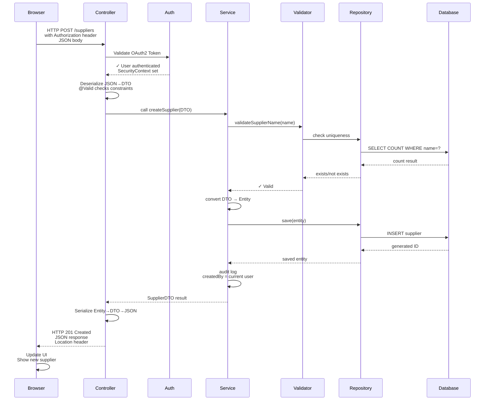
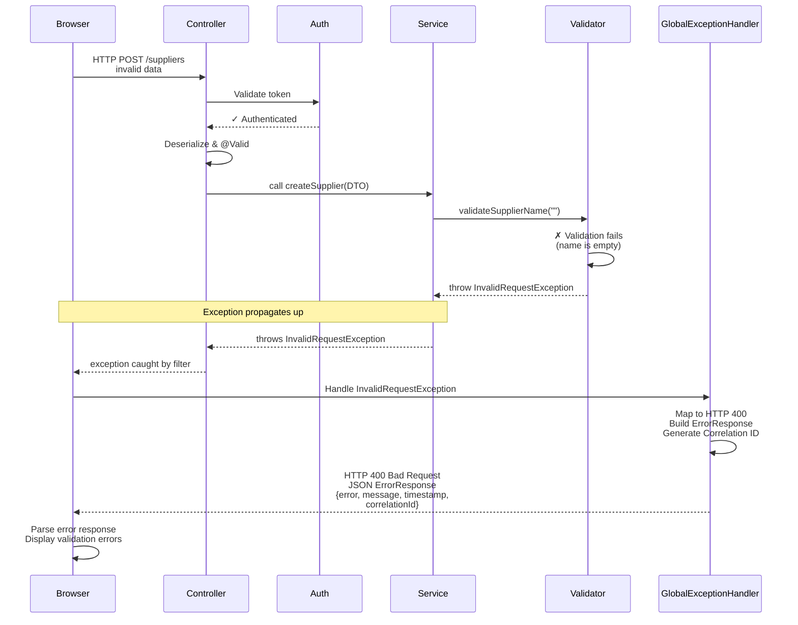

# Request Lifecycle

**Status**: Complete | **Last Updated**: 2025-11-20 | **Version**: 1.0.0

## Navigation

**Back to**: [Diagrams Index](./index.md) | [Architecture Index](../index.md)

---

## Overview

The request lifecycle diagram shows the complete end-to-end flow of an HTTP request through the Smart Supply Pro backend, including both the happy path (success) and error path (exception handling).

---

## Happy Path: Successful Request



---

## Error Path: Exception Handling



---

## Detailed Flow Descriptions

### Happy Path: Create Supplier (Success)

**1. HTTP Request**
- Browser sends: POST /suppliers with JSON body and Authorization header
- Content-Type: application/json
- Authorization: Bearer {google_access_token}

**2. Authentication**
- Spring Security filter intercepts request
- Validates OAuth2 token against Google provider
- Establishes SecurityContext with user information
- Extracts user ID and roles

**3. Controller Deserialization**
- Controller method receives HTTP request
- Spring deserializes JSON → CreateSupplierDTO
- @Valid annotation triggers DTO validation
- Checks @NotBlank, @NotNull constraints
- If DTO constraints fail → HTTP 400 immediately

**4. Business Logic**
- Controller calls SupplierService.createSupplier(dto)
- Service converts DTO → Supplier entity
- Service calls Validator to check business rules
- Validator queries repository for existing suppliers
- Database returns count of existing suppliers
- Validator confirms name is unique

**5. Persistence**
- Service calls SupplierRepository.save(entity)
- Repository uses Spring Data JPA
- JPA generates SQL: INSERT INTO supplier (name, ...)
- Database executes INSERT, returns generated ID
- Entity is now persisted with ID

**6. Audit Trail**
- Service sets createdBy to current user (from SecurityContext)
- Service sets createdAt timestamp
- These fields are automatically saved with entity

**7. Response**
- Service returns populated entity to Controller
- Controller converts entity → SupplierDTO
- Controller serializes DTO → JSON
- HTTP response: 201 Created with Location header

**8. Browser Update**
- Browser receives response with HTTP 201
- JavaScript parses JSON response
- UI updates to show new supplier in list

---

### Error Path: Invalid Request (Failure)

**1. Invalid Input**
- Browser sends malformed request (e.g., empty supplier name)
- Controller receives request and validates DTO
- @NotBlank constraint on name field fails
- Spring wraps into MethodArgumentNotValidException

**2. Exception Handling**
- GlobalExceptionHandler catches MethodArgumentNotValidException
- Handler extracts field errors from exception
- Creates ErrorResponse with:
  - error: "BAD_REQUEST"
  - message: "Validation failed: name is required"
  - timestamp: ISO-8601 UTC timestamp
  - correlationId: "SSP-{timestamp}-{random}"

**3. HTTP Response**
- Returns HTTP 400 with ErrorResponse JSON
- Browser receives 400 status code
- JavaScript parses error response
- UI displays validation error message to user

**4. Logging & Tracking**
- Correlation ID is logged on server side
- If user reports issue, they can provide correlation ID
- Server logs can be searched by correlation ID to find full request trace
- No sensitive data is returned to client

---

## Correlation ID Flow

The **correlation ID** uniquely identifies a single request across all system components:

```
Browser Request
    ↓
[No correlation ID yet]
    ↓
Controller receives request
    ↓
GlobalExceptionHandler generates correlation ID
    ↓
Correlation ID embedded in ErrorResponse
    ↓
Server logs include correlation ID
    ↓
Response sent to browser with correlation ID
    ↓
Browser receives correlation ID
    ↓
User can provide correlation ID for support
    ↓
Support team searches logs by correlation ID
    ↓
Full request trace found (all log entries)
```

---

## Transaction Boundaries

**Service Method = Transaction**
- Each service method is marked with `@Transactional`
- Spring begins transaction at method entry
- All database operations are ACID compliant
- If exception occurs → rollback all pending changes
- If success → commit all changes

**Example:**
```
@Transactional
createSupplier(dto):
  - Entity created but not yet saved
  - Repository.save() executes SQL INSERT
  - If error during save → rollback
  - If success → commit and ID is assigned
```

---

## Performance Considerations

**Request Path**:
1. Authentication (milliseconds) – Token validation
2. DTO validation (milliseconds) – Constraint checking
3. Business validation (milliseconds to seconds) – Database queries
4. Persistence (milliseconds to seconds) – INSERT/UPDATE/SELECT
5. Response serialization (milliseconds) – JSON generation

**Typical Request Time**: 50-500ms depending on complexity

**Bottlenecks**:
- Database query complexity
- Number of database round trips
- Serialization of large responses
- Validation queries (can be cached)

---

## Error Recovery

**Automatic Retries**:
- Client can retry failed requests (idempotent operations)
- Correlation ID remains same for related requests
- Server logs show retry pattern

**Manual Recovery**:
- For business logic failures, user may need to:
  - Fix input and retry
  - Contact support with correlation ID
  - Check audit logs (via admin panel)

---

## Related Documentation

- [Context Diagram](./context-diagram.md) - System overview
- [Logical Architecture](./logical-architecture.md) - Layered structure
- [Exception Handling](../exception/index.md) - Exception mapping and handling
- [Controller Documentation](../controller/index.md) - API endpoints
- [Service Layer](../services/index.md) - Business logic details
