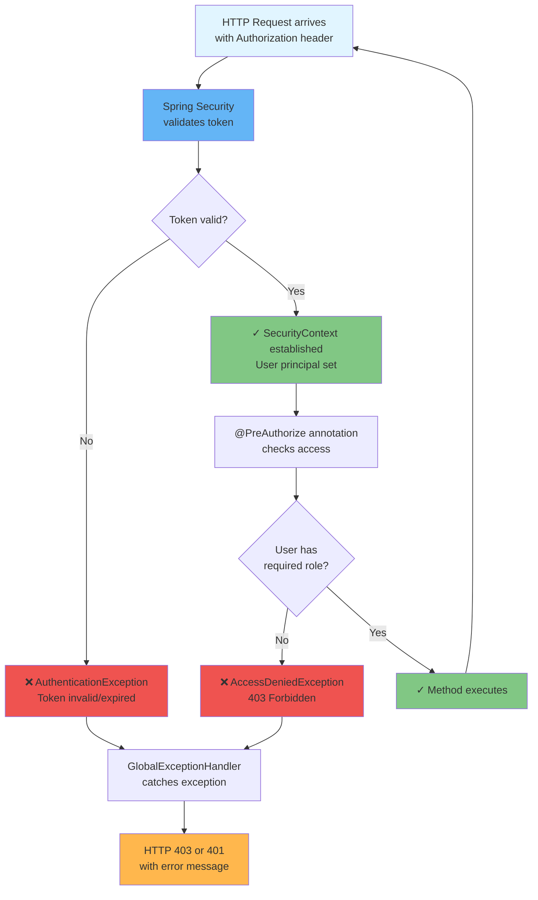

# Security Flow

**Status**: Complete | **Last Updated**: 2025-11-20 | **Version**: 1.0.0

## Navigation

**Back to**: [Diagrams Index](./index.md) | [Architecture Index](../index.md)

---

## Overview

The security flow diagrams show how OAuth2 authentication and authorization work in Smart Supply Pro, including user login, token validation, and permission checking.

---

## OAuth2 Authorization Code Flow

```mermaid
sequenceDiagram
    User->>Browser: 1. Click "Login with Google"
    Browser->>Frontend: 2. Navigate to login page
    Frontend->>Google: 3. Redirect to Google OAuth2<br/>/oauth2/authorization/google
    
    Google->>Google: 4. Display login screen
    User->>Google: 5. Enter Google credentials
    Google->>Google: 6. Authenticate user
    
    Google->>Backend: 7. Redirect to callback<br/>with authorization code<br/>/oauth2/login/google/code={code}
    
    Backend->>Google: 8. Exchange code for token<br/>POST /token with code & secret
    Google-->>Backend: 9. Return access token & user info<br/>{access_token, id_token, expires_in}
    
    Backend->>Database: 10. Look up/create user<br/>SELECT/INSERT into APP_USER
    Database-->>Backend: 11. User record returned
    
    Backend->>Frontend: 12. Redirect to home<br/>Set session cookie/JWT
    Browser->>Frontend: 13. Cookie/Token stored
    
    Frontend->>User: 14. Display dashboard
    
    style User fill:#e3f2fd
    style Browser fill:#bbdefb
    style Frontend fill:#90caf9
    style Backend fill:#64b5f6
    style Google fill:#ffb74d
    style Database fill:#81c784
```

---

## Authenticated API Request Flow

```mermaid
sequenceDiagram
    Browser->>API: 1. HTTP GET /api/suppliers<br/>Authorization: Bearer {token}
    
    API->>SecurityFilter: 2. Validate token
    SecurityFilter->>Google: 3. Verify token validity<br/>(if needed)
    Google-->>SecurityFilter: 4. Token valid ✓
    
    SecurityFilter->>SecurityContext: 5. Establish user principal<br/>Set current user
    SecurityFilter-->>API: 6. User authenticated
    
    API->>Database: 7. Query suppliers<br/>SELECT * FROM supplier
    Database-->>API: 8. Return results
    
    API->>API: 9. Check authorization<br/>@PreAuthorize("hasRole('USER')")
    API->>API: 10. User has USER role ✓
    
    API-->>Browser: 11. Return JSON response<br/>HTTP 200
    
    Browser->>Browser: 12. Update UI with data
    
    style Browser fill:#bbdefb
    style API fill:#64b5f6
    style SecurityFilter fill:#ef5350
    style Google fill:#ffb74d
    style Database fill:#81c784
```

---

## Authorization Checking Flow



---

## Authentication & Authorization Markers

### API Method with Authorization

**Example Code:**
```java
@PostMapping("/suppliers")
@PreAuthorize("hasRole('ADMIN')")  // Only ADMIN can create
public ResponseEntity<SupplierDTO> createSupplier(
    @Valid @RequestBody CreateSupplierDTO dto
) {
    SupplierDTO created = supplierService.create(dto);
    return ResponseEntity.status(HttpStatus.CREATED).body(created);
}
```

**Flow When User Calls**:
1. Browser sends POST with token
2. Spring Security validates token → OK
3. @PreAuthorize evaluates "hasRole('ADMIN')"
4. If user role = ADMIN → Method executes
5. If user role = USER → AccessDeniedException thrown

---

### Common @PreAuthorize Patterns

| Pattern | Meaning | HTTP on Failure |
|---------|---------|-----------------|
| `hasRole('ADMIN')` | Only ADMIN users | 403 Forbidden |
| `hasRole('USER')` | Only USER role (or ADMIN) | 403 Forbidden |
| `hasAnyRole('ADMIN','USER')` | Either ADMIN or USER | 403 Forbidden |
| `isAuthenticated()` | Any authenticated user | 403 Forbidden |

---

## Token Validation Details

### Token Contents (JWT Claims)
```json
{
  "sub": "google-user-id",
  "email": "user@example.com",
  "email_verified": true,
  "name": "John Doe",
  "picture": "https://...",
  "aud": "app-client-id.apps.googleusercontent.com",
  "iss": "https://accounts.google.com",
  "exp": 1700000000,
  "iat": 1699999000
}
```

### Validation Steps
1. **Signature**: Verify token is signed by Google
2. **Expiration**: Check `exp` claim hasn't passed
3. **Issuer**: Verify `iss` is Google's OAuth2 endpoint
4. **Audience**: Verify `aud` matches our app's client ID
5. **Subject**: Extract `sub` to identify user

### Cache Strategy
- Token validation results are cached (5-10 minutes)
- Reduces calls to Google OAuth2 provider
- On cache miss: Query Google to re-validate
- Expired tokens force re-validation

---

## Security Flows by Scenario

### Happy Path: Admin Creates Supplier

```
1. Admin logs in via Google OAuth2
2. Gets access token from Google
3. Sends POST /suppliers with token
4. Spring Security validates token → ✓ Valid
5. @PreAuthorize checks "hasRole('ADMIN')" → ✓ Has role
6. Service creates supplier
7. HTTP 201 Created returned
```

### Error: User Tries to Create Supplier

```
1. User logs in via Google OAuth2
2. Gets access token
3. Sends POST /suppliers with token
4. Spring Security validates token → ✓ Valid
5. @PreAuthorize checks "hasRole('ADMIN')" → ✗ User has role only
6. AccessDeniedException thrown
7. GlobalExceptionHandler catches
8. HTTP 403 Forbidden returned
9. Message: "Access denied - ADMIN role required"
```

### Error: Invalid/Expired Token

```
1. Attacker sends request with old/fake token
2. Spring Security validates token
3. Token validation fails (expired or invalid signature)
4. AuthenticationException thrown
5. GlobalExceptionHandler catches
6. HTTP 401 Unauthorized returned
7. Message: "Authentication failed"
```

---

## Security Best Practices Implemented

✅ **Generic Error Messages**
- Don't say "User not found" (enables user enumeration)
- Say "Authentication failed" instead

✅ **No Token Exposure**
- Tokens never logged
- Tokens never returned to client (except during login)
- Token stored securely in HTTP-only cookie

✅ **HTTPS Only**
- All communication encrypted
- Tokens transmitted over TLS/HTTPS
- Prevents man-in-the-middle attacks

✅ **Correlation ID Tracking**
- All security events logged with correlation ID
- If user reports issue, correlation ID aids investigation
- Server-side logs have full security context

✅ **Role-Based Access Control (RBAC)**
- @PreAuthorize on methods enforces rules
- Roles stored in database (not in token)
- Can revoke access by changing user role

✅ **Session Timeout**
- Tokens expire (typically 1 hour)
- Requires re-login for extended sessions
- Reduces risk if token is compromised

---

## Related Documentation

- [Context Diagram](./context-diagram.md) - System overview
- [Request Lifecycle](./request-lifecycle.md) - Request flow with auth
- [Security Architecture](../security/index.md) - Detailed security documentation
- [Exception Handling](../exception/security-exceptions.md) - Auth/authz exceptions
- [Authentication & Authorization](../integration/auth-flow-frontend.md) - Frontend integration
