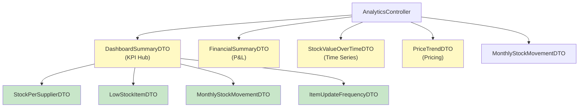

[⬅️ Back to DTO Hub](./index.md)

# Analytics DTOs

## Overview

Analytics DTOs are read-only projections and aggregations used for reporting, KPIs, and dashboards. They aggregate data from `InventoryItem`, `StockHistory`, `Supplier`, and related entities without modifying them.

**Controller:** `AnalyticsController`  
**Services:** `StockAnalyticsService`, `FinancialAnalyticsService`  
**Entities:** Projections (no single entity)  
**Total DTOs:** 8 specialized types

---

## DTO Diagram



---

## DashboardSummaryDTO (KPI Hub)

### Definition

Comprehensive dashboard aggregation with 5 sub-DTOs providing inventory and activity overview.

```java
@Data
@NoArgsConstructor
@AllArgsConstructor
@Builder
public class DashboardSummaryDTO {

    /** Stock distribution across all suppliers. */
    private List<StockPerSupplierDTO> stockPerSupplier;

    /** Items requiring attention due to low stock. */
    private List<LowStockItemDTO> lowStockItems;

    /** Monthly stock movement trends. */
    private List<MonthlyStockMovementDTO> monthlyStockMovement;

    /** Most frequently updated items (activity metrics). */
    private List<ItemUpdateFrequencyDTO> topUpdatedItems;
}
```

### Response Example

```json
{
  "stockPerSupplier": [
    {
      "supplierId": "SUP-001",
      "supplierName": "ACME Corp",
      "totalStockQuantity": 1250,
      "totalStockValue": 45600.75,
      "itemCount": 180
    }
  ],
  "lowStockItems": [
    {
      "itemName": "Widget A",
      "quantity": 5,
      "minimumQuantity": 20
    }
  ],
  "monthlyStockMovement": [ /* ... */ ],
  "topUpdatedItems": [ /* ... */ ]
}
```

---

## FinancialSummaryDTO (P&L Analysis)

### Definition

Weighted Average Cost (WAC) period summary for financial reporting. Covers opening/closing balances, purchases, sales, and COGS.

```java
@Getter @Setter @Builder
@AllArgsConstructor @NoArgsConstructor
public class FinancialSummaryDTO {
    
    /** Costing method identifier (currently "WAC"). */
    private String method;

    // Period dates
    private String fromDate;
    private String toDate;

    // Opening inventory
    private long openingQty;
    private BigDecimal openingValue;

    // Purchases and receipts
    private long purchasesQty;
    private BigDecimal purchasesCost;

    // Customer returns (inbound)
    private long returnsInQty;
    private BigDecimal returnsInValue;

    // Sales (outbound)
    private long salesQty;
    private BigDecimal salesValue;

    // Adjustments
    private long adjustmentQty;
    private BigDecimal adjustmentValue;

    // Closing inventory
    private long closingQty;
    private BigDecimal closingValue;

    // Financial metrics
    private BigDecimal costOfGoodsSold;
    private BigDecimal averageUnitCost;
    private BigDecimal inventoryTurnover;
    private BigDecimal inventoryHoldingCost;
}
```

### Key Metrics

| Metric | Calculation | Use |
|--------|-------------|-----|
| `costOfGoodsSold` | (opening + purchases - closing) | Expense reporting |
| `averageUnitCost` | (openingValue + purchasesCost) / (openingQty + purchasesQty) | WAC method |
| `inventoryTurnover` | salesValue / average inventory | Efficiency KPI |
| `inventoryHoldingCost` | Estimated cost to hold stock | Working capital analysis |

---

## StockPerSupplierDTO (Distribution)

### Definition

Supplier-level aggregation showing stock quantity, value, and item count.

```java
@Data
@AllArgsConstructor
public class StockPerSupplierDTO {

    /** Supplier identifier. */
    private String supplierId;

    /** Supplier name (enriched). */
    private String supplierName;

    /** Total units held from this supplier. */
    private Integer totalStockQuantity;

    /** Total value of stock from this supplier. */
    private BigDecimal totalStockValue;

    /** Number of unique items from this supplier. */
    private Integer itemCount;
}
```

### Response Example

```json
[
  {
    "supplierId": "SUP-001",
    "supplierName": "ACME Corp",
    "totalStockQuantity": 1250,
    "totalStockValue": 45600.75,
    "itemCount": 180
  },
  {
    "supplierId": "SUP-002",
    "supplierName": "Global Supplies",
    "totalStockQuantity": 2100,
    "totalStockValue": 62400.50,
    "itemCount": 245
  }
]
```

---

## LowStockItemDTO (Alert)

### Definition

Simplified alert for items below minimum threshold. Used in dashboards and alerts.

```java
@Data
@AllArgsConstructor
public class LowStockItemDTO {

    /** Item name. */
    private String itemName;

    /** Current quantity. */
    private int quantity;

    /** Minimum threshold. */
    private int minimumQuantity;
}
```

### Alert Trigger Logic

```
Alert triggered when: currentQuantity < minimumQuantity

Example:
  Item "Widget A" with reorderLevel = 20
  Current quantity = 5
  → Alert: quantity (5) < minimumQuantity (20) ✅ Show alert
```

---

## PriceTrendDTO (Pricing Analysis)

### Definition

Time series of price statistics for trend analysis.

```java
@Data
@AllArgsConstructor
public class PriceTrendDTO {

    /** Data point date (ISO format). */
    private LocalDate date;

    /** Average unit price on this date. */
    private BigDecimal averagePrice;

    /** Minimum price across items. */
    private BigDecimal minPrice;

    /** Maximum price across items. */
    private BigDecimal maxPrice;

    /** Percentage change from previous period. */
    private BigDecimal priceChangePercent;
}
```

### Response Example

```json
[
  {
    "date": "2025-09-01",
    "averagePrice": 19.50,
    "minPrice": 10.00,
    "maxPrice": 99.99,
    "priceChangePercent": 0.0
  },
  {
    "date": "2025-10-01",
    "averagePrice": 19.85,
    "minPrice": 10.00,
    "maxPrice": 99.99,
    "priceChangePercent": 1.79
  },
  {
    "date": "2025-11-01",
    "averagePrice": 20.50,
    "minPrice": 10.00,
    "maxPrice": 99.99,
    "priceChangePercent": 3.27
  }
]
```

---

## StockValueOverTimeDTO (Time Series)

### Definition

Daily (or periodic) snapshot of total inventory value and quantity.

```java
@Data
@AllArgsConstructor
public class StockValueOverTimeDTO {

    /** Data point date. */
    private LocalDate date;

    /** Total stock value on this date. */
    private BigDecimal totalStockValue;

    /** Number of unique items. */
    private Integer itemCount;

    /** Total quantity across all items. */
    private Integer totalQuantity;
}
```

### Use Cases

- Inventory trending (value over time)
- Supply chain visualization
- Working capital analysis

---

## MonthlyStockMovementDTO (Activity)

### Definition

Monthly aggregation of stock inbound, outbound, and adjustments.

```java
@Data
@AllArgsConstructor
public class MonthlyStockMovementDTO {

    /** Month in yyyy-MM format. */
    private String month;

    /** Items received (inbound). */
    private Integer itemsReceived;

    /** Items sold (outbound). */
    private Integer itemsSold;

    /** Adjustments (manual counts, damage, etc.). */
    private Integer adjustments;

    /** Net change (received - sold - adjustments). */
    private Integer netChange;
}
```

### Response Example

```json
[
  {
    "month": "2025-09",
    "itemsReceived": 450,
    "itemsSold": 380,
    "adjustments": 15,
    "netChange": 55
  },
  {
    "month": "2025-10",
    "itemsReceived": 520,
    "itemsSold": 420,
    "adjustments": 25,
    "netChange": 75
  },
  {
    "month": "2025-11",
    "itemsReceived": 485,
    "itemsSold": 410,
    "adjustments": 10,
    "netChange": 65
  }
]
```

---

## ItemUpdateFrequencyDTO (Activity Metrics)

### Definition

Item-level activity indicator showing update frequency and last update timestamp.

```java
@Data
@AllArgsConstructor
public class ItemUpdateFrequencyDTO {

    /** Item identifier. */
    private String itemId;

    /** Item display name. */
    private String itemName;

    /** Number of stock changes in period (default: last 30 days). */
    private Integer updateCount;

    /** Last stock update timestamp. */
    private LocalDateTime lastUpdate;

    /** Frequency ratio (days between updates). */
    private Double updateFrequencyDays;
}
```

### Response Example

```json
[
  {
    "itemId": "ITEM-001",
    "itemName": "Widget A",
    "updateCount": 45,
    "lastUpdate": "2025-11-19T14:30:00.000Z",
    "updateFrequencyDays": 2.1
  },
  {
    "itemId": "ITEM-042",
    "itemName": "Gizmo X",
    "updateCount": 5,
    "lastUpdate": "2025-11-10T09:00:00.000Z",
    "updateFrequencyDays": 18.2
  }
]
```

### Interpretation

| updateFrequencyDays | Status | Action |
|-------------------|--------|--------|
| 0.5–1.0 | Very active | Fast-moving item, frequent replenishment |
| 1.0–7.0 | Active | Normal operational item |
| 7.0–30.0 | Slow | Low-velocity item, infrequent updates |
| 30.0+ | Stale | Dormant inventory, audit candidate |

---

## Request/Response Examples

### GET Dashboard Summary

**Request:**

```http
GET /api/analytics/dashboard-summary
Authorization: Bearer <token>
```

**Response (200 OK):**

```json
{
  "stockPerSupplier": [
    {
      "supplierId": "SUP-001",
      "supplierName": "ACME Corp",
      "totalStockQuantity": 1250,
      "totalStockValue": 45600.75,
      "itemCount": 180
    }
  ],
  "lowStockItems": [
    {
      "itemName": "Widget A",
      "quantity": 5,
      "minimumQuantity": 20
    }
  ],
  "monthlyStockMovement": [ /* 3 months */ ],
  "topUpdatedItems": [ /* top 10 items */ ]
}
```

### GET Financial Summary

**Request:**

```http
GET /api/analytics/financial-summary?fromDate=2025-11-01&toDate=2025-11-30
Authorization: Bearer <token>
```

**Response (200 OK):**

```json
{
  "method": "WAC",
  "fromDate": "2025-11-01",
  "toDate": "2025-11-30",
  "openingQty": 5000,
  "openingValue": 95000.00,
  "purchasesQty": 3500,
  "purchasesCost": 65800.00,
  "returnsInQty": 200,
  "returnsInValue": 3980.00,
  "salesQty": 2800,
  "salesValue": 58100.00,
  "adjustmentQty": 50,
  "adjustmentValue": 995.00,
  "closingQty": 5850,
  "closingValue": 110790.00,
  "costOfGoodsSold": 58100.00,
  "averageUnitCost": 18.80,
  "inventoryTurnover": 3.45,
  "inventoryHoldingCost": 2850.00
}
```

### GET Stock Value Time Series

**Request:**

```http
GET /api/analytics/stock-value?start=2025-11-01&end=2025-11-30&supplierId=SUP-001
Authorization: Bearer <token>
```

**Response (200 OK):**

```json
[
  {
    "date": "2025-11-01",
    "totalStockValue": 125750.50,
    "itemCount": 1250,
    "totalQuantity": 5420
  },
  {
    "date": "2025-11-02",
    "totalStockValue": 127200.75,
    "itemCount": 1250,
    "totalQuantity": 5480
  }
]
```

### GET Low Stock Items

**Request:**

```http
GET /api/analytics/low-stock-items?page=0&size=20
Authorization: Bearer <token>
```

**Response (200 OK):**

```json
{
  "content": [
    {
      "itemName": "Widget A",
      "quantity": 5,
      "minimumQuantity": 20
    },
    {
      "itemName": "Gizmo B",
      "quantity": 8,
      "minimumQuantity": 25
    }
  ],
  "pageable": { ... },
  "totalElements": 23,
  "totalPages": 2
}
```

---

## Caching Considerations

Analytics endpoints perform heavy aggregations. Recommend caching:

```java
@Cacheable(value = "analytics-dashboard", unless = "#result == null")
public DashboardSummaryDTO getDashboardSummary() {
    // Expensive aggregation
}

@Cacheable(value = "analytics-financial", 
    key = "#startDate + '-' + #endDate",
    unless = "#result == null")
public FinancialSummaryDTO getFinancialSummary(LocalDate startDate, LocalDate endDate) {
    // Expensive calculation
}
```

**Cache Invalidation:**
- On stock update (PATCH /api/items/{id}/update-stock)
- On item create/update/delete
- Scheduled expiry (e.g., 1 hour TTL)

---

## Testing Strategy

### Unit Test for Dashboard Summary

```java
@WebMvcTest(AnalyticsController.class)
class AnalyticsControllerTest {

    @MockBean
    private StockAnalyticsService analyticsService;

    @Test
    void testDashboardSummary_Returns200WithAggregations() throws Exception {
        DashboardSummaryDTO mockDashboard = DashboardSummaryDTO.builder()
            .stockPerSupplier(List.of(
                new StockPerSupplierDTO("SUP-001", "ACME", 1250, 
                    BigDecimal.valueOf(45600.75), 180)
            ))
            .lowStockItems(List.of(
                new LowStockItemDTO("Widget A", 5, 20)
            ))
            .monthlyStockMovement(List.of())
            .topUpdatedItems(List.of())
            .build();

        when(analyticsService.getDashboard())
            .thenReturn(mockDashboard);

        mockMvc.perform(get("/api/analytics/dashboard-summary"))
            .andExpect(status().isOk())
            .andExpect(jsonPath("$.stockPerSupplier[0].supplierName")
                .value("ACME"))
            .andExpect(jsonPath("$.lowStockItems[0].itemName")
                .value("Widget A"));
    }
}
```

---

## Summary

| DTO | Purpose | Data Points | Use Case |
|-----|---------|-------------|----------|
| `DashboardSummaryDTO` | KPI hub | 4 sub-lists | Executive dashboard |
| `FinancialSummaryDTO` | P&L analysis | 15+ fields | Financial reporting |
| `StockPerSupplierDTO` | Distribution | 5 fields | Supplier analysis |
| `LowStockItemDTO` | Alert | 3 fields | Replenishment notifications |
| `PriceTrendDTO` | Pricing trends | 5 fields | Price analysis charts |
| `StockValueOverTimeDTO` | Time series | 4 fields | Inventory trending |
| `MonthlyStockMovementDTO` | Activity | 5 fields | Movement tracking |
| `ItemUpdateFrequencyDTO` | Activity metrics | 5 fields | Item velocity analysis |

**Total:** 8 specialized DTOs aggregating data from entities without modification.

---

[⬅️ Back to DTO Hub](./index.md)
