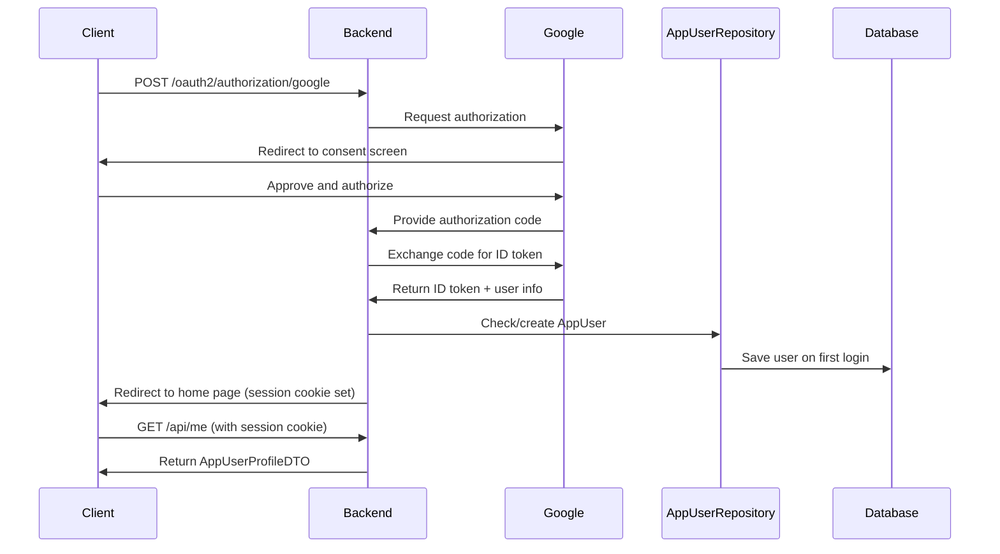

[⬅️ Back to DTO Hub](./index.md)

# Auth & User DTOs

## Overview

Authentication DTOs represent the current authenticated user's profile, derived from OAuth2 security context and the `AppUser` entity. Used exclusively for profile queries and logout operations.

**Entity:** `AppUser`  
**Controller:** `AuthController`  
**Security:** Spring Security OAuth2

---

## AppUserProfileDTO (User Profile Record)

### Definition

Immutable record containing current user profile information. Derived from OAuth2 authentication principal and database lookup.

```java
public record AppUserProfileDTO(
    String email,
    String fullName,
    String role,
    String pictureUrl
) {}
```

### Field Reference

| Field | Type | Source | Notes |
|-------|------|--------|-------|
| `email` | String | OAuth2 principal | User's email address (unique identifier) |
| `fullName` | String | AppUser entity or OAuth2 | Display name from profile or OAuth provider |
| `role` | String | AppUser entity | Assigned role (ROLE_USER or ROLE_ADMIN) |
| `pictureUrl` | String | OAuth2 principal | Profile picture URL from OAuth provider (nullable) |

---

## Role Assignment Logic

Roles are assigned on first login based on email configuration:

```java
public AppUserProfileDTO getMe(OAuth2User principal) {
    String email = principal.getAttribute("email");
    
    // Check if email is in admin list
    if (APP_ADMIN_EMAILS.contains(email)) {
        return new AppUserProfileDTO(
            email,
            principal.getAttribute("name"),
            "ROLE_ADMIN",
            principal.getAttribute("picture")
        );
    } else {
        return new AppUserProfileDTO(
            email,
            principal.getAttribute("name"),
            "ROLE_USER",
            principal.getAttribute("picture")
        );
    }
}
```

### Admin Email Configuration

Set via environment variable:

```
APP_ADMIN_EMAILS=admin@company.com,ops@company.com,finance@company.com
```

---

## Request/Response Examples

### GET Current User Profile

**Request:**

```http
GET /api/me
Authorization: Bearer <token>
```

**Response (200 OK):**

```json
{
  "email": "user@company.com",
  "fullName": "John Smith",
  "role": "ROLE_USER",
  "pictureUrl": "https://lh3.googleusercontent.com/a/..."
}
```

### GET Admin User Profile

**Request:**

```http
GET /api/me
Authorization: Bearer <admin-token>
```

**Response (200 OK):**

```json
{
  "email": "admin@company.com",
  "fullName": "Jane Admin",
  "role": "ROLE_ADMIN",
  "pictureUrl": "https://lh3.googleusercontent.com/b/..."
}
```

### GET Without Authentication

**Request:**

```http
GET /api/me
(no Authorization header)
```

**Response (401 Unauthorized):**

```json
{
  "error": "unauthorized",
  "message": "User not authenticated",
  "timestamp": "2025-11-19T10:35:00.000Z",
  "correlationId": "SSP-1700123456789-4523"
}
```

---

## OAuth2 Authentication Flow

### Login Sequence



### Session Cookie Configuration

OAuth2 login sets an HttpOnly, Secure cookie:

```
Set-Cookie: JSESSIONID=<token>; HttpOnly; Secure; SameSite=None; Path=/; Max-Age=1800
```

**Properties:**
- `HttpOnly` – Prevents JavaScript access (XSS protection)
- `Secure` – Only sent over HTTPS
- `SameSite=None` – Allows cross-site requests (for stateless API)
- `Max-Age=1800` – Session expires in 30 minutes

---

## Logout Operation

### POST Logout

**Request:**

```http
POST /api/logout
Authorization: Bearer <token>
```

**Response (302 Found):**

```
Location: /
Set-Cookie: JSESSIONID=deleted; HttpOnly; Secure; SameSite=None; Path=/; Max-Age=0
```

**Effect:**
- Session cookie invalidated (Max-Age=0)
- Redirect to home page
- Subsequent requests to `/api/me` return 401 Unauthorized

---

## Controller Integration

```java
@RestController
@RequestMapping("/api")
@RequiredArgsConstructor
public class AuthController {

    private final AppUserRepository appUserRepository;
    private static final List<String> APP_ADMIN_EMAILS = 
        Arrays.asList(System.getenv("APP_ADMIN_EMAILS").split(","));

    /**
     * Gets authenticated user's profile information.
     *
     * @param principal OAuth2 authentication principal
     * @return user profile with email, name, role, and picture
     * @throws ResponseStatusException 401 if not authenticated
     */
    @GetMapping("/me")
    public ResponseEntity<AppUserProfileDTO> getMe(
            @AuthenticationPrincipal OAuth2User principal) {
        
        if (principal == null) {
            throw new ResponseStatusException(
                HttpStatus.UNAUTHORIZED,
                "User not authenticated"
            );
        }

        String email = principal.getAttribute("email");
        String role = APP_ADMIN_EMAILS.contains(email) 
            ? "ROLE_ADMIN" 
            : "ROLE_USER";

        // Optionally create/update AppUser in database
        appUserRepository.findByEmail(email)
            .orElseGet(() -> appUserRepository.save(
                new AppUser(
                    email,
                    principal.getAttribute("name"),
                    role,
                    principal.getAttribute("picture")
                )
            ));

        return ResponseEntity.ok(new AppUserProfileDTO(
            email,
            principal.getAttribute("name"),
            role,
            principal.getAttribute("picture")
        ));
    }

    /**
     * Logs out the current user by invalidating session.
     *
     * @param request HTTP request to clear session
     * @param response HTTP response to clear cookies
     * @return redirect to home page
     */
    @PostMapping("/logout")
    public ResponseEntity<Void> logout(
            HttpServletRequest request,
            HttpServletResponse response) {
        
        new SecurityContextLogoutHandler().logout(request, response, 
            SecurityContextHolder.getContext().getAuthentication());
        
        return ResponseEntity
            .status(HttpStatus.FOUND)
            .header("Location", "/")
            .build();
    }
}
```

---

## Testing Strategy

### Unit Test for User Profile

```java
@WebMvcTest(AuthController.class)
class AuthControllerTest {

    @Test
    @WithMockUser(username = "user@company.com")
    void testGetMe_WithAuthenticatedUser_Returns200() throws Exception {
        OAuth2User mockPrincipal = mock(OAuth2User.class);
        when(mockPrincipal.getAttribute("email"))
            .thenReturn("user@company.com");
        when(mockPrincipal.getAttribute("name"))
            .thenReturn("John Smith");
        when(mockPrincipal.getAttribute("picture"))
            .thenReturn("https://example.com/pic.jpg");

        mockMvc.perform(
            get("/api/me")
                .principal(mockPrincipal)
        )
        .andExpect(status().isOk())
        .andExpect(jsonPath("$.email").value("user@company.com"))
        .andExpect(jsonPath("$.fullName").value("John Smith"))
        .andExpect(jsonPath("$.role").value("ROLE_USER"));
    }

    @Test
    void testGetMe_WithoutAuthentication_Returns401() throws Exception {
        mockMvc.perform(get("/api/me"))
            .andExpect(status().isUnauthorized());
    }

    @Test
    @WithMockUser(username = "admin@company.com")
    void testLogout_InvalidatesSession_Returns302() throws Exception {
        mockMvc.perform(post("/api/logout"))
            .andExpect(status().isFound())
            .andExpect(header().exists("Location"))
            .andExpect(header().string("Location", "/"));
    }
}
```

---

## Security Considerations

### 1. Email-Based Role Assignment

**Risk:** If `APP_ADMIN_EMAILS` list is not properly maintained, users may get incorrect roles.

**Mitigation:**
- Hardcode environment variable validation at startup
- Log all role assignments for audit
- Regularly audit user roles in production

### 2. Picture URL from Untrusted Source

**Risk:** OAuth2 provider's picture URL could be XSS vector if not handled carefully.

**Mitigation:**
- Validate URL format (HTTPS only)
- Use Content Security Policy (CSP) to restrict image sources
- Consider proxying images through your server

### 3. Session Timeout

**Risk:** Default 30-minute timeout may be too long/short for your use case.

**Mitigation:**
- Adjust `Max-Age` based on security requirements
- Implement refresh token rotation for long-lived sessions
- Log session activity for audit

---

## Summary

| Aspect | Detail |
|--------|--------|
| **DTO Class** | `AppUserProfileDTO` (immutable record) |
| **Data Source** | OAuth2 principal + AppUser entity |
| **Authorization** | `isAuthenticated()` |
| **Operations** | GET profile, POST logout |
| **Session** | HttpOnly, Secure, SameSite=None |
| **Role Assignment** | Email-based (from APP_ADMIN_EMAILS) |
| **Immutability** | Read-only; derived from authentication |

---

[⬅️ Back to DTO Hub](./index.md)
