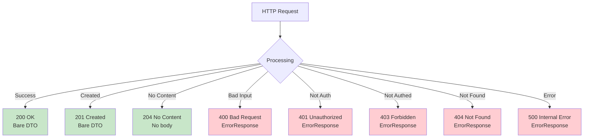

[⬅️ Back to DTO Hub](./index.md)

# Common Response Shapes

## Overview

This document describes the **intentional design decision** to return **bare DTOs** without generic wrapper envelopes. HTTP status codes serve as the primary envelope, providing clear contract boundaries between client and server.

---

## Response Shape Philosophy

```
HTTP Status Code = Primary Envelope
├── 2xx Success → HTTP status conveys success
│   └── Body: Bare DTO (or Page<DTO> for lists)
│
└── 4xx/5xx Error → HTTP status conveys error
    └── Body: StandardizedErrorResponse
```

### Why NO Generic Wrapper?

**Anti-pattern (discouraged):**

```json
{
  "success": true,
  "data": {
    "id": "SUP-001",
    "name": "ACME Corp"
  },
  "error": null
}
```

**Problems:**
- Redundant metadata (success flag + HTTP status)
- Extra nesting complicates client parsing
- Inconsistent between success and error (error has different structure)
- Larger payloads

**Our pattern (recommended):**

```json
{
  "id": "SUP-001",
  "name": "ACME Corp"
}
```

**Benefits:**
- Cleaner payloads
- HTTP status is the envelope
- Consistent structure (flat DTO)
- Easy to parse and cache

---

## HTTP Status Code Envelope

The HTTP response status codes **explicitly communicate** the outcome:



---

## 2xx Success Responses

### 200 OK (Single Resource)

**Scenario:** GET single resource, or successful operation returning data

**Request:**

```http
GET /api/suppliers/SUP-001
Authorization: Bearer <token>
```

**Response (200 OK):**

```json
{
  "id": "SUP-001",
  "name": "ACME Corp",
  "contactName": "John Smith",
  "phone": "+1-555-123-4567",
  "email": "acme@example.com",
  "createdBy": "admin@company.com",
  "createdAt": "2025-11-19T10:30:00.000Z"
}
```

**Content-Type:** `application/json`

---

### 200 OK (List with Pagination)

**Scenario:** GET list of resources

**Request:**

```http
GET /api/suppliers?page=0&size=20
Authorization: Bearer <token>
```

**Response (200 OK):**

```json
{
  "content": [
    {
      "id": "SUP-001",
      "name": "ACME Corp",
      ...
    },
    {
      "id": "SUP-002",
      "name": "Global Supplies",
      ...
    }
  ],
  "pageable": {
    "pageNumber": 0,
    "pageSize": 20,
    "sort": [ { "property": "name", "direction": "ASC" } ]
  },
  "totalElements": 42,
  "totalPages": 3,
  "last": false,
  "first": true,
  "numberOfElements": 2,
  "empty": false
}
```

**Note:** Paginated responses use Spring Data's `Page<T>` structure with metadata.

---

### 201 Created (New Resource)

**Scenario:** POST creates new resource

**Request:**

```http
POST /api/suppliers
Content-Type: application/json
Authorization: Bearer <token>

{
  "name": "New Corp",
  "email": "new@example.com"
}
```

**Response (201 Created):**

```json
{
  "id": "SUP-999",
  "name": "New Corp",
  "contactName": null,
  "phone": null,
  "email": "new@example.com",
  "createdBy": "admin@company.com",
  "createdAt": "2025-11-19T14:30:00.000Z"
}
```

**Headers:**

```
Content-Type: application/json
Location: /api/suppliers/SUP-999
```

**Note:** The `Location` header points to the newly created resource URI.

---

### 204 No Content (Delete/Update)

**Scenario:** Successful operation with no response body

**Request:**

```http
DELETE /api/suppliers/SUP-001
Authorization: Bearer <token>
```

**Response (204 No Content):**

```
(No body)
```

**Use in:** DELETE operations, or PUT operations that don't return updated resource

---

### 202 Accepted (Async Operations)

**Scenario:** Operation accepted but not yet complete (async processing)

**Note:** Not currently used in this API. Included for reference.

**Example (if implemented):**

```http
POST /api/analytics/generate-report
Content-Type: application/json

{ "startDate": "2025-11-01", "endDate": "2025-11-30" }
```

**Response (202 Accepted):**

```json
{
  "jobId": "JOB-123456",
  "statusUrl": "/api/jobs/JOB-123456",
  "message": "Report generation started"
}
```

---

## 4xx Client Error Responses

### 400 Bad Request

**Scenario:** Validation error, malformed request, invalid parameters

**Response (400 Bad Request):**

```json
{
  "error": "bad_request",
  "message": "Validation failed: Name is required",
  "timestamp": "2025-11-19T10:35:00.789Z",
  "correlationId": "SSP-1700123456789-4523"
}
```

---

### 401 Unauthorized

**Scenario:** No authentication or invalid/expired token

**Response (401 Unauthorized):**

```json
{
  "error": "unauthorized",
  "message": "User not authenticated",
  "timestamp": "2025-11-19T10:37:00.789Z",
  "correlationId": "SSP-1700123456789-6725"
}
```

---

### 403 Forbidden

**Scenario:** Authenticated but lacks required role/permission

**Response (403 Forbidden):**

```json
{
  "error": "forbidden",
  "message": "User does not have required role: ADMIN",
  "timestamp": "2025-11-19T10:39:00.789Z",
  "correlationId": "SSP-1700123456789-8927"
}
```

---

### 404 Not Found

**Scenario:** Requested resource doesn't exist

**Response (404 Not Found):**

```json
{
  "error": "not_found",
  "message": "Supplier with ID 'SUP-INVALID' not found",
  "timestamp": "2025-11-19T10:40:00.789Z",
  "correlationId": "SSP-1700123456789-9028"
}
```

---

### 409 Conflict

**Scenario:** Operation violates data integrity (unique constraint, etc.)

**Response (409 Conflict):**

```json
{
  "error": "conflict",
  "message": "Email 'acme@example.com' already exists",
  "timestamp": "2025-11-19T10:41:00.789Z",
  "correlationId": "SSP-1700123456789-0129"
}
```

---

## 5xx Server Error Responses

### 500 Internal Server Error

**Scenario:** Unhandled exception in server code

**Response (500 Internal Server Error):**

```json
{
  "error": "internal_server_error",
  "message": "Database connection timeout",
  "timestamp": "2025-11-19T10:42:00.789Z",
  "correlationId": "SSP-1700123456789-1230"
}
```

---

### 503 Service Unavailable

**Scenario:** External service (database, cache) is down

**Response (503 Service Unavailable):**

```json
{
  "error": "service_unavailable",
  "message": "Database is temporarily unavailable",
  "timestamp": "2025-11-19T10:43:00.789Z",
  "correlationId": "SSP-1700123456789-2331"
}
```

---

## Response Content Types

### JSON Responses (Default)

All endpoints return `application/json` unless otherwise specified:

```
Content-Type: application/json; charset=UTF-8
```

---

### File Downloads (CSV Export)

**Scenario:** Export large dataset to CSV (hypothetical)

```http
GET /api/suppliers/export?format=csv
```

**Response:**

```
Content-Type: text/csv; charset=UTF-8
Content-Disposition: attachment; filename="suppliers.csv"

id,name,email,phone
SUP-001,ACME Corp,acme@example.com,+1-555-123-4567
SUP-002,Global Supplies,global@example.com,+1-555-234-5678
```

---

## Response Headers

### Standard Headers

| Header | Value | Purpose |
|--------|-------|---------|
| `Content-Type` | `application/json` | Response format |
| `Content-Length` | Integer | Body size in bytes |
| `Date` | RFC 1123 timestamp | Response time |
| `Server` | `Spring/...` | Server identification |

### Creation Headers (201)

| Header | Value | Purpose |
|--------|-------|---------|
| `Location` | `/api/resources/{id}` | URI of created resource |
| `Content-Location` | `/api/resources/{id}` | Alternative to Location |

### Caching Headers (Optional)

```
Cache-Control: public, max-age=3600
Expires: <future-timestamp>
ETag: "33a64df551"
```

---

## Response Charset

All responses use **UTF-8 encoding:**

```
Content-Type: application/json; charset=UTF-8
```

This ensures international characters (Chinese, Arabic, etc.) are handled correctly.

---

## Client Implementation

### JavaScript Fetch API

```javascript
async function fetchSupplier(id) {
  const response = await fetch(`/api/suppliers/${id}`, {
    headers: { 'Authorization': `Bearer ${token}` }
  });

  // Check HTTP status
  if (!response.ok) {
    // 4xx/5xx: Parse error response
    const error = await response.json();
    console.error(`[${error.error}] ${error.message}`);
    throw new Error(error.message);
  }

  // 2xx: Parse DTO
  const supplier = await response.json();
  console.log('Supplier:', supplier);
  return supplier;
}
```

### Java RestTemplate

```java
RestTemplate restTemplate = new RestTemplate();

try {
  ResponseEntity<SupplierDTO> response = restTemplate.getForEntity(
      "http://localhost:8080/api/suppliers/SUP-001",
      SupplierDTO.class
  );

  // Check status code
  if (response.getStatusCode().is2xxSuccessful()) {
    SupplierDTO supplier = response.getBody();
    System.out.println("Supplier: " + supplier);
  }
} catch (HttpClientErrorException.NotFound ex) {
  System.err.println("Supplier not found: " + ex.getResponseBodyAsString());
} catch (HttpClientErrorException ex) {
  // Parse error response
  String error = ex.getResponseBodyAsString();
  System.err.println("Error: " + error);
}
```

---

## Design Decision Summary

### When to Return Bare DTO

✅ **All success responses (2xx)**
- Single resource: `{ id, name, ... }`
- List: `Page<T>` (with pagination metadata)
- No extra wrapper layer

### When to Return Error Response

✅ **All error responses (4xx/5xx)**
- Standardized `ErrorResponse` with error code, message, timestamp, correlationId
- HTTP status is the envelope

### NO Generic Wrapper

❌ **Not used:**
```json
{
  "success": true,
  "data": { ... },
  "error": null
}
```

**Rationale:**
- Redundant (HTTP status already indicates success/failure)
- Inconsistent structure between success/error branches
- Extra layer complicates client code
- Larger payloads with null fields

---

## Summary

| Response Type | Status | Body | Content-Type |
|---------------|--------|------|--------------|
| **Success (single)** | 200 | Bare DTO | application/json |
| **Success (list)** | 200 | Page<T> | application/json |
| **Created** | 201 | Bare DTO | application/json |
| **No content** | 204 | (empty) | (none) |
| **Bad request** | 400 | ErrorResponse | application/json |
| **Unauthorized** | 401 | ErrorResponse | application/json |
| **Forbidden** | 403 | ErrorResponse | application/json |
| **Not found** | 404 | ErrorResponse | application/json |
| **Conflict** | 409 | ErrorResponse | application/json |
| **Server error** | 500 | ErrorResponse | application/json |

---

[⬅️ Back to DTO Hub](./index.md)
