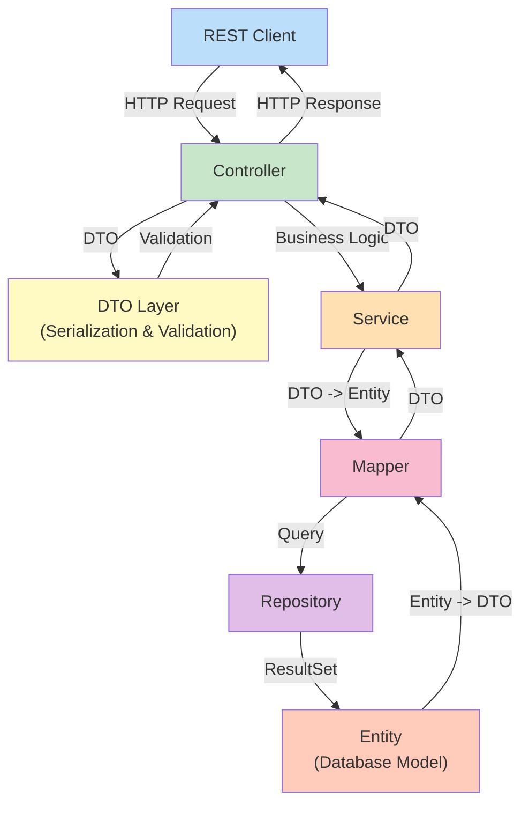

[⬅️ Back to Architecture](../index.md)

# Data Transfer Objects (DTOs)

## Overview

DTOs (Data Transfer Objects) are boundary models that decouple internal domain entities from external API contracts. This layer handles serialization, validation, and transformation between database models and REST API responses.

**Key Principle:** DTOs are never used in repositories. Entities are never exposed directly by controllers.

---

## Architecture Context



---

## DTO Categories

### Domain DTOs

Data Transfer Objects specific to business domains. One DTO per domain entity.

| Domain | DTO | Purpose | Entity |
|--------|-----|---------|--------|
| **Supplier** | `SupplierDTO` | Supplier CRUD and display | `Supplier` |
| **Inventory Item** | `InventoryItemDTO` | Item CRUD and stock management | `InventoryItem` |
| **Stock History** | `StockHistoryDTO` | Audit trail for stock changes | `StockHistory` |
| **Analytics** | `DashboardSummaryDTO`, `FinancialSummaryDTO`, etc. | Read-only reporting aggregations | Projections/Aggregates |
| **Auth/User** | `AppUserProfileDTO` | Current user profile (from OAuth2) | `AppUser` |

### Common DTOs

Reusable structures used across multiple endpoints.

| DTO | Purpose | Used In |
|-----|---------|---------|
| Pagination Response | Wraps lists with page metadata | All list endpoints |
| Error Response | Standardized error payload | All endpoints (on error) |
| Sort/Filter DTOs | Query parameters for filtering | Analytics, Stock History |

---

## DTO Listing by Domain

### 1. Supplier Domain (`supplier-dto.md`)

**DTOs:**
- `SupplierDTO` – Full supplier record with audit fields
- `SupplierListDTO` (implicit) – Supplier in paginated list responses
- `CreateSupplierDTO` (implicit via validation groups)

**Usage:**
- Controller: `SupplierController`
- Service: `SupplierService`
- Entity: `Supplier`

**Operations:** CREATE, READ, UPDATE, DELETE (paginated lists)

---

### 2. Inventory Item Domain (`inventory-item-dto.md`)

**DTOs:**
- `InventoryItemDTO` – Full item record with validation groups (Create/Update)
- `StockUpdateResultDTO` – Enriched result after stock update with item/supplier names
- `LowStockItemDTO` – Alert for items below minimum threshold

**Usage:**
- Controller: `InventoryItemController`
- Service: `InventoryItemService`
- Entity: `InventoryItem`

**Operations:** CRUD items, update stock, search

---

### 3. Stock History Domain (`stock-history-dto.md`)

**DTOs:**
- `StockHistoryDTO` – Core audit trail entry
- `StockUpdateResultDTO` – Enhanced display format for audit list

**Usage:**
- Controller: `StockHistoryController`
- Service: `StockHistoryService`
- Entity: `StockHistory`

**Operations:** READ-ONLY audit trail

---

### 4. Analytics Domain (`analytics-dto.md`)

**DTOs:**
- `DashboardSummaryDTO` – KPI aggregation (5 sub-DTOs)
- `FinancialSummaryDTO` – WAC (Weighted Average Cost) P&L summary
- `StockPerSupplierDTO` – Distribution by supplier
- `LowStockItemDTO` – Low stock alerts
- `PriceTrendDTO` – Price history over time
- `StockValueOverTimeDTO` – Time series aggregation
- `MonthlyStockMovementDTO` – Monthly trends
- `ItemUpdateFrequencyDTO` – Activity metrics

**Usage:**
- Controller: `AnalyticsController`
- Services: `StockAnalyticsService`, `FinancialAnalyticsService`
- Entities: Projections (no single entity)

**Operations:** READ-ONLY reporting and KPI endpoints

---

### 5. Auth/User Domain (`auth-user-dto.md`)

**DTOs:**
- `AppUserProfileDTO` (record) – Current user profile from OAuth2 context

**Usage:**
- Controller: `AuthController`
- Entity: `AppUser` (implicit, from Spring Security principal)

**Operations:** GET profile, LOGOUT

---

## Pagination & Sorting (`pagination-and-sorting-dto.md`)

All **list endpoints** return `Page<T>` with pagination metadata:

```json
{
  "content": [ /* List of DTOs */ ],
  "pageable": { "pageNumber": 0, "pageSize": 20, ... },
  "totalElements": 1250,
  "totalPages": 63,
  "last": false
}
```

**Not a separate DTO class**, but a **standard response shape** from Spring Data's `Page<>`.

---

## Error & Problem Details (`error-and-problem-details-dto.md`)

Single error response structure across all endpoints:

```json
{
  "error": "bad_request",
  "message": "Validation failed: email is required",
  "timestamp": "2025-11-19T12:34:56.789Z",
  "correlationId": "SSP-1700123456789-4523"
}
```

**DTO:** `ErrorResponse` (builder pattern with status derivation)

**Used By:** `GlobalExceptionHandler`

---

## Common Response Shapes (`common-response-shapes.md`)

**Principle:** Return **bare DTOs** wrapped in HTTP status codes; no generic success wrapper.

```
✅ 200 OK:    { "id": "SUP-001", "name": "ACME" }
✅ 201 Created: { "id": "SUP-999", "name": "New Corp" }
❌ 4xx/5xx:   { "error": "not_found", "message": "...", "correlationId": "..." }
```

**NO generic wrapper:** Intentional design—HTTP status is the envelope.

---

## Naming Conventions (`conventions-and-style.md`)

### DTO Class Naming

```
<Entity>DTO              SupplierDTO, InventoryItemDTO
Create<Entity>DTO       (implicit via validation groups)
Update<Entity>DTO       (implicit via validation groups)
<Entity>SummaryDTO      DashboardSummaryDTO, FinancialSummaryDTO
<Entity>ListDTO         (implicit, used in Page<>)
<Qualifier><Entity>DTO  LowStockItemDTO, StockPerSupplierDTO
```

### Field Naming

- **camelCase:** All fields (Java convention)
- **Dates:** ISO 8601 format (`yyyy-MM-dd` or ISO-8601 timestamp)
- **Times:** `LocalDateTime` serialized as ISO-8601 timestamp
- **BigDecimal:** Numeric precision for prices, totals, financial values
- **Enums:** Uppercase or normalized string (no Java constant names)

### Validation Annotations

```java
@NotBlank(message = "Name is required")          // Non-empty strings
@NotNull(message = "Price is mandatory")          // Non-null values
@Email(message = "Invalid email format")          // Email validation
@Positive(message = "Price must be > 0")          // Positive numbers
@PositiveOrZero(message = "Qty must be >= 0")    // Non-negative
```

---

## Mapping Strategy

### Entity to DTO Mapping

**Mappers:** Located in `src/main/java/.../mapper/`

- `SupplierMapper` – Entity ↔ DTO
- `InventoryItemMapper` – Entity ↔ DTO
- `StockHistoryMapper` – Entity ↔ DTO

**Pattern:** Manual mapping (no MapStruct) for clarity and control.

```java
public SupplierDTO toDTO(Supplier entity) {
    return SupplierDTO.builder()
        .id(entity.getId())
        .name(entity.getName())
        .email(entity.getEmail())
        .createdBy(entity.getCreatedBy())
        .createdAt(entity.getCreatedAt())
        .build();
}
```

### DTO to Entity Mapping

For CREATE/UPDATE operations:

```java
public Supplier toEntity(CreateSupplierDTO dto) {
    return Supplier.builder()
        .name(dto.getName())
        .email(dto.getEmail())
        .createdBy(getCurrentUser())
        .createdAt(LocalDateTime.now())
        .build();
}
```

---

## Validation Groups Pattern

**InventoryItemDTO** uses validation groups to support different rules for CREATE vs UPDATE:

```java
public interface Create {}   // Constraints for POST
public interface Update {}   // Constraints for PUT

@Null(groups = Create.class)        // Must be absent on CREATE
@NotNull(groups = Update.class)     // Must be present on UPDATE
private String id;
```

**Benefit:** Single DTO supports multiple operations with tailored validation.

---

## Serialization Rules

### Jackson Configuration

- **Date Serialization:** ISO-8601 (`yyyy-MM-ddThh:mm:ss.sssZ`)
- **Null Handling:** Include nulls (clients expect consistent JSON shape)
- **BigDecimal Precision:** Preserve for financial calculations
- **Enum Format:** String (not ordinal) for readability

### Example Serialized DTO

```json
{
  "id": "ITEM-001",
  "name": "Widget A",
  "quantity": 100,
  "price": 19.99,
  "totalValue": 1999.00,
  "supplierId": "SUP-001",
  "reorderLevel": 50,
  "createdBy": "admin@company.com",
  "createdAt": "2025-11-01T08:30:00.000Z"
}
```

---

## File Structure

```
docs/backend/architecture/dto/
├── index.md                              # This file (hub)
├── conventions-and-style.md              # Naming, validation, serialization
├── supplier-dto.md                       # SupplierDTO & variants
├── inventory-item-dto.md                 # InventoryItemDTO & variants
├── stock-history-dto.md                  # StockHistoryDTO & variants
├── analytics-dto.md                      # All analytics DTOs (8+ types)
├── auth-user-dto.md                      # AppUserProfileDTO
├── pagination-and-sorting-dto.md         # Page<T> & pagination metadata
├── error-and-problem-details-dto.md      # ErrorResponse structure
└── common-response-shapes.md             # HTTP 200/201/4xx/5xx shapes
```

---

## Quick Reference

### DTO Count by Domain

```
Supplier        1 DTO   (SupplierDTO)
Inventory Item  3 DTOs  (InventoryItemDTO, StockUpdateResultDTO, LowStockItemDTO)
Stock History   2 DTOs  (StockHistoryDTO, StockUpdateResultDTO)
Analytics       8 DTOs  (Dashboard, Financial, Price, Value, Supplier, LowStock, Movement, Frequency)
Auth/User       1 DTO   (AppUserProfileDTO)
Common          2 DTOs  (ErrorResponse, implicit Page<T>)
────────────────────────
Total          17 DTOs  (15 explicit classes + implicit Page<T> wrapper)
```

### Validation Patterns

| Pattern | Annotation | Example |
|---------|-----------|---------|
| Required Field | `@NotBlank`, `@NotNull` | Name, Email |
| Format Check | `@Email`, `@Pattern` | Email validation |
| Range Check | `@Positive`, `@PositiveOrZero`, `@Min`, `@Max` | Quantities, prices |
| Optional Field | No annotation | Contact name, phone |

---

## Related Documentation

- **[Conventions & Style](./conventions-and-style.md)** – Naming, validation, serialization
- **[Supplier DTO](./supplier-dto.md)** – Supplier domain DTOs
- **[Inventory Item DTO](./inventory-item-dto.md)** – Item management DTOs
- **[Stock History DTO](./stock-history-dto.md)** – Audit trail DTOs
- **[Analytics DTO](./analytics-dto.md)** – Reporting & KPI DTOs
- **[Auth User DTO](./auth-user-dto.md)** – Authentication DTOs
- **[Pagination & Sorting](./pagination-and-sorting-dto.md)** – List response structure
- **[Error & Problem Details](./error-and-problem-details-dto.md)** – Error contract
- **[Common Response Shapes](./common-response-shapes.md)** – HTTP response patterns

---

## Cross-References

- **Model Layer:** [Entity Documentation](../layers/model/index.md)
- **Controller Layer:** [REST API Documentation](../controller/index.md)
- **Service Layer:** [Business Logic Documentation](../layers/service/index.md)
- **Mappers:** Located in `src/main/java/.../mapper/`

---

[⬅️ Back to Architecture](../index.md)
