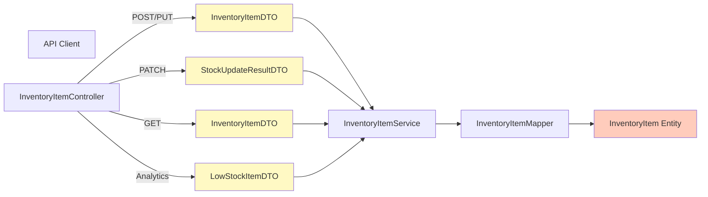

[⬅️ Back to DTO Hub](./index.md)

# Inventory Item DTOs

## Overview

Inventory Item DTOs handle the boundary between the REST API and the `InventoryItem` entity. Supports CRUD operations with validation groups (Create/Update) and specialized DTOs for stock updates and alerts.

**Entity:** `InventoryItem`  
**Mapper:** `InventoryItemMapper`  
**Controller:** `InventoryItemController`  
**Service:** `InventoryItemService`

---

## DTO Diagram



---

## InventoryItemDTO (Full Record)

### Definition

Complete inventory item record with validation groups supporting both CREATE and UPDATE operations.

```java
@Data
@Builder
@Getter
@Setter
@NoArgsConstructor
@AllArgsConstructor
public class InventoryItemDTO {

    // Validation group markers
    public interface Create {}   // Constraints for POST requests
    public interface Update {}   // Constraints for PUT requests

    /** Unique identifier, system-generated on creation. */
    @Null(message = "ID must be absent when creating", groups = Create.class)
    @NotNull(message = "ID must be present", groups = Update.class)
    private String id;

    /** Display name of the inventory item. */
    @NotBlank(message = "Item name is mandatory")
    private String name;

    /** Current stock quantity (non-negative). */
    @NotNull(message = "Quantity is mandatory")
    @PositiveOrZero(message = "Quantity must be zero or positive")
    private int quantity;

    /** Price per unit (positive value required). */
    @NotNull(message = "Price is mandatory")
    @Positive(message = "Price must be greater than zero")
    private BigDecimal price;

    /** Calculated total value (quantity × price), backend-populated. */
    private BigDecimal totalValue;

    /** Associated supplier identifier. */
    @NotBlank(message = "Supplier ID is mandatory")
    private String supplierId;

    /** Minimum stock threshold for reorder alerts. */
    @NotNull
    @PositiveOrZero
    private int reorderLevel;

    /** User or process that created this item (audit trail). */
    @NotBlank(message = "CreatedBy must be provided")
    private String createdBy;

    /** Creation timestamp (system-generated). */
    private LocalDateTime createdAt;
}
```

### Field Reference

| Field | Type | Required | Notes |
|-------|------|----------|-------|
| `id` | String | Create: No, Update: Yes | System-generated unique identifier |
| `name` | String | Yes | Item name, 1-255 chars |
| `quantity` | int | Yes | Current stock, non-negative |
| `price` | BigDecimal | Yes | Unit price, must be > 0 |
| `totalValue` | BigDecimal | No | Calculated by backend (qty × price) |
| `supplierId` | String | Yes | Foreign key to supplier |
| `reorderLevel` | int | Yes | Minimum threshold for alerts |
| `createdBy` | String | Auto-filled | User who created the item |
| `createdAt` | LocalDateTime | Auto-filled | Creation timestamp |

---

## StockUpdateResultDTO (Enriched Result)

### Definition

Enhanced stock update result with human-readable names for audit and reporting.

```java
@Data
@AllArgsConstructor
public class StockUpdateResultDTO {

    /** Item display name (enriched from ID). */
    private String itemName;

    /** Supplier display name (enriched from ID). */
    private String supplierName;

    /** Quantity delta (positive inbound, negative outbound). */
    private int change;

    /** Stock change reason classification. */
    private String reason;

    /** User or process that triggered this change. */
    private String createdBy;

    /** When this change was recorded. */
    private LocalDateTime timestamp;

    /** Item price at time of change (for value tracking). */
    private BigDecimal priceAtChange;
}
```

### Field Reference

| Field | Type | Notes |
|-------|------|-------|
| `itemName` | String | Human-readable item name (from InventoryItem) |
| `supplierName` | String | Human-readable supplier name (from Supplier) |
| `change` | int | Quantity change: positive (inbound), negative (outbound) |
| `reason` | String | Reason code (e.g., "received", "sold_to_customer") |
| `createdBy` | String | User or process making the change |
| `timestamp` | LocalDateTime | When the change occurred (ISO-8601) |
| `priceAtChange` | BigDecimal | Item price at time of change for historical value |

---

## LowStockItemDTO (Alert)

### Definition

Simplified DTO for low-stock alerts, used in analytics dashboards.

```java
@Data
@AllArgsConstructor
public class LowStockItemDTO {

    /** Item name requiring attention. */
    private String itemName;

    /** Current available stock quantity. */
    private int quantity;

    /** Minimum threshold (alert triggers when quantity < minimumQuantity). */
    private int minimumQuantity;
}
```

### Field Reference

| Field | Type | Notes |
|-------|------|-------|
| `itemName` | String | Human-readable item name |
| `quantity` | int | Current stock level |
| `minimumQuantity` | int | Reorder threshold |

---

## Validation Rules

### POST (Create Inventory Item)

| Field | Constraint | Rule |
|-------|-----------|------|
| `id` | `@Null` (Create) | Must be **absent** from request |
| `name` | `@NotBlank` | Required, non-empty |
| `quantity` | `@NotNull`, `@PositiveOrZero` | Required, >= 0 |
| `price` | `@NotNull`, `@Positive` | Required, > 0 |
| `totalValue` | — | Calculated by service (ignored in request) |
| `supplierId` | `@NotBlank` | Required foreign key |
| `reorderLevel` | `@NotNull`, `@PositiveOrZero` | Required, >= 0 |
| `createdBy` | — | Auto-filled from auth context |
| `createdAt` | — | Auto-filled (current timestamp) |

### PUT (Update Inventory Item)

| Field | Constraint | Change from POST |
|-------|-----------|------------------|
| `id` | `@NotNull` (Update) | Required (in URL path) |
| `name` | `@NotBlank` | Same validation |
| `quantity` | `@NotNull`, `@PositiveOrZero` | Same validation |
| `price` | `@NotNull`, `@Positive` | Same validation |
| `supplierId` | `@NotBlank` | Same validation |
| `reorderLevel` | `@NotNull`, `@PositiveOrZero` | Same validation |
| `createdBy` | — | Preserved (not updated) |
| `createdAt` | — | Preserved (not updated) |

### PATCH (Update Stock)

Special operation using custom DTO with `@RequestBody`:

```java
{
  "newQuantity": 150,
  "reason": "received_from_supplier"
}
```

---

## Request/Response Examples

### POST Create Item

**Request:**

```http
POST /api/items
Content-Type: application/json
Authorization: Bearer <token>

{
  "name": "Widget A",
  "quantity": 100,
  "price": 19.99,
  "supplierId": "SUP-001",
  "reorderLevel": 20
}
```

**Response (201 Created):**

```json
{
  "id": "ITEM-001",
  "name": "Widget A",
  "quantity": 100,
  "price": 19.99,
  "totalValue": 1999.00,
  "supplierId": "SUP-001",
  "reorderLevel": 20,
  "createdBy": "admin@company.com",
  "createdAt": "2025-11-19T10:30:00.000Z"
}
```

### PATCH Update Stock (Increase)

**Request:**

```http
PATCH /api/items/ITEM-001/update-stock
Content-Type: application/json
Authorization: Bearer <token>

{
  "newQuantity": 150,
  "reason": "received_from_supplier"
}
```

**Response (200 OK):**

```json
{
  "itemName": "Widget A",
  "supplierName": "ACME Corp",
  "change": 50,
  "reason": "received_from_supplier",
  "createdBy": "warehouse@company.com",
  "timestamp": "2025-11-19T14:30:00.000Z",
  "priceAtChange": 19.99
}
```

### PATCH Update Stock (Decrease)

**Request:**

```http
PATCH /api/items/ITEM-001/update-stock
Content-Type: application/json
Authorization: Bearer <token>

{
  "newQuantity": 130,
  "reason": "sold_to_customer"
}
```

**Response (200 OK):**

```json
{
  "itemName": "Widget A",
  "supplierName": "ACME Corp",
  "change": -20,
  "reason": "sold_to_customer",
  "createdBy": "sales@company.com",
  "timestamp": "2025-11-19T15:45:00.000Z",
  "priceAtChange": 19.99
}
```

### GET List Items (Paginated)

**Request:**

```http
GET /api/items?page=0&size=20&sort=name,asc
Authorization: Bearer <token>
```

**Response (200 OK):**

```json
{
  "content": [
    {
      "id": "ITEM-001",
      "name": "Widget A",
      "quantity": 130,
      "price": 19.99,
      "totalValue": 2598.70,
      "supplierId": "SUP-001",
      "reorderLevel": 20,
      "createdBy": "admin@company.com",
      "createdAt": "2025-11-19T10:30:00.000Z"
    },
    {
      "id": "ITEM-002",
      "name": "Widget B",
      "quantity": 5,
      "price": 29.99,
      "totalValue": 149.95,
      "supplierId": "SUP-001",
      "reorderLevel": 25,
      "createdBy": "admin@company.com",
      "createdAt": "2025-11-18T09:15:00.000Z"
    }
  ],
  "pageable": { ... },
  "totalElements": 1250,
  "totalPages": 63,
  "last": false
}
```

---

## Validation Groups in Action

### Using Validation Groups in Controller

```java
@RestController
@RequestMapping("/api/items")
@RequiredArgsConstructor
public class InventoryItemController {

    @PostMapping
    @PreAuthorize("hasRole('ADMIN')")
    public ResponseEntity<InventoryItemDTO> create(
            @Validated(InventoryItemDTO.Create.class)
            @RequestBody InventoryItemDTO dto) {
        // ID must be null, enforced via @Null(groups = Create.class)
        return ResponseEntity.status(HttpStatus.CREATED)
            .body(itemService.create(dto));
    }

    @PutMapping("/{id}")
    @PreAuthorize("hasRole('ADMIN')")
    public ResponseEntity<InventoryItemDTO> update(
            @PathVariable String id,
            @Validated(InventoryItemDTO.Update.class)
            @RequestBody InventoryItemDTO dto) {
        // ID must not be null, enforced via @NotNull(groups = Update.class)
        return ResponseEntity.ok(itemService.update(id, dto));
    }
}
```

---

## Mapping Strategy

### InventoryItemMapper

```java
@Component
public class InventoryItemMapper {

    public InventoryItemDTO toDTO(InventoryItem entity) {
        if (entity == null) return null;
        
        return InventoryItemDTO.builder()
            .id(entity.getId())
            .name(entity.getName())
            .quantity(entity.getQuantity())
            .price(entity.getPrice())
            .totalValue(entity.getQuantity() * entity.getPrice())
            .supplierId(entity.getSupplierId())
            .reorderLevel(entity.getReorderLevel())
            .createdBy(entity.getCreatedBy())
            .createdAt(entity.getCreatedAt())
            .build();
    }

    public InventoryItem toEntity(InventoryItemDTO dto, String createdBy) {
        if (dto == null) return null;
        
        return InventoryItem.builder()
            .id(dto.getId())
            .name(dto.getName())
            .quantity(dto.getQuantity())
            .price(dto.getPrice())
            .supplierId(dto.getSupplierId())
            .reorderLevel(dto.getReorderLevel())
            .createdBy(createdBy)
            .createdAt(LocalDateTime.now())
            .build();
    }
}
```

---

## Stock Change Reasons

Stock updates (PATCH) use reason codes from `StockChangeReason` enum:

| Code | Description | Direction |
|------|-------------|-----------|
| `received` | Stock received from supplier | Inbound (+) |
| `sold_to_customer` | Sold to customer | Outbound (-) |
| `return_from_customer` | Return from customer | Inbound (+) |
| `damaged` | Damaged and removed | Outbound (-) |
| `inventory_adjustment` | Manual inventory count adjustment | Both |

---

## Error Scenarios

### Invalid Stock Update (Below Zero)

**Request:**

```http
PATCH /api/items/ITEM-002/update-stock
Content-Type: application/json

{
  "newQuantity": -5,
  "reason": "sold_to_customer"
}
```

**Response (400 Bad Request):**

```json
{
  "error": "bad_request",
  "message": "Stock quantity cannot be negative",
  "timestamp": "2025-11-19T10:35:00.000Z",
  "correlationId": "SSP-1700123456789-4523"
}
```

### Missing Required Field

**Request:**

```http
POST /api/items
Content-Type: application/json

{
  "name": "Widget C",
  "price": 29.99
}
```

**Response (400 Bad Request):**

```json
{
  "error": "bad_request",
  "message": "Validation failed: Quantity is mandatory; Supplier ID is mandatory",
  "timestamp": "2025-11-19T10:36:00.000Z",
  "correlationId": "SSP-1700123456789-5624"
}
```

---

## Testing Strategy

### Unit Test for Validation Groups

```java
@WebMvcTest(InventoryItemController.class)
class InventoryItemControllerTest {

    @Test
    void testCreate_WithIdPresent_Returns400() throws Exception {
        // POST with ID should fail (@Null on Create group)
        InventoryItemDTO dto = InventoryItemDTO.builder()
            .id("ITEM-999")  // Should not be present on CREATE
            .name("Widget")
            .quantity(100)
            .price(BigDecimal.valueOf(19.99))
            .supplierId("SUP-001")
            .reorderLevel(20)
            .build();

        mockMvc.perform(
            post("/api/items")
                .contentType(MediaType.APPLICATION_JSON)
                .content(objectMapper.writeValueAsString(dto))
        )
        .andExpect(status().isBadRequest());
    }

    @Test
    void testUpdate_WithoutId_Returns400() throws Exception {
        // PUT without ID should fail (@NotNull on Update group)
        InventoryItemDTO dto = InventoryItemDTO.builder()
            // No ID
            .name("Widget Updated")
            .quantity(150)
            .price(BigDecimal.valueOf(19.99))
            .supplierId("SUP-001")
            .reorderLevel(20)
            .build();

        mockMvc.perform(
            put("/api/items/ITEM-001")
                .contentType(MediaType.APPLICATION_JSON)
                .content(objectMapper.writeValueAsString(dto))
        )
        .andExpect(status().isBadRequest());
    }
}
```

---

## Summary

| Aspect | Detail |
|--------|--------|
| **Main DTO** | `InventoryItemDTO` (with Create/Update groups) |
| **Stock Update DTO** | `StockUpdateResultDTO` (enriched audit record) |
| **Alert DTO** | `LowStockItemDTO` (for dashboards) |
| **Entity** | `InventoryItem` |
| **Mapper** | `InventoryItemMapper` |
| **Controller** | `InventoryItemController` |
| **Operations** | CREATE (POST), READ (GET), UPDATE (PUT), PATCH (stock) |
| **Validation Groups** | Create (no ID), Update (requires ID) |
| **Authorization** | CREATE/UPDATE/DELETE require ADMIN; READ requires authenticated or demo mode |
| **Audit Fields** | `createdBy`, `createdAt` (auto-filled) |

---

[⬅️ Back to DTO Hub](./index.md)
