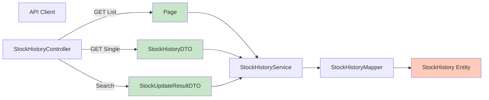

[⬅️ Back to DTO Hub](./index.md)

# Stock History DTOs

## Overview

Stock History DTOs represent the immutable audit trail of inventory changes. All stock modifications create `StockHistory` records through the `StockHistoryService`. These DTOs are **read-only** and used exclusively for reporting and audit purposes.

**Entity:** `StockHistory`  
**Mapper:** `StockHistoryMapper`  
**Controller:** `StockHistoryController`  
**Service:** `StockHistoryService`

**Important:** Stock History is append-only; no updates or deletions are exposed via API.

---

## DTO Diagram



---

## StockHistoryDTO (Core Audit Record)

### Definition

Core stock change audit trail entry. Records what changed, when, and why.

```java
@Data
@Builder
@NoArgsConstructor
@AllArgsConstructor
public class StockHistoryDTO {

    /** Unique audit record identifier. */
    private String id;

    /** Inventory item affected by this change. */
    private String itemId;

    /** Quantity delta (positive for inbound, negative for outbound). */
    private int change;

    /** Reason code for the stock change (enum-based). */
    private String reason;

    /** User or process that triggered this change. */
    private String createdBy;

    /** When this change was recorded. */
    private LocalDateTime timestamp;

    /** Item price at time of change (for value tracking). */
    private BigDecimal priceAtChange;
}
```

### Field Reference

| Field | Type | Read-Only | Notes |
|-------|------|-----------|-------|
| `id` | String | Yes | System-generated unique identifier |
| `itemId` | String | Yes | Foreign key to InventoryItem |
| `change` | int | Yes | Quantity delta: positive (inbound), negative (outbound) |
| `reason` | String | Yes | Reason code (e.g., "received", "sold_to_customer") |
| `createdBy` | String | Yes | User or process creating this record |
| `timestamp` | LocalDateTime | Yes | When the change occurred (ISO-8601 UTC) |
| `priceAtChange` | BigDecimal | Yes | Historical price for value tracking |

---

## StockUpdateResultDTO (Enriched Display)

### Definition

Enhanced stock history with human-readable item and supplier names. Used for display and export.

```java
@Data
@AllArgsConstructor
public class StockUpdateResultDTO {

    /** Item display name (enriched from ID). */
    private String itemName;

    /** Supplier display name (enriched from ID). */
    private String supplierName;

    /** Quantity delta (positive inbound, negative outbound). */
    private int change;

    /** Stock change reason classification. */
    private String reason;

    /** User or process that triggered this change. */
    private String createdBy;

    /** When this change was recorded. */
    private LocalDateTime timestamp;

    /** Item price at time of change (for value tracking). */
    private BigDecimal priceAtChange;
}
```

### Field Reference

| Field | Type | Notes |
|-------|------|-------|
| `itemName` | String | Human-readable item name (enriched from InventoryItem) |
| `supplierName` | String | Human-readable supplier name (enriched from Supplier) |
| `change` | int | Quantity delta |
| `reason` | String | Reason code |
| `createdBy` | String | User or process |
| `timestamp` | LocalDateTime | When the change occurred |
| `priceAtChange` | BigDecimal | Historical price |

---

## Stock Change Reasons

All stock changes are categorized by reason code:

| Code | Description | Direction | Typical Actor |
|------|-------------|-----------|----------------|
| `received` | Stock received from supplier | Inbound (+) | Warehouse staff |
| `sold_to_customer` | Sold to customer | Outbound (-) | Sales/Fulfillment |
| `return_from_customer` | Return from customer | Inbound (+) | Warehouse staff |
| `damaged` | Damaged and removed | Outbound (-) | Quality control |
| `inventory_adjustment` | Manual count adjustment | Both ±0 | Audit/Management |

---

## Request/Response Examples

### GET List Stock History (Paginated)

**Request:**

```http
GET /api/stock-history?page=0&size=20&sort=timestamp,desc
Authorization: Bearer <token>
```

**Response (200 OK):**

```json
{
  "content": [
    {
      "id": "SH-00042",
      "itemId": "ITEM-001",
      "change": 50,
      "reason": "received",
      "createdBy": "warehouse@company.com",
      "timestamp": "2025-11-19T14:30:00.000Z",
      "priceAtChange": 19.99
    },
    {
      "id": "SH-00041",
      "itemId": "ITEM-002",
      "change": -20,
      "reason": "sold_to_customer",
      "createdBy": "sales@company.com",
      "timestamp": "2025-11-19T13:15:00.000Z",
      "priceAtChange": 29.99
    },
    {
      "id": "SH-00040",
      "itemId": "ITEM-001",
      "change": -5,
      "reason": "damaged",
      "createdBy": "qc@company.com",
      "timestamp": "2025-11-19T10:00:00.000Z",
      "priceAtChange": 19.99
    }
  ],
  "pageable": {
    "pageNumber": 0,
    "pageSize": 20,
    "sort": [ { "property": "timestamp", "direction": "DESC" } ]
  },
  "totalElements": 5420,
  "totalPages": 271,
  "last": false
}
```

### GET Single Stock History Record

**Request:**

```http
GET /api/stock-history/SH-00042
Authorization: Bearer <token>
```

**Response (200 OK):**

```json
{
  "id": "SH-00042",
  "itemId": "ITEM-001",
  "change": 50,
  "reason": "received",
  "createdBy": "warehouse@company.com",
  "timestamp": "2025-11-19T14:30:00.000Z",
  "priceAtChange": 19.99
}
```

### GET Stock History by Item (Filtered)

**Request:**

```http
GET /api/stock-history/by-item/ITEM-001?page=0&size=50
Authorization: Bearer <token>
```

**Response (200 OK):**

```json
{
  "content": [
    {
      "id": "SH-00042",
      "itemId": "ITEM-001",
      "change": 50,
      "reason": "received",
      "createdBy": "warehouse@company.com",
      "timestamp": "2025-11-19T14:30:00.000Z",
      "priceAtChange": 19.99
    },
    {
      "id": "SH-00039",
      "itemId": "ITEM-001",
      "change": -30,
      "reason": "sold_to_customer",
      "createdBy": "sales@company.com",
      "timestamp": "2025-11-19T09:45:00.000Z",
      "priceAtChange": 19.99
    }
  ],
  "pageable": { ... },
  "totalElements": 287,
  "totalPages": 6,
  "last": false
}
```

### GET Stock History by Supplier (Filtered)

**Request:**

```http
GET /api/stock-history/by-supplier/SUP-001?page=0&size=100
Authorization: Bearer <token>
```

**Response (200 OK):**

Returns all stock history records for items from the specified supplier.

---

## Enriched Search Response

When using search endpoints, results return enriched `StockUpdateResultDTO`:

**Request:**

```http
POST /api/stock-history/search
Content-Type: application/json
Authorization: Bearer <token>

{
  "itemId": "ITEM-001",
  "reason": "received",
  "startDate": "2025-11-01",
  "endDate": "2025-11-30"
}
```

**Response (200 OK):**

```json
[
  {
    "itemName": "Widget A",
    "supplierName": "ACME Corp",
    "change": 50,
    "reason": "received",
    "createdBy": "warehouse@company.com",
    "timestamp": "2025-11-19T14:30:00.000Z",
    "priceAtChange": 19.99
  },
  {
    "itemName": "Widget A",
    "supplierName": "ACME Corp",
    "change": 100,
    "reason": "received",
    "createdBy": "warehouse@company.com",
    "timestamp": "2025-11-12T08:00:00.000Z",
    "priceAtChange": 19.85
  }
]
```

---

## Mapping Strategy

### StockHistoryMapper

```java
@Component
public class StockHistoryMapper {

    @Autowired
    private InventoryItemRepository itemRepository;

    @Autowired
    private SupplierRepository supplierRepository;

    /**
     * Convert StockHistory entity to core DTO.
     */
    public StockHistoryDTO toDTO(StockHistory entity) {
        if (entity == null) return null;
        
        return StockHistoryDTO.builder()
            .id(entity.getId())
            .itemId(entity.getItemId())
            .change(entity.getChange())
            .reason(entity.getReason().getValue())  // Enum to string
            .createdBy(entity.getCreatedBy())
            .timestamp(entity.getTimestamp())
            .priceAtChange(entity.getPriceAtChange())
            .build();
    }

    /**
     * Convert to enriched result with display names.
     */
    public StockUpdateResultDTO toEnrichedDTO(StockHistory entity) {
        if (entity == null) return null;
        
        InventoryItem item = itemRepository.findById(entity.getItemId())
            .orElse(null);
        Supplier supplier = item != null
            ? supplierRepository.findById(item.getSupplierId()).orElse(null)
            : null;

        return new StockUpdateResultDTO(
            item != null ? item.getName() : entity.getItemId(),
            supplier != null ? supplier.getName() : "Unknown",
            entity.getChange(),
            entity.getReason().getValue(),
            entity.getCreatedBy(),
            entity.getTimestamp(),
            entity.getPriceAtChange()
        );
    }

    /**
     * Convert list of entities to DTOs.
     */
    public List<StockHistoryDTO> toDTOList(List<StockHistory> entities) {
        return entities.stream()
            .map(this::toDTO)
            .collect(Collectors.toList());
    }
}
```

---

## Authorization & Access

### Read-Only Endpoint

All stock history endpoints are read-only (no POST/PUT/DELETE):

```java
@RestController
@RequestMapping("/api/stock-history")
@RequiredArgsConstructor
public class StockHistoryController {

    @GetMapping
    @PreAuthorize("isAuthenticated() or @appProperties.demoReadonly")
    public ResponseEntity<Page<StockHistoryDTO>> list(...) {
        // GET allowed
    }

    @GetMapping("/{id}")
    @PreAuthorize("isAuthenticated() or @appProperties.demoReadonly")
    public ResponseEntity<StockHistoryDTO> get(@PathVariable String id) {
        // GET allowed
    }
}
```

### Audit Trail Immutability

Stock history records are created automatically when:

1. Items are created (initial quantity recorded)
2. Stock updates via `PATCH /api/items/{id}/update-stock`
3. Inventory adjustments via manual operations

**No API to modify/delete stock history.** Immutability ensures audit trail integrity.

---

## Date Range Filtering

For analytics and reporting, filter by date range:

**Query Parameters:**

| Parameter | Type | Example | Notes |
|-----------|------|---------|-------|
| `startDate` | Date | `2025-11-01` | ISO format `yyyy-MM-dd` |
| `endDate` | Date | `2025-11-30` | ISO format `yyyy-MM-dd` |
| `itemId` | String | `ITEM-001` | Filter by item (optional) |
| `reason` | String | `received` | Filter by reason (optional) |

**Example Request:**

```http
GET /api/stock-history?startDate=2025-11-01&endDate=2025-11-30&reason=received&page=0&size=100
Authorization: Bearer <token>
```

---

## Testing Strategy

### Unit Test for Immutability

```java
@WebMvcTest(StockHistoryController.class)
class StockHistoryControllerTest {

    @Test
    void testGetStockHistory_ReturnsDTO() throws Exception {
        StockHistoryDTO mockHistory = StockHistoryDTO.builder()
            .id("SH-00042")
            .itemId("ITEM-001")
            .change(50)
            .reason("received")
            .createdBy("warehouse@company.com")
            .timestamp(LocalDateTime.now())
            .priceAtChange(BigDecimal.valueOf(19.99))
            .build();

        when(stockHistoryService.getById("SH-00042"))
            .thenReturn(Optional.of(mockHistory));

        mockMvc.perform(get("/api/stock-history/SH-00042"))
            .andExpect(status().isOk())
            .andExpect(jsonPath("$.itemId").value("ITEM-001"))
            .andExpect(jsonPath("$.change").value(50));
    }

    @Test
    void testPostStockHistory_Returns405MethodNotAllowed() throws Exception {
        // POST should be forbidden
        mockMvc.perform(
            post("/api/stock-history")
                .contentType(MediaType.APPLICATION_JSON)
                .content("{}")
        )
        .andExpect(status().isMethodNotAllowed());
    }
}
```

---

## Summary

| Aspect | Detail |
|--------|--------|
| **Core DTO** | `StockHistoryDTO` (raw audit record) |
| **Enriched DTO** | `StockUpdateResultDTO` (with display names) |
| **Entity** | `StockHistory` |
| **Mapper** | `StockHistoryMapper` |
| **Controller** | `StockHistoryController` |
| **Operations** | READ-ONLY (no create/update/delete via API) |
| **Authorization** | Authenticated or demo mode (read-only safe) |
| **Immutability** | Records created automatically, never modified |
| **Audit Trail** | Every stock change recorded with timestamp, user, reason |
| **Filtering** | By item, supplier, date range, reason |

---

[⬅️ Back to DTO Hub](./index.md)
