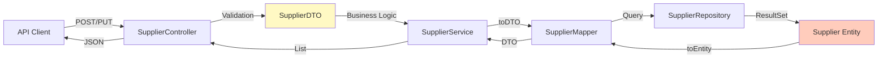

[⬅️ Back to DTO Hub](./index.md)

# Supplier DTOs

## Overview

Supplier DTOs handle the boundary between the REST API and the `Supplier` entity. Supports CRUD operations with validation groups for flexible create/update constraints.

**Entity:** `Supplier`  
**Mapper:** `SupplierMapper`  
**Controller:** `SupplierController`  
**Service:** `SupplierService`

---

## DTO Diagram



---

## SupplierDTO (Full Record)

### Definition

Complete supplier record with audit trail. Used for GET (single), POST, PUT, and list responses.

```java
@Data
@Builder
@NoArgsConstructor
@AllArgsConstructor
public class SupplierDTO {

    /** Unique supplier identifier (system-generated). */
    private String id;

    /** Supplier display name. */
    @NotBlank(message = "Name is required")
    private String name;

    /** Optional contact person name. */
    private String contactName;

    /** Optional phone number. */
    private String phone;

    /** Optional email address with format validation. */
    @Email(message = "Invalid email format")
    private String email;

    /** User who created this supplier (audit trail). */
    @NotBlank(message = "CreatedBy must be provided.")
    private String createdBy;

    /** Creation timestamp (system-generated). */
    private LocalDateTime createdAt;
}
```

### Field Reference

| Field | Type | Required | Notes |
|-------|------|----------|-------|
| `id` | String | Yes (system-generated) | Unique identifier, absent in POST body |
| `name` | String | Yes | Supplier name, 1-255 chars |
| `contactName` | String | No | Optional contact person |
| `phone` | String | No | Optional phone number |
| `email` | String | No | Optional email, must match email format if provided |
| `createdBy` | String | Yes (auto-filled) | User or process that created record |
| `createdAt` | LocalDateTime | Yes (auto-filled) | Creation timestamp (ISO-8601) |

---

## Validation Rules

### POST (Create Supplier)

| Field | Constraint | Rule |
|-------|-----------|------|
| `id` | — | Must be **absent** from request body |
| `name` | `@NotBlank` | Required, non-empty |
| `contactName` | — | Optional, can be null |
| `phone` | — | Optional, can be null |
| `email` | `@Email` | Optional, but if provided must match email format |
| `createdBy` | — | **Auto-filled** by service (from authentication context) |
| `createdAt` | — | **Auto-filled** by service (current timestamp) |

### PUT (Update Supplier)

Same as POST, except:

| Field | Constraint | Change |
|-------|-----------|--------|
| `id` | — | Required in URL path; ignored in request body |
| `createdBy` | — | Preserved from original (not updated) |
| `createdAt` | — | Preserved from original (not updated) |

### GET (Retrieve Supplier)

All fields returned as stored. No validation applied.

---

## Request/Response Examples

### POST Create Supplier

**Request:**

```http
POST /api/suppliers
Content-Type: application/json
Authorization: Bearer <token>

{
  "name": "ACME Corp",
  "contactName": "John Smith",
  "phone": "+1-555-123-4567",
  "email": "procurement@acme.example.com"
}
```

**Response (201 Created):**

```json
{
  "id": "SUP-001",
  "name": "ACME Corp",
  "contactName": "John Smith",
  "phone": "+1-555-123-4567",
  "email": "procurement@acme.example.com",
  "createdBy": "admin@company.com",
  "createdAt": "2025-11-19T10:30:00.000Z"
}
```

### GET Single Supplier

**Request:**

```http
GET /api/suppliers/SUP-001
Authorization: Bearer <token>
```

**Response (200 OK):**

```json
{
  "id": "SUP-001",
  "name": "ACME Corp",
  "contactName": "John Smith",
  "phone": "+1-555-123-4567",
  "email": "procurement@acme.example.com",
  "createdBy": "admin@company.com",
  "createdAt": "2025-11-19T10:30:00.000Z"
}
```

### PUT Update Supplier

**Request:**

```http
PUT /api/suppliers/SUP-001
Content-Type: application/json
Authorization: Bearer <token>

{
  "name": "ACME Corporation",    // Updated
  "contactName": "Jane Smith",   // Updated
  "phone": "+1-555-987-6543",    // Updated
  "email": "sales@acme.example.com"  // Updated
}
```

**Response (200 OK):**

```json
{
  "id": "SUP-001",
  "name": "ACME Corporation",
  "contactName": "Jane Smith",
  "phone": "+1-555-987-6543",
  "email": "sales@acme.example.com",
  "createdBy": "admin@company.com",      // Unchanged
  "createdAt": "2025-11-19T10:30:00.000Z" // Unchanged
}
```

### GET List Suppliers (Paginated)

**Request:**

```http
GET /api/suppliers?page=0&size=20&sort=name,asc
Authorization: Bearer <token>
```

**Response (200 OK):**

```json
{
  "content": [
    {
      "id": "SUP-001",
      "name": "ACME Corp",
      "contactName": "John Smith",
      "phone": "+1-555-123-4567",
      "email": "procurement@acme.example.com",
      "createdBy": "admin@company.com",
      "createdAt": "2025-11-19T10:30:00.000Z"
    },
    {
      "id": "SUP-002",
      "name": "Global Supplies Inc",
      "contactName": "Alice Johnson",
      "phone": "+1-555-234-5678",
      "email": "orders@global.example.com",
      "createdBy": "admin@company.com",
      "createdAt": "2025-11-18T14:15:00.000Z"
    }
  ],
  "pageable": {
    "pageNumber": 0,
    "pageSize": 20,
    "sort": [ { "property": "name", "direction": "ASC" } ]
  },
  "totalElements": 42,
  "totalPages": 3,
  "last": false
}
```

---

## Mapping Strategy

### SupplierMapper

Manual mapping (no MapStruct) for clarity and control:

```java
@Component
public class SupplierMapper {

    /**
     * Convert Supplier entity to DTO.
     * @param entity Supplier from database
     * @return DTO for REST response
     */
    public SupplierDTO toDTO(Supplier entity) {
        if (entity == null) return null;
        
        return SupplierDTO.builder()
            .id(entity.getId())
            .name(entity.getName())
            .contactName(entity.getContactName())
            .phone(entity.getPhone())
            .email(entity.getEmail())
            .createdBy(entity.getCreatedBy())
            .createdAt(entity.getCreatedAt())
            .build();
    }

    /**
     * Convert DTO to Supplier entity for persistence.
     * @param dto REST request body
     * @param createdBy Current user/process name
     * @return Entity ready for persistence
     */
    public Supplier toEntity(SupplierDTO dto, String createdBy) {
        if (dto == null) return null;
        
        return Supplier.builder()
            .id(dto.getId())
            .name(dto.getName())
            .contactName(dto.getContactName())
            .phone(dto.getPhone())
            .email(dto.getEmail())
            .createdBy(createdBy)  // Set from current context
            .createdAt(LocalDateTime.now())  // Set current time
            .build();
    }

    /**
     * Convert DTO list to entity list.
     * @param dtos List of DTOs
     * @return List of entities
     */
    public List<Supplier> toDTOList(List<SupplierDTO> dtos) {
        return dtos.stream()
            .map(dto -> toEntity(dto, "system"))
            .collect(Collectors.toList());
    }

    /**
     * Convert entity list to DTO list.
     * @param entities List of entities
     * @return List of DTOs
     */
    public List<SupplierDTO> toDTOList(List<Supplier> entities) {
        return entities.stream()
            .map(this::toDTO)
            .collect(Collectors.toList());
    }
}
```

---

## Controller Integration

### SupplierController Usage

```java
@RestController
@RequestMapping("/api/suppliers")
@RequiredArgsConstructor
public class SupplierController {

    private final SupplierService supplierService;
    private final SupplierMapper supplierMapper;

    @GetMapping
    public ResponseEntity<Page<SupplierDTO>> listAll(
            @PageableDefault(size = 20) Pageable pageable) {
        return ResponseEntity.ok(
            supplierService.findAll(pageable)
                .map(supplierMapper::toDTO)
        );
    }

    @PostMapping
    @PreAuthorize("hasRole('ADMIN')")
    public ResponseEntity<SupplierDTO> create(@Valid @RequestBody SupplierDTO dto) {
        Supplier entity = supplierService.create(dto);
        return ResponseEntity
            .status(HttpStatus.CREATED)
            .body(supplierMapper.toDTO(entity));
    }

    @PutMapping("/{id}")
    @PreAuthorize("hasRole('ADMIN')")
    public ResponseEntity<SupplierDTO> update(
            @PathVariable String id,
            @Valid @RequestBody SupplierDTO dto) {
        Supplier updated = supplierService.update(id, dto);
        return ResponseEntity.ok(supplierMapper.toDTO(updated));
    }
}
```

---

## Error Scenarios

### Validation Errors

**Request:**

```http
POST /api/suppliers
Content-Type: application/json

{
  "name": "",
  "email": "invalid-email"
}
```

**Response (400 Bad Request):**

```json
{
  "error": "bad_request",
  "message": "Validation failed: name is required; email must be valid",
  "timestamp": "2025-11-19T10:35:00.000Z",
  "correlationId": "SSP-1700123456789-4523"
}
```

### Resource Not Found

**Request:**

```http
GET /api/suppliers/SUP-INVALID
Authorization: Bearer <token>
```

**Response (404 Not Found):**

```json
{
  "error": "not_found",
  "message": "Supplier with ID 'SUP-INVALID' not found",
  "timestamp": "2025-11-19T10:36:00.000Z",
  "correlationId": "SSP-1700123456789-5624"
}
```

### Authorization Denied

**Request:**

```http
POST /api/suppliers
Content-Type: application/json
Authorization: Bearer <user-token>  (USER role, not ADMIN)

{ "name": "New Corp", ... }
```

**Response (403 Forbidden):**

```json
{
  "error": "forbidden",
  "message": "User does not have required role: ADMIN",
  "timestamp": "2025-11-19T10:37:00.000Z",
  "correlationId": "SSP-1700123456789-6725"
}
```

---

## Testing Strategy

### Unit Test Template

```java
@WebMvcTest(SupplierController.class)
class SupplierControllerTest {

    @MockBean
    private SupplierService supplierService;

    @Test
    void testCreateSupplier_WithValidData_Returns201() throws Exception {
        // Arrange
        SupplierDTO input = SupplierDTO.builder()
            .name("ACME Corp")
            .email("acme@example.com")
            .build();

        SupplierDTO response = SupplierDTO.builder()
            .id("SUP-001")
            .name("ACME Corp")
            .email("acme@example.com")
            .createdBy("admin@company.com")
            .createdAt(LocalDateTime.now())
            .build();

        when(supplierService.create(any())).thenReturn(response);

        // Act & Assert
        mockMvc.perform(
            post("/api/suppliers")
                .contentType(MediaType.APPLICATION_JSON)
                .content(objectMapper.writeValueAsString(input))
        )
        .andExpect(status().isCreated())
        .andExpect(jsonPath("$.id").value("SUP-001"))
        .andExpect(jsonPath("$.name").value("ACME Corp"));
    }
}
```

---

## Summary

| Aspect | Detail |
|--------|--------|
| **DTO Class** | `SupplierDTO` |
| **Entity** | `Supplier` |
| **Mapper** | `SupplierMapper` |
| **Controller** | `SupplierController` |
| **Operations** | CREATE (POST), READ (GET), UPDATE (PUT), DELETE (implicit soft-delete) |
| **Validation** | `@NotBlank` for name; `@Email` for email |
| **Authorization** | CREATE/UPDATE/DELETE require ADMIN role; READ requires authenticated or demo mode |
| **Response** | Individual DTO or paginated `Page<SupplierDTO>` |
| **Audit Fields** | `createdBy`, `createdAt` (auto-filled) |

---

[⬅️ Back to DTO Hub](./index.md)
