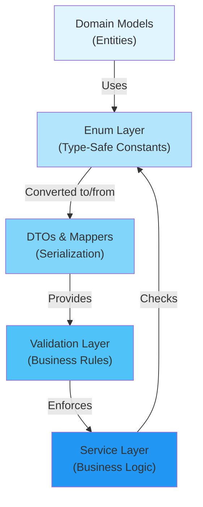

[⬅️ Back to Architecture Index](../index.html)

# Enums Reference

## Overview

This section documents all enumerations used throughout the Smart Supply Pro backend. Enums provide type-safe constants for roles, stock change reasons, audit severity levels, and other domain-specific classifications. They ensure consistency across the application and prevent invalid state transitions.

## What are Enums?

Enums in this application serve as:
- **Type-Safe Constants** - Compile-time checked values instead of strings
- **Domain Models** - Business concepts like roles, stock change reasons, audit severity
- **Validation Enforcers** - Restrict values to predefined, valid options
- **Metadata Carriers** - Methods on enums provide business logic context

**Storage Pattern:** All enums are persisted as `STRING` via `@Enumerated(EnumType.STRING)` for database readability and migration flexibility.

## Quick Navigation

| Enum | Location | Purpose | Related |
|------|----------|---------|---------|
| **[Role](./role.html)** | `model/` | User authorization roles (ADMIN, USER) | AppUser, Security, Controllers |
| **[StockChangeReason](./stock-change-reason.html)** | `enums/` | Stock movement classifications (SOLD, DAMAGED, etc.) | StockHistory, Analytics, InventoryItem |

---

## Architecture Diagram



---

## Enum List

### 1. Role (`role.md`)

**Purpose:** User authorization and access control

**Values:**
- `ADMIN` - Full system access, can perform all operations
- `USER` - Limited access, typically read-only in demo mode

**Usage:**
```java
@Entity
public class AppUser {
    @Enumerated(EnumType.STRING)
    private Role role;
}

@PreAuthorize("hasRole('ADMIN')")
public void deleteSupplier(String id) { ... }
```

**Key Methods:**
- `fromString(String)` - Parse string to enum with trimming

**Storage:** VARCHAR(10) in database

**See:** [Role Enum Documentation](./role.html)

---

### 2. StockChangeReason (`stock-change-reason.html`)

**Purpose:** Standardized stock movement classification for audit compliance and financial reporting

**Categories:**
- **Initial Operations:** INITIAL_STOCK
- **Administrative:** MANUAL_UPDATE, PRICE_CHANGE
- **Customer:** SOLD, RETURNED_BY_CUSTOMER
- **Quality Control:** DAMAGED, SCRAPPED, EXPIRED
- **Security:** LOST, DESTROYED, RETURNED_TO_SUPPLIER

**Example Values & Meanings:**
- `SOLD` - Customer purchase transaction (affects revenue)
- `DAMAGED` - Temporary hold for damaged items
- `SCRAPPED` - Permanent removal for quality issues
- `DESTROYED` - Catastrophic loss (insurance claim trigger)

**Key Methods:**
- `requiresManagerApproval()` - Checks if approval needed
- `affectsQuantity()` - Tests if quantity is modified
- `isLossReason()` - Identifies loss-type movements
- `requiresComplianceDocumentation()` - Audit requirement check
- `getAuditSeverity()` - Returns severity level (LOW, MEDIUM, HIGH, CRITICAL)
- `getLossReasons()` - Static set of all loss-type reasons
- `getCustomerReasons()` - Static set of customer-related reasons
- `getSupplierReasons()` - Static set of supplier-related reasons
- `getSecuritySensitiveReasons()` - Static set requiring investigation
- `parseReason(String)` - Safe parsing with error handling

**Nested Enum: AuditSeverity**
- `LOW` - Routine operations
- `MEDIUM` - Administrative adjustments
- `HIGH` - Revenue-impacting transactions
- `CRITICAL` - Loss events requiring investigation

**Storage:** VARCHAR(30) in database

**See:** [StockChangeReason Enum Documentation](./stock-change-reason.html)

---

## Design Patterns

### 1. Type-Safe Enum Pattern

```java
public enum StockChangeReason {
    SOLD,
    DAMAGED,
    DESTROYED;
    
    public boolean isLossReason() {
        return this == DESTROYED || this == SCRAPPED;
    }
}
```

**Benefits:**
- Compile-time type checking
- IDE autocompletion
- Impossible to have invalid values
- Methods on enum provide context

### 2. String Parsing with Validation

```java
public static StockChangeReason parseReason(String reasonString) {
    try {
        return valueOf(reasonString.trim().toUpperCase());
    } catch (IllegalArgumentException e) {
        throw new IllegalArgumentException(
            String.format("Invalid reason: %s. Valid options: %s", 
                reasonString, Arrays.toString(values())), e);
    }
}
```

**Benefits:**
- Clear error messages
- Explicit validation
- User-friendly exceptions

### 3. Business Logic on Enums

```java
public class StockHistory {
    private StockChangeReason reason;
    
    public boolean requiresApproval() {
        return reason.requiresManagerApproval();
    }
}
```

**Benefits:**
- Logic stays close to data
- Easy to understand business rules
- Type-safe queries

### 4. Enum Classification Sets

```java
public static Set<StockChangeReason> getLossReasons() {
    return EnumSet.of(SCRAPPED, DESTROYED, EXPIRED, LOST);
}
```

**Benefits:**
- Efficient classification
- Readable business logic
- Easy to test

---

## Database Representation

### Storage Strategy

All enums use `@Enumerated(EnumType.STRING)` for:
- **Readability** - Database values are human-readable strings
- **Migration Flexibility** - Can add enums without reordering
- **External System Integration** - Easy API serialization

**Example Schema:**

```sql
-- Role storage
ALTER TABLE app_user ADD COLUMN role VARCHAR(10);
-- Values: 'ADMIN', 'USER'

-- StockChangeReason storage
ALTER TABLE stock_history ADD COLUMN reason VARCHAR(30);
-- Values: 'SOLD', 'DAMAGED', 'DESTROYED', etc.
```

### Performance Considerations

1. **Index on Enum Columns** - Recommended for frequent filtering
   ```sql
   CREATE INDEX idx_stock_history_reason ON stock_history(reason);
   ```

2. **Enum Ordinal (NOT USED)** - Avoided because:
   - Ordering changes would corrupt data
   - Not human-readable in database
   - Migration risk

3. **Large EnumSets** - Efficient for enum classification
   ```java
   Set<StockChangeReason> losses = StockChangeReason.getLossReasons();
   // EnumSet uses bit flags, O(1) operations
   ```

---

## Validation Integration

### Custom Validators Using Enums

```java
@Target(ElementType.FIELD)
@Retention(RetentionPolicy.RUNTIME)
@Constraint(validatedBy = StockChangeReasonValidator.class)
public @interface ValidStockChangeReason {
    String message() default "Invalid stock change reason";
}

public class StockChangeReasonValidator implements ConstraintValidator<ValidStockChangeReason, String> {
    @Override
    public boolean isValid(String value, ConstraintValidatorContext context) {
        try {
            StockChangeReason.parseReason(value);
            return true;
        } catch (IllegalArgumentException e) {
            return false;
        }
    }
}
```

### Controller Usage

```java
@PostMapping("/stock-history")
public ResponseEntity<?> logStockChange(
    @Valid @RequestBody StockHistoryDTO dto) {
    // @Valid triggers StockChangeReasonValidator on reason field
    // Ensures only valid enum values accepted
}
```

---

## Serialization in APIs

### JSON Representation

All enums serialize as **string values** (not ordinals):

**Request:**
```json
{
  "reason": "SOLD",
  "quantity": -50
}
```

**Response:**
```json
{
  "id": "SH-001",
  "reason": "SOLD",
  "timestamp": "2025-11-19T10:30:00Z"
}
```

### Mapper Integration

```java
public class StockHistoryMapper {
    public StockHistoryDTO toDTO(StockHistory entity) {
        return StockHistoryDTO.builder()
            .reason(entity.getReason().name())  // enum → string
            .build();
    }
    
    public StockHistory toEntity(StockHistoryDTO dto) {
        return StockHistory.builder()
            .reason(StockChangeReason.parseReason(dto.getReason()))  // string → enum
            .build();
    }
}
```

---

## Testing Enums

### Unit Test Template

```java
@Test
void testStockChangeReasonClassification() {
    // Test loss reason classification
    Set<StockChangeReason> losses = StockChangeReason.getLossReasons();
    assertTrue(losses.contains(StockChangeReason.DESTROYED));
    assertFalse(losses.contains(StockChangeReason.SOLD));
}

@Test
void testEnumParsing() {
    // Valid parse
    StockChangeReason reason = StockChangeReason.parseReason("SOLD");
    assertEquals(StockChangeReason.SOLD, reason);
    
    // Invalid parse throws exception
    assertThrows(IllegalArgumentException.class,
        () -> StockChangeReason.parseReason("INVALID"));
}

@Test
void testAuditSeverity() {
    assertEquals(AuditSeverity.CRITICAL, 
        StockChangeReason.DESTROYED.getAuditSeverity());
}
```

### Integration Test Template

```java
@Test
@Transactional
void testEnumPersistence() {
    // Create entity with enum
    StockHistory history = StockHistory.builder()
        .reason(StockChangeReason.SOLD)
        .build();
    
    repository.save(history);
    
    // Retrieve and verify enum
    StockHistory retrieved = repository.findById(history.getId()).get();
    assertEquals(StockChangeReason.SOLD, retrieved.getReason());
}
```

---

## Best Practices

✅ **DO:**
- Use enums for fixed sets of values
- Add business logic methods to enums
- Store as STRING in database
- Validate enum values in DTOs
- Provide clear error messages for invalid values
- Document enum meanings with JavaDoc

❌ **DON'T:**
- Use ordinals for storage (enum order can change)
- Create enums for user-generated values
- Hardcode enum string values in code
- Forget to update documentation when adding enum values
- Store enums as numbers in database

---

## Related Documentation

**Architecture:**
- [Data Models & Entities](../model.html) - Entities using enums
- [DTOs & Data Transfer Objects](../dto/index.html) - Serialization patterns
- [Validation Framework](../validation.html) - Enum validation rules

**Code Examples:**
- [Role Usage in AppUser](../../model/AppUser.java)
- [StockChangeReason Usage in StockHistory](../../model/StockHistory.java)
- [Enum Parsing in Mappers](../../mapper/StockHistoryMapper.java)

---

[⬅️ Back to Architecture Index](../index.html)
