# Exception-to-HTTP Mapping

**Status**: Complete | **Last Updated**: 2025-11-20 | **Version**: 1.0.0

## Overview

This document provides a **complete reference** for how each exception type in Smart Supply Pro is mapped to HTTP status codes. It serves as both a **decision tree for developers** (when to throw which exception) and a **reference guide for API consumers** (what status codes to expect).

---

## Quick Lookup Table

| HTTP Status | Exception | Error Token | Common Causes | Handler |
|-------------|-----------|-------------|---------------|---------|
| **400** | MethodArgumentNotValidException | `bad_request` | @Valid annotation failed on request body | Global |
| **400** | ConstraintViolationException | `bad_request` | JSR-380 constraint failed on parameter | Global |
| **400** | HttpMessageNotReadableException | `bad_request` | Malformed JSON in request body | Global |
| **400** | MissingServletRequestParameterException | `bad_request` | Required query parameter missing | Global |
| **400** | MethodArgumentTypeMismatchException | `bad_request` | Path/query param type conversion failed | Global |
| **400** | InvalidRequestException | `bad_request` | Business validation failed (custom domain) | Business |
| **401** | AuthenticationException | `unauthorized` | User not authenticated or credentials invalid | Global |
| **403** | AccessDeniedException | `forbidden` | User lacks required permissions/role | Global |
| **404** | NoSuchElementException | `not_found` | Resource lookup returned empty | Global |
| **404** | IllegalArgumentException | `not_found` | Invalid argument caused lookup failure | Global |
| **409** | DuplicateResourceException | `conflict` | Uniqueness constraint violation (custom) | Business |
| **409** | DataIntegrityViolationException | `conflict` | Database constraint violation (FK, UNIQUE, CHECK) | Global |
| **409** | ObjectOptimisticLockingFailureException | `conflict` | Concurrent update (version field mismatch) | Global |
| **409** | IllegalStateException | `conflict` | Business state rule violation (custom) | Business |
| **500** | Exception (unhandled) | `internal_server_error` | Any unhandled exception | Global |

---

## Status Code 400: Bad Request

### When to Use 400

Use **400 Bad Request** when the request itself is **malformed, invalid, or doesn't meet requirements**:
- ✅ Client sent invalid/missing data
- ✅ Request body JSON is malformed
- ✅ Query parameters have wrong type
- ✅ Required fields are missing
- ✅ Business validation rules failed
- ❌ Resource doesn't exist (use 404)
- ❌ User not authenticated (use 401)
- ❌ User lacks permission (use 403)

### Exceptions Mapped to 400

#### 1. MethodArgumentNotValidException

**Trigger**: @Valid annotation validation fails on request body

```java
@PostMapping("/suppliers")
public SupplierDTO create(@Valid @RequestBody CreateSupplierRequest req) {
    // If req violates @Valid constraints → MethodArgumentNotValidException
}
```

**Example Response**:
```json
{
  "error": "bad_request",
  "message": "Validation failed: name is required; email must be valid format; quantity must be greater than 0",
  "timestamp": "2025-11-20T14:30:45.123Z",
  "correlationId": "SSP-1700551445123-4891"
}
```

**What Client Should Do**:
```javascript
if (error.status === 400 && error.data.error === 'bad_request') {
    // Extract field errors from message
    const messages = error.data.message.split(';');
    messages.forEach(msg => {
        const [field, description] = msg.trim().split(':');
        displayFieldError(field, description);
    });
}
```

---

#### 2. ConstraintViolationException

**Trigger**: JSR-380 constraint validation fails on method parameters

```java
@GetMapping("/{id}")
public SupplierDTO get(@NotNull @Min(1) @PathVariable Long id) {
    // If id is null or < 1 → ConstraintViolationException
}
```

**Example Response**:
```json
{
  "error": "bad_request",
  "message": "Constraint violation: id: must be greater than or equal to 1",
  "timestamp": "2025-11-20T14:30:46.234Z",
  "correlationId": "SSP-1700551446234-5902"
}
```

**Common Annotations**:
```java
@NotNull           // Value must not be null
@NotEmpty          // String must not be empty
@NotBlank          // String must not be blank (spaces don't count)
@Min(n)            // Number must be >= n
@Max(n)            // Number must be <= n
@Pattern(regex)    // String must match regex
@Email             // Must be valid email format
@Size(min,max)     // Collection size must be between min and max
```

---

#### 3. HttpMessageNotReadableException

**Trigger**: Request body JSON parsing fails (malformed JSON)

```java
@PostMapping
public SupplierDTO create(@RequestBody CreateSupplierRequest req) {
    // POST /suppliers
    // Body: {"name": invalid json} → HttpMessageNotReadableException
}
```

**Example Response**:
```json
{
  "error": "bad_request",
  "message": "Invalid request format: malformed JSON or missing required fields",
  "timestamp": "2025-11-20T14:30:47.345Z",
  "correlationId": "SSP-1700551447345-6013"
}
```

**Common Causes**:
- Missing quotes around string values
- Trailing commas in JSON
- Missing closing braces
- Invalid characters
- Non-numeric value for numeric field

**Example Bad Request**:
```json
// Bad: Missing quotes, trailing comma
{"name": "ACME", "email": john@example.com,}

// Good
{"name": "ACME", "email": "john@example.com"}
```

---

#### 4. MissingServletRequestParameterException

**Trigger**: Required query/form parameter is missing

```java
@GetMapping
public List<SupplierDTO> search(
    @RequestParam(required = true) String category,
    @RequestParam(required = false) String region
) {
    // GET /suppliers (no category param) → MissingServletRequestParameterException
}
```

**Example Response**:
```json
{
  "error": "bad_request",
  "message": "Missing required parameter: category (String)",
  "timestamp": "2025-11-20T14:30:48.456Z",
  "correlationId": "SSP-1700551448456-7124"
}
```

**Correct Request**:
```
GET /suppliers?category=FOOD
```

---

#### 5. MethodArgumentTypeMismatchException

**Trigger**: Path/query parameter type conversion fails

```java
@GetMapping("/{id}")
public SupplierDTO get(@PathVariable Long id) {
    // GET /suppliers/abc (abc is not a number) → MethodArgumentTypeMismatchException
}
```

**Example Response**:
```json
{
  "error": "bad_request",
  "message": "Invalid Long for parameter 'id': received 'abc'",
  "timestamp": "2025-11-20T14:30:49.567Z",
  "correlationId": "SSP-1700551449567-8235"
}
```

**Valid Request**:
```
GET /suppliers/123
```

---

#### 6. InvalidRequestException (Domain)

**Trigger**: Custom domain validation failure thrown explicitly

```java
// In service layer
if (request.getQuantity() < 1) {
    throw InvalidRequestException.valueOutOfRange("quantity", 1, 999999);
}
```

**Example Response**:
```json
{
  "error": "bad_request",
  "message": "Validation failed: quantity value must be between 1 and 999999",
  "timestamp": "2025-11-20T14:30:50.678Z",
  "correlationId": "SSP-1700551450678-9346"
}
```

**Factory Methods**:
```java
InvalidRequestException.requiredField("email")
InvalidRequestException.invalidFormat("sku", "XXX-YYYY-ZZZZ")
InvalidRequestException.valueOutOfRange("quantity", 1, 999)
InvalidRequestException.businessRuleViolation("Cannot order zero quantity")
```

---

## Status Code 401: Unauthorized

### When to Use 401

Use **401 Unauthorized** when **authentication is missing or invalid**:
- ✅ User hasn't logged in (no token)
- ✅ Token is expired
- ✅ Token is invalid (tampered with)
- ✅ Credentials (username/password) don't match
- ❌ User is authenticated but lacks permission (use 403)

### Exceptions Mapped to 401

#### AuthenticationException

**Trigger**: Authentication fails (credentials invalid, no token, expired token)

```java
@GetMapping("/profile")
@PreAuthorize("isAuthenticated()")
public ProfileDTO getProfile() {
    // If user not authenticated → AuthenticationException
}
```

**Example Response**:
```json
{
  "error": "unauthorized",
  "message": "Authentication failed: invalid credentials or expired session",
  "timestamp": "2025-11-20T14:30:51.789Z",
  "correlationId": "SSP-1700551451789-0457"
}
```

**Security Note**: Message is generic to prevent user enumeration (doesn't reveal if username exists or password is wrong).

**Frontend Handling**:
```javascript
if (error.status === 401) {
    // Redirect to login page
    window.location.href = '/login';
    
    // Optional: show login-required message
    showMessage('Your session has expired. Please log in again.');
}
```

---

## Status Code 403: Forbidden

### When to Use 403

Use **403 Forbidden** when **user is authenticated but lacks permission** for the operation:
- ✅ User doesn't have required role (ADMIN, MANAGER, etc.)
- ✅ User lacks specific permission
- ✅ User is not the owner of the resource
- ✅ Operation is disabled for this user's account status
- ❌ User isn't logged in (use 401)
- ❌ Resource doesn't exist (use 404)

### Exceptions Mapped to 403

#### AccessDeniedException

**Trigger**: User lacks required permissions/role

```java
@DeleteMapping("/{id}")
@PreAuthorize("hasRole('ADMIN')")
public void deleteSupplier(@PathVariable Long id) {
    // If user is not ADMIN → AccessDeniedException
}
```

**Example Response**:
```json
{
  "error": "forbidden",
  "message": "Access denied: insufficient permissions for this operation",
  "timestamp": "2025-11-20T14:30:52.890Z",
  "correlationId": "SSP-1700551452890-1568"
}
```

**Security Note**: Message is generic (doesn't reveal which role/permission is required).

**Frontend Handling**:
```javascript
if (error.status === 403) {
    // Show "unauthorized" message
    showMessage('You do not have permission to perform this action');
    
    // Disable the UI element that triggered the request
    disableButton();
    
    // Optional: show "contact admin" message
    showContactAdminMessage();
}
```

---

## Status Code 404: Not Found

### When to Use 404

Use **404 Not Found** when **resource doesn't exist**:
- ✅ User requests a supplier that doesn't exist
- ✅ Resource was deleted
- ✅ Wrong resource ID provided
- ❌ Parameter is wrong type (use 400)
- ❌ Required field is missing (use 400)
- ❌ User not authenticated (use 401)

### Exceptions Mapped to 404

#### NoSuchElementException

**Trigger**: Resource lookup returns empty (Optional.empty())

```java
@GetMapping("/{id}")
public SupplierDTO get(@PathVariable Long id) {
    return supplierRepository.findById(id)
            .orElseThrow(() -> new NoSuchElementException("Supplier not found"));
}
```

**Example Response**:
```json
{
  "error": "not_found",
  "message": "Supplier not found",
  "timestamp": "2025-11-20T14:30:53.901Z",
  "correlationId": "SSP-1700551453901-2679"
}
```

---

#### IllegalArgumentException

**Trigger**: Invalid argument in lookup operation

```java
@GetMapping("/by-status/{status}")
public List<SupplierDTO> getByStatus(@PathVariable String status) {
    SupplierStatus enumStatus = SupplierStatus.valueOf(status);
    // If status = "UNKNOWN" → IllegalArgumentException
    return supplierRepository.findByStatus(enumStatus);
}
```

**Example Response**:
```json
{
  "error": "not_found",
  "message": "No enum constant com.smartsupplypro.SupplierStatus.UNKNOWN",
  "timestamp": "2025-11-20T14:30:54.012Z",
  "correlationId": "SSP-1700551454012-3780"
}
```

---

## Status Code 409: Conflict

### When to Use 409

Use **409 Conflict** when **request conflicts with current state**:
- ✅ Resource already exists (duplicate unique field)
- ✅ Concurrent update conflict (someone else modified resource)
- ✅ Business state rule violation (e.g., can't delete supplier with active items)
- ❌ Resource doesn't exist (use 404)
- ❌ User not authenticated (use 401)
- ❌ User lacks permission (use 403)

### Exceptions Mapped to 409

#### DuplicateResourceException (Domain)

**Trigger**: Uniqueness constraint violation (custom)

```java
@PostMapping
public SupplierDTO create(CreateSupplierRequest req) {
    if (supplierRepository.existsByName(req.getName())) {
        throw DuplicateResourceException.supplierName(req.getName());
    }
    return supplierRepository.save(supplier);
}
```

**Example Response**:
```json
{
  "error": "conflict",
  "message": "Supplier with name 'ACME Inc' already exists",
  "timestamp": "2025-11-20T14:30:55.123Z",
  "correlationId": "SSP-1700551455123-4891"
}
```

**With Field Error Details**:
```javascript
// Parse context from exception
{
  "error": "conflict",
  "message": "Supplier with name 'ACME Inc' already exists",
  "resourceType": "Supplier",
  "conflictField": "name",
  "duplicateValue": "ACME Inc"
}
```

---

#### DataIntegrityViolationException

**Trigger**: Database constraint violation (UNIQUE, FOREIGN KEY, CHECK)

```java
@PostMapping
public SupplierDTO create(CreateSupplierRequest req) {
    return supplierRepository.save(supplier);
    // If database has UNIQUE constraint on email → DataIntegrityViolationException
}
```

**Example Response**:
```json
{
  "error": "conflict",
  "message": "Resource with this value already exists",
  "timestamp": "2025-11-20T14:30:56.234Z",
  "correlationId": "SSP-1700551456234-5902"
}
```

**Sanitization**:
- ❌ Raw error: "UNIQUE constraint failed: SUPPLIERS.EMAIL"
- ✅ Sanitized: "Resource with this value already exists"

---

#### ObjectOptimisticLockingFailureException

**Trigger**: Concurrent update conflict (optimistic locking version mismatch)

```java
@PutMapping("/{id}")
public SupplierDTO update(@PathVariable Long id, @RequestBody UpdateRequest req) {
    Supplier supplier = supplierRepository.findById(id).orElseThrow();
    supplier.setName(req.getName());
    supplier.setVersion(req.getVersion()); // Version must match current DB version
    return supplierRepository.save(supplier);
    // If another user modified supplier since fetch → ObjectOptimisticLockingFailureException
}
```

**Example Response**:
```json
{
  "error": "conflict",
  "message": "Resource was modified by another user. Please refresh and try again.",
  "timestamp": "2025-11-20T14:30:57.345Z",
  "correlationId": "SSP-1700551457345-6013"
}
```

**Frontend Handling**:
```javascript
try {
    await api.put(`/suppliers/${id}`, { ...data, version: 5 });
} catch (error) {
    if (error.status === 409 && error.data.error === 'conflict') {
        // Refresh from server and retry
        const latest = await api.get(`/suppliers/${id}`);
        showRetryDialog(latest);
    }
}
```

---

#### IllegalStateException (Domain)

**Trigger**: Business state rule violation

```java
@DeleteMapping("/{id}")
public void deleteSupplier(@PathVariable Long id) {
    Supplier supplier = supplierRepository.findById(id).orElseThrow();
    
    if (supplier.getStatus() == DELETED) {
        throw new IllegalStateException("Cannot modify already-deleted supplier");
    }
    
    if (inventoryRepository.existsBySupplier(supplier)) {
        throw new IllegalStateException("Cannot delete supplier with active inventory");
    }
}
```

**Example Response**:
```json
{
  "error": "conflict",
  "message": "Cannot delete supplier with active inventory",
  "timestamp": "2025-11-20T14:30:58.456Z",
  "correlationId": "SSP-1700551458456-7124"
}
```

---

## Status Code 500: Internal Server Error

### When to Use 500

Use **500 Internal Server Error** for **unhandled exceptions** that don't fit other categories:
- ✅ NullPointerException
- ✅ Database connection timeout
- ✅ File system access error
- ✅ Third-party API failure
- ✅ Any exception not explicitly handled
- ❌ Use 400-409 for client/request errors
- ❌ Use 401/403 for auth errors

### Exceptions Mapped to 500

#### Generic Exception (Catch-All)

**Trigger**: Any unhandled exception

```java
@ExceptionHandler(Exception.class)
public ResponseEntity<ErrorResponse> handleUnexpected(Exception ex) {
    logger.error("Unhandled exception", ex); // Full stack trace logged
    
    return ErrorResponse.builder()
            .status(HttpStatus.INTERNAL_SERVER_ERROR)
            .message("An unexpected error occurred. Please contact support.")
            .build();
}
```

**Example Response**:
```json
{
  "error": "internal_server_error",
  "message": "An unexpected error occurred. Please contact support.",
  "timestamp": "2025-11-20T14:30:59.567Z",
  "correlationId": "SSP-1700551459567-8235"
}
```

**Security Note**: No stack trace, no exception details exposed to client (prevent information disclosure).

**Frontend Handling**:
```javascript
if (error.status === 500) {
    const correlationId = error.data.correlationId;
    
    showErrorMessage(`Error: ${error.data.message}`);
    showSupportContact(`Please report error ID: ${correlationId}`);
    
    // Log for telemetry/analytics
    analytics.error({
        status: error.status,
        correlationId: correlationId,
        timestamp: error.data.timestamp,
        url: window.location.href
    });
}
```

---

## Decision Tree

Use this flowchart to determine the appropriate HTTP status code:

```mermaid
graph TD
    A["Exception Thrown"] --> B{{"Exception Type?"}}
    
    B -->|Request Format Invalid| C{{"Which Kind?"}}
    B -->|Authentication Missing| D["401<br/>Unauthorized<br/>AuthenticationException"]
    B -->|Insufficient Permission| E["403<br/>Forbidden<br/>AccessDeniedException"]
    B -->|Resource Not Found| F{{"Which Kind?"}}
    B -->|State Conflict| G{{"Which Kind?"}}
    B -->|Unhandled| H["500<br/>Internal Server Error"]
    
    C -->|Malformed JSON| C1["400<br/>Bad Request<br/>HttpMessageNotReadableException"]
    C -->|Missing Parameter| C2["400<br/>Bad Request<br/>MissingServletRequestParameterException"]
    C -->|Type Mismatch| C3["400<br/>Bad Request<br/>MethodArgumentTypeMismatchException"]
    C -->|Validation Failed| C4["400<br/>Bad Request<br/>MethodArgumentNotValidException"]
    C -->|Business Rule Violated| C5["400<br/>Bad Request<br/>InvalidRequestException"]
    
    F -->|Not Found in Optional| F1["404<br/>Not Found<br/>NoSuchElementException"]
    F -->|Invalid Enum Value| F2["404<br/>Not Found<br/>IllegalArgumentException"]
    
    G -->|Duplicate Key| G1["409<br/>Conflict<br/>DuplicateResourceException"]
    G -->|DB Constraint Violated| G2["409<br/>Conflict<br/>DataIntegrityViolationException"]
    G -->|Concurrent Update| G3["409<br/>Conflict<br/>ObjectOptimisticLockingFailureException"]
    G -->|Business State Violated| G4["409<br/>Conflict<br/>IllegalStateException"]
```



---

## Frontend Error Handling Pattern

Implement this pattern to handle all status codes consistently:

```typescript
async function makeRequest(method, url, data = null) {
    try {
        const response = await fetch(url, {
            method,
            headers: { 'Content-Type': 'application/json' },
            body: data ? JSON.stringify(data) : null
        });
        
        if (!response.ok) {
            const error = await response.json();
            handleHttpError(response.status, error);
            return null;
        }
        
        return await response.json();
    } catch (error) {
        handleNetworkError(error);
        return null;
    }
}

function handleHttpError(status, errorData) {
    const { error, message, correlationId } = errorData;
    
    switch (status) {
        case 400:
            // User error - show validation message
            showValidationError(message);
            break;
        case 401:
            // Authentication error - redirect to login
            redirectToLogin();
            break;
        case 403:
            // Permission error - show access denied
            showAccessDenied();
            break;
        case 404:
            // Not found - show resource doesn't exist
            showNotFound(message);
            break;
        case 409:
            // Conflict - handle retry or conflict resolution
            if (error === 'conflict') {
                showConflictDialog(message);
            }
            break;
        case 500:
            // Server error - show generic message with correlation ID
            showServerError(correlationId);
            break;
        default:
            showUnknownError();
    }
}
```

---

## Related Documentation

- **[Exception Architecture Overview](./index.md)** – Exception types, handler ordering
- **[Global Exception Handler](./global-exception-handler.md)** – Implementation details
- **[Domain Exceptions](./domain-exceptions.md)** – Custom exception classes
- **[Error Response Structure](./error-response-structure.md)** – JSON format and fields
- **[Guidelines & Best Practices](./guidelines-and-best-practices.md)** – Best practices

---

## Version History

| Version | Date | Changes |
|---------|------|---------|
| 1.0.0 | 2025-11-20 | Initial comprehensive mapping documentation |

---

## Quick Reference Card

**Print this for quick reference:**

```
┌─────────┬────────────────────────┬──────────────────────────┐
│ Status  │ Error Token            │ When to Use              │
├─────────┼────────────────────────┼──────────────────────────┤
│ 400     │ bad_request            │ Invalid request data     │
│ 401     │ unauthorized           │ Not authenticated        │
│ 403     │ forbidden              │ Insufficient permission  │
│ 404     │ not_found              │ Resource doesn't exist   │
│ 409     │ conflict               │ State/duplicate conflict │
│ 500     │ internal_server_error  │ Unhandled exception      │
└─────────┴────────────────────────┴──────────────────────────┘
```

```
HOW TO DETERMINE STATUS CODE:

1. Is request malformed?              → 400
2. Is user not authenticated?         → 401
3. Does user lack permission?         → 403
4. Does resource not exist?           → 404
5. Does state/duplicate conflict?     → 409
6. Is it an unhandled error?          → 500
```
